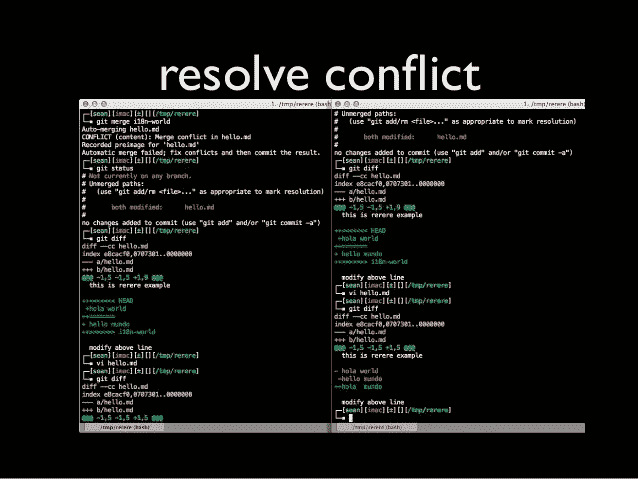
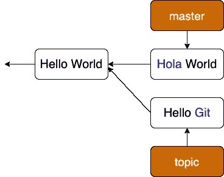
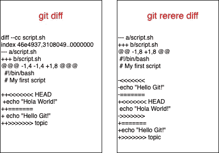
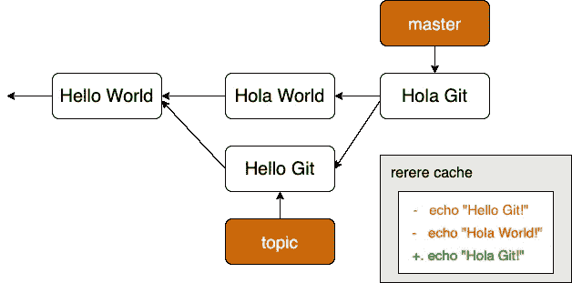
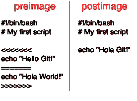
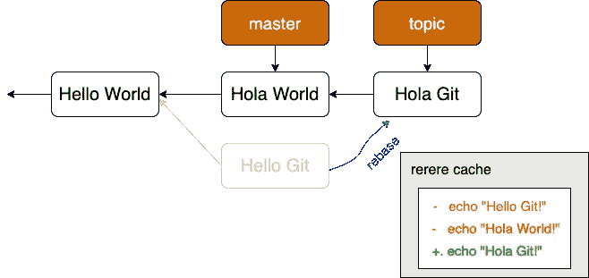

# Git Rerere 命令—自动解决合并冲突

> 原文：<https://levelup.gitconnected.com/the-git-rerere-command-automate-solutions-to-fix-merge-conflicts-d501a9ab9007>



来源[https://pt.slideshare.net/lethee/git-rerere/6?smtNoRedir=1](https://pt.slideshare.net/lethee/git-rerere/6?smtNoRedir=1)

> 关于`git rerere`命令你需要知道的一切

今天我们要讨论 Git 的一个隐藏特性:`git rerere`。我认为你应该意识到这一点，以使你解决冲突的生活更容易。

`rerere`代表**“重复使用录制的分辨率”**。

`rerere`允许你请求 Git 记住你是如何解决一个大块冲突的，这样下次它看到同样的冲突时，Git 可以自动为你解决它。这才是重点。

在讨论细节之前，让我们先来看一些场景，在这些场景中，这个功能可能会非常方便。

# 情节

1.  如果您有一个主题分支，并且您不断地将主分支或开发分支合并到其中，以使它保持最新。但是您不想因为一堆中间合并提交而弄乱历史。使用`rerere`，您可以偶尔合并，解决冲突，然后中止合并。然后主题分支完成，您可以进行最后的合并，并且`rerere`可以自动为您解决所有问题。
2.  如果你将一个主题分支的一堆变更合并成一个可测试的(比如 uni-test)分支。如果测试分支失败，您可以撤消合并，修复失败，并再次重新合并到测试分支，而不必再次重新解决冲突。

现在你已经想好了你的场景，让我们开始吧。

# 它是如何工作的

要启用`rerere`，运行以下命令:

```
**$** git config --global rerere.enabled true
```

假设我们有一个名为 script.sh 的文件，其内容如下:

```
#!/bin/bash
# My first scriptecho "Hello World!"
```

在*主*分支中，我们将单词“Hello”改为“Hola”，然后在*主题*分支中，我们将“World”改为“Git”



当我们将两个分支合并在一起时，我们会遇到合并冲突:

```
$ **git merge topic**
Auto-merging script.sh
CONFLICT (content): Merge conflict in script.sh
**Recorded preimage for 'script.sh'**
Automatic merge failed; fix conflicts and then commit the result.
```

这就像一个普通的合并冲突，但是有一个额外的声明**“为‘script . sh’记录前像”**。当你运行`git rerere status`而不是`git status`时，你会知道它记录了什么合并前的状态，或者说前像

```
$ **git rerere status**
script.sh
```

这是`git rerere diff`将向你展示的，与`git diff`相比:



恢复将在文件夹中保存解决方案记录。git/rr-cache。如果您查看您的回购，您确实会找到原像文件:

```
$ tree .git/rr-cache
.git/rr-cache
└── 54db390f1318184c7fb941c7c688546bdec9590a
    └── preimage
```

## 通过解决冲突来记录修复

我将通过合并 *master* 分支中的单词“Hola”和 *topic* 分支中的单词“Git”来解决这个冲突，最终结果将是“Hola Git”。再次运行`rerere diff`看看它会记住什么:

```
$ **git rerere diff**
--- a/script.sh
+++ b/script.sh
@@ -1,8 +1,4 @@
 #!/bin/bash
 # My first script-<<<<<<<
-echo "Hello Git!"
-=======
-echo "Hola World!"
->>>>>>>
+echo "Hola Git!"
```

看起来不错，对！然后，为了让*重新确保*有效地记住解决冲突，暂存文件并提交更改:

```
$ git add script.sh$ git commit
**Recorded resolution for 'script.sh'.**
[master d0e6d1b] Merge branch 'topic'
```

你可以看到`rerere`将**记录为‘script . sh’，**或 postimage 的分辨率。让我们想象下面的图表所显示的变化:



事实上，这个补丁现在已经在*发布了:*

```
tree .git/rr-cache
.git/rr-cache
└── 54db390f1318184c7fb941c7c688546bdec9590a
    ├── postimage
    └── preimage
```



**前像**和**后像**的内容

恭喜你！！你刚刚用`git rerere`做出了你的第一个记录决议。

对于每个包含冲突的文件，git 将创建一个带有哈希的新目录。在目录中，我们看到了**【前图像】****【后图像】**。

*   当`rerere`看到冲突时，它会创建“前像”。preimage 的内容与您运行`git diff`命令时的内容完全相同。
*   不出所料，“postimage”是冲突解决后文件的外观。

以下是`rerere`的工作原理:

> 当`**rerere**`发现 script.sh 有冲突时，它会在相应的 rr-cache 目录中查找，找到与冲突匹配的“前映像”,并更改工作目录中的文件以匹配“后映像”

## 重现自动解决的冲突

你怎么知道它会自动解决冲突。让我们撤销合并，然后使用命令`git reset -—hard HEAD^`在主分支之上重新构建主题分支

```
$ git reset --hard HEAD^
HEAD is now at ca1bf2b Change Hello to Hola
```

然后检出主题分支，并对其重新排序

```
$ git checkout topic
Switched to branch 'topic'$ git rebase master
First, rewinding head to replay your work on top of it...
Applying: Change World to Git
Using index info to reconstruct a base tree...
M script.sh
Falling back to patching base and 3-way merge...
Auto-merging script.sh
CONFLICT (content): Merge conflict in script.sh
**Resolved 'script.sh' using previous resolution.**
error: Failed to merge in the changes.
Patch failed at 0001 Change World to Git
```

我们有和以前一样的冲突，但是要注意行**使用以前的解决方案解决了‘script . sh’。**如果我们查看该文件，我们会发现它已经得到解决，其中没有合并冲突标记。

```
$ cat script.sh
#!/bin/bash
# My first scriptecho "Hola Git!"
```


另外，`git diff`向您展示了它是如何被自动重新解析的

```
$ git diff
diff --cc script.sh
index 46e4937,3108049..0000000
--- a/script.sh
+++ b/script.sh
@@@ -1,4 -1,4 +1,4 @@@
  #!/bin/bash
  # My first script- echo "Hola World!"
 -echo "Hello Git!"
++echo "Hola Git!"
```



说明重新确定基础的过程

现在我可以添加并继续 rebase 来完成它:

```
$ git add script.sh
$ git rebase --continue
Applying: Change World to Git
```

## 再拧一下

虽然`rerere`自动为你解决冲突，但它仍然让你的自动修复文件处于未升级状态。这意味着你必须手动操作`git add <file>`，有时候真的很烦人。

如果您更喜欢`rerere`自动升级它自动修复的文件，使用此命令:

```
$ git config --global rerere.autoupdate true
```

从现在开始，`rerere`将为您自动修复和自动暂存您的文件。太棒了。

```
git rebase master
First, rewinding head to replay your work on top of it...
Applying: Change text to Hello Git
Using index info to reconstruct a base tree...
M script.sh
Falling back to patching base and 3-way merge...
Auto-merging script.sh
CONFLICT (content): Merge conflict in script.sh
**Staged 'script.sh' using previous resolution.**
error: Failed to merge in the changes.
Patch failed at 0001 Change World to Git
```

你所要做的就是继续重定基础来完成它:

```
$ git rebase --continue
Applying: Change World to Git
```

# 结论

如果你做了大量的重新合并，或者想在不进行大量合并的情况下保持主题分支与主分支保持同步，或者你经常改变基础，你可以打开`rerere`来帮助你摆脱困境。只需使用`**git config --global rerere.enabled true**`打开它，让 Git 完成所有剩下的工作。

祝你快乐！