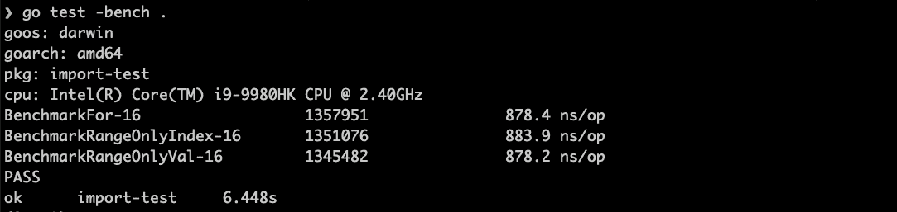
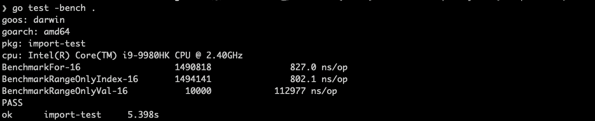
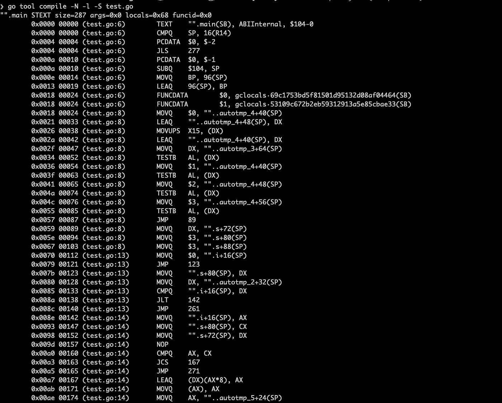
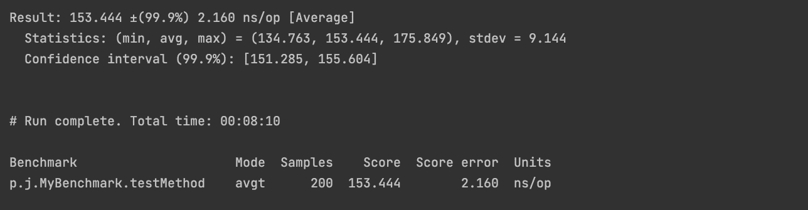
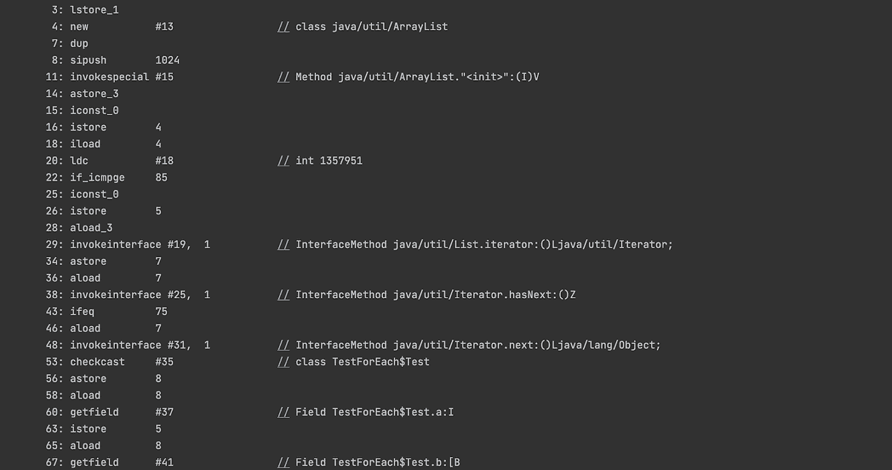
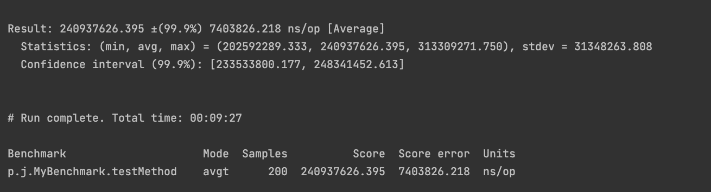
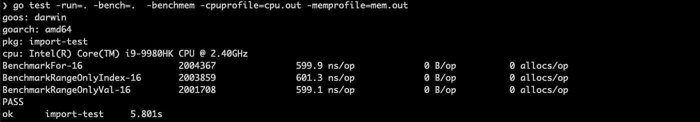

# Go 循环探索:Go 与 Java

> 原文：<https://levelup.gitconnected.com/the-go-loop-exploration-e2d465af8c25>

## for 和 for-range、Go 和 Java 之间的比较


Go VS. Java，来自 unsplash， [@chipsundhampagner](https://unsplash.com/photos/diRzqWT67CA)

通过比较学习总是有助于加深理解。作为一名 Java 老手，我忍不住将我学习的任何新语言与它进行比较，这让我对每种语言的优缺点有了全面的了解。并且在同一种语言中的不同实现之间进行比较，这样你就能记住它们的特性，这永远不会让你失望。我不得不承认，在研究了 Go 语言的编码策略和内部实现逻辑之后，我越来越喜欢它了。

Go 的效率部分是由于它的底层实现，我想在本文中深入探讨这一点，以最常用的语法`for loop`为例。Go 中的`for loop`不仅支持简单的索引遍历，还支持`for-range`遍历，有点类似于 Java 中传统的`for`和`foreach`语法。让我送你下去。

# 关键要点

*   `for-range`和`for`的区别
*   `for-range`和`for`的性能
*   `for-range`的底层实现
*   Go 的`for-range`与 Java 的`for/foreach`的性能比较
*   `For-range`的可能性

# 在 Go 中为-range 和 For

`For`只能通过索引访问数组或切片，而`for-range`可以支持索引和值得遍历。

而且`for-range`支持更多的遍历类型，比如字符串、映射、通道、切片等。上述示例中的`i`和`val`可以替换为`_`。

记下以下几点可以帮助你避免错误。

*   `for-range`中的`val`是一个值副本，不能直接使用和修改，只能赋给一个新变量后使用。
*   `For-range`遍历地图，结果未排序。在上面的`map`例子中，多次执行后结果可能会有所不同。
*   `For-range`只能通过索引修改元素值。

我将跳过例子，其中一些可以在我以前的文章 [*十大 Go 编码陷阱*](https://laiyuanyuan-sg.medium.com/top-10-go-coding-traps-ff3a546ec9e6) 中找到。

# 对于范围和性能而言

让我们看看在基准测试中使用`for`索引、`for-range`索引和`for-range`值时的性能。

这里看不出有多大区别。



然而，当我们将遍历对象从 int 改为包含大数组的 struct 时，即使没有调用大数组，这种差异也会显现出来。



唯值遍历的性能很差，只要看一眼源代码就能很容易地找出原因。

# For-range 底层实现

我们从第一次基准测试中可以看到，因为在底层实现 `**for-range**` **时应用了`**for**` **循环，所以`for-range`和`for`循环在正常情况下的性能几乎相同。****

虽然不同的类型有不同的实现，但它们基本上共享下面的[代码结构](https://github.com/golang/gofrontend/blob/925ace70ac7426c3f8b5c0bfb75aa9601f071de4/go/statements.cc#L6538)。

```
// Arrange to do a loop appropriate for the type.  We will produce//   for INIT ; COND ; POST {//           ITER_INIT//           INDEX = INDEX_TEMP//           VALUE = VALUE_TEMP // If there is a value//           original statements//   }
```

例如，slice 的`for-range`实现的[主逻辑](https://github.com/golang/gofrontend/blob/925ace70ac7426c3f8b5c0bfb75aa9601f071de4/go/statements.cc#L6758):

```
// The loop we generate://   for_temp := range//   len_temp := len(for_temp)//   for index_temp = 0; index_temp < len_temp; index_temp++ {//           value_temp = for_temp[index_temp]//           index = index_temp//           value = value_temp//           original body//   }
```

这里我们抓住了第二个性能测试缓慢的根本原因。由于每次都要复制值，所以当值是一个巨大的对象时，占用的内存更多，执行的 GC 也更频繁。

除此之外，其他四种类型的`for-range`结构都是在:

*   对于数组， [lower_range_array](https://github.com/golang/gofrontend/blob/925ace70ac7426c3f8b5c0bfb75aa9601f071de4/go/statements.cc#L6641)
*   对于字符串，[下限 _ 范围 _ 字符串](https://github.com/golang/gofrontend/blob/925ace70ac7426c3f8b5c0bfb75aa9601f071de4/go/statements.cc#L6743)
*   对于地图，[下限 _ 范围 _ 地图](https://github.com/golang/gofrontend/blob/925ace70ac7426c3f8b5c0bfb75aa9601f071de4/go/statements.cc#L6992)
*   对于通道，[下限 _ 范围 _ 通道](https://github.com/golang/gofrontend/blob/925ace70ac7426c3f8b5c0bfb75aa9601f071de4/go/statements.cc#L7094)

所以，`for-range`其实就是一个简单的句法糖。读下面两个循环代码的汇编代码，你会发现基本上是一样的。

```
s := []int{1, 2, 3}
for i, val := range s {
  println(i, ":", val)
}for i := 0; i < len(s); i++ {
  println(i, ":", s[i])
}
```

检查下面的结果，如果感兴趣，完整的编译[在这里](https://gist.github.com/slaise/8cfdca8cad9d0510968d3b6a3aac838b)。



我们不去分析汇编代码的生成，这太复杂了。但是循环的本质是处理`OFOR`类型的节点。详细代码见[src/cmd/compile/internal/GC/SSA . go](http://cmd/compile/internal/gc/ssa.go)。

# Go for-range 和 Java for/foreach

看到 Java 在相同条件下如何表现的想法一闪而过。为什么不尝试使用与第一个基准测试中的 Go 代码相似的 Java 代码呢？

然后，我使用 [jmh](https://github.com/openjdk/jmh) 基准框架来执行下面的代码。

迭代 10 次后，最终的测试报告出来了。查看完整记录[此处](https://gist.github.com/slaise/53a858330cf012c1321808d2299a70d3)。



**令人惊讶的是，**平均 153.44ns/op，几乎比 Go 代码快 4 倍！🙀

Java beats🤜以性能优异著称的围棋？这怎么可能呢？

我猜原因是 JVM 的动态编译出色，优化了基准代码循环中的无效代码，一定程度上提升了性能。

让我们通过`javap -v`查看汇编代码，你会发现`foreach`实际上是通过`list.iterator`和`hasNext/next`方法实现的，其中`hasNext`和 `next`只执行一次，因此性能很高。



事实上，Java 编译器(JIT)寻求通过那些有用的循环优化方法来优化代码，比如[循环展开](https://blogs.oracle.com/javamagazine/post/loop-unrolling)、[循环平铺](https://www.sciencedirect.com/topics/computer-science/loop-tiling)、[循环互换](http://underpop.online.fr/j/java/help/loop-interchange-compiler-java-programming-language.html.gz)、[循环融合](https://stackoverflow.com/questions/42804226/loop-fusion-of-stream-in-java-8-how-it-works-internally)等。

为了避免编译器优化，我做了一个简单的迂回，给数组赋值，而不是引用数组元素的默认值。

```
public void foreach(int times) {
  int[] l = new int[1024];
  for (int i = 0; i < times; i++) {
     int a = 0;
     for (int j = 0; j < l.length; j++) {
       l[j] = a++;
     }
     int b = a;
  }
}
```

然后再考，再惊。性能大大降低。随着 nanoTime 值的立即提升，我无法测量这种降低，或者可能是百万分之一(240937626 对 153)？



相反，用同样的方法重写 Go 代码后，测试结果并没有太大的不同，甚至有所改善。

```
func BenchmarkFor(b *testing.B) {
  var items [1024]int
  for i := 0; i < b.N; i++ {
    var tmp int
    for k := 0; k < len(items); k++ {
      items[k] = tmp
      tmp = tmp+1
    }
    _ = tmp
  }
}
```



# 射程的可能性

毫无疑问，Go 为 for-loop 相关的实现提供了足够的支持，满足了几乎所有的需求。然而，一些问题仍然没有解决，其中最受关注的是`for i, val:= range arr`中的`val`值复制。要使用它，你需要在循环中给一个新的变量赋值，这容易出错而且很麻烦。另一个令人头痛的问题是命名变量，许多地鼠都注意到了这一点，所以这里出现了[在每次迭代中重新定义范围循环变量的提议](https://github.com/golang/go/issues/20733)。还是保持对 Go2 的期待吧。

# 结束了

一系列的实践、测试和源代码跟踪加深了我对`for-range`底层实现的理解，探索本身非常有趣。将 Go 与其他语言进行比较有助于想象它的优点和缺点。永远保持学习、比较和反思我们的围棋之旅！