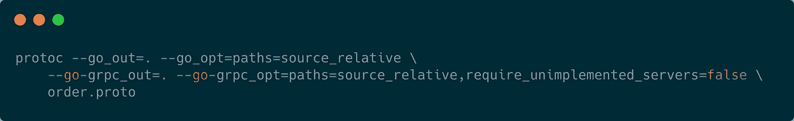
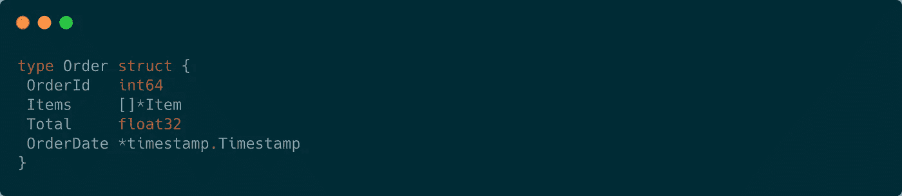
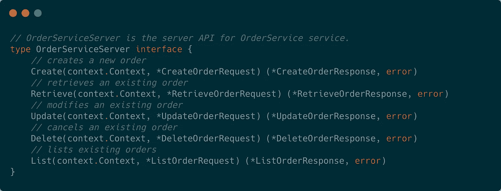
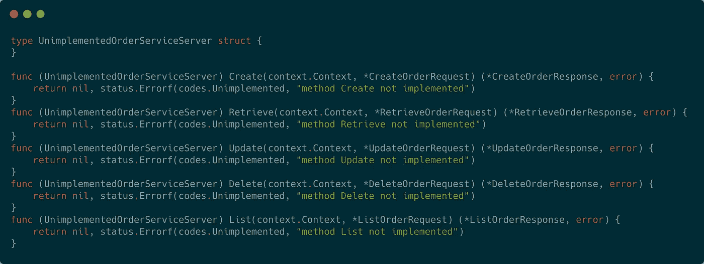
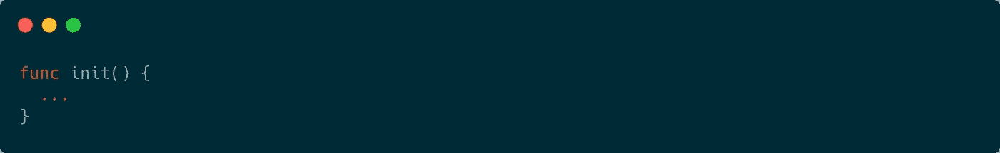

# Go 微服务工具包

> 原文：<https://levelup.gitconnected.com/the-golang-microservice-toolkit-7521516ee4b>

很多年来，我认为自己是一个语言无关的软件开发人员，因为当谈到编程语言时，我总是优先掌握基础知识和学习新概念，而不是“偏爱”。在我 15 年的职业生涯中，我编写了数千行跨多种语言的代码(例如， *Java* 、[Scala](https://georgefrancisjr.medium.com/the-essential-scala-toolkit-1fd2e43220a9)、 *Go、*等)。).直到我掌握了 Go 之后，我才意识到:选择正确的语言很重要。我成了一个真正的忠诚者；今天，它是我最喜欢的语言。它的简单和优雅，加上它强大的并发范例，使它成为下一代分布式服务的完美选择。

为了表达我对这门语言的热爱，我开发了一个工具包来帮助其他希望使用 to power 微服务的开发人员。

**1。REST + gRPC:创造完美婚姻**

微服务通常有 REST、gRPC *等 HTTP 或 RPC 框架做后盾。*

REST 伴随着对面向设计的[实体](https://www.collinsdictionary.com/us/dictionary/english/entity) *-* 的熟悉——这种设计方法是 HTTP 协议的[构件](https://tools.ietf.org/html/rfc2616#page-42)。*CRUD**(**C**reate**R**EAD**U**pdate**D**elete)操作定义了一个实体的一组行为。REST APIs 使用 [HTTP 方法](https://developer.mozilla.org/en-US/docs/Web/HTTP/Methods)的一个子集在一个通常被表示/序列化为 JSON 的实体上执行 CRUD 操作。***

***gRPC 是一个高性能的 RPC 框架(作为背景，RPC APIs 允许开发人员访问分布式过程或方法，它们在语法上与集中式过程或方法没有区别，隐藏了网络上数据序列化/传输的复杂性)。它提供客户端、服务器和双向流。***

***在底层，gRPC 使用 HTTP/2(用于传输)和协议缓冲区(用于高效的序列化)来实现优于 REST+JSON 的性能。它为代码生成提供了一流的支持。protobuf 编译器生成客户机和服务器代码，这有助于快速开发应用程序，并减少发布新服务所需的工作量。***

***通过结合 REST + gRPC，我们可以创建高性能的分布式服务，为客户提供双重访问模式，同时保留面向实体的设计方法的优点。***

***下面是上面的一个例子，在这个例子中，我们首先定义一个 gRPC 服务，使用 protobuf 规范以面向实体的方式放置`orders`。使用`order`作为我们的实体，我们需要定义对应于服务将支持的 CRUD 操作的 RPC 方法。我们将添加一个额外的 RPC 方法`List`来支持现有订单的列表/过滤。***

***订单.原型***

***接下来，我们使用带有必要 Go 选项的`protoc`来编译我们的`order.proto` 。***

******

***编译顺序. proto***

***运行上面的命令将生成两个文件:`order.pb.go`和`order_grpc.pb.go`。`order.pb.go`包含 order.proto 中定义的每个 protobuf `message`类型的结构。***

******

***订单结构(生成的代码)***

***`order_grpc.pb.go`提供与订单服务交互的客户端/服务器代码。这个文件中包含的是`OrderServiceServer`*——`OrderService`的接口翻译(出于婚姻类比的目的，就当它是司仪)。****

********

****OrderServiceServer 接口(生成的代码)****

****要启动并运行 gRPC 服务器，我们需要实现`OrderServiceServer` 接口。对于这个练习，我们可以使用`UnimplementedOrderServiceServer`(生成的代码中提供的基本实现)。****

********

****`UnimplementedOrderServiceServer (generated code)`****

****`RegisterOrderServiceServer`(生成代码)方法接受一个`grpc.Server`和一个`OrderServiceServer`接口；这个方法在我们的订单服务接口的实现周围包装了一个`grpc.Server`，并且必须在调用服务器的`Serve()`方法之前被调用。参见下面的例子。****

****初始化 gRPC 服务器****

****通过这一步，gRPC 订单服务只用几行代码就完成了。最后一步是开发一个 REST 服务器。通过在 REST 服务器中注入`OrderServiceServer`接口，我们可以让这场“联姻”正式化。****

****嵌入订单服务接口的示例 REST 服务器****

****最后，更新`main`方法，与 REST + gRPC 联姻。****

****使用服务接口统一 REST + gRPC 服务器****

****现在，gRPC 和 REST 服务器都使用相同的订单服务实现启动并运行。注意，我们可以对上面的代码片段进行一些优化，因为它涉及到错误处理、并发性、可读性等。记住以后解决这些问题。****

****如上所述，gRPC 框架提供了丰富的 protobuf 工具，可促进快速应用程序开发，使开发人员能够生成客户机/服务器代码，包括可用于将 gRPC 与 REST 或其他 HTTP APIs 结合的服务接口。****

## ****2.并发性— Goroutines 和通道****

****`Goroutines`是与其他函数同时执行的函数。我们可以认为它们是后台进程，不会阻塞当前的执行线程。在幕后，这些轻量级线程被复用到一个或多个(多:1) `[OS threads](https://en.wikipedia.org/wiki/Thread_(computing))`上。这允许 Go 程序处理数百万个`goroutines`，而 Java 可以处理的`futures`的数量将受到可用 OS 线程数量的限制(因为 Java 线程与 OS 线程是 1:1)。对于这种性能优势的警告是，Go 线程共享内存空间，并且对该内存空间的访问必须是同步的(这对于 Java 开发人员来说应该很熟悉)。这就是`channels`将我们从自由落体状态和死锁地狱中解救出来的地方。****

****通道是基本的[类型的管道](https://tour.golang.org/concurrency/2)(你可以把它们想象成邮箱)，它允许 goroutines 在没有互斥体(锁)的情况下安全地来回共享数据。通道读/写[阻塞当前执行线程](https://en.wikipedia.org/wiki/Blocking_(computing))，直到发送方或接收方准备就绪。****

****下面是一些常见的任务，goroutines 可能会有用。****

*   ******应用任务**:运行 web 服务器、数据库连接池、守护进程、API 轮询、数据处理队列****
*   ******请求/事件任务**:处理传入的 HTTP 请求，执行昂贵的子任务(例如多个网络调用)来完成请求，向卡夫卡发布新消息****
*   ******触发&忘记任务**:日志记录、警报、指标****

****web 服务器是一个应用级进程，通常有一个`start` */* `serve`方法来阻塞当前的执行线程，直到服务器完成对请求的服务。如果你很好奇 Go 的 HTTP 服务器是如何处理请求的，那就结账[源码代码](https://github.com/golang/go/blob/520f3b72db7befab2028d9a47376267cf2d274a9/src/net/http/server.go#L3013)*(TL；对于每个传入的 HTTP 请求，都会产生一个`goroutine`。*****

*****由于`grpcServer.Serve()`和`restServer.Start()`都是阻塞调用，所以在`main`的执行线程中只能执行其中一个调用。另一个必须在后台执行。我们其余的& gRPC 服务器的`start` */* `serve`方法也会返回错误，我们需要优雅地处理这些错误。(这方面的一个快速提示:将每个服务器包装在一个公开错误通道的结构中。调用将错误写入错误通道的`goroutine`中的*启动/服务*方法。这允许我们使用`[select](https://tour.golang.org/concurrency/5)`来等待多个通道操作完成)。*****

****下面的代码演示了如何针对后台处理和基于通道的错误传播优化 REST & gRPC 服务器。****

****RestServer 重构****

****GrpcServer****

****记得把你的 Go app 当做一个实体。很多时候，开发人员可以编写可靠的服务级别代码，然后在他们的`main`方法中加入大量的条件`log.Fatal()`语句和其他难以理解的逻辑。****

****考虑为应用程序创建一个包含配置、服务器和其他应用程序级依赖项的结构。尽管 Go 提供了创建多个 [init](https://golang.org/doc/effective_go.html#init) 函数的能力，但是尽可能避免使用`init` 。Init 函数有一些缺点，包括它们有空返回。具体来说，Go [运行时](https://golang.org/doc/faq#runtime)寻找具有以下签名的包级函数****

********

****这意味着您不能从`init`函数返回值。如果你试图初始化一个变量，出现错误，你可能会被迫[死机](https://go-proverbs.github.io/)，退出应用程序，或者编写`recover`逻辑。Init 函数会使代码更难理解。相反，探索创建您自己的定制的类似构造函数的函数，该函数创建一个新的应用程序，执行所有必要的应用程序初始化，并返回应用程序。如果应用程序初始化过程中出现错误，只需更改函数的返回签名，返回一个应用程序实例和一个错误。****

****下面是`main`的优化版本，它为应用程序创建了一个结构，使用`select`来监听来自其余& gRPC 服务器的错误，并处理应用程序的启动/关闭(包括操作系统终止信号)。****

****主重构****

****在我们创建或更新`order`之前，我们需要获得支付方式的预授权批准，并且我们应该确认要购买的商品有库存。假设这些子任务可能出错(失败或超时)，并且可以独立执行。处理请求级并发有几个选项。我们可以使用标准的 goroutines 和频道，但也许有更好的选择。****

****等待组允许我们开始一组 goroutines 并等待它们完成。一个`waitGroup` 可以工作，但是这伴随着管理 [waitGroup](https://golang.org/pkg/sync/#example_WaitGroup) 计数器的责任。错误组非常适合执行一组相关的子任务。一个`errGroup`由执行子任务和处理错误传播的 goroutines 集合组成。一个`errGroup`等待(阻塞)直到所有子任务完成。****

****将[上下文](https://golang.org/pkg/context/)用于传入和传出的服务器请求。上下文允许在客户机和服务器之间传播请求范围的值、截止时间和取消信号。`Context`有一个`Done()`通道，可以在`Context`被取消时通知 goroutines，允许它们提前退出并释放系统资源。当使用`errgroup.WithContext()`时，在第一次遇到子任务错误或第一次`wait()`返回时，派生上下文被取消。****

****在下面的例子中，`validateOrder`创建了一个`errGroup`，它派生出两个并发的子任务，一个任务给`preAuthorizePayment`，另一个任务给`checkInventory`，并确认是否所有的`items`都有库存。在两个子任务中调用的函数接受一个`Context`，并且能够在发生上下文取消(或请求超时)时提前返回。****

****大多数仓库(和履行中心)都有订单管理系统来实现高效和经济的订单履行。类似地，管理并发性对于保持应用程序的质量至关重要。下面的例子使用了一个`waitgroup`和通道来限制我们的仓库一次可以处理的订单数量。****

****限制等级的等待组****

## ****3.有效单元测试****

****在我职业生涯的早期(Java 时代)，[单元测试](https://en.wikipedia.org/wiki/Unit_testing)让我想起了我妈妈总是放在我餐盘里的那份蔬菜。小时候，我总是先吃好吃的，然后偷偷把蔬菜铲进垃圾桶。换句话说，单元测试给我留下了不好的印象。这主要是因为它需要团队跟上新的模仿框架，用一个通常很难掌握的框架创建一个陡峭的学习曲线。更不用说，这些嘲讽的框架依赖于反射——正如 Rob Pike 曾经说过的,[反射永远不会清晰](https://www.youtube.com/watch?v=PAAkCSZUG1c&t=15m22s)。****

****幸运的是，Go 改变了我对单元测试的看法。以下是我一路走来学到的一些测试技巧。****

*   ******用纯函数代替方法。**最容易测试的代码单元之一是纯函数。纯函数是确定性的，不需要初始化来测试。方法是定义在一个`type`(例如。结构)。为了测试一个方法，必须初始化它的父类型。见下文。****

****方法与纯函数(示例)****

*   ******创建功能依赖关系。** 函数执行任务需要的任何外部依赖(DB、web 服务调用、事件生产者等)都可以作为参数注入到函数中。具有嵌入式依赖关系的函数很难测试。开发人员通常通过使用能够在运行时(通过反射)改变(模仿)外部依赖关系值的测试框架来避开这种[代码味道](https://martinfowler.com/bliki/CodeSmell.html#:~:text=A%20code%20smell%20is%20a,me%20with%20my%20Refactoring%20book.&text=The%20best%20smells%20are%20something,you%20to%20really%20interesting%20problems.)。如果您再看一下`validateOrder`函数(在上面的一个代码片段中)，您可能会注意到外部依赖项`preAuthorizePayment`和`verifyInventory`是嵌入的。这个函数很难测试。因为 Go 支持一级函数——我们可以通过把`validateOrder`变成一个[高阶](https://georgefrancisjr.medium.com/the-essential-scala-toolkit-1fd2e43220a9)函数来解决这个问题。****

****下面是一个将事情联系在一起的示例测试用例。****

*   ****当用作工具而不是拐杖时，嘲讽框架是有用的。即使我们可以在没有第三方朋友的情况下模仿外部依赖，这些框架仍然为单元测试的乏味部分提供了价值，例如执行测试断言。****
*   ******对你的队友友好。**正如罗布派克[所说](https://www.youtube.com/watch?v=PAAkCSZUG1c&t=14m35s)“清晰胜于巧妙。”我总是鼓励开发人员在编写代码时考虑到受众。清晰的代码易于编写，易于测试，并且应该易于开发人员(和非开发人员)理解。****

****享受你掌握围棋的旅程。请在下面留下您的评论。****