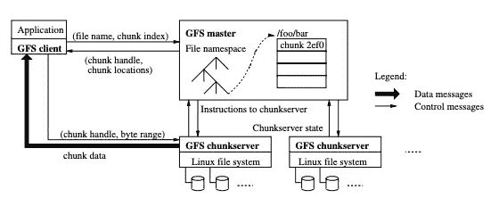
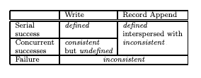

# Google 文件系统:Google 构建的分布式文件系统

> 原文：<https://levelup.gitconnected.com/the-google-file-system-the-distributed-file-system-that-google-built-68463670ac57>

## 从分布式文件系统中学到的经验是，许多 Google 应用程序如 BigTable、MapReduce 都是建立在分布式文件系统之上的。

罗伯特·卡茨基在 [Unsplash](https://unsplash.com?utm_source=medium&utm_medium=referral) 上的照片

> 本文总结了从 2003 年发表的 Google 文件系统(GFS)论文中获得的主要经验。

# 什么是 GFS？

谷歌文件系统(GFS)是一个**可扩展的分布式文件系统**，用于大型分布式数据密集型应用。它提供了容错功能，即使是廉价的商用硬件，也能为大量客户端提供高平均性能。GFS 在 Google 内部被广泛部署，作为需要生成和处理大型数据集的应用程序的存储平台。

## 为什么您应该阅读 Google 文件系统白皮书？

1.  合并了分布式系统中许多重复出现的主题:并行性能、容错、复制和一致性。
2.  GFS 代表了一种成功的现实设计。许多 Google 应用程序如 BigTable 和 MapReduce 都是建立在 GFS 之上的。
3.  GFS 论文(2003)写得很好，包括了作者从应用层到网络层的各种考虑。

## 2003 年，政府统计处的文件对该行业的主要贡献是什么？

*   尽管写了关于分布、分片、容错的基本概念，GFS 的使用规模还是很大的(比大多数学术系统都大)。
*   用于工业，并分享了谷歌的现实世界的经验。
*   证明了弱一致性的成功使用。
*   演示单个主机的成功使用。

# GFS 试图解决的问题是什么？

塞巴斯蒂安·赫尔曼在 [Unsplash](https://unsplash.com?utm_source=medium&utm_medium=referral) 上的照片

Google 需要一个大规模、高性能的统一存储系统，用于它的许多内部服务，如 MapReduce 及其内部网络爬虫服务。特别是，该存储系统必须:

1.  放眼全球。任何客户端都可以访问(读/写)任何文件。这允许在不同的应用程序之间共享数据。
2.  支持在多台机器上自动分割大文件。这通过允许每个文件块上的并行进程提高了性能，并且还处理了无法放入单个磁盘的大文件。
3.  支持从故障中自动恢复。
4.  针对大文件的顺序访问和最常见的读取和追加操作进行优化。

特别是，作者针对高持续带宽(目标应用程序重视以高速率批量处理数据)优化了 GFS，但不一定针对低延迟(GFS 通常用于内部服务，不面向客户端)。

# GFS(架构)的大图

让我们回顾一下 GFS 的大图。在本节中，我们将介绍 GFS 作者做出的 3 个主要设计选择，即 I)选择仅使用一个主文件，ii)选择仅在非易失性存储中存储一些元数据，以及 iii)选择一致性保证。

GFS 由一个主服务器和多个分块服务器组成，由多个客户端访问。文件被分成 64MB 的固定大小的块。每个块都有一个不可变的全局唯一的块处理程序，它是由主节点在创建块时分配的。默认情况下，每个文件块被复制到 3 个不同的块服务器上。

图 GFS 体系结构的高级概述。改编自[1]。

## 单主

主服务器维护所有文件系统元数据。这包括从文件到块、块位置等的映射。主服务器还定期向 chunkserver 发送心跳消息，向它发出指令并收集它的状态(图 1)。

**单个主机的优势:**由于单个主机可以使用全局知识做出复杂的数据块放置和复制决策，因此极大地简化了 GFS 设计。

**单主的可能缺点:**

1.  单点故障。必须定期将关键元数据检查到非易失性存储中。
2.  可能是性能瓶颈点。必须最大限度地减少主机对读写的参与。

关于第 2 点，客户端从不通过主服务器读写文件数据。正如您在图 1 中看到的，客户端询问主服务器应该联系哪个 chunkserver，在有限的时间内缓存该信息，并直接与 chunkserver 交互以进行读写操作。

## [计]元数据

元数据存储在主**内存**中，而数据存储在 chunkservers 中。这使得主设备的操作非常快速，并且还允许主设备在后台高效地执行对其整个状态的周期性扫描。周期性扫描用于实现块垃圾收集、块迁移等。

主存储 3 种主要类型的元数据:

1.  文件和块名称空间
2.  文件名→块处理程序数组
3.  块处理器→块服务器列表、主块服务器、块版本号

请注意，前两种类型的元数据通过将变化记录到存储在主服务器本地磁盘上的操作日志中来保持持久性，并定期复制到远程机器。然而，主设备不会永久存储块位置信息。相反，它会在主服务器启动时以及每当一个 chunksserver 加入集群时向每个 chunkserver 询问它的 chunk。这是因为 chunkservers 是块位置和主要状态信息的权威数据源。

## GFS 的一致性保证

GFS 提供了一个宽松的一致性模型，这对于 Google 的高度分布式应用程序来说很好，但是实现起来相对简单有效。这里，作者描述了文件区域的两种状态(表 1):

1.  如果所有客户端总是看到相同的数据，不管它们从哪个副本读取，文件区域都是**一致的**。
2.  如果在一个突变之后，它是一致的，并且客户端将看到该突变完整地写入了什么，则文件区域被定义为**(即，该突变被写入而没有被来自其他突变的其他数据交织)。**

****

**表 1:突变后的文件区域状态。改编自[1]。**

**当非并发突变成功时(所有副本都报告成功)，文件区域被定义，因此是一致的。然而，在并发成功突变的情况下，文件区域是一致的，但可能没有被定义:所有客户端看到相同的数据，但通常它由来自多个突变的交错片段组成。失败的突变(至少有一个副本未报告成功)表明文件区域不一致，因此未定义。在这种失败的情况下，GFS 客户端只需重新运行变异。**

****原子操作****

**GFS 提供了一些原子保证。文件命名空间变化(例如文件创建)是原子性的，并且由主机专门处理。名称空间锁定保证了原子性，并且主机的操作日志定义了这些操作的全局总顺序。**

**与常规的写入或附加操作相比，GFS 提供了一个记录附加操作，该操作保证即使在同时发生突变的情况下，也至少自动执行一次要附加的数据，但是是以 GFS 选择的偏移量执行的。GFS 会将附加数据的偏移量返回给客户端。**

## **区块副本**

**为了确保在一系列成功的突变之后，文件区域包含由最后一次突变写入的数据，GFS i)通过指定主副本，以相同的顺序将突变应用于块副本，ii)使用块版本号来检测由于在 chunkserver 关闭时错过了突变而变得过时的任何副本。**

**陈旧的副本将永远不会被包含在变异中，也不会被提供给向主服务器请求块位置的客户端。它们是尽早收集的垃圾。**

# **从政府财政处汲取的主要教训是什么？**

1.  **假设存在某种形式的应用程序级检查，弱一致性甚至在生产中也是可行的。**

> **由于记录追加的原子保证，GFS 客户端应该依赖记录追加，而不是覆盖。Record append 的至少追加一次语义保留了每个编写器的输出。读者可以通过添加额外的信息(如校验和和唯一标识符)来过滤掉重复记录，从而处理偶尔出现的填充和重复记录。**
> 
> ***GFS 客户端还通过在写入所有数据后自动将文件重命名为永久名称来执行检查点操作，或者检查已经成功写入了多少数据。检查点还可以包括应用程序级校验和。***

**2.全局集群文件系统作为一种通用的基础设施，对于许多数据密集型应用是非常有用的。**

**3.如果我们将主服务器中的元数据与 chunkservers 中的存储分开，并尽量减少客户端对主服务器的调用，那么单个主服务器可能是可行的。**

**4.我们可以利用文件分块来提高并行吞吐量。**

**5.使用主副本分块服务器对所有副本的写入进行排序。**

**然而，事后看来，政府飞行服务队的设计有一些缺点或不足之处:**

1.  **单主性能可能没那么大。回想起来，当这些年来文件数量显著增加时，Google 开始出现问题。**

> ***从几百兆字节到十兆字节，然后到几十兆字节……这确实需要主机维护的元数据量成比例地增加。此外，扫描元数据以寻找恢复等操作都与数据量成线性关系。因此，要求大师完成的工作量大大增加了。保留所有这些信息所需的存储量也在增长。[3]***

**2.缺少到主副本的自动故障切换。工程师过去必须手动执行主状态的加载检查点并执行故障转移。这既慢又没用。**

**3.GFS 使用的一致性模型在实践中可能过于宽松[3]。**

**点击这里查看我在 MapReduce 上的总结！**

** [## [论文摘要] MapReduce:大型集群上的简化数据处理

### 从谷歌建立的分布式大规模计算管道中吸取的教训。

levelup.gitconnected.com](/paper-summary-mapreduce-simplified-data-processing-on-large-clusters-58dac068462e) 

# 参考

[1] Sanjay Ghemawat，Howard Gobioff，Shun-Tak Leung (2003)。谷歌文件系统。[https://pdos.csail.mit.edu/6.824/papers/gfs.pdf](https://pdos.csail.mit.edu/6.824/papers/gfs.pdf)

[2]麻省理工学院 6.824 2020 GFS 注释[https://pdos.csail.mit.edu/6.824/notes/l-gfs.txt](https://pdos.csail.mit.edu/6.824/notes/l-gfs.txt)

[3] GFS:快速发展的演变(2009 年)[https://queue.acm.org/detail.cfm?id=1594206](https://queue.acm.org/detail.cfm?id=1594206)**