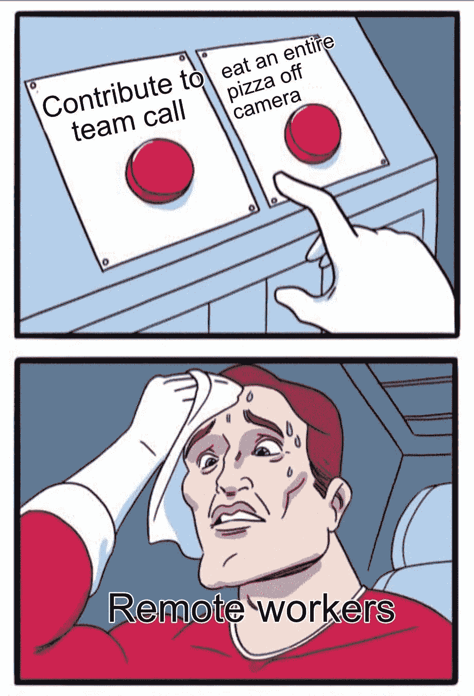

# 《苦差事》:技术与编码周刊——第 4 期

> 原文：<https://levelup.gitconnected.com/the-grind-tech-coding-weekly-issue-4-881e28d1db17>

优步购买邮戳//互联网档案馆的法律团队//网络黑暗时代

[***订阅 The Grind***](https://thegrind.news/)**把本周最好的科技和编程故事发到你的收件箱里。**

*又是一周，又是一期！Mozilla [发布了火狐 78](https://www.mozilla.org/en-US/firefox/78.0/releasenotes/) 版本。Brython 试图让 Python 成为语言，而不是 JavaScript。Dish [收购 Boost Mobile](https://arstechnica.com/tech-policy/2020/07/dish-is-finally-a-mobile-provider-but-doesnt-operate-its-own-network-yet/) 进军无线市场。*

# ***新闻***

*优步收购 Postmates
优步似乎打算以 26.5 亿美元收购广受欢迎的食品配送服务 Postmates。此举正值该公司寻求扩大 Uber Eats，以便在与竞争对手 DoorDash 的竞争中占据一席之地。 [**彭博**](https://www.bloomberg.com/news/articles/2020-07-06/uber-postmates-said-to-agree-on-2-65-billion-all-stock-deal)*

*互联网档案馆获得法律帮助在之前的一期杂志中，我们报道了互联网档案馆——一个支持大量教育媒体的非营利组织——是如何被多家大型出版公司起诉的，因为他们通过国家紧急图书馆倡议放松了限制，以应对新冠肺炎造成的危机。现在，电子前沿基金会和主要的法律事务所 Durie Tangri 正站在 IA 一边，这肯定会是一场旷日持久的法律战。 [**TORRENTFREAK**](https://torrentfreak.com/eff-heavyweight-legal-team-will-defend-internet-archives-digital-library-against-publishers-200626/)*

***特朗普瞄准互联网审查法** 当 Twitter 开始在唐纳德·特朗普的推文中添加免责声明时，它重新引发了关于社交媒体公司应如何处理发布在其平台上的争议性信息的辩论。相关法律第 230 条为科技公司提供全面保护。正如我们所知，它是创建互联网的基础，但一些人认为它也应该进行审查。 [**《纽约人》**](https://www.newyorker.com/news/letter-from-silicon-valley/trump-twitter-facebook-and-the-future-of-online-speech)*

***Bandcamp:无算法的成功** 在线音乐商店 Bandcamp 讲述了人类的接触——而不是算法——是网站持续成功的原因。与 Spotify 或 Tidal 等流媒体服务不同，Bandcamp 是一个将音乐家放在第一位的地方。这种方式让网站更像是一个唱片商店，并让公司能够给它所服务的艺术家更多的回报。 [**居留顾问**](https://www.residentadvisor.net/features/3703)*

# ***意见***

*开发者 Bartosz Ciechanowski 对光影在设计中的相互作用进行了令人难以置信的详细分析。它包括许多实际操作的例子来说明想法的巨大影响。*

***Mozilla 基金会反对 EARN IT 法案 Mozilla 基金会站出来大声谴责目前在参议院的 EARN IT 法案，称他们认为“美国参议院正在推进一项对数字安全基石——强加密——造成威胁的立法。” [**MOZILLA**](https://foundation.mozilla.org/en/campaigns/oppose-earn-it-act/)***

# *****来自互联网*****

*****不成功开发人员的 5 种心态开发人员 Manish Jain 列出了开发人员在遇到困难时可能会告诉自己的 5 个最常见的误区，然后雄辩地逐一消除。*****

*****[**解决常见问题的 6 个 JavaScript 代码片段**](/6-javascript-code-snippets-for-solving-common-problems-33deb6cacef3)软件工程师 Tate Galbraith 介绍了每个开发人员面临的问题，以及解决每个问题的详细解释的代码片段。对于缺乏经验的 JavaScript 开发人员来说，这是一本很好的读物。问题包括在对象数组中查找特定对象，以及使用 spread 运算符。*****

# *******开发工具*******

*****[**Adobe Color**](https://color.adobe.com/create/color-wheel)一个创建和微调调色板的伟大工具。包括多种“颜色和谐”规则，如类似、互补和三色。它是免费的，多年来已经成熟和发展得很好。*****

*****[**DevIcon**](https://konpa.github.io/devicon/)由 [konpa (Julien Monty)](https://github.com/konpa) 创建的一个代表许多主要编程语言和 web 技术的吸引人的图标集合。*****

# *******花式项目*******

*****[**Web 黑暗时代**](https://pavellaptev.github.io/web-dark-ages/)一个网站的绝妙创意，具有极大的执行力。*网络黑暗时代*带你穿越互联网设计的黑暗过去，通过时代的视觉标志讲述故事。*****

# *****本周迷因*****

**********

******保持研磨，******

*****但*****

*****[***订阅研***](https://thegrind.news/)**把本周最好的科技和编程故事送到你的收件箱。*******