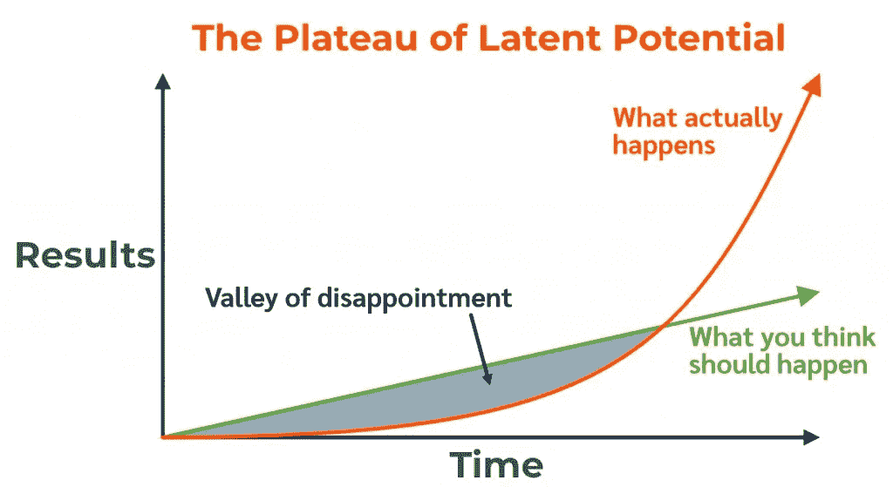

# 学习编码最难的部分

> 原文：<https://levelup.gitconnected.com/the-hardest-part-about-learning-to-code-a6ddf4a704ac>

我们都有过这样的想法。“我想学编码。”像任何事情一样，开始时相当简单和令人兴奋，但没有人谈论接下来会发生什么。


由[安德里亚·皮亚卡迪奥](https://www.pexels.com/photo/young-troubled-woman-using-laptop-at-home-3755755/)拍摄

## 你好世界

学习编码是许多人的目标，写下第一行代码让人激动不已:

```
console.log('Hello World');
```

如果你正在读这篇文章，你可能已经去过那里了。在第一行之后不久，你会发现自己在用代码进行简单的数学运算，这也很有趣。然而，到了某个时候，你决定你实际上想要构建一些有意义的东西，并通过代码让它变成现实。不仅仅是一个运行在 VS 代码中的简单计算器，而是一个真正的应用程序。因此，您的代码之旅开始了…

> 你必须跳进水里去游泳。—麦克米勒

一旦你的旅程真正开始，事情会变得艰难，你会发现你的最终目标——构建有意义的东西——还很遥远，你最终会遇到学习编码最难的部分**。**

## 过程和问题

学习编码是一个独特的过程，因为你经常处于情绪和无数心理状态的过山车上，因为有时候你觉得自己是编码的冠军，而其他时候你觉得编码可能不适合你——你不适合做这个。最好/最坏的部分是你可以在一瞬间从一种状态转换到另一种状态。

问题是编程中的门柱移动了…很多。你的个人目标以及随着时间的推移，行业期望的目标。你的个人目标会移动，因为你最初对“学习编码”的理解是对软件工程的肤浅和宽泛的理解。

像其他技能一样，真正学习编码也有一定的层次。如果你是认真的，你会想达到一个相当高的水平。

## 一个不太可能的敌人——如果没有别的，读读这个吧！

学习编码最难的部分是你在和多个敌人战斗，而其中一个敌人是你可能都没有意识到的不可能的罪犯。 ***是自己。***

是的，没错。认识到这一点非常重要，现在是最佳时机。那些让你想退出的感觉、想法和情绪都来自一个单一的来源——***你*** 。

发生这种情况的原因是因为我们的大脑实际上非常善于保护我们。基于你迄今为止的生活经历，你的大脑已经建立了一个目录，它认为你可以做的事情都在你的掌控之中。当你走出那个目录，你的大脑会(自然地)想要保护你免受伤害，因为你正在参与一些你不熟悉的事情。本质上，你的大脑试图保护你免受压力。

不幸的是，这不是我们学习的方式。我们必须有压力，至少有一点，去学习一项新技能。

要明白那些时刻是自然的，但是你必须抵抗并坚持度过它们以达到你的最终目标。

你越早意识到正在发生的事情，你就越接近战胜自我怀疑，从失望的低谷中走出来。

大多数反对力量来自内部。另一个反对力量是你对进步的想法。在您的代码之旅的开始，您将以更显著的速度学习东西，因为您实际上是从零开始。然而，一旦你学会了一些东西，**你会经历一个阶段，感觉你没有以同样的速度进步(或者根本没有进步)。这被称为*失望之谷。***

在失望的低谷中，你必须保持专注、一致和积极，如果你在看似毫无进展的时候坚持下去，你将会看到指数级的结果。如果你没有从这篇文章中学到什么，请记住:继续前进。不要放弃。

下图显示了潜在电位的平稳状态。大多数人会在失望的低谷中迷失，但是如果你度过了它，你将会在你的结果中经历指数级的增长。



照片由 [ELTNick](https://eltnick.wordpress.com/2020/08/14/the-valley-of-disappointment/) 拍摄

最后，你也在与对自己的认知作斗争。善待自己，温柔自己。

> 像对你爱的人说话一样对自己说话。

## 学习曲线

虽然学习编码时你是自己的敌人，但也有其他人。其他对立力量包括:

*   **语法** —学习实际键入代码的方法需要调整。
*   **逻辑**——学会从逻辑上确定如何获得你想要的结果，并将抽象转化为程序，这是另一项需要学习的技能。
*   **划分问题** —将问题分解成更小的部分是编程的基本原则。

## 其他考虑

机会成本——另一个反对力量是，你可能会把时间花在做其他事情上，而不是学习一些你不完全确定会带来结果的东西。娱乐和休闲有它们的位置，但是在你留出学习的时间里。**学**。

## 不要拿自己和别人比较

就是这样。简单明了。除非另一个人的结果将决定你的，否则你不应该担心另一个人会如何反对你。专注于你。你的旅程是你自己的。

## 结论

学习编码很难。有太多的事情会阻碍你的成长。然而，有了专注、一致和积极，所有对立的力量都可以被阻挡。你能做到的。你至少有一个我的粉丝。

保重。

[**通过电子邮件获取我的文章点击这里**](https://anthonycg_.medium.com/subscribe) **|** [**购买 5 美元中等会员资格**](https://medium.com/@anthonycg_/membership)

*大家好，我是安东尼！我当然希望你喜欢这个故事，更重要的是，我希望它能让你思考，这一直是我的目标。我目前正在进行成为一名熟练软件工程师的个人旅程，我希望你能加入我的行列。给我一个关注(和一两个掌声)，我们下次再见！*