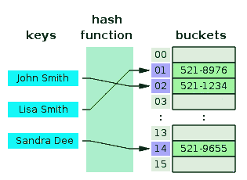
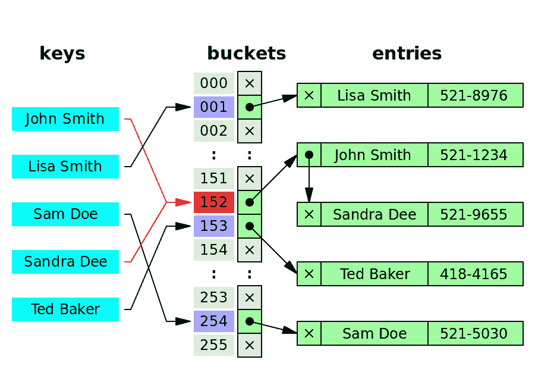

# 哈希表走进酒吧…

> 原文：<https://levelup.gitconnected.com/the-hash-table-4e02f7052440>

在我们之前的文章中，我们已经讨论了二叉查找树(BST)及其属性。我们回顾了它的 O(log n)的 Big-O 符号，并讨论了它的当代替代品:哈希表。在这篇文章中，我们将剥离散列表(HT)的一些层，它的用途和它如何比较。

## **数据结构**

就像 BST 一样，HT 是另一种数据结构——然而，与树不同，HT 使用关联数组(一个数组和一个散列函数的组合)将其元素存储在可以快速轻松访问的键值对中。每个键被分解成数组中的“桶”,每个桶包含一个或多个值——为了防止对象具有相同键时的冲突，每个桶都可以成为链表(我们将在后面讨论)。

因此，如果我们想要将个人的电话号码存储在一个集合中并快速检索它们，实现一个散列表看起来有点像这样:



## 哈希函数

HT 的关键元素是散列函数。根据维基百科的定义:

> 一个**散列函数**是任何一个**函数**，可以用来将任意大小的数据映射到固定大小的数据。由**散列函数**返回的值被称为**散列**值、**散列**代码、摘要，或者简称为**散列**。— [*哈希函数*](https://en.wikipedia.org/wiki/Hash_function)

由期望的散列函数返回的散列值可以是任何值——尽管它们通常是整数——并且表示每个数据集的键。哈希函数必须是一个纯函数，所以当我们给定相同的输入时，它应该总是给出相同的输出。没有这种一致性，我们将无法查找我们的索引并找到我们刚刚映射到表中的数据。

设置索引通常在以下任一步骤中完成:

```
index = f(key, array_size)
```

或者两步走:

```
hash = hashfunc(key)
index = hash % array_size
```

在散列函数中运行了键之后，我们现在就有了表中任何对象/数据的简明引用点。我们所要做的就是获取我们想要查找的关键字，并将其传递给哈希函数，以再次返回相同的索引，并使用该索引来标识在关联数组中的何处查找。与分别具有 O(log n)和 O(n)的 Big-O 符号的 BST 和链表(LL)相比，尽管它依赖于哈希函数的时间和复杂性，但理想情况下，这给了我们的 HT 一个恒定的查找和插入时间 O(1) —太棒了！

## 碰撞

如果两个键被散列到同一个索引，我们会以冲突结束。如果我们处理一个固定大小的表，随着数据集的增长，冲突越来越不可避免。没有固定大小的表可能更容易避免这种情况，但是这种类型的表需要大量未使用的空间或浪费的内存。

未处理的冲突当然是有问题的，因为我们期望在每个索引中只能找到一个值。为了说明这一点，有几种碰撞方法；最常见的是通过链表进行单独链接。这意味着每个桶包含一个链表，并将我们的常数时间 O(1)减少到 O(n ),因为一旦我们查找索引，我们将需要遍历列表中条目的数量 *n* 。我们的电话簿示例的最终结果如下所示:



对于 Javascript 中的代码示例，我们可以参考以下由 Beau Carnes 提供的 CodePen 链接:

【https://codepen.io/beaucarnes/pen/VbYGMb?editors=0012 号

感谢阅读！