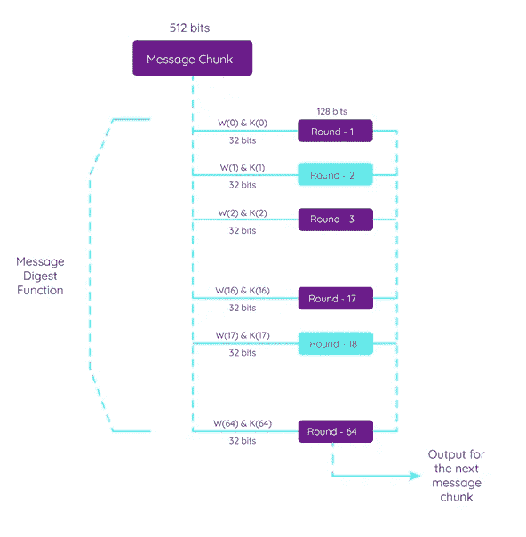

# 区块链的心脏——哈希函数

> 原文：<https://levelup.gitconnected.com/the-heart-of-blockchains-hash-functions-501d0b32762b>

## 哈希函数是区块链技术的核心。为什么它们如此重要，它们是如何工作的？使用了什么散列函数什么是 Merkle 树？开门见山，这就是我们要看的。

## 不变性和信任引擎:散列函数

我们在以前的文章中已经讨论过，区块链是一个分布式和不可变的数据库，但是这是如何实现的呢？

**区块链中的每个块通过散列机制**链接到前一个块。每个块包含前一个块中数据的**散列**，创建了一个相互链接的块链。不能改变块的顺序或改变任何数据，因为如果块被改变，块的散列将改变，将其标记为无效。这就是区块链不变性的来源。任何更改都会被自动检测到并失效，因为它与哈希不匹配。

每个块在块头中包含前一个块散列(包括前一个块事务)。**此外，块还包含块中包含的事务，通常以 Merkle 树的形式。这个 Merkle 树散列包含在块头中。**交易可以是金融交易，也可以是事件，即交易不一定需要转移价值。它可以是资产的转移或简单的数据转移。

## Merkle 根

hashMerckeRoot 是区块链大多数街区使用的田地。Merkle 根就像块中所有事务的指纹。它来自梅克尔树。它们在密码学中被广泛使用，在区块链发明之前就已经被使用了。1979 年，这些树以拉尔夫·默克尔的名字命名。它们是验证共享数据未被更改、破坏或篡改的基本方法。

Merkle 树也是一种验证区块链中数据有效性的轻量级方法。例如，如果你在手机上使用比特币钱包，你的钱包不需要下载所有的区块链交易来验证它们。带有 Merkle 根的 Merkle 树将验证所有以前的事务。

Merkle 树结果或 Merkle 根基本上是所有事务的散列的散列。你可以把它想象成一棵树，树叶就是区块链的交易。这些叶子被散列成分支，这些分支被散列到根。Merkle 树是递归构建的，即它是由 Merkle 树中的叶子的散列产生的，这些叶子又对应于事务。

Merkle 根是通过散列这些被称为叶子的单个事务来求解的。附加的叶对被散列以创建可以对应于区块链网络中的事务的附加叶节点。

虽然 Merkle 树可以从大量的事务中创建，但是 **Merkle 根总是对应于 32 字节的字符串或 256 位的**(例如，SHA256 散列算法总是输出 32 字节的固定长度，而不管输入的大小)。**这样，我们可以使用小到 32 字节的东西来验证一些事务——可能是数千个——是不可变的。**

## 哈希函数特征

散列函数接受任何大小的输入值，并创建固定长度的输出。无论输入有多大，输出总是有相同的大小。如果输入值有任何变化，输出会自动改变。

任何东西都可以被散列。区块链交易，威廉莎士比亚全集，阿特拉斯耸耸肩，一个图像或者一个文档，hash 输出总是一样的大小，有特定的特征。SHA-256、SHA-3 和 Keccak 在几个区块链中被广泛使用，它产生 256 位(32 字节)大小的散列(输出)。

让我们来看看哈希函数的特征:

**计算效率**:计算或验证一个 hash 不需要很多计算资源。

**确定性**:只要输入相同，hash 的输出总是相同的。如果我将一张特定的猫照片哈希 1000000 次，输出将始终相同。然而，如果我改变猫照片中的一个像素，输出(散列字符串)将完全不同。

在这个截图中，我们检查一个句子的 SHA256 散列输出是什么。您可以看到，改变句子中的一个字母会完全改变散列输出。

**抗冲突**:两个不同的输入极不可能有相同的散列输出。SHA256 有 2 个⁵⁶结果，这是一个非常大的数字:

2²⁵⁶ = 11579208923731619542357098500868790785326998466564039457584007913129639936

那是一个 75 位数的数字！发现碰撞的几率是 115 万分之一。宇宙“仅仅”在大爆炸发生的 4351968000000000 秒前被创造出来。

2⁵⁶2.66⁵⁵比宇宙的年龄大多少秒😂

**抗前镜像:**无法将哈希的输出转换为输入。

散列的输出并不揭示输入的任何信息。目前不可能发现某个散列输出的输入是什么。即使是量子计算机也会发现这项任务非常困难。

消化什么是散列，散列是散列函数返回的输出。无论文件、文本或输入哈希函数的事务有多大，输出总是有固定的长度。如果输入改变了一个字母，输出散列将会不同。

# 哈希算法…变得非常严肃

SHA —安全散列算法

我告诉过你我喜欢这个杂碎吗？在本文中，我们已经简要介绍了哈希算法，但是现在让我们来分解主要的哈希算法。

SHA 对应于美国 NIST 国家标准与技术研究所开发的几种算法。SHA 哈希算法具有哈希算法需要具备的主要特征。它们是抗前映像的，这意味着很难(或不可能)将散列的输出反转为原始输入。比如“我爱在公园里跳的狗”这句话的 SHA1 hash 是 03d 6 FD 883 EDC 045071 efb F5 e 48 f 56811090 fdad 4，但是我们永远无法单独从 hash 输出中得到输入。在每个哈希算法中，这个 n 位哈希总是具有相同的长度，这是一个单向的抗冲突机制，这意味着从两个不同的输入中获得相同的哈希是极不可能的。SHA 哈希算法用于签署包括比特币在内的区块链交易，并在计算机科学中有多种用途，如证书签名。一些散列算法对于输入消息可能具有限制大小，并且所有这些算法将总是具有相同大小的消息摘要，即散列结果。

**SHA-0**

Sha-0 是最初的 Sha 系列哈希算法。它的摘要大小为 160 位。它很快被 SHA-1 取代，虽然也是 160 位，但更安全。加密密钥中不再使用 SHA-0

**SHA-2**

SHA-1 发布后不久，SHA-2 就开始标准化不同的输出大小。来自沙-224，SHA-256，沙-12 和其他。

**SHA-256**

SHA-256 允许更大的最大消息大小，即 2⁶⁴比特、256 比特的摘要大小、512 比特的块大小和 32 比特的字大小。别担心，这比哈希*莎士比亚全集*、*阿特拉斯耸耸肩*和*悲惨世界*加起来那么大的几千本书绰绰有余。SHA-256 硬限制允许最多 2097152 的输入。SHA-256 有一个 32 位输出。普通计算机一直使用 SHA-256，这也是比特币和许多其他区块链背后的基础哈希算法之一。

**SHA-384 和沙-513**

这两个 SHA 的最大消息大小为 2 个⁸位，比 SHA-256 更好，需要更多的计算能力。最大块大小为 1024 位，字长为 64 位。它们使用 64 位进行计算，使用与 SHA-256 和 SHA-224 几乎相同的操作，并且它们执行 80 轮运算。

**SHA-3**

SHA-3 创建于 2015 年，它允许 224、256、384 和 512 位的不同大小。以太坊中使用的 Keccak 算法是 SHA-3 家族的一部分。SHA-3 可以根据需要提供不同大小的输出，块大小根据摘要大小而变化，从 576 位到 1152 位。SHA-3 能打 24 发子弹。

现在让我们仔细观察并分解 SHA-256，它可能是区块链使用最广泛的散列算法。

正如我们之前看到的，哈希算法将任何输入转换为固定长度的字符串。该字符串不能转换回初始输出，这意味着哈希函数是抗前映像的。

加密哈希函数采用任意数据块并返回固定大小的位串。我们将在下面看到如何将 M(消息)转换成哈希值，也称为摘要或简称为哈希。

让我们手动散列一些东西，好吗？您可以在下面看到从消息处理到散列计算所需的步骤。所以…让我们一步一步地散列某个输入。

让我们来看看产生 SHA-256 弦的幕后发生了什么。

**步骤 1:填充消息**

SHA-256 首先将消息转换为二进制数，并获得长度 l。这种填充的目的是在哈希计算开始之前准备好消息。填充确保填充的消息是 512 位的倍数。

我想将消息“M = Moky”转换成 8 位二进制表示。Moky 是我的狗的名字，也是我 17 年来最好的朋友。

*M = 01001101 o = 01101111k = 01101011y = 01111001*

然后，在消息 M 的末尾添加 1 位

*M = 01001101 01101111 01101011 011111001+1 位*

*长度= l = 32 位(即原始报文的长度)*

现在，将 K 个零比特添加到消息中，使其成为 512 的倍数，并将长度为 I 的 64 比特表示添加到字符串的末尾(我们需要用 K 个零填充它，以完成算法所需的比特大小)

计算要追加的 0 位数:

*K = 512 — (l+1) — 64*

现在将 l 转换为输入消息长度的 64 位表示形式:

*M = 01001101 01101111 01101011 01111001+1 位+ (k 个零位)+ I 为 64 位 bin newLenght = l + 1 + {k 个零位} + (64 位 i) = 512*

我们的填充应该是什么样子的图形表示。

填充后，我们的消息如下所示:

***第二步:解析消息***

*现在我们将解析填充的消息。在消息填充之后，我们现在需要将消息解析成 512 位的块，然后才能开始哈希计算。*

*为了进行解析，我们将取每组 8 位，并将元素(即每 4 组 8 位)转换为十六进制值。我们将用 16 * 32 位 W 形成 512 位 W(0)字段，每个 W 代表 4 组 8 位。当您看到“0x”时，这意味着它是一个十六进制值。*

**01001101 01101111 01101011 01111001 = W(0)0 = 0x 4d 6 F6 b 79**

**10000000000000000000000000000 = W(0)1 = 0x 8000000000**

**000000000000000000000000000000 = W(0)2…14 = 0x 00000000000**

**000000000000000000000000000000000 = W(0)15 = 0x 00000000060**

*步骤 3:初始化哈希值*

*我们的 SHA-256 将需要一些额外的初始值来工作。*

*初始哈希值如下:*

*W(0)代表我们的信息。这是我们在步骤 1 和 2 中生成的内容:*

*W(0) 0 = 0x4D6F6B79*

*W(0) 1 = 0x80000000*

*W(0) 2…14 = 0x00000000*

*W(0) 15 = 0x00000060*

*H(0)是前 8 个素数的平方根的小数部分的前 32 位。这些值称为初始哈希值，是 SHA-256 算法提供的常量。这些也是我们工作变量的一部分:*

*H0 = 0x6a09e667*

*H1 = 0xbb67ae85*

*H2 = 0x3c6ef372*

*H3 = 0xa54ff53a*

*H4 = 0x510e527f*

*H5 = 0x9b05688c*

*H6 = 0x1f83d9ab*

*H7 = 0x5be0cd19*

*K(0)代表立方根的前 64 个素数(即从 2 到 311)的前 32 位。这些值是常量，由 SHA-256 码提供，并且始终相同，因为它们是加密标准的一部分:*

*k[0..63] = 0x428a2f98，0x71374491，0xb5c0fbcf，0xe9b5dba5，0x3956c25b，0x59f111f1，0x923f82a4，0xab1c5ed5，0xd807aa98，0x12835b01，0x243185be，0x550c7dc3，0x72be5d74，0x80deb1fe，0x9bdc06a7*

***第四步:SHA-256 哈希计算***

*散列算法然后将执行必要的计算，包括创建散列的迭代。现在，我们将之前准备好的初始化哈希值输入到算法中。*

**

*对于哈希函数计算，该算法将获取被分成块的消息，并对其进行 64 轮操作。每一轮中获得的输出作为下一轮计算的输入。*

**

*在此图中，我们可以看到将在 512 位消息中执行的 64 轮操作。输入 W(消息块)和 K(质数)在每一轮中被发送。前 16 个将把 512 位的消息分解成 16 个 32 位的部分，我们需要在每一步计算 W。*

*W(i) = Wⁱ⁻ ⁶ + σ⁰ + Wⁱ⁻⁷ + σ其中，*

*σ⁰ = (Wⁱ⁻ ⁵ ROTR⁷(x))异或(Wⁱ⁻ ⁵罗特⁸(x))异或(Wⁱ⁻ ⁵ SHR (x))*

*σ=(wⁱ⁻·罗特·⁷(x))异或(wⁱ⁻·罗特·⁹(x))异或(wⁱ⁻·什尔·⁰(x))*

*ROTRⁿ(x) =将“x”向右循环旋转“n”位*

*SHRⁿ(x) =将“x”循环右移“n”位*

*现在我们能够为所有 64 轮创建 W(i)*

**

*该图像说明了每一轮/迭代中发生的情况。一旦所有迭代完成，我们就可以完成散列过程。*

*阿沙-2 族压缩函数的一次迭代。蓝色组件执行以下操作:*

*Ch(E，F，G) = (E 和 F) XOR((非 E 和 G)*

*Ma(A，B，C) = (A 和 B) XOR (A 和 C) XOR (B 和 C)*

*∑(A) = (A >>> 2)异或(A >>> 13)异或(A >>> 22)*

*∑(E) = (E >>> 6)异或(E >>> 11)异或(E >>> 25)*

*+ =加法模

紫色方框是 SHA-256 的加法模 2。*

*在所有的迭代之后，我们得到了所有的散列，并得到一个 256 位的值，该值将最终转化为最终的散列。搞定了。*

*“Moky”的哈希是:278282 c 6 C4 fa 7a 2 a3 a 3 DCA 4d 08721 e 17 e 9 b 8 ca 491 D5 bb 1a 5 FB fc 9 e 6 adfefde*

*SHA-256 是最广泛使用的算法之一，虽然不可行破解，但计算非常简单。我知道这看起来有很多步骤，但是对于计算机来说，执行这些计算是相当简单的。专家们对 SHA-256 的安全性仍有分歧，但现实是破解阿沙-256…嗯，这几乎是不可能的，因为这需要几十亿年的时间。*

*你有什么想法？将来我们需要升级区块链来使用不同种类的散列函数吗？*

***🚀关注我，也查看我的🧱·区块链的书和课程:***

***👨‍🎓** [**Fintech、云和网络安全课程**](https://www.udemy.com/course/fintech-technologies-cloud-and-cybersecurity/?referralCode=F1D4EA005A2881735A36)*

***📖** [**取消连锁图书— Kindle 和 Paperbac**](https://www.amazon.com/dp/B091CYTX37/ref=sr_1_1?dchild=1&keywords=unblockchain&qid=1617186443&s=digital-text&sr=1-1) **k***

***👨‍🎓** [**解除封锁**](https://www.udemy.com/course/blockchain-deep-dive-from-bitcoin-to-ethereum-to-crypto/?referralCode=B8463EE382E6D313304B)*