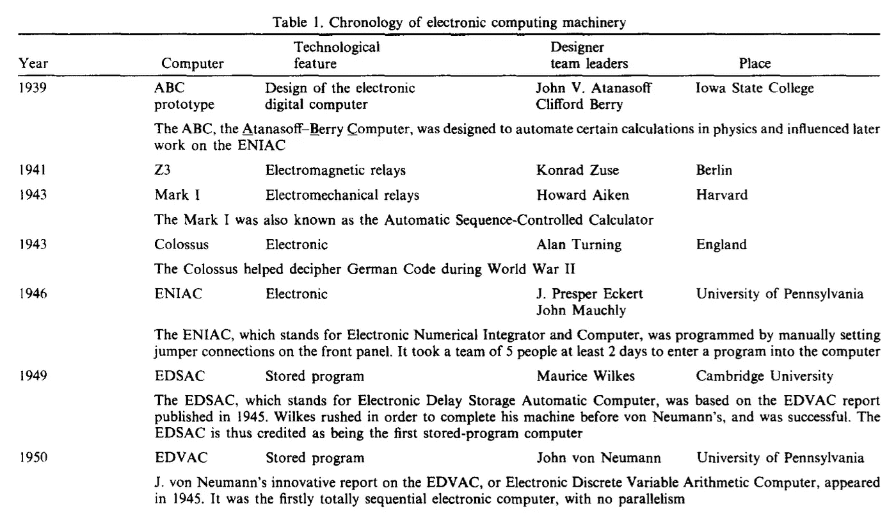
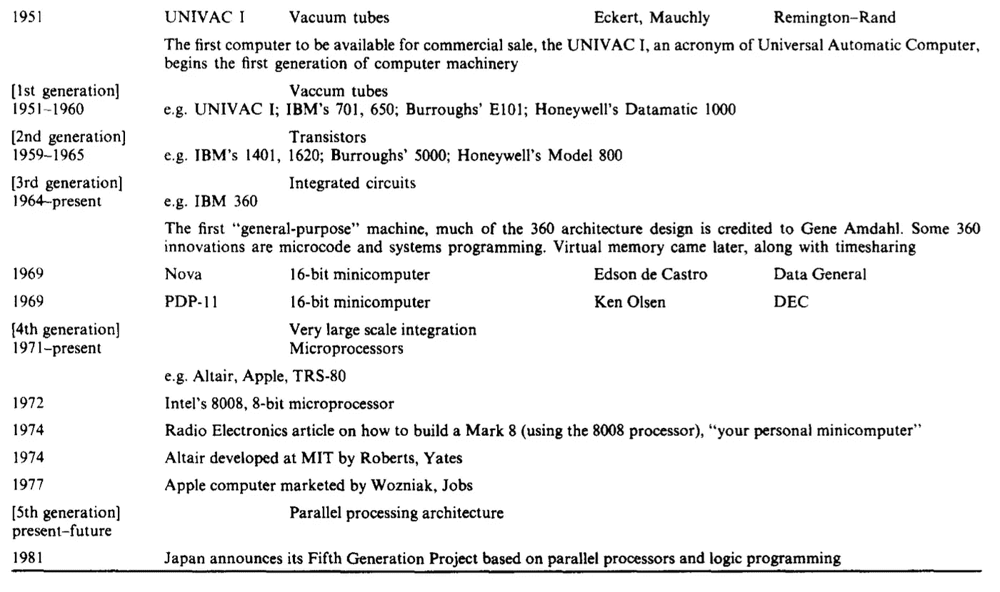
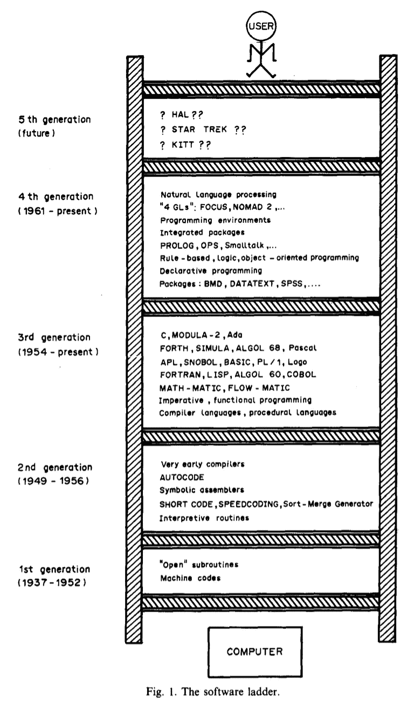
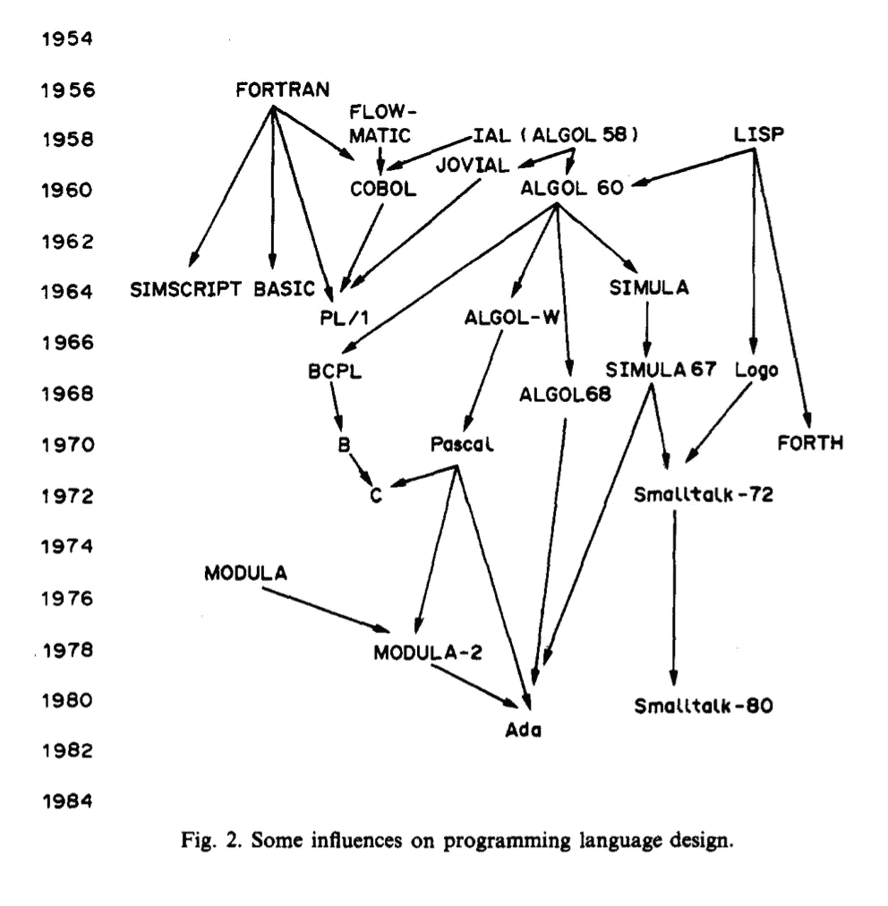

# 早期编程语言简史

> 原文：<https://levelup.gitconnected.com/the-history-of-early-programming-languages-1b4067f624a1>

照片由[@ solenfeyssa](https://unsplash.com/@solenfeyissa)拍摄

## 正如琳达·魏泽·弗里德曼从一开始到 90 年代所说

《从巴贝奇到巴别塔及以后》是琳达·魏泽·弗里德曼写的一篇文章。这篇文章是她的文章的摘要，回顾了计算机编程语言的历史。她描述了从机器码到不同语言、范例和环境的四个*软件“代”*。

根据 Friedman 在 90 年代(写作的时候)的说法，一些最古老的编程语言是最流行的。她特别提到了 FORTRAN 和 COBOL。她还认为:

> "只研究高级编程语言目前的状态是不完整的。"

她问了这个问题。

*   高级语言为什么会进化？
*   为什么我们不再用机器代码编程了？

早期的编程语言对后来的影响很大。许多编程语言都有类似的结构。

也许考察以前的语言是很重要的。

她参考了以前的一系列研究。其中包括 Knuth，他研究了从古代到现代的数学和数值算法。从描述“静态函数关系”(如数学中的方程)到动态过程的符号(算法)。

> 通常，为了将算法表示为输入-输出转换，可以简单地将其表示为 y=f(x)，其中 x 是输入变量，y 是输出变量，f 是抽象(或“黑盒”)模型，即(可能是数字)算法

她声称，在研究早期计算硬件和软件之前，算法已经变得“冗长”和“不精确”。

## 分析引擎

已知最早的计算机被认为是查尔斯·巴贝奇在 1834 年设计的分析引擎。它被设计用来提供可变的数值运算顺序和数据的内部存储。虽然在他的有生之年没能建成，但他的合作者，洛夫莱斯伯爵夫人奥古斯塔·阿达女士(诗人拜伦的女儿)还是为它编写了程序。

巴贝奇机器上的机器码操作是这样的:

*   V~ × V2= V3，带运算(如乘法运算)和变量。
*   它使用穿孔卡片(提花)。
*   卡片被输入机器，处理内部数据。
*   内部条件化，以适应条件“跳跃”(通过物理跳过卡片来完成)。

洛夫莱斯夫人思考操作的重复序列，因此被认为是创新了循环或重复结构的概念。

巴贝奇被认为是第一个计算机建筑师，洛夫莱斯是第一个计算机程序员。

## EDVAC

直到 1945 年，存储程序计算机才被描述和实现。这发生在约翰·冯·诺依曼宾夕法尼亚大学的“关于 EDVAC 的报告初稿”中。

EDVAC(电子离散变量算术计算机)描述了一种与主存储器耦合的处理器。

这种配置被称为冯·诺依曼架构:

> “…描述了一种配置，在这种配置中，处理器与主存储紧密耦合，主存储足够大，可以存储大量数据以及程序代码，操作按顺序执行，而没有早期机器上需要的并行性，以抵消其极其有限的存储能力。”

## 硬件的发展

Friedman (1992)构建了一个框架来帮助获得硬件发展的概况。这看起来像下面这样:

她将此描述为从早期实验项目到日本第五代项目的计算机机械的历史概述。

名单上第一台商用电子计算机是雷明顿·兰德公司 1951 年生产的 UNIVAC。第一辆由美国人口普查局购买。这是基于真空管的。

后来的计算机以新的和不同的技术为特征:

1.  晶体管。
2.  集成电路。
3.  大规模集成。

显然，1951 年随着 UNIVAC 的安装，人们预测到 1975 年美国将有 12 台计算机。他们完全错了。到 1975 年，有 155，000 台计算机在使用。到 1989 年底，这一数字上升到 5400 万。

Friedman 继续将软件世代描述为一个阶梯:

弗里德曼的模型。

# 第一代软件——机器语言编程

弗里德曼分四代讨论软件。据她所说，这与人类和计算机用户之间的“阶梯”有关。

> "第一代计算机软件是机器语言编程的时代."

在 20 世纪 40 年代和 50 年代早期，所有的编码都是用机器语言完成的。这意味着计算机自己的内部(基于二进制)指令集。

此后很久，机器编码或“手工编码”仍然很流行。每台机器都有自己的内置代码。

每项任务都是“从零开始”编写的，几乎没有归纳的机会。

> "那时这个词不是编程，而是编码，程序员就是编码员."

根据弗里德曼的说法，程序员一词起源于英国，在 20 世纪 50 年代越过大西洋传到了美国，到那时，程序员比程序员更有“声望”。

社区成员之间的正式交流并不多。

然而，计算机械协会(ACM)成立于 1947 年，几年后期刊开始出版。

很少有人考虑所有权问题，因为很难将其归因于单一来源。

弗里德曼说:

> “1947 年，发生了一件令程序员和计算机专业学生特别感兴趣的事情。格蕾丝·默里·霍普在调查马克·I1 电脑为什么不能正常工作时，发现机器里有一只死去的小飞蛾，并用镊子把它取出来。那只蛾子连同一张为子孙后代记录这一事件的便条一起记入了她的日志。从那时起，计算错误被称为“bug”，发现并消除这些错误的过程被称为“调试”。

顺便提一下，尽管作者声称这一点，但这一陈述似乎有一些[‘bug’或错误。](https://www.computerworld.com/article/2515435/moth-in-the-machine--debugging-the-origins-of--bug-.html#:~:text=Did%20Grace%20Hopper%20really%20invent,bug'%20to%20describe%20software%20errors%3F&text=It's%20an%20oft%2Drepeated%20tale,Harvard%20University's%20Mark%20II%20calculator.)

霍华德·艾肯为马克三型建议了一个**‘编码机’**。按下按钮，机器代码就会被打在纸带上。这样一来，人类编码员就不必费心去记忆许多复杂的二进制代码序列。

Friedman 将此描述为通向第二代软件的火花。

# 第二代软件——预编译器时代

第二代编码辅助工具，如机器语言编码专家用的。

这包括不同的自动化和汇编程序。一个“以许多第一为标志”的时代。

Friedman 要求我们根据创新来考虑当时的编程或“编码”文化:

> “我们必须记住，首先，编码机构的思维模式是，除了手工编码之外的任何东西都被认为是劣等的；其次，那些手工编码的机器语言程序实际上非常复杂和错综复杂，与我们今天的复杂程序一样，用更少的存储空间做同样多的事情。”

她还表示，这种怀疑是有根据的，因为这些系统产生的程序比聪明、有创造力的人类编码员产生的同等手工编码版本效率更低、成本更高。

所以，此时程序员并不总是“从零开始”编程。许多人会手动复制代码段。

抄袭充斥着“抄写错误”。

1949 年，约翰·莫奇里为 BINAC(二进制自动计算机)提出了“短序列码”或“**短码**”。这台计算机是由约翰·莫奇利和 j·普雷斯珀·埃克特制造的，后来被雷明顿-兰德公司收购。

简短代码:存储在内存中的一组解释子程序。*短代码的执行速度比同等的手工编码程序*慢大约五十倍。

1950-1951 年间，出现了大量人工机器语言或“伪代码”。

> 在 20 世纪 50 年代早期，Betty Holbertson 的排序合并生成器是使用计算机编写程序的第一次尝试，并启发了一整个家族的其他程序生成器。"

1951 年，第一本编程教科书来自英国。这本书叫做“数字计算机程序的准备”，作者是威尔克斯、惠勒和吉尔。

它讨论了“汇编例程”，指的是:*“…一段代码，它将组合一组子例程，并将存储分配为称为“浮动地址”的可重定位地址块。”*

1951 年，Grace Murray Hopper 在 Remington-Rand 的 UNIVAC I 上工作时，提出了她所谓的“**编译程序**，即把“伪代码”翻译成一套完整的机器语言指令的行为。

1952 年，米莉·科斯(Millie Coss)发明了“**编辑生成器**，进行算术运算并打印出经理和其他人可读的输出。

Friedman 将 Alick E. Glennie 于 1952 年开发的自动编码系统描述为“第三代”软件的一个环节。这是一个原始的、高度依赖于机器的代数编译器，它将代数语句翻译成曼彻斯特 Mark I 的机器语言。

# 第三代软件——过程语言

1945 年，美联储开发了一种理论编程语言。众所周知，德国的康拉德·楚泽称之为 Plankalkul(程序演算)，尽管这直到 1972 年才被注意到。

在意大利，Corrado Bohm 在 1951 年的博士论文中描述了一个系统，该系统将每个语句定义为指定语句的特例，例如 S 相当于“将程序计数器设置为变量 S 的值”。

第一台代数编译器被认为是为杰伊·福雷斯特和肯·奥尔森设计的麻省理工学院的旋风式计算机设计的。它是第一台能够并行处理和实时计算的 16 位小型计算机。它于 1953 年春进行了演示，并于 1954 年 1 月开始运行。

1955 年，Grace Murray Hoppe 的编程团队开始开发一种使用一些英语关键字的代数编程语言。

1957 年，它作为 MATH-MATIC 发布，但执行效率很低。1957 年，IBM 终于推出了 FORTRAN 编译器。它越来越被计算社区所接受。

1958 年，FLOW-MATIC 发布，成为 COBOL 后续设计的重要因素。

## **FORTRAN (** 公式翻译系统)

1954 年，约翰·巴科斯领导了一个 IBM 研究小组(后来被命名为编程研究小组)来设计和开发数学公式到 IBM 704 机器代码的自动翻译器。他们只会接受和他们的对手一样有效的东西。他们最关心的是效率，根据 Friedman 的说法，这可能更容易被编码社区接受。语言设计方面处理得很快。弗里德曼描述道:*“…以一种必须在‘真正的’工作(编译器的设计)完成之前完成的杂务的方式。”*

公式翻译系统，或 FORTRAN 发布于 1954 年，文档的很大一部分致力于系统的证明，包括一个乐观的预期，即 FORTRAN 将消除编码和调试。

1958 年，为 IBM 709 和 650 发布了 FORTRAN 编译器；1960 年为 1620 和 7070。版本不一定相同，在一台计算机上编写的程序在另一台计算机上产生的结果也不一定相同。

1961 年，FORTRAN 编译程序可用于其他计算机(UNIVAC、雷明顿-兰德·LARC 和 ALTAC)。

1964 年，市场上有 40 多种不同的 FORTRAN 编译器。必须指出，它不是独立于机器的语言，并且在不同的计算机上有不同的表现。

1958 年发布了 FORTRAN II，随后在 1962 年发布了 FORTRAN III 和 FORTRAN IV。在 1978 年 FORTRAN 77 发布之前，FORTRAN IV 一直是这种语言的标准。

## 列表处理器

在 1956-1958 年间，约翰·麦卡锡在达特茅斯设计了一种交互式应用语言。

1959 年，麻省理工学院在 1960 年出版的参考手册中实现了这一点。

LISP 基于 lambda 演算，与其他语言不同，它是为符号公式操作而设计的。弗里德曼认为，它成为了人工智能社区的“通用语”(交流媒介)。

她列举了一些创新特征如下:

*   作为基本程序单元的函数。
*   列表作为基本的数据结构。
*   动态数据结构。
*   “垃圾收集”设施。
*   使用与数字相对的符号表达。
*   递归。
*   作为控制结构的条件表达式。
*   用于交互式评估 LISP 语句的“eval”函数。

## 算法语言

1958 年，一个委员会在苏黎世召开会议，设计一种通用的高级编程语言。它包括来自 GAMM(德国应用数学和力学协会)和计算机械协会的欧洲代表。委员会的成员之一是约翰·巴科斯，他曾领导过 FORTRAN 开发小组。

其中一个目标是促进国际计算社区的沟通和交流，同时实际目标是将编译器带到欧洲(他们仍在手工编码)。需要一种新语言的原因之一是 FORTRAN 是 IBM 的专有产品。因此，采用 FORTRAN 在某种程度上意味着只购买 IBM 的机器，人们希望 IBM 不要在欧洲占据主导地位。

这种语言最初被命名为 IAL，即国际代数语言，最终更名为 ALGOL(算法语言)。第一个版本被称为 ALGOL 58。

该委员会于 1960 年在巴黎再次开会，以改进语言和消除弱点。

> ALGOL60 对编程语言设计的影响，以及对整个计算机科学发展的影响是深远的。

弗里德曼列举了几个创新特征:

*   程序设计语言定义的元语言。
*   编程语言是研究的对象，而不仅仅是达到目的的手段。
*   用作算法的发布语言。
*   块结构和本地化数据环境。
*   程序单元的嵌套。
*   自由格式的程序代码。
*   显式类型降级。
*   动态内存分配。
*   通过值和名称传递的参数。
*   If /then/else 和 begin/end 来分隔复合语句。
*   范围规则。
*   局部变量的声明。
*   通过名称、值或引用传递的参数。

## COBOL(面向商业的通用语言

1959 年，在美国国防部的监督下，另一个小组开会讨论开发一种“通用”编程语言。

> 这个团体由约 40 名成员组成，代表来自工业界、大学和政府的计算机制造商和用户，后来被称为 CODASYL 委员会

设计一种能在不同机器上工作的语言符合计算机制造商和政府的利益。

1960 年 4 月，一种叫做 COBOL 的语言诞生了。

与 FORTRAN 不同，这种语言一开始是相对“独立于机器”的。

对于许多第一代和第二代程序来说，大多数人都很难理解，并认为是弗里德曼所说的“黑色艺术”。

根据 Friedman 的说法，COBOL 的重要创新如下:

*   记录数据结构。
*   文件描述和操作工具。
*   数据和程序描述的机器独立性。
*   数据部门的数据描述和程序部门的操作并重。
*   英语对动词、从句、句子、段落、小节和分句使用的影响。
*   一种相对自然的语言风格，包括可读性的干扰词。
*   为产生自文档化程序代码的语言所做的全部努力。

他们开创了面向数据语言的重要趋势。弗里德曼认为，这最终导致了数据库管理系统、查询语言以及以数据库为中心的高生产率编程工具和环境的激增。

COBOL 编译器的广泛使用部分是由于政府的参与:

> “……国防部向所有计算机制造商发送了一封措辞强硬的信，建议他们如果想继续向国防部(最大的计算机合同商和研究基金捐赠人)出售计算机，最好安装 COBOL 编译器。”

Friedman 评论说，FORTRAN、COBOL 和 LISP 是写作时最常用的编程语言(大约。1990).

## 巴别塔→20 世纪六七十年代

> “20 世纪 60 年代和 70 年代见证了编程语言的惊人发展。Jean Sammetin 1969 年将这种活动的喧嚣比作圣经中的巴别塔。

**APL(一种编程语言)**。1962 年，哈佛大学的 Kenneth Iverson 参与了这本书的设计，并通过这本书向公众介绍了这一概念。它需要一个特殊的键盘，并没有得到广泛使用。

**SNOBOL(面向字符串的符号语言)**。它于 1963 年首次实现，由贝尔实验室的研究人员设计成一种字符串操作语言。该实现实际上被命名为 SEXI(字符串表达式解释器),但它显然被认为是不可接受的。这种语言的名字是对首字母缩略词的幽默讽刺:SNOBOL(StriNg oriented symbolic languag)。SNOBOL4 于 1968 年发布，是为第三代计算机硬件设计的，它将模式视为数据对象。独一无二的特性是它的字符串和模式匹配功能。

**BASIC(初学者通用符号指令代码)**。代码运行于 1964 年，语言设计的目的是向非科学学科的学生介绍计算。简单性优先于编译器效率，并且提供了清晰的错误消息。

**PL/1(编程语言/one)** 。发布于 1966 年，意在成为“终结所有语言的语言”，但并不像 IBM 希望的那样受欢迎。编译器效率低下且不可靠。它被批评为一种过于庞大的语言，因为它试图包含语言设计中所有可以想到的元素。

**Logo** 。在 1966-1968 年间发展起来的。专为数学教育设计，用于课堂实验。Logo 和 LISP 很像。它包括“海龟图形”，用于教孩子几何原理。

**第四**(第四代语言)。Charles H. Moore 想要一种对科学和工程应用足够有效的语言，同时允许使用更少的代码行进行更快的编程。这似乎是两个(显然)相互冲突的设计目标。根据 Friedman 的说法，今天它不能被认为是第四代语言。

**SIMULA** 。1962 年由挪威计算中心的克利斯登·奈加特和奥利·约翰·达尔根据与 Univac 的合同设计。被模拟应用的愿望所激励——一种在许多不同领域成功使用的运筹学技术。这种语言引入了“类概念”，这是面向对象编程的一个重要抽象概念。

**帕斯卡(以 17 世纪法国哲学家、数学家布莱士·帕斯卡命名)**。ALGOL68 的修订版(来自 ALGOL60)并不流行，因为它不必要的庞大和笨拙。“反对者”之一尼古拉斯·沃斯设计了 Pascal，并于 1970 年首次实现。弗里德曼认为，为教育用途而设计的帕斯卡脱颖而出:“……与潮流背道而驰”。这是一种将语言与功能复杂化的趋势，因此用户不可能知道所有的功能。

**C** 。肯·汤普逊和丹尼斯·里奇开发了 C 语言来编写 UNIX 操作系统中的例程。c 语言是 B 语言(也是由 Thompson 设计的)的扩展，它借鉴了早期的 BCPL 语言。c 创造了可移植操作系统的概念。弗里德曼认为，简洁的语法使得 C 程序难以阅读、理解、调试和维护。

**Modula-2** (模块化语言/二)。Pascal 的后代，用于大型系统。该模块有助于信息共享，将代码封装在清晰描述的片段中。

**阿达**。它于 1980 年提出，并于 1983 年标准化，其意图与 PL/1(终结所有语言的语言)相似，并取得了相似的成功。

在 1954 年宣布 FORTRAN 和报告之后，有大量的语言试图:*“…驯服电子计算机，供人类在各个应用领域进行高级使用。”*

弗里德曼非常友好地为不同语言之间的一些影响画了一个模型:

弗里德曼的模型

# 第四代软件——声明性语言

> “冯·诺依曼式的计算机体系结构，虽然是一代编程语言的催化剂，但似乎在很大程度上也是编程语言技术概念发展停滞的原因。”

Friedman 所指的是存储在存储单元中的程序，在顺序指令流中只有一个计数器。依赖于这种**先验范式(过程化)**架构的编程语言往往是:

1.  面向语句(假设顺序执行有限数量的操作)。
2.  由大量的代码行组成。调试是艰巨而漫长的。
3.  维护既费时又费钱。

弗里德曼认为，下一个范式是反增长的:

> 第四代语言是说明性的，即它给计算机的指令更多地集中在做什么，而不是详细描述如何做

第四代试图优化人类劳动而不是计算机时间。

通常针对特定应用领域的非技术用户。

弗里德曼认为，一些趋势是:

*   陈述性语言。
*   打包软件。
*   集成包。
*   用户友好的互动环境。
*   查询语言。
*   高生产率的编程工具。
*   语言的融合。
*   编程工具(单个交互系统中的编辑器、链接器、翻译器、文件处理程序和用户界面)。

她提到，并非所有系统都是非程序性的，分类也是任意的。

1961 年，加州大学伯克利分校开发了统计学软件包 BMD (BioMeDicalpackage ),并在 IBM 7090 上用 FORTRAN 语言实现。

1967 年，Arthur S. Couch 在哈佛大学开发了针对社会科学家的数据文本。

**PROLOG** (逻辑编程)。于 1972 年在 ALGOL-W 中实现，用于自然语言处理。自 1981 年以来，它成为与日本的第五代项目。

**OPS(官方生产系统)**。人工智能领域中使用的一种产生式系统或基于规则的语言。OPS5 发布于 1977 年。

**闲聊**。在施乐帕洛阿尔托研究中心(PARC)设计和实现的软件组件:“Alan Kay 的传奇 Dynabook，一款面向非技术用户的笔记本大小的个人计算机。”环境很重要:鼠标用于选择和指向；图形用户菜单等等。史蒂夫·乔布斯在苹果电脑 Lisa 和 Macintosh 操作系统上使用了这种方法。

**查询语言**。为了使受过最少培训的人也能访问数据库，查询语言被开发得对用户友好。SQL 是为 SystemsR 和其他几种查询方式开发的。SQL 是由 IBM 设计的，1979 年由 Oracle 推向市场。

弗里德曼认为:

> “第四代高生产率工具在很大程度上是非过程化的、用户友好的、面向问题的。”

此外，她说，这些系统一直围绕着一个数据库，并包括数据库管理系统的组成部分。

软件始于人类被迫“思考”特定机器的代码。

在写这篇文章的时候，弗里德曼已经提出，计算机可以“思考”或者在某种程度上像人类一样行动。

琳达·魏泽·弗里德曼的文章引人入胜，我当然推荐你全文阅读，而不是我有限的摘要。

我希望你喜欢这篇文章！

这里是#500daysofAI，您正在阅读的是第 467 条。500 天来，我每天都在写一篇关于或与人工智能相关的新文章。