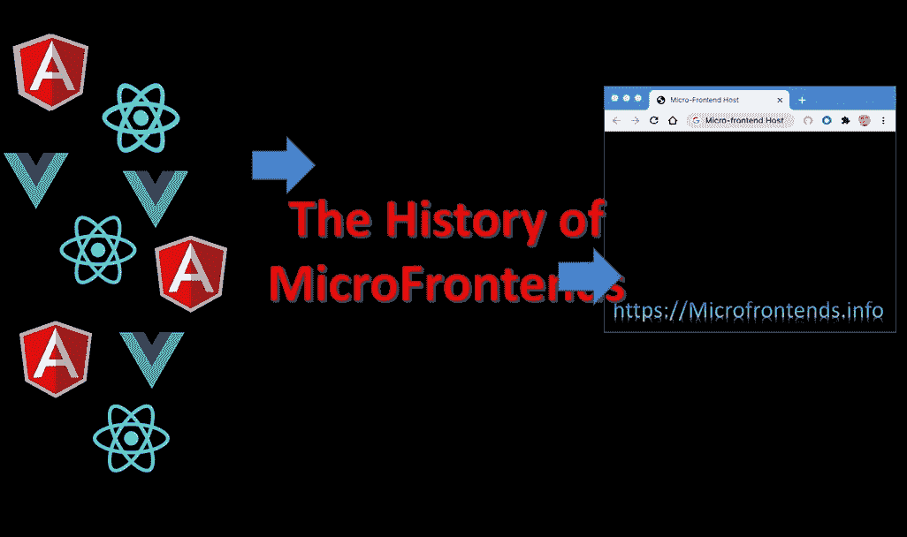
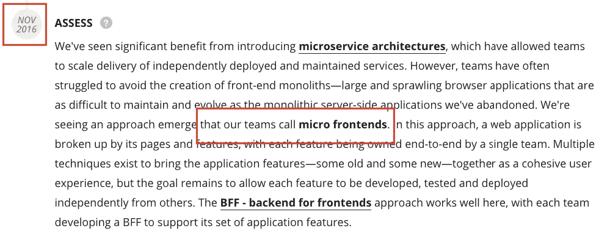
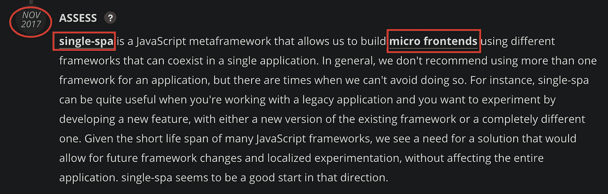
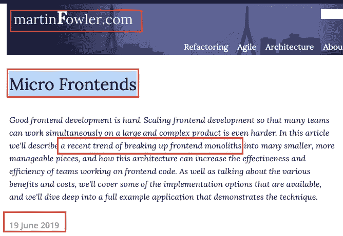
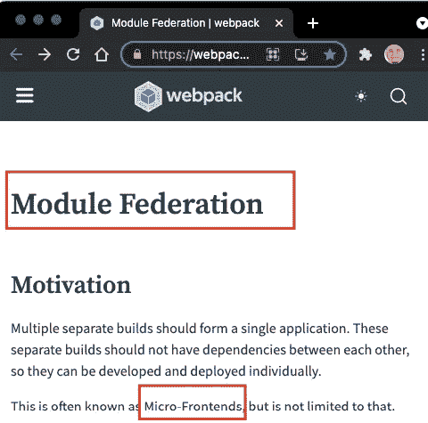
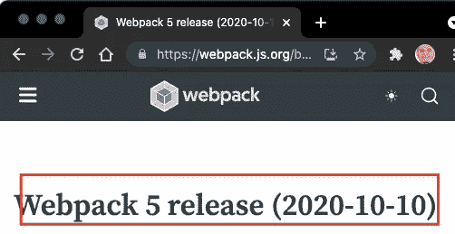
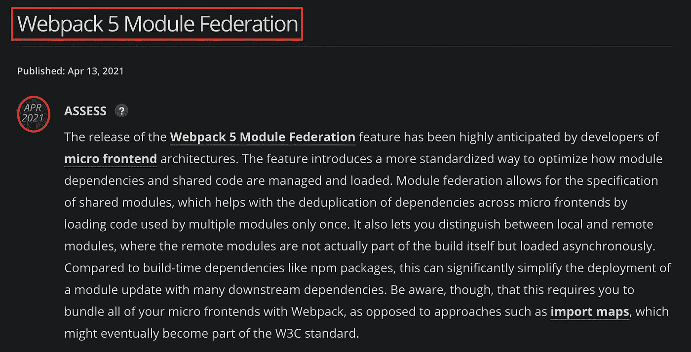
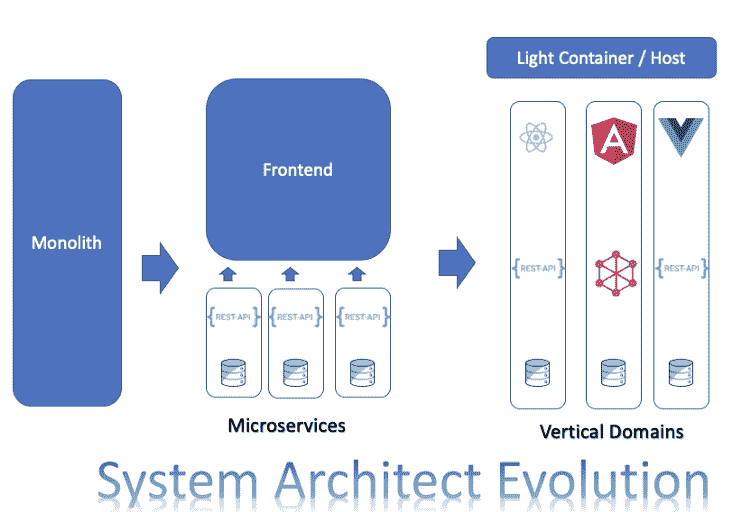

# 微前端的历史

> 原文：<https://levelup.gitconnected.com/the-history-of-microfrontends-a8e9e5e9a1d4>

你有没有想过“微前端”这个术语是何时何地出现的？在本文中，我将介绍微前端的发展。

*   2011 年:“微服务”本身在 2011 年软件架构师的一次活动中首次亮相，当时该术语被用来描述一种架构风格，当时许多与会者正在尝试这种风格。网飞和亚马逊是微服务的早期先驱。
*   2016 年 11 月:在微服务架构取得巨大成功后， [Thought Works 于 2016 年 11 月首次在技术雷达](https://www.thoughtworks.com/radar/techniques/micro-frontends)中加入了“微前端”(Microfrontends)这一术语，作为类似微服务的前端架构用于前端开发。这种架构设计是因为单页应用程序的 monolith 微内容给后端 monolith 架构带来了类似的挑战。在那之后，公司开始实现可以帮助使用这种新架构构建前端的框架。例如，依赖于构建时合成的 Bit 和依赖于打印时合成的 Single-Spa。

*   2017 年 11 月，Thought Works 推荐使用 Single-Spa 实现微前端。

*   2019 年:马丁·福勒(Martin Fowler)撰写了关于微前端的文章，并在他的文章“微前端”中推广了微前端架构。

*   2020 年 10 月:2020 年底， [Zack Jackson](https://medium.com/u/9ef1379caffc?source=post_page-----a8e9e5e9a1d4--------------------------------) 在 Webpack 5 中发布了他的代表作“[模块联邦](https://webpack.js.org/concepts/module-federation/)”。模块联合插件将微前端的世界改变到了一个全新的水平。现在，您可以将一个远程组件包含到您的项目中，因为您已经在本地开发了它，而不依赖于构建或部署，甚至不需要 web 服务器来运行它。这是微波炉的未来。公司开始采用模块联合的方法从单一应用程序迁移到微前端。

*   2021 年 4 月: [Thoughtworks 开始推荐微前端实现的模块联合](https://www.thoughtworks.com/radar/languages-and-frameworks/webpack-5-module-federation)

与微服务相比，微前端仍处于早期阶段。作家们没有就如何写它达成一致。我从微前端开始，然后改为微前端。最后，我决定用一个类似于“微服务”的一字“微前端”。

# 如果您想了解更多关于微前端的信息:

*   [微前端:什么，为什么，如何](https://www.linkedin.com/pulse/micro-frontends-what-why-how-rany-elhousieny-phd%E1%B4%AC%E1%B4%AE%E1%B4%B0)
*   [使用 React、Webpack5 和 Module Federation 一步步实现微前端。](https://www.linkedin.com/pulse/micro-frontends-hands-on-example-using-react-webpack-rany)
*   [微字体从初学者到专家](https://www.linkedin.com/pulse/micro-frontends-from-begining-expert-rany-elhousieny-phd%E1%B4%AC%E1%B4%AE%E1%B4%B0)
*   [https://micro frontends . info](https://microfrontends.info)

# ======

# 参考

 [## 兰尼·埃尔豪斯尼，LinkedIn 上的 PhDᴬᴮᴰ:微前端的历史

### 微前端的历史...

www.linkedin.com](https://www.linkedin.com/feed/update/urn:li:ugcPost:6842147008610996224?updateEntityUrn=urn%3Ali%3Afs_feedUpdate%3A%28*%2Curn%3Ali%3AugcPost%3A6842147008610996224%29)  [## 微前端:什么、为什么和如何

### 在我以前的文章(本文末尾和这里的链接)中，我亲自展示了什么是微前端以及如何…

www.linkedin.com](https://www.linkedin.com/pulse/micro-frontends-what-why-how-rany-elhousieny-phd%E1%B4%AC%E1%B4%AE%E1%B4%B0)  [## 微前端

### Martin Fowler 将微前端架构定义为“一种可独立交付的架构风格…

microfrontends.info](https://microfrontends.info)