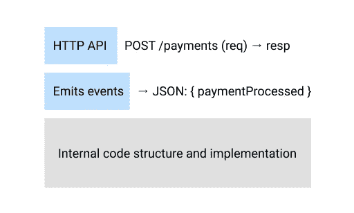
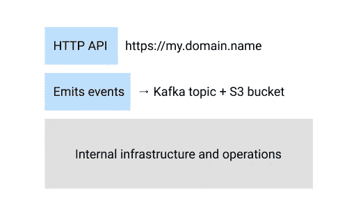

# 微服务的身份

> 原文：<https://levelup.gitconnected.com/the-identity-of-a-microservice-fb845816126a>

山坡上的小盒子…

我现在的公司正在向微服务转型。这对公司来说是一个新的挑战，因为在这之前，我们所有的流程和工具都围绕着一个整体，由我们过去做出的所有决定(好的和坏的)形成。

我们决定开始的方式是将一个组件迁移到一个微服务中，并为其他服务铺设一条“黄金路径”。这有助于我们简化流程，并引发一些关于该主题的真正有趣的讨论。

今天是最后一场大辩论。一个房间里有 15 个人，所有人都有不同的背景，他们在争论我们是将一个服务部署到 2 个机器集群(一个服务于 HTTP API，另一个监听不同的事件流并将信息具体化到数据库)，还是将一个服务部署到具有这两种职责的单个机器集群。

辩论的结果是务实的，也是符合我们当前需求的，但我惊讶地发现，我们无法就一个最基本的方面达成一致:**微服务何时不再是微服务？**

我正要回家，我无法摆脱这个想法，所以我决定写这篇(非常固执己见的)文章。希望能引起一些人的共鸣，一些评论会挑战我现在的假设。

# 设定一些界限

在做微服务时，我们学到的第一个概念是有界上下文的概念，或者我们业务的两个不同部分之间的边界。设定正确的界限真的很难，因为企业的所有部分都以某种方式相互关联。但是假设我们已经找到了一个合理的有界环境的近似，并且我们有一个处理支付的服务 P。

服务 P(可以想象)在公司相当受欢迎。而且它还有很多其他组件想要与之对话，所以它需要定义一种方式让它们说话。那就是接口，或者说服务的 API。

# 关于接口和共享数据库的前言

现在，我们这些从事 Web 服务工作的人倾向于将术语接口与传统的 Java 接口联系起来，将术语 API 与 REST HTTP API 联系起来，但是为了本文的缘故，我想强调接口可以是任何东西！

1.  它可以是一系列 HTTP 端点。
2.  发送用 JSON 编码的作业参数的队列。
3.  S3 桶中的一系列 CSV 文件。
4.  SQL 数据库。
5.  你的同事迈克，*的拥有者，当一个客户打电话给你说*那个*问题时你需要运行的脚本*。

如果你从事后端/前端工作，你可能习惯于选项 1-2，而选项 3-4 听起来有些混乱。如果你处理数据，你可能经常会做 3-4 次。如果你已经在这个行业呆了一段时间，你可能已经经历了选项 5 的痛苦。

但关键是，它们都是接口，在适当的上下文中它们都是有意义的。**重要的部分是找到一个客户端可以使用的契约，服务器可以保证**。

所以我认为，当我们听到关于微服务的强烈言论时，我们应该把它放在上下文中。

> 误解:“2 个微服务不能共享同一个数据库”
> 
> 现实:“2 个微服务不得共享同一个数据库**来存储内部状态**”

# 微服务的逻辑和物理接口

我通常从两个角度来看待服务的接口。

一方面，我们有“逻辑”界面。这包括输入和输出的构造方式，或者我们命名和组织不同端点、命令或表格的方式。

服务的接口可以由不同的部分组成。在本例中，服务公开了一个 HTTP API，并发出具有特定模式的事件。

另一方面，我们有“物理”界面。这与接口的公开方式有关。我们如何处理 HTTP API 或数据库？是公开暴露还是通过专网/vpn 暴露？

上例中的物理接口可能会在公共域上公开 HTTP API，向特定的 Kafka 主题发出事件，并将事件存储在 S3 桶中，以便于以后访问。

我今天开始意识到，逻辑和物理之间，以及接口和实现细节之间的交集是一个灰色区域，会导致很多混乱。所以我要问你一些哲学问题，作为思考练习，你可以记下你的第一直觉是什么。

# 微服务是不是因为我们重构了内部代码就不再是微服务了？

如果我们对代码进行内部重构，保留当前接口，我们会称之为不同的微服务吗？

如果我们将服务的某些部分模块化，它会变成别的东西吗？

# 微服务是否会因为我们改变了部署方式而不再是微服务？

如果我们将一个服务部署到多个地区，或者[多个云](https://en.wikipedia.org/wiki/Multicloud)，它们会变成不同的服务吗？

如果我们将一个服务部署到两个独立的集群(一个处理 iOS 客户端，另一个处理 Android 客户端，用于隔离目的)，这会使它们不同吗？如果这需要为负载均衡器实现定制逻辑会怎样？

如果我们以两种不同的风格部署相同的代码库(一种处理 HTTP 请求，另一种处理消费事件)，这是否意味着我们没有做微服务？

如果我们的部署由 6 个无服务器功能、2 个 HTTP 服务器和 1 个数据库组成，它们都独立部署和更新，但共享相同的代码库，您会将它们视为两个独立的微服务吗？

# 得到答案了吗？

如果你的直觉是对第一部分的问题回答“否”，对第二部分的一些问题回答“是”，我必须告诉你我不同意你的观点。但是让我请求你帮两个忙:

1.  听我说完。
2.  在评论区分享你的想法和反驳。我真的很想知道！

# 我(目前)的观点

对我来说，微服务只能通过它所公开的接口来识别。

不同的代码文件、模块和变量在内部的布局不会改变它的身份，我觉得这很容易达成一致。

但是我认为同样的推理应该适用于物理实现细节。在任何时候，我们都可能:

*   将服务部署到多个区域或云中。
*   将每个区域的部署划分到 3 个集群中，以[隔离](https://docs.microsoft.com/en-us/azure/architecture/patterns/bulkhead)不同的工作负载。
*   将版本 2 作为金丝雀版本部署到我们 10%的用户中。
*   将 2 个事件侦听器重写为无服务器函数。

这些决定将使解决方案更加可靠。它们还会使维护变得更加复杂。但它们不会以任何方式改变我们微服务的身份，也不会代表微服务架构的反模式。

…对吗？