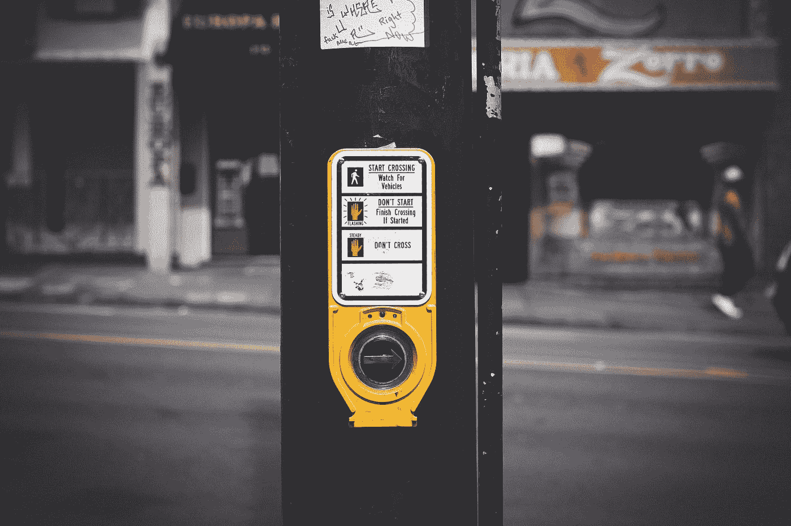
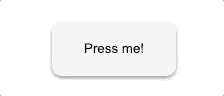
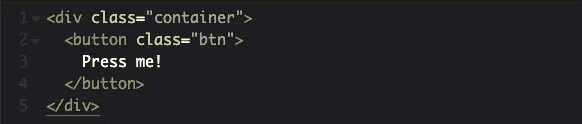
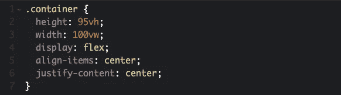
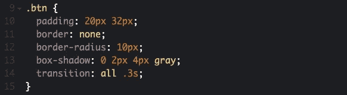
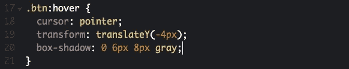
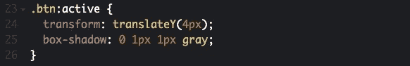
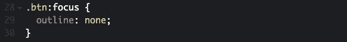

# 沉浸式按钮——使用 HTML 和 CSS 构建动画按钮

> 原文：<https://levelup.gitconnected.com/the-immersive-button-building-an-animated-button-using-html-and-css-be902c794252>

你更愿意点击悬停时弹出的按钮，还是稍微暗一点的按钮？用这个沉浸式按钮教程让你的按钮更精彩！

照片由[萨克斯·哥鲁达](https://unsplash.com/@sakethgaruda?utm_source=medium&utm_medium=referral)拍摄

对于任何使用过这些人行横道按钮的人来说，你知道按下它们并不好玩。它们很脏，不会真的压进去，通常也不会发生什么。互联网上的按钮也是一样——如果你按下的按钮在你与它们交互时确实做了一些事情，而不是在悬停时变暗，然后把你送到不同的页面，这不是更令人愉快吗？

沉浸式按钮！

那个按钮只是要求当你悬停在它上面时按下它。创建它实际上非常简单，只需要大约 30 行代码。如果你用 Sass 就更少了！在本教程中，我将只使用基本的 HTML 和 CSS。这一点都不时髦。

**HTML 设置**

我从一个容器 div 开始，只是为了让按钮居中。如果您只想继续操作并制作按钮，这一步是可选的。接下来，我创建了一个按钮元素，其类名为“btn ”,并向其中添加了一些文本。要记住的一个关键点是，这种效果对任何有填充的东西都有效，不一定是按钮。

这就是 HTML 的全部内容！

**CSS 实现**

(可选)我使用 flex box 将容器设计为使按钮居中。我的视图高度属性设置为 95 是因为底部导航栏，但是对于真正的中心，设置为 100。对齐内容在 X 轴上对齐容器内的所有内容，而对齐项目则在 Y 轴上对齐。我希望它们都设置为居中，这样按钮就在屏幕的正中间。

现在我们来设计按钮的样式。首先，我增加了一点填充，使按钮更大。我还删除了按钮 HTML 元素的自然边框，并将边框半径设置为 10px，使其边缘更圆。这下一部分是有点复杂的盒子阴影。“方框阴影”属性有多个值。第一个值是水平偏移量，我将其设置为 0，因为我根本不想让阴影向右或向左移动。下一个值是垂直偏移量，我将其设置为 2px，以产生它突出页面的错觉。然后是模糊值。我把它设置为 4px 来降低阴影的强度。我使用的最后一个值只是盒子的颜色-阴影。您还可以使用其他值，例如“阴影扩散”,将方框阴影改为“插入”,而不是“开始”(默认),等等。在 [W3Schools](https://www.w3schools.com/cssref/css3_pr_box-shadow.asp) 查看更多信息。最后，我希望悬停和活动的所有转换都在 0.3 秒内完成。这将平滑动画。

接下来，当光标悬停在按钮上时，我将设置按钮的样式。我将 cursor 属性设置为 pointer，这样当光标悬停在按钮上时，会向用户提示该按钮是可点击的。为了创建移动，我通过将按钮在 Y 轴上平移-4 个像素来变换按钮，这将按钮向上移动 4 个像素。为了创造当鼠标悬停在屏幕上时按钮实际上更加突出的错觉，我增加了 4 个像素的垂直偏移，同时也增加了模糊度。

之后，我想为被点击的按钮设计样式。这将是按钮的`active`状态。活动状态与按钮的默认状态有关，而与悬停时按钮的状态无关。我将 transform 属性设置为在 Y 轴上平移 4 个像素，这意味着它将从默认的 0 像素平移状态向下移动 4 个像素。我将框阴影垂直偏移设置为 1 个像素，模糊设置为 1 个像素，创建了按钮仍然在那里但现在被按下的错觉。

最后，我想在您单击按钮后移除焦点轮廓。这可以通过定位按钮的焦点状态并将其轮廓设置为 none 来轻松实现:

就是这样！简短，甜蜜，有效。然而，您可以在这个简单的按钮上添加更多内容。在我的文件夹中，我有一些按钮，点击时可以向右滑动，一些按钮变暗，一些按钮反转颜色，一些按钮将颜色恢复正常。我之前的一篇关于[激活你的社交媒体栏](https://medium.com/swlh/adding-life-to-your-social-media-icons-e0038fdead48?sk=941730a4fc31588beca541d11f31d0a3)的博文展示了如何灰度化你的按钮，并在悬停时恢复它们。