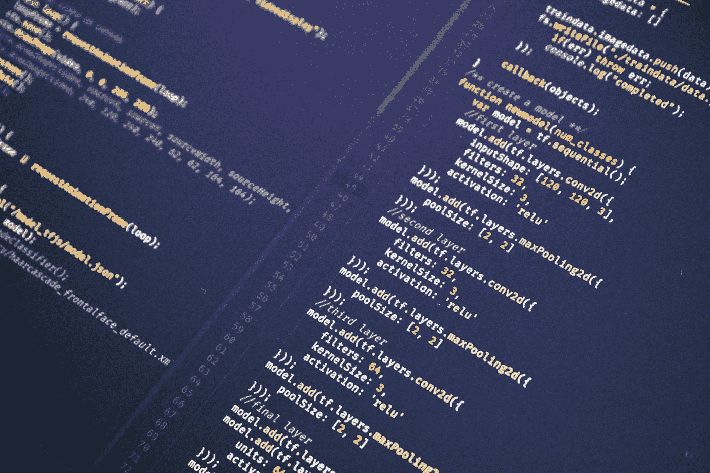

# 重复代码的影响

> 原文：<https://levelup.gitconnected.com/the-impact-of-duplicate-code-31c0bceab831>

马赫什·拉纳韦拉在 [Unsplash](https://unsplash.com?utm_source=medium&utm_medium=referral) 上的照片

## 这是代码质量的一个很好的指标

每隔一段时间，当你输入代码时，你会突然有一个灵光乍现的时刻。等等…这段代码看起来有点类似于我刚刚在代码库中读到的其他代码。首先应该想到的是，您希望避免重复代码。

每当你有写重复代码的感觉时，是时候开始质疑你为什么(尽管可能是部分)重写你的一些代码了。

因为如果你不这样做，你的代码就会这样。

# 告别可维护性

尽管这可能是无意中发生的，但添加重复代码仍然可能发生。不熟悉代码库的开发人员可能会引入重复代码。复制粘贴编程是在代码库中引入重复代码的另一个原因。

一般来说，更多的软件总是意味着更多的麻烦，尤其是在项目的维护阶段。杰夫·阿特伍德认为，最好的代码就是根本没有代码。尤其是在项目的维护阶段，代码越少越好。重复代码是不允许的，应该出现在代码库中你不想要的东西的列表中。

重复代码对代码的可维护性影响最大——牺牲可维护性是一件坏事。因为到目前为止，大部分时间都花在了维护上，所以你不应该牺牲它。

如果你的代码会产生重复的代码，那就不要去做快速而肮脏的修改。一旦项目进入维护阶段，这将花费大量的时间和金钱。

拥有两段完全相同的代码会带来各种各样的问题。

首先，扩展一段代码或修复其中的一个 bug 会给你带来不必要的重复工作。你现在不必改变一段代码，而是将它加倍。

最终，您会遇到这种情况，其中只有两段代码被更改。例如，当一个新的开发人员加入到项目中时。由于重复代码不是标准，新开发人员可能会在这两个地方之一修复代码。当然，这完全是无意的，因为重复代码并不常见——这是有充分理由的。将测试的不良覆盖添加到这个问题中，这个错误会悄悄地潜入代码库。

只修复两段代码中的一段，会给你留下两段代码之间的差异。

可以肯定地说，重复的代码使您的代码非常难以维护。它使你的代码库变得不必要的大，并且增加了额外的技术负担。最重要的是，写重复的代码是浪费时间，而这些时间本可以更好的利用。

# 如何从这里继续

如果你发现自己在写重复的代码，这可能发生在你不太了解的项目中。我强烈建议您花些时间阅读代码库，理解代码库，并了解已经存在的代码。

如前所述，当谈到不编写重复代码时，缺乏关于代码库的知识是致命的。

在你开始一头扎进代码之前，一旦你被分配了一些编码任务，你应该给自己一些时间去了解代码库。在这方面投资一些时间在将来会有巨大的回报。尤其是，当代码库必须存在很多年的时候。

当您发现重复代码时，您应该做什么？

首先，重复的代码可能是糟糕设计的标志。这表明通用功能没有被恰当地抽象出来。每当发现重复代码时，您想做的第一件事就是仔细检查设计。

有没有什么可以改变的地方，使得代码可以以更好、更有效的方式重用，而不仅仅是重新键入？

最重要的是，遵循 DRY(不要重复自己)原则被认为是很好的实践。这意味着一旦你开始输入相同的代码，你可能需要重构你的代码。将您的代码和逻辑划分成更小的可重用单元，并通过在您想要的地方调用它来使用这些代码。

当你成功地遵循了 DRY 原则，代码中任何部分的修改都不需要改变其他逻辑上不相关的部分。这正是你应该为之奋斗的，因为你不想在一些完全不相关的代码部分修改代码时产生 bug。

这种类型的错误是完全意想不到的，因此非常危险。当这样的事情经常发生时，从事该项目的开发人员会害怕对代码库进行新的更改——这对代码库也没有好处。

思考项目的设计和适当的重构是拥有一个没有重复代码的代码库的关键。

# 包装它

重复代码使得代码库的可维护性受到严重影响。代码库中引入重复代码的原因之一是糟糕的设计。

防止重复代码进入代码库的最有效方法是将代码和逻辑分成更小的可重用单元。

一旦你发现重复的代码，你就知道是时候改变了。您可能会在设计不允许更小的可重用单元的地方重构部分代码。

思考设计和使用小的、可重用的单元是拥有没有重复代码的代码库的两个关键因素。

感谢阅读！