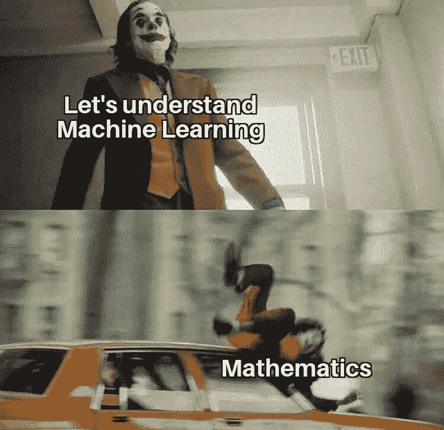
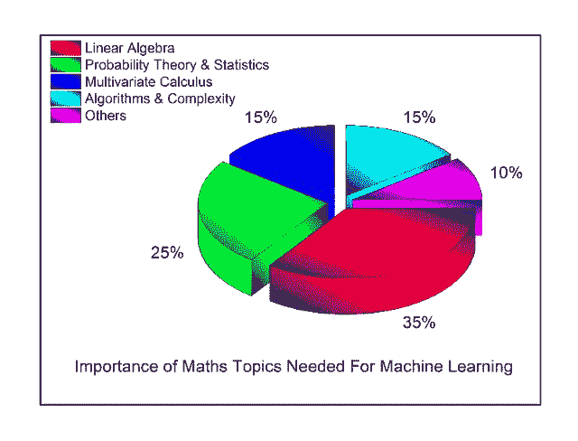
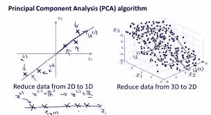
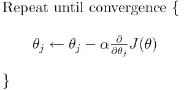
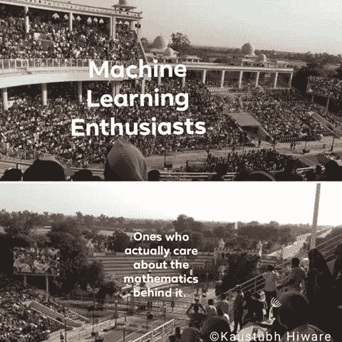

# 数学在机器学习中的作用

> 原文：<https://levelup.gitconnected.com/the-importance-of-mathematics-in-machine-learning-4ea441266f05>

“我明天有面试。希望我能得到这份实习。”

“这个实习是关于什么的？”我问。“机器学习。”

第二天，我得知他在面试后两小时内就被拒绝了。为什么？因为面试官要求他推导出基尼系数或信息增益是如何决定决策树中的最佳分裂的。而且，他没有这样做。**为什么？**因为，在他致力于机器学习的 4 个月里，他甚至从未费心去理解他在代码中如此流利使用的算法背后的数学原理。

大多数情况下，刚接触机器学习的人都对数学概念很感兴趣。因为毕竟这不是任何形式的初等数学。 ***但是，这也不是火箭科学。***

> “学习机器学习算法背后的数学有什么用？为什么不使用 Python 和 R 中可用的库来构建模型呢！”

如果你想过这个问题，那么相信我，你并不孤单。如上所述，存在大量的库来执行各种机器学习任务。所以，避开这个领域的数学部分是很常见的。很明显，来自非科学、非经济或非技术背景的人更容易面临这种困境。

就这样。不像超速行驶的出租车那么痛。

# 那么，为什么要担心数学呢？

从机器学习的角度讲，这门学科背后的数学之所以**至关重要**有很多原因。在这里，我将讨论几个数学是该主题不可或缺的一部分的场景:

1.  首先，模型/算法是任何机器学习项目的核心。如果你懂数学，选择正确的算法，包括考虑准确性、训练时间、模型复杂性、参数数量和特征数量，对你来说绝对是小菜一碟。
2.  对于一个特定的算法，选择参数设置和验证策略，并了解为什么你选择的值会产生与你朋友的模型不同的精度。
3.  理解机器学习模型对不同数据的行为是一个人应该知道的主要基础之一。如果不了解数学，通过理解偏差-方差权衡来识别欠拟合和过拟合是不可能的。
4.  没有一个机器学习模型是完美的，因为机器学习是一个持续而短暂的过程。因此，ML 模型不可能达到 100%的精度(你知道，很像卡诺发动机)。如果是这样，我们回去检查我们的模型或数据集是否有问题。但是，您将如何衡量和消除错误呢？再次，你必须很好的掌握数学，尤其是微积分。
5.  现在让我们来谈谈数据科学的这一方面，没有它，机器学习就不可能实现:**数据**。**你的数据中存在的所有东西都必须输入到你的机器学习模型中吗？我们如何知道某些特征是否与你的结果/预测无关或无关？**大多数时候，当你在现实生活和工业项目中工作时，你得到的数据并不令人满意。

> 假设您已经分发了您主持的研讨会的反馈表。**每个人都会填写所有条目，这是不是有点奇怪？**

如果您的数据缺少值，您希望您的模型运行良好吗？你将如何估算这些价值？如何找到不符合约定的数据(假设一个字符串在一个“仅整数”列中)？您将如何搜索严重偏离所有其他数据点(异常值)的数据？

这么多问题。一个答案。 ***数学。*** *(本例中专门统计)*

# 我完全糊涂了。我从哪里开始？

我理解你。去过，感觉:-)

但是，仅仅因为我说没有数学的机器学习是不完整的，并不意味着你开始解决你能找到的每一本数学书。在你的机器学习之旅中，有几个数学领域更为重要。

让我们看看每个数学领域到底有多重要:

粗略近似

你可以理解线性代数和统计是最有力量和影响力的话题。

让我们来探讨一下为什么我们必须知道这些话题，它们在机器学习中扮演了什么角色。

**线性代数:** *“线性代数是 21 世纪的数学”。*我会讲非常简单的机器学习的基础话题，需要你具体了解线性代数。在 ML 中，线性代数随处可见。诸如主成分分析(PCA)、奇异值分解(SVD)、矩阵的特征分解、对称矩阵、矩阵运算、投影、特征值&特征向量、向量空间和范数等主题对于理解用于机器学习的优化方法是需要的。

主成分分析

**统计与概率:**统计在机器学习中，尤其是在数据分析中的力量是无法估量的。你如何理解你的数据在输入算法后会有多好的表现？这正是统计学帮助你的地方。概率呢？假设，在一个数据集中，你想知道， ***给定你年收入超过 20 lacs 的条件下，你会买车的可能性有多大？*** 问题的框架看起来相似吗？正确。这是一个基于贝叶斯定理的问题，贝叶斯定理是朴素贝叶斯分类算法背后的数学基础。这个简单的问题将改变你的分类器看待你的数据的方式。而且，是简单的概率。不要过头。为了引用更多的用例，机器学习所需的一些基本统计和概率理论是:组合学、概率规则&公理、条件和联合分布、标准分布(伯努利、二项式、多项式、均匀和高斯)等。

朴素贝叶斯算法

老实说，当我在学校的时候，微积分是我最喜欢的话题。它仍然是我的第一选择。因为一旦你把微积分看作是需要**理解**和**实现的东西，**而不仅仅是埋头苦读，你会从中找到不同的慰藉。关于微积分最著名的例子是微分在回归问题中的广泛应用。先说线性回归。您知道，回归的主要目标是通过最小化成本函数找到最佳拟合曲线，以便假设 h(x)更接近 y。为了实现这一目标，我们不断降低 J(theta)的值，直到最终达到局部最小值。这叫做**梯度下降。**

梯度下降算法

梯度下降公式中的导数项不过是代价函数形成的曲线的斜率。这条切线的符号告诉我们我们的算法从哪个方向开始下降，并允许我们验证我们的算法(用于最小化θ值)是否正确。

微积分中的其他主要子域是拉普拉斯平滑、拉格朗日乘子(**对理解支持向量机**非常非常重要)、方向梯度、Hessian、Jacobian 分布等。

相信我，数学并不像看起来那么难。一旦你理解了它的终极潜力，就没有回头路了。

***为什么不证明上面的场景是错的，在空看台订一个座位？；*——)**