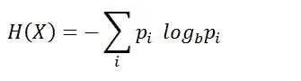
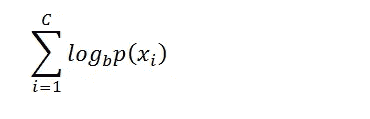
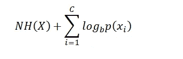
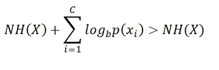
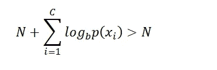

# 熵编码的低效率(集合成形理论)

> 原文：<https://levelup.gitconnected.com/the-inefficiency-of-entropy-coding-set-shaping-theory-fcbf1ccb40bc>

pixabay 上由[pixlteufel](https://pixabay.com/it/users/pixxlteufel-117549/)拍摄的照片

要理解熵编码的低效率，有必要理解一个压缩的序列代表什么。

从理论的角度来看，术语“压缩”与信源编码联系在一起。

术语信源编码是指将信源产生的符号转换成码字的过程。使用各种符号的发射概率来完成转换，这样，具有较高概率的符号将与较短的码字相关联。

在这种方法中，理解码字的最小可能长度是很重要的。香农在信源编码定理中解决了这个问题，他证明了码字的平均长度永远不会小于信源的熵。

具有概率分布的随机变量 *X* 的熵 *H(X)* 为:

> 因此，知道熵定义了发射的每个符号的平均信息，压缩的消息代表了消息的总信息。

使用该定义，压缩消息长度限制为:

NH(X)

对压缩信息的解释是香农给出的。

不幸的是，这种方法存在以下问题:其中符号被码字替换的压缩消息不能被解码器解码，该解码器不具有关于生成该消息的源的信息。

下面的例子解释了这个问题。

我需要用 2 进制编码下面的消息。

111123

在这种情况下，使用霍夫曼编码，我们将得到:

1=0

2=10

3=11

因此，压缩后的消息结果是:

00001011

接收到该消息并且没有进一步信息的解码器不能生成原始消息。

事实上，例如，消息 00001011 可以以多种方式解码:

111123

222213

333312

……..

因此，在不知道所使用的唯一可破译的代码的情况下，该消息不能以模糊的方式表示起始消息。

为了生成原始消息，解码器必须知道码字，在这种情况下，码字是:

1=0

2=10

3=11

因此，要解码的消息必须包含代码字列表，因此该消息看起来是:

1=10;2=11;3=0;00001011

通常，关于码字的信息被插入在消息的开头。

关于识别所使用的唯一可解码代码的代码字列表的信息的最小长度等于:

c 是随机变量的基数，代表消息中存在的符号数，是码字相对于符号的最小长度(第一香农定理)。因此，通过对与所用符号相关的所有最小长度的码字求和，可以获得发送码字列表所需的最小信息。

现在我们可以给出第二个定义，它考虑了这些额外的信息。

> 压缩消息被定义为一个序列，在没有关于源的信息的情况下，解码器可以解码该序列以获得原始消息。

使用第二个定义，压缩消息长度限制为:

第一项 NH(X)表示消息的信源编码，第二项表示关于码字列表的信息。

在这一点上，为了分析这两个定义，我们可以问自己，是否存在一种特殊的情况，在这种情况下，可以用一种简单的方法来确定压缩消息的最小长度。这种情况是存在的，并且是当随机变量具有均匀分布(每个符号具有等于 1/C 的概率)时发生的情况。在这种情况下，源生成的消息是完全随机的，因此不可能压缩它。实际上，根据鸽子洞原理，不可能在一组长度为 N 的序列和一个长度为 N-1 的序列子集之间定义双凸关系，因此压缩消息的最小长度等于 N

第一个定义给出了确切的极限。相反，如果我们使用第二个定义，我们得到下面的不等式:

如果使用 C 的模数作为基础计算熵，H(X)等于 1(均匀分布),则我们有:

因此，定义源的术语由以下等式定义:

这个公式代表了源代码编码的低效率。这种低效率代表了我们为了使用一种可以基于熵压缩数据的通信语言而必须付出的代价。人们一直认为这种低效率是固有的，不可能克服。最终，多亏了 [**集合成形理论**](https://www.scienceopen.com/hosted-document?doi=10.14293/S2199-1006.1.SOR-.PPPWXAY.v1) ，在降低这种低效率方面迈出了一大步。事实上，正如文章 [**“一个黎曼思想如何革命性地改变信息理论”**](https://medium.com/codex/as-one-riemann-idea-it-is-revolutionizing-information-theory-set-shaping-theory-entropy-coding-f9e0549e9c29) 所示，通过这种新技术来降低这种低效率是可能的。

**集合成形理论的更新**
已经发表了一篇文章，其中理论结果得到了实验验证。

文章《集合成形理论在霍夫曼编码中的实际应用》。

 [## 集合成形理论在霍夫曼编码中的实际应用

### 12 页张贴时间:2022 年 10 月 3 日撰写日期:2022 年 8 月 23 日对集合成形理论最大的批评之一是…

papers.ssrn.com](https://papers.ssrn.com/sol3/papers.cfm?abstract_id=4198125) 

你可以在 Matlab 文件交换下载代码:

 [## 测试-SST-霍夫曼编码

### 版本 10.0.0 (23.5 KB)如果你没有 Matlab，你可以注册并申请一个月的免费试用版…

www.mathworks.com](https://www.mathworks.com/matlabcentral/fileexchange/115590-test-sst-huffman-coding?s_tid=FX_rc1_behav) 

[这个结果对香农第一定理的影响](https://www.academia.edu/88056303/Consequences_of_the_practical_application_of_set_shaping_theory_on_Shannon_s_first_theorem)