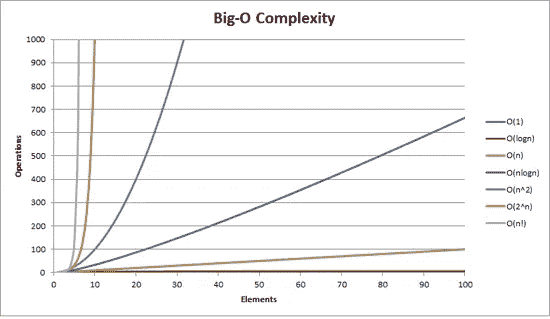

# 整体图像

> 原文：<https://levelup.gitconnected.com/the-integral-image-4df3df5dce35>

## 计算机视觉导论，第 3 部分

图片来源:[VentureBeat.com](https://venturebeat.com/2020/08/29/how-to-tell-if-computer-vision-can-transform-your-business/)

[上一次](/haar-like-features-seeing-in-black-and-white-1a240caaf1e3)，我们讨论了 Haar-like 特征，它们是什么，它们如何帮助 Viola-Jones 算法检测物体，以及它们如何确定它们是否找到了一个特征。我们涵盖了很多信息，如果你以前从未听说过 Haar-like 特性，我强烈推荐你阅读上一篇文章，因为我给出的任何总结都不足以给你理解我们今天的主题所需的基础:积分图像。

为了真正强调整体形象的重要性，我们来谈一点…

# 大 O

图片来源:【Pinterest.com 

不，不是那个大 O。这个大 O:

图片来源:[克里斯托弗·韦伯](https://medium.com/journey-of-one-thousand-apps/complexity-and-big-o-notation-in-swift-478a67ba20e7)

大 O 是一种计算完成一项任务所需时间和资源的方法。随着变量/元素/输入数量的增加，处理时间越长，资源(处理能力、内存等)越多。)用完了。不要在细节上陷得太深，记住这一点:

> 随着你增加任务的复杂性，所需的时间和资源也会成倍增加。

这和积分图像有什么关系？

所以请记住，Haar-like 特征是在代表灰度图像的阵列上“平移”的一系列帧。这些帧可以缩放到几乎任何大小，除了 1x1 像素。这是因为帧(和图像数组)的每个单元(或元素)代表一个像素，它只能包含一种颜色的值。另一个原因是因为这些帧的全部功能是比较与*相邻的*像素的“白色”和“黑色”,因此不能缩小到单个像素。

自 2001 年 Viola-Jones 问世以来，已经开发了许多类似 Haar 的功能，我们将重点介绍当时可供他们使用的三种功能:

图片来源:[OpenCV.org](https://docs.opencv.org/master/d2/d99/tutorial_js_face_detection.html)

*   边缘特征:检测对象的边缘。最小比例- 1x2 或 2x1。
*   线条特征:检测对象中的线条和高光。最小刻度- 1x3 或 3x1。
*   四矩形特征:检测对角线和直线。最小比例- 2x2

通过计算帧的“较亮”和“较暗”侧的平均值并将它们彼此相减来对特征进行分类。如果差异落在某个阈值内，则该算法识别出该帧内的像素构成了类似 Haar 的特征。

这就是大 O 发挥作用的地方。由于这些帧是可缩放的，因此有数千种组合和位置，即使是一幅很小的图像也能容纳这些特征。正如在[上一篇文章](/haar-like-features-seeing-in-black-and-white-1a240caaf1e3)中提到的，一张 24x24 像素的图像包含超过 180，000 个可能的特征。该图像中的帧可以介于 1x2(或 2x1)像素和 24x24 像素之间。

为了更好地说明这个问题，考虑这个例子:

假设计算机计算单个特征的平均值所需的时间为 1 毫秒(这可能会慢得令人难以置信，但让我们试试看)。由于在 24x24 像素的图像中有超过 180，000 个特征，因此计算其中的所有特征需要 180，000 毫秒(3 分钟)。这还不包括处理能力和完成任务所需的内存。

考虑到现在你很可能会使用分辨率为 1920x1080 像素的图像，时间会变得更长。为了减少时间和资源的消耗，我们需要找到一种方法来降低任务的复杂性。Viola 和 Jones 是如何做到这一点的，他们的算法可以在数码相机上实时检测人脸？

# 输入:积分图像

究竟什么是整体形象？这是一个数组，它的值是一个图像值的和。然而，什么价值观呢？它是如何以有意义的方式安排的？我们就做一个吧。当你看到它的时候会更容易理解。

图 1

假设这个数组表示一个 10×8 像素的图像。正如我们所知，数字代表该通道上像素的亮度。为了简单起见，假设我们没有将这些值缩小到 0 到 1 之间。因此，这些值的原始范围是 0 到 255，0 表示没有亮度，255 表示最亮(这意味着上面的图像几乎是一片漆黑)。

该算法采用该原始图像，并创建一个维数完全相同的和数组，称为积分图像。

图 1.02

然后，它开始按照特定的模式计算原始图像中值的总和，从而填充该表。再说一遍，当我们看到它在运行时，就更容易理解了。假设我们需要如下所示的值:

图 1.03

嗯，这个单元格不是像素，而是原始图像上相应区域所有值的总和。要计算它的值，请转到原始图像中与这个像素对应的像素。然后从右下角画一条直线向上，另一条向左。在这些线的上方和左侧的值上画阴影，您将得到以下结果:

图 1.04

我们的**积分图像**中的单元格的值是**阴影区域**中所有数字的**和**。这些数字的和是 51，所以让我们把它放到我们的积分图像中。

图 1.05

厉害！让我们再试一次来掌握它的窍门。

图 1.06

下面的单元格代表原始图像的哪个区域？

图 1.07

如果这是你的答案，你就对了！现在把它放到我们的整体形象中。

图 1.08

到目前为止，您可能已经注意到了一种模式。*积分*图像**中的一个**单元格**对应于*原始*图像中的一个特定区域**。该单元格的**值**是原始图像中相应区域中所有值的**总和。现在我们已经对一个完整的法师是如何被制造和组织的有了一点直觉，让我们来完成剩下的部分。**

图 1.09

现在，回到最初的图像。我们将选择图像中需要求和的部分，并用红色标出轮廓。

图 1.10

这只有 5x3 像素大，所以我们可以把所有 15 个数字加起来，这并不难。然而，如果我们有一个 100x100 像素的帧会怎么样呢？还是 1000x1000 像素？那是一大堆数字加起来！这就是整体形象发光的地方。因为积分图像的每个单元对应于原始图像的一个*区域*，所以我们可以找到包含我们所描绘的所有值的区域的总和，然后减去多余的值。我们来试试吧！

首先，找到对应红框右下角像素的单元格。

图 1.11

现在，同样，这个数字是位于原始图像的特定区域的值的总和。该单元格对应于*原始*图像的哪个区域？

图 1.12

好吧！我们已经开始隔离盒子里的区域了！回头参考积分图像，我们知道阴影部分的总和是 215。然而，这仍然包括红框之外的值，所以我们需要删除更多的值。

幸运的是，这些超额值可以分解成两种形状，如下所示:

图 1.13

图 1.14

让我们从移除最上面的两行开始(图 1.13 中的橙色阴影)。*积分*图像中的哪个单元格对应于该区域？

图 1.15

80!215 减去 80，得到 135。让我们检查一下原始图像的进度。

图 1.16

所以蓝色阴影部分的值之和是 135。现在我们只需要移除图 1.14 中最后的绿色阴影部分。但是，有一个问题，我们需要首先解决！

花点时间比较一下图 1.13 和 1.14。敏锐的眼睛会注意到它们重叠在一起！看下面的图 1.17，你会看到重叠的区域。

图 1.17

问题是，当我们移除上面两行的时候，我们已经减去了这个区域的总和。如果我们向前跳，从图 1.14 中减去绿色阴影区域，我们将减去这些值两次！不过，别担心！这很容易解决。我们只需要把这些值加回我们的计算中。所以回到积分图，找到粉色区域对应的值。

图 1.18

没错！20!所以把这个加回我们的总数，我们有 155。然而，更重要的是，我们已经解决了这个问题。看看吧！

图 1.19

剩下的蓝色阴影区域现在与图 1.14 中的绿色区域完美地对齐了！现在我们减去这个面积！让我们找出积分图像上的值。

图 1.20

完美！减去这个会得到我们的答案。155- 72 = 83.这是图 1.10 中原始图像上红框中所有值的总和！

现在，这一切意味着什么？很简单，无论一帧中选择了多少像素，您只需要四个数字来计算这些值的总和。面积是 24x24 像素还是 1000x1000 像素，都无所谓。你只需要那四个数字。这一过程大大降低了任务的复杂性，从而减少了计算所需的时间和资源。

# 应用于 Haar 类特征

那么 Viola-Jones 算法是如何工作的呢？我们再来看看原图。

图 2

此处的框架代表一个边缘特征。该算法需要计算较亮和较暗的一半的平均值，并将它们相减，以查看差值是否在阈值范围内。为了便于讨论，假设我们的阈值是 10(请记住，我们解释数组中的值时，假设它们仍然在 0 到 255 的范围内)。所以它创造了完整的图像。

图 2.01

然后，它通过找到四个相关的数字来计算较轻的那一半的总和。

图 2.02

> 255 - 215 + 46 - 55 = 31

取此总和，算法通过将其除以框架中的列数来计算平均值。

> 31 / 6 = 5.167

现在，它遵循完全相同的步骤来寻找较暗的一半的平均值。

图 2.03

> 302 - 255 + 55 - 69 = 33
> 
> 33 / 6 = 5.5

现在，它减去平均值，看它是否落在阈值内。

> 5.5 - 5.167 = 0.333

这落在我们的阈值之外，并且算法确定在图像的这一部分中没有边缘特征，并且继续前进。

# 摘要

我们今天讨论了很多内容，但关键是积分图像在减少实时计算和评估数十万个特征所需的时间和处理能力方面起着重要作用。20 年前，正是像这样聪明的快捷方式使得这种物体检测在硬件上成为可能。简直太有才了。