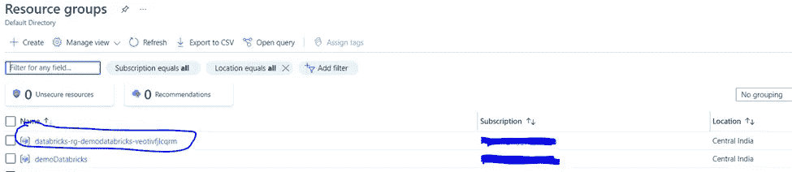
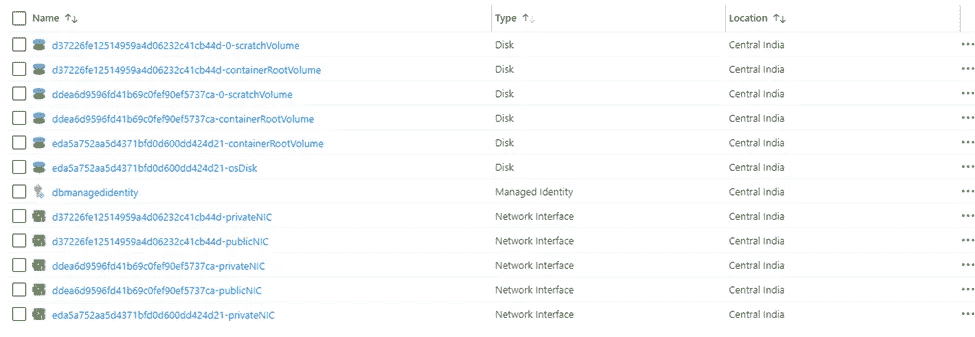

# 数据块的内部结构

> 原文：<https://levelup.gitconnected.com/the-internal-of-databricks-34ab74f4d922>

*解构数据块:了解内部情况*

创建数据块实例时会发生什么？当您剥离新集群时会发生什么？好奇？那么这个博客是给你的…

由[卢卡斯·坦尼](https://unsplash.com/@luk10?utm_source=medium&utm_medium=referral)在 [Unsplash](https://unsplash.com?utm_source=medium&utm_medium=referral) 上拍摄的照片

我多次被问到这个问题。坦率地说，我从未想过这个问题。我们做这些事情的频率，因为这只是另一种可以在云上提供的服务，也可以在需求上提供。

因此，在一个慵懒的周日，我打开笔记本电脑，插上耳机，寻找答案。你也一样。

马库斯·温克勒在 [Unsplash](https://unsplash.com?utm_source=medium&utm_medium=referral) 上拍摄的照片

为此，我们选择 Azure 作为云提供商，但它在其他云提供商如 AWS 或 GCP 中或多或少是相同的。

首先，让我们从 basic 开始，首先创建 Databricks 实例。在这个演示中，我们将在 azure 上剥离基于 premium 的数据块。

在“网络”选项卡中，让我们保持原样。如果你已经有了虚拟网络，你可以选择这个选项。一旦创建了实例，就无法更改网络。

我们将启用基础架构加密。

我们将添加几个标签

并将点击创建按钮。

一旦创建了 Databricks 实例，我们将转到资源组，查看创建了哪些组件。

如您所见，该位置与我们之前选择的位置一样，位于印度中部。但是其他选择呢。Databricks 将存储数据的位置(我的意思是著名的 dbfs 位置)。

要查看此内容，我们必须转到“所有资源组”页面。在那里，我们可以找到另一个新创建的资源组。

如您所见，名为 databricks-rg-demodatabricks-*的资源组已经生成。我们将去资源组并检查里面有什么。如您所见，创建了以下组件。

*   托管身份
*   存储帐户
*   网络安全小组
*   虚拟网络

让我们试着理解每个组件是做什么的。

托管身份–管理身份验证并帮助用户登录。它与 Azure AD 相关联。

存储帐户—这是您在数据块中存储数据的位置。如果不挂载任何其他存储位置。

如您所见，默认情况下，创建存储帐户时启用了 GRS 选项，禁用了帐户类型 BlobStorage 和分层命名空间(这意味着它不是 ADLS)。

网络安全组-它包含允许或拒绝几种类型的 Azure 资源的入站网络流量或出站网络流量的安全规则。例如，以下是默认规则

VNET —这是数据块的虚拟专用网。如果您已经有了现有的虚拟网络，并且想要使用它，那么需要在创建数据块时选择它。它将联系公共和私有子网，每个子网都与网络安全组(NSG)相连。在这种情况下，它连接到已创建的 NSG。

到目前为止一切顺利。

现在，让我们连接到 Databricks，尝试创建一个多节点群集，并尝试了解在我们这样做时内部会发生什么。

在本演示中，我们将使用 11.3 Databricks 运行时版本创建多节点集群，工作类型为 2 到 8。
如果你仔细观察，我们为 worker 和 driver 选择了不同类型的节点。对于工人标准 _ D3，而对于司机标准 _ D3。

*注意——选择时，请检查 DBU 装置。DBU 单位越多，应计成本就越多。根据应用程序工作负载选择驱动程序和工作节点。*

现在让我们看看创建这个集群(多模式集群)时会发生什么。

如果我们转到前面的资源组，我们可以看到创建了许多新组件。

这是内部发生的事情。根据群集标准，它会剥离虚拟机。

在本例中，创建了两个虚拟机，一个用于工作节点，另一个用于驱动节点。例如，这是一个工作节点，因为这是我们在创建群集时选择的相同工作类型。此外，你可以看到它运行的是什么样的操作系统(在这种情况下，它使用的是 Ubuntu 18.04)。

随着虚拟机的创建，它将创建多个磁盘、网络接口和公共地址。

在这种情况下，当打开自动扩展时，基于工作负载，数据块将自动分离额外的工作节点(在这种情况下为虚拟机)。

如您所见，基于群集配置，它将创建驱动程序节点、工作节点和相关的其他组件。

现在，如果停止群集，组件将会保留，但如果从 Databricks 计算页面中删除群集，组件也将被删除。

例如，在删除集群之后，资源组(在某种程度上)进入了早期阶段。

如您所见，删除群集后，除了网络接口和公共 IP 地址外，大多数组件(如虚拟机)都被删除，只剩下少量磁盘。

一旦您创建另一个集群，这将被重用。

# **限制**

不能修改该组件的任何部分。尽管我是该订阅的所有者，但我不能修改任何内容。

例如，如果我试图删除任何组件，比如说*数据* *磁盘*它将抛出以下错误。

因此，即使您是订阅的所有者，您也不能修改由 Databricks 内部创建的组件。

我就说这些。希望这能帮助你更好地理解这个系统。

祝下次学习愉快！