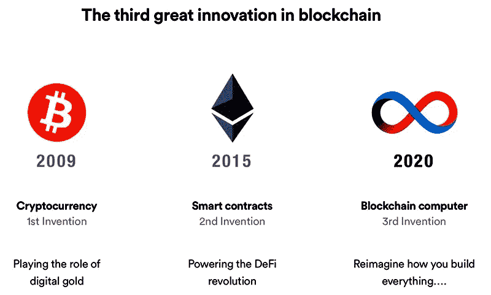
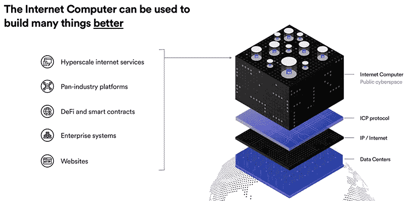
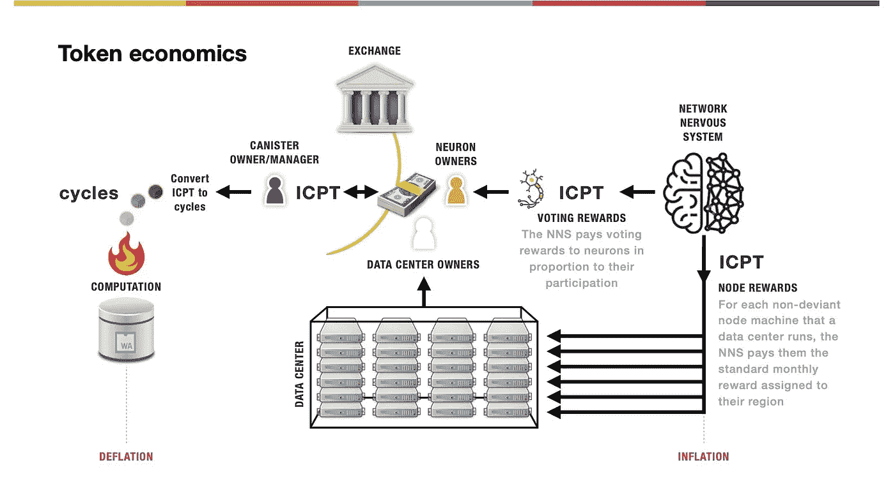

# 互联网可能正在经历一场范式转变

> 原文：<https://levelup.gitconnected.com/the-internet-may-be-seeing-a-paradigm-shift-fd525ed30e73>

## “我们想让互联网重获魔力”

来源:[有限组织](https://miro.medium.com/max/4800/1*_C2zMptYbK0octu5L8zWew.png)

T 现代互联网是一个复杂的庞然大物，面临着日益增长的安全、标准化和公平的需求。今天，谷歌和亚马逊等十几家科技公司控制着大量的数据中心、网络服务等，所有这些都为全球约 47 亿用户的互联网提供动力。不管你喜欢还是讨厌它们，这些科技巨头哪儿也不会去，他们对我们每天的精神消耗有着前所未有的控制。

互联网的现状与许多第一批先驱者的希望和梦想背道而驰。互联网本来是创造者的天堂，任何人都可以在这里发布内容，组织朋友，做任何你想做的事情。

> “在早期，互联网似乎是一个反文化空间和反企业空间，现在它是企业经济生产的场所。互联网现在已经不是过去的样子，也不一定要变成现在的样子。”拉梅什·斯里尼瓦桑

# 席卷互联网

5 月 11 日星期一，一种名为互联网计算机的数字令牌以高达 450 亿美元的价格进入加密货币生态系统，使其进入市值前十的加密货币。如果你认为加密货币在几天内就能做到这一点是荒谬的，那你就对了。但是互联网计算机实际上并不是什么新东西。

Dfinity 基金会由多米尼克·威廉姆斯(Dominic Williams)领导，近五年来一直致力于互联网计算机协议(ICP)的研究。Dfinity 创建 ICP 是为了以互联网的速度创建智能合约。此外，国际比较方案旨在成为互联网的一个真正去中心化的版本。

Dfinity 构建 ICP 的目的是通过无限数量的应用程序、智能合约和数据实现无限的可扩展性。它旨在成为区块链进化时间表的“第三项发明”，允许开发者为基于区块链的互联网创建应用程序。这一领域的其他参与者包括 Cardano，这些新组织旨在充分利用区块链的优势，如安全性、透明度和去中心化，同时添加自己的可扩展性和设计形式。

*资料来源:多米尼克·威廉姆斯，无限基金会*

Dfinity 打算通过在他们自己的区块链上建立一个构建平台来大幅降低互联网开发成本。开发者将能够做任何事情，从构建去中心化金融(DeFi)到令牌化社交媒体应用，甚至扩展基于以太坊的应用。

## 互联网计算机区块链架构

ICP 是基于区块链的协议。它通过负责控制、配置和管理区块链网络的网络神经系统进行内置治理。互联网计算机网络是由一系列构件构建而成的。第一层由托管标准化节点硬件的数据中心组成。当组合时，这些节点形成负责数据传输的子网。

互联网协议控制通过其网络发送的数据格式。无限因特网计算机位于数据中心层之上，有自己的分散协议 ICP。互联网计算机使用国际域名系统，目前可通过网络浏览器和智能手机访问。

来源:多米尼克·威廉姆斯，无限基金会

互联网计算机的顶层应该是一个公共的网络空间，开发者不必担心在亚马逊或谷歌等科技巨头的服务器上托管应用程序。相反，开发者将能够直接在开放的互联网上构建。如果完成，这可能成为企业家精神的寒武纪大爆发，因为应用程序的构建没有托管和网络配置的初始障碍。

> Dfinity 的创始人兼首席科学家多米尼克·威廉姆斯(Dominic Williams)表示:“我们正在将互联网带回到为创造力和经济增长提供这种开放环境的时代，这是一个服务可以平等连接的自由市场。“我们想让互联网重获魔力。”

## 用互联网规模的智能合约构建一切

互联网计算机由控制信息和数据编排的容器组成。开发人员可以在一个容器内创建他们的应用程序，完全跳过一系列令人头疼的部署问题，而不必去迎合 Amazon 或 Google 之类的服务器设置。罐子是可扩展的智能合约——它们是为互联网规模的服务而设计的可互操作的计算单元。

罐是通过 WebAssembly 模块实现的。如果你以前没有听说过 WebAssembly，它是一个基于堆栈的虚拟机，允许你将任何语言编译成浏览器的可执行字节码。这带来了各种各样的机会，因为你现在可以在 Chrome 上运行一个高效的 C++游戏。WebAssembly 是一个相当新的产品，并且已经开始普及，事实上，互联网计算机决定使用 WebAssembly 来为他们的罐子提供动力，这已经是一个巨大的竞争优势。

资料来源:互联网计算机公司的伊冯娜-安妮·皮格诺莱

但是等等，还有更多。滤毒罐解决了现代互联网今天面临的许多编程和安全问题。简而言之，罐能够存储持久状态。如果单个罐面临高流量或数据过载，它可以克隆自己来创建新的罐，以自动处理增加的需求，而无需来自开发者的任何规范。

滤毒罐也没有阻塞机制——你只能发送和接收信息。这防止了许多经典的并发问题，如饥饿，因为你不能等待一个消息发送另一个。然而，如上所述，在这个具有自动可伸缩性行为的系统中，并发性仍然在起作用。

## 象征经济学

《区块链议定书》中有很大增长的一个因素是以通货膨胀和/或通货紧缩战术为名的象征性经济背后的过程。在因特网计算机中，有两个过程在起作用。第一个是由底层数据中心驱动的膨胀过程。对于网络在一个节点中托管的每一个罐集合，网络神经系统为诚实的节点支付每月奖励。

这些奖励通过投票奖励在系统中冒泡。互联网计算机通过“神经元”鼓励投票系统。通过这种方式，人们可以投票决定是否同意某个特定的网络增加。想象一下，当你甚至不使用应用程序时，你可以对一项拟议中的脸书政策进行投票，该政策会监控你的言论(咳咳)。

来源:[有限组织](https://miro.medium.com/max/3300/1*SHQ1Il-EiIr48I7ywBgmqw.jpeg)

因此，神经元的所有者可以很容易地出售他们的投票奖励，或者他们可以将它们转让给一个罐子的管理者。奖励被转换成相当于以太气的“周期”。为了对抗节点奖励的膨胀，罐子烧掉这些奖励来执行计算。这样，互联网计算机创造了一个活生生的供求网络。

由 Dfinity 支持的互联网计算机协议希望把互联网带回它的创造者的首要原则。如果成功，ICP 将允许开发者和企业家构建高度安全和可伸缩的应用程序，而不必担心部署和托管困难。ICP 有很大的野心去创造一个真正去中心化的和基于区块链的互联网。有了一个全明星团队，并进一步认识到区块链技术的好处，他们可能会在努力中取得成功。

如果你想了解更多关于 Dfinity 组织和互联网计算机的信息，你可以去他们的网站。他们有很棒的学习资源，以及通过精心编写的教程创建自己的 ICP 应用程序的文档:

 [## 无限基金会|互联网计算机

### 最后一个原始的第 1 层区块链项目正在启动一个革命性的公共网络，它提供了无限的…

dfinity.org](https://dfinity.org/) 

如果你想参与加密货币并自己购买互联网电脑，你可以使用我的推荐代码 **w6jyux2vcq** 获得 25 美元的 crypto.com 代币 CRO。您可以从下面下载他们获奖的移动应用程序开始:

 [## Crypto.com-立即购买比特币 Google Play 上的应用

### 下载 Crypto.com 应用程序并在几分钟内注册一个帐户。开始赚取高达 6.5%的年利率。成长…

play.google.com](https://play.google.com/store/apps/details?id=co.mona.android) 

以上内容仅代表一种观点，仅供参考。它无意成为投资建议。找一个有正式执照的专业人士寻求投资建议。