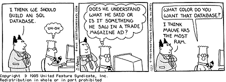
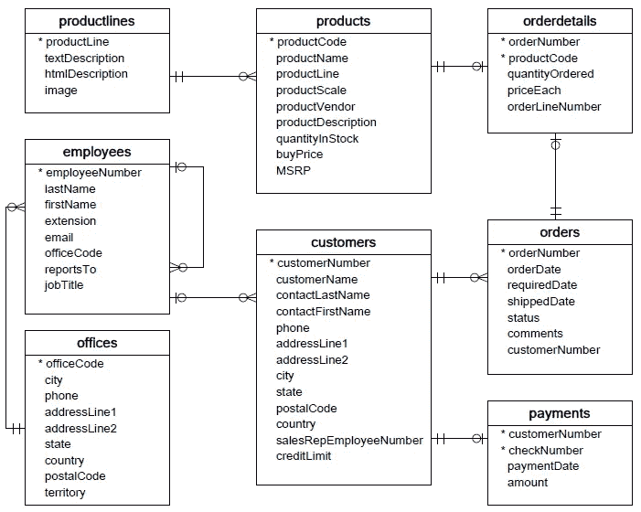
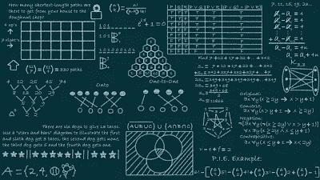
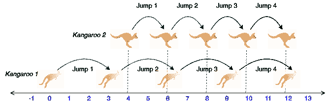

# 数据工程师面试学习指南

> 原文：<https://levelup.gitconnected.com/the-interview-study-guide-for-data-engineers-3443dd6abe3a>

任何技术职位的面试通常都需要准备、学习和一整天的面试。作为一名数据工程师，我们需要研究的东西并不总是清晰的。有些职位需要 Hadoop，有些职位需要 SQL，有些职位需要了解统计，而还有一些职位需要大量的系统设计。

我们已经收集了许多资源，这些资源是我们用来在 FAANG 家族的公司以及其他主要的技术公司学习和找工作的。我们还没有找到一个要求你在面试过程中了解 Hadoop 的问题，因此没有包括在本学习指南中。

但是，作为本学习指南的一部分，我们创建了清单。有时候，为面试而学习会让你觉得自己一事无成。因此，这份清单将帮助你保持跟踪，这样你就知道哪里需要改进，你做了什么。[你可以在这里找到清单。](https://docs.google.com/spreadsheets/d/1GOO4s1NcxCR8a44F0XnsErz5rYDxNbHAHznu4pJMRkw/edit?usp=sharing)

**概述**

1.  SQL 视频前问题
2.  SQL 视频
3.  SQL Post 视频问题
4.  数据库、数据仓库和 ETL 设计
5.  算法和数据结构编程问题
6.  操作编程问题
7.  系统设计视频
8.  Udemy 课程
9.  书

# 结构化查询语言

作为一名数据工程师，你几乎不可避免地会遇到一些 SQL 问题。作为一个参加过很多顶级科技公司面试的人，比如亚马逊和 Capital One。他们通常遵循一些相似的模式。

通常，至少有一个问题需要使用筛选器进行聚合，另一个问题需要一些连接，还有一个问题需要子查询。除此之外，可能还有一些需要自连接、递归和分析函数的曲线球问题。因此，让我们来看几个很好涵盖的概念

## SQL 视频前问题

这些最初的几个问题将帮助你衡量你在不同概念上的位置。这样你就可以在[学习指南](https://docs.google.com/spreadsheets/d/1GOO4s1NcxCR8a44F0XnsErz5rYDxNbHAHznu4pJMRkw/edit?usp=sharing)上做笔记，然后回去复习你觉得不舒服的地方。

## 用聚合连接

[**262。行程和用户**](https://leetcode.com/problems/trips-and-users/)

**问题:**`Trips`表保存了所有的出租车行程。每次旅行都有一个惟一的 Id，而 Client_Id 和 Driver_Id 都是`Users`表中 Users_Id 的外键。Status 是一个枚举类型(' completed '，' cancelled _ by _ driver '，' cancelled _ by _ client ')。

这通常是第三或第四种提问方式。

## 具有复杂逻辑的 SQL 问题

有时，您很幸运，只需要处理涉及一点逻辑的 SQL 问题。有时候事情会变得有点棘手。例如，此问题要求您查找连续三行且人口超过 100 的城市。

当你在工作的时候，这通常很容易做到，但是当你在面试的时候，有时会有点困难。

[**601。体育场**的人流量](https://leetcode.com/problems/human-traffic-of-stadium/)

**问题:** X 市新建了一个体育场，每天都有很多人来参观，统计数据保存为这些列: **id** ， **visit_date** ，**人**

请编写一个查询来显示连续 3 行或更多行且人数超过 100(含)的记录。

[**185。部门前三名薪资**](https://leetcode.com/problems/department-top-three-salaries/)

**问题:**编写一个 SQL 查询来查找每个部门中工资最高的三名雇员。对于上面的表，您的 SQL 查询应该返回下面的行(行的顺序无关紧要)。

[**197。**温度上升](https://leetcode.com/problems/rising-temperature/)

**问题:**给定一个`Weather`表，编写一个 SQL 查询来查找与前一个(昨天的)日期相比温度更高的所有日期的 id。

## 高级连接

[**626。交换席位**](https://leetcode.com/problems/exchange-seats/)

**问题:** Mary 是一名中学教师，她有一个表`seat`存储学生的姓名和他们相应的座位号。

列 **id** 是一个连续的增量。

玛丽想给相邻的学生换座位。

您能编写一个 SQL 查询来为 Mary 输出结果吗？

## 简单连接

[**报告**](https://www.hackerrank.com/challenges/the-report/problem)

***问题:*** *Ketty* 给 *Eve* 一个任务，生成包含三列的报表:*名称*、*等级*和*标记*。凯蒂不想要那些分数低于 8 分的学生的名字。报告必须按年级降序排列，即先输入较高的年级。如果有一个以上的学生被分配了相同的分数(8-10)，按字母顺序排列这些特定的学生。最后，如果等级低于 8，用“NULL”作为他们的名字，按等级降序排列。如果有一个以上的学生被分配了相同的分数(1-7)，按分数升序排列这些学生。

写一个查询来帮助 Eve。

## 排名、行数和分析函数

[**177。第 n 高工资**](https://leetcode.com/problems/nth-highest-salary/)

**问题:**编写一个 SQL 查询，从`Employee`表中获取第 *n* 份最高工资。

## 复杂的自连接

[**对称对**](https://www.hackerrank.com/challenges/symmetric-pairs/problem)

**问题:**给你一个表，*函数*，包含两列: *X* 和 *Y* 。

两对 *(X1，Y1)**(X2，Y2)* 若*X1 = Y2**X2 = Y1*则称*对称* *对*。

编写一个查询，通过 *X* 的值按升序输出所有这样的*对称* *对*。

如果您需要更多的 SQL，也可以试试这些:

[**职业**](https://www.hackerrank.com/challenges/occupations/problem)

[**奥利凡德的库存**](https://www.hackerrank.com/challenges/harry-potter-and-wands/problem)

[**安置**](https://www.hackerrank.com/challenges/placements/problem)

## 视频:

**IQ15: 6 SQL 查询面试问题**

[**学习行数和解析函数**](https://www.youtube.com/watch?v=QFj-hZi8MKk)

[**解析函数运行总高级实现**](https://www.youtube.com/watch?v=G3kYPzLWtpo&t=4s)

[**解析函数中值的高级实现**](https://www.youtube.com/watch?v=XecU6Ieyu-4&t=54s)

[**智枭 SQL 视频**](https://www.youtube.com/watch?v=2-1XQHAgDsM&list=PL6EDEB03D20332309)

# 发布视频 SQL 问题

一旦你看完上面的 SQL 视频。考虑尝试下面的新问题。试着看看你是否觉得自己在进步。同样，记下你觉得薄弱的任何特定话题。

[**二叉树节点**](https://www.hackerrank.com/challenges/binary-search-tree-1/problem)

[**595。**大国](https://leetcode.com/problems/big-countries/)

[**626。交换席位**](https://leetcode.com/problems/exchange-seats/)

[**气象观测站 18**](https://www.hackerrank.com/challenges/weather-observation-station-18/problem)

[**挑战**](https://www.hackerrank.com/challenges/challenges/problem)

[**打印质数**](https://www.hackerrank.com/challenges/print-prime-numbers/problem)

[**SQL 面试问题:3 个技术筛选练习(针对数据分析师)**](https://data36.com/sql-interview-questions-tech-screening-data-analysts/)

# 数据库、ETL 和数据仓库

对于数据库、ETL 和数据仓库设计问题，我们已经收集甚至制作了一些视频，我们希望在面试中解释您的设计时能够帮助您。此外，我们还列出了一些看似合理的数据库/数据仓库概念，您可以尝试自己设计。

*我们正在制作类似的视频。[注册以获取未来关于我们视频的电子邮件](https://forms.gle/yfMf7bnckZTyG6Ln7)。

[**设计传统关系数据库视频**](https://www.youtube.com/watch?v=I_rxqSJAj6U)

[**数据仓库设计视频**](https://www.youtube.com/watch?v=--OJpdPeH80)

**ETL 设计视频**

# 自我练习问题:

在面试练习的这一部分，我们将列出一些你可以尝试设计的商业系统。首先，我们建议设计一个关系数据库，然后考虑如何设计依赖于该关系数据库的 ETL 和 DW。

*此外，我们发现面试官通常会根据你的设计提出面试问题。所以，想一想你可以用数据库回答的一些问题，并把它们列出来。

为以下项目设计数据库/ETL 和 DW:

*   约会应用
*   自行车租赁服务
*   音乐流媒体应用
*   求职网站
*   Udemy like 网站

这些只是一些想法。我们希望它们能帮助你对你可以练习建模和设计有一个更清晰的概念。在开始之前，花些时间想想用户如何与这些网站互动。

# 编程问题

数据工程师在日常生活中做大量的编程工作。数据工程师使用几种特定的语言。特别是，Python 是最常见的。

如果这个角色需要大量的 Hadoop 工作，那么 Java 也是一种有用的语言。还有一些其他有用的语言，比如 Java 和 Powershell(如果你在微软商店工作的话)。

我们经历过两种类型的问题。有的面试官会问你更多操作性的问题。其他人会问经典算法和数据结构问题。

以下是它们的列表…

# 算法和数据结构

在深入研究数据结构和算法之前。让我们快速检查一下，看看你目前在这方面做得怎么样。我们列出了 8 个难度不同的 leetcode 问题。试试这些，试着估计一下你需要多长时间以及你需要多少提示。如果你是按照学习指南，然后记下这一点。在这个列表的最后还有几个问题。所以一旦你看完了所有的视频，考虑做那些题，看看你是否觉得自己在进步！

**预习题**

1.  [**985。查询后偶数之和**](https://leetcode.com/problems/sum-of-even-numbers-after-queries/)
2.  [**657。机器人返回原点**](https://leetcode.com/problems/robot-return-to-origin/)
3.  [**961。大小为 2N 的数组中的 n 个重复元素**](https://leetcode.com/problems/n-repeated-element-in-size-2n-array/)
4.  [**110。平衡二叉树**](https://leetcode.com/problems/balanced-binary-tree/)
5.  [**3。没有重复字符的最长子串**](https://leetcode.com/problems/longest-substring-without-repeating-characters/)
6.  [**19。从列表**末尾删除第 n 个节点](https://leetcode.com/problems/remove-nth-node-from-end-of-list/)
7.  [23**23。合并 k 个排序列表**](https://leetcode.com/problems/merge-k-sorted-lists/)
8.  [**31。下一个排列**](https://leetcode.com/problems/next-permutation/)

现在，你已经完成了这 8 个问题，并抖落了锈迹。让我们开始复习这些概念。

**数据结构**

[数据结构&算法# 1——什么是数据结构？](https://www.youtube.com/watch?v=bum_19loj9A)

[数据结构:链表](https://youtu.be/njTh_OwMljA)

[数据结构:树](https://youtu.be/oSWTXtMglKE)

[数据结构:堆](https://youtu.be/t0Cq6tVNRBA)

[数据结构:哈希表](https://youtu.be/shs0KM3wKv8)

[数据结构:堆栈和队列](https://youtu.be/wjI1WNcIntg)

[数据结构:计算机科学速成班#14](https://youtu.be/DuDz6B4cqVc)

[数据结构:尝试](https://www.youtube.com/watch?v=zIjfhVPRZCg)

**算法**

[Python 面试算法](https://www.youtube.com/watch?v=p65AHm9MX80)

[算法:图搜索、DFS 和 BFS](https://www.youtube.com/watch?v=zaBhtODEL0w&list=PLX6IKgS15Ue02WDPRCmYKuZicQHit9kFt)

[算法:二分搜索法](https://youtu.be/P3YID7liBug)

[算法:递归](https://youtu.be/KEEKn7Me-ms)

[算法:冒泡排序](https://youtu.be/6Gv8vg0kcHc)

[算法:合并排序](https://youtu.be/KF2j-9iSf4Q)

[算法:快速排序](https://youtu.be/SLauY6PpjW4)

**大 O 批注**

[大 O 符号和时间复杂度介绍(数据结构&算法#7)](https://www.youtube.com/watch?v=D6xkbGLQesk)

**一些面试演练**

[亚马逊编码面试问题—递归阶梯问题](https://www.youtube.com/watch?v=5o-kdjv7FD0)

[谷歌编码面试——通用价值树问题](https://www.youtube.com/watch?v=7HgsS8bRvjo)

[谷歌编码面试问答#1:第一个重复出现的字符](https://www.youtube.com/watch?v=GJdiM-muYqc)

# **贴吧视频问题**

一旦你完成了上面的视频。考虑试试下面的算法和数据结构问题。确保你记录下在解决问题时你感觉有多舒服。

1.  [越大越好](https://www.hackerrank.com/challenges/bigger-is-greater/problem)
2.  6。之字形转换
3.  7。反向整数
4.  40。组合和二
5.  43。乘法字符串
6.  [拉里的阵列](https://www.hackerrank.com/challenges/larrys-array/problem)
7.  [短回文](https://www.hackerrank.com/challenges/short-palindrome/problem)
8.  65。有效号码

如果你仍然觉得需要帮助，那么考虑参加一个关于[算法和数据结构](https://click.linksynergy.com/deeplink?id=GjbDpcHcs4w&mid=39197&murl=https%3A%2F%2Fwww.udemy.com%2Fcoding-interview-bootcamp-algorithms-and-data-structure%2F)的课程。

# 操作编程问题

操作性面试问题比较难准备。这里没有“经典”的面试问题。然而，他们也往往更容易当场弄清楚。算法面试题通常都有某种窍门。比如平衡括号问题。如果你不知道你需要使用队列，这将很难得到正确的答案。

运营问题将更加集中在工作流和业务流程上。所以只要你擅长走真题，这个应该比较容易。这里有一些非常适合准备的问题。我们发现知道如何使用数组和字典很有帮助。除此之外，没有更多的要求。

[袋鼠问题](https://www.hackerrank.com/challenges/kangaroo/problem)

[破纪录](https://www.hackerrank.com/challenges/breaking-best-and-worst-records/problem)

[找一根弦](https://www.hackerrank.com/challenges/find-a-string/problem)

[itertools.permutations()](https://www.hackerrank.com/challenges/itertools-permutations/problem)

[没想法！](https://www.hackerrank.com/challenges/no-idea/problem)

[程序员的日子](https://www.hackerrank.com/challenges/day-of-the-programmer/problem)

[排行榜](https://www.hackerrank.com/challenges/climbing-the-leaderboard/problem)

[词序](https://www.hackerrank.com/challenges/word-order/problem)

[夏洛克和方块](https://www.hackerrank.com/challenges/sherlock-and-squares/problem)

[均衡阵列](https://www.hackerrank.com/challenges/equality-in-a-array/problem)

苹果和橘子

[更多操作风格问题](https://www.hackerrank.com/domains/python)

# 系统设计问题

系统设计问题并不常见。然而，这是一个很好的实践技能，因为你永远不知道面试官什么时候突然要求你为下一个优步设计一个移动应用程序(这已经发生在我们身上了)。在进行高层次设计时，你不会想被困在你不了解的部分。它很快显示出你对什么一无所知。例如，什么是 CDN，你将为 ASP.NET 站点使用什么类型的 web 服务器，API 层在哪里。所有这些都是你不想被难住的基本问题。

所以花几分钟看下面的视频会帮助你做好准备，以防你的面试官用他们的问题吓到你。

[微小的网址](https://www.youtube.com/watch?v=fMZMm_0ZhK4)

[停车场系统](https://youtu.be/DSGsa0pu8-k)

[Whats App](https://www.youtube.com/watch?v=vvhC64hQZMk)

[优步设计](https://youtu.be/umWABit-wbk)

[Instagram](https://www.youtube.com/watch?v=QmX2NPkJTKg)

[火绒服务](https://www.youtube.com/watch?v=xQnIN9bW0og)

# 结论

我们希望这个列表能帮助你准备下一次数据工程面试。如果你需要清单来帮助跟踪，那么[你可以在这里找到清单](https://docs.google.com/spreadsheets/d/1GOO4s1NcxCR8a44F0XnsErz5rYDxNbHAHznu4pJMRkw/edit?usp=sharing)。如果您有任何问题或需要任何帮助，请告诉我们。

 [## 编写面试问题

### 一个完整的平台，在这里我会教你找到下一份工作所需的一切，以及…

技术开发](https://skilled.dev)