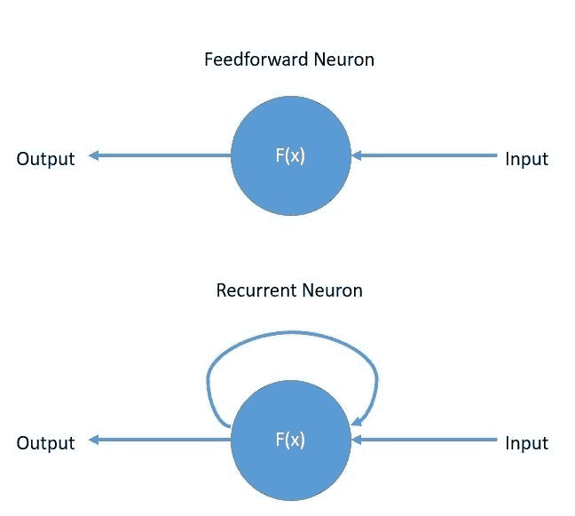
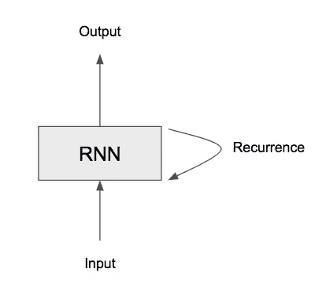
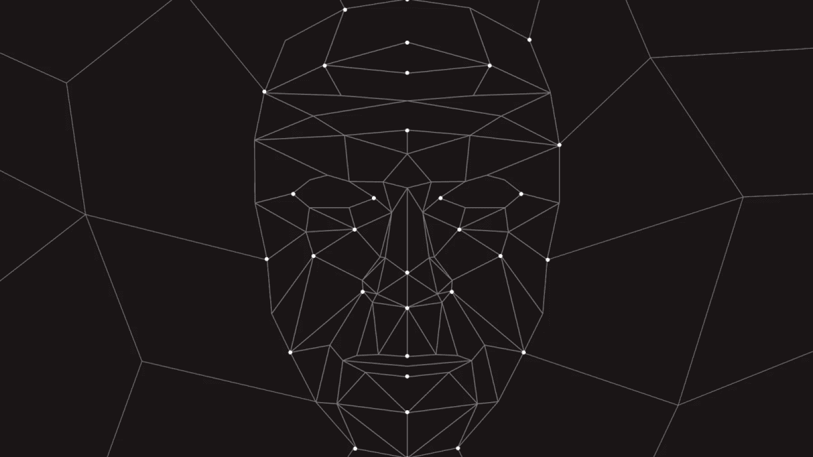

# 普通递归神经网络的直觉

> 原文：<https://levelup.gitconnected.com/the-intuition-of-vanilla-recurrent-neural-networks-b2ae08aacdc7>

R **通用神经网络**是专门对序列数据建模的神经网络。本质上，rnn 被设计为从时间序列和时间序列数据中获取信息。

但是这到底意味着什么呢？

假设我们有一张静止的飞盘在空中滑行的照片。

*现在，如果我们想预测飞盘的方向会怎么样？*

好吧，我们可以猜一猜，尽管这个猜测可能不准确，因为我们是随机猜测的。我们没有足够的信息知道飞盘去了哪里，所以我们不能准确地猜测飞盘要去哪里。

尽管如此，如果我们记录下飞盘连续的快照**序列**(许多快照)，我们将有足够的数据来做出更好的预测。

类似于飞盘的例子，RNN 对序列数据的研究。

RNN 序列数据的示例:

*   声音的
*   文本
*   录像
*   形象

**我们知道，rnn 是使用序列数据进行预测的好方法，但如何使用呢？**

由于 RNNs 惊人的顺序记忆，该模型可以很好地利用顺序数据进行预测。

好吧，试着在脑子里拼出你的全名。

这是一个很好的例子

对你们大多数人来说，这个任务可能很简单，对吗？

好的，现在试着倒着拼写你的全名。

等等，不，不是这个

更近了，但还不完全是。

最终，但这需要几次尝试。

我敢打赌，与第一个任务相比，这个任务要稍微困难一些，除非你多次练习这个序列，否则你可能会遇到困难。

就像你学习如何按照**顺序拼写你的名字一样，**顺序记忆让你的大脑更容易识别顺序模式。

*好的，我们知道 rnn 有顺序存储器，但是它们是如何实现这个概念的呢？*

我们需要看一个前馈神经网络。

如您所见，前馈神经网络有一个输入层、一个隐藏层和一个输出层。

*但是，我们如何才能让一个前馈神经网络能够利用以前的信息来影响未来的信息呢？*

本质上，我们需要看一下神经网络，以便能够传递以前的信息。

注意 RNN 的小模样。

这基本上就是 RNN 人做的事情。该模型有一个特殊的循环组件，作为一条高速公路，允许数据从一个步骤流向下一个步骤。

我们称这个信息为隐藏状态，意思是这是先前输入的一个表示。我们需要使用先前分类器的状态，因为如果不这样做，我们将需要一个深度神经网络(具有数百或数千层)来记住所有先前的信息。

取而代之的是，我们有一个单一的模型来总结过去并向分类器提供该信息，这就创建了如上所述的高速公路机制。为了实现这一点，rnn 使用时间 (BBPT)的**反向传播。**

作为 RNN 过程的结果，与前馈网络不同，rnn 可以接收顺序数据，并输出顺序数据。由于 RNN 的内部记忆，模型可以记住关于输入的重要信息，这允许模型预测接下来会发生什么。因此，这就是为什么 rnn 是顺序数据的首选模型。

# 应用程序

## 生成文本

RNN 可以将一系列单词作为输入，并预测下一个单词的可能性。因此，许多 rnn 可以用于语言翻译。当生成文本时，输出的概率用于对下一次迭代中出现的单词进行采样。

## 语音识别

通过从作为输入的声波中检测语音模式，RNNs 可用于语音识别。这组输入包括来自音频源的常见声音或信号，它们被处理成模型可以作为输入的适当格式。然后，该模型将计算音素并产生一组与输出的可能性相关联的语音。

步骤:

*   输入数据通过模型进行处理和识别，输入由各种声波组成。
*   声波中的信息通过与查询相关的关键字进行分类。
*   声波成分被进一步分类成语音段，并使用特定的 RNN 库组合成有凝聚力的单词。最后，输出将由一系列语音片段组成，这些语音片段被组合成一个句子结构。

## 图像检测

RNNs 可以用于不同的计算机视觉应用，例如图像识别。本质上，该模型将图像的一个单元视为一个输入，并在由多组指定输出组成的组件中产生该图像的描述。

这是框架的样子:

卷积神经网络将处理图像并识别图像中的特征。

RNN 使用已知的特征来理解图像，并将对输入图像进行适当的描述。

总的来说，rnn 有一个特殊的模型，可以帮助它们对一系列内存单元进行建模，这使它们能够持久存储数据，从而使该模型适用于短期依赖。因此，这种特定的模型非常适合用于时间序列中与识别数据和不同模式之间的相关性相关的任务。

# 如有任何疑问，请联系我🚀

如果你喜欢这篇文章，可以考虑看看我写的关于[CNN](https://medium.com/swlh/an-overview-on-convolutional-neural-networks-ea48e76fb186):)的文章

大家好，我是 Ashley，一个 16 岁的编程呆子和人工智能爱好者！

我希望你喜欢阅读我的文章，如果你喜欢，请随时查看我在 Medium 上的其他作品:)

如果您有任何问题，想了解更多关于我的信息，或者想要任何人工智能或编程相关的资源，您可以通过以下方式联系我:

💫电子邮件:ashleycinquires@gmail.com