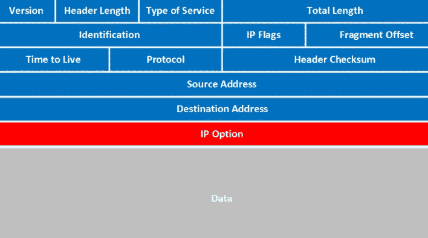

# IPSec 框架概述

> 原文：<https://levelup.gitconnected.com/the-ipsec-framework-overview-bea5725025db>

**互联网协议**用于将连接机器之间发送的数据报寻址和路由到网络。这种协议没有任何保证，在现代计算中，特别是在网络领域，它被广泛使用。

由于没有保证，一种“新”的方法出现来解决这个问题，这就是为什么 **IPsec 框架**存在的原因。**互联网协议安全**是一组确保 IP 通信安全的工具，基本上以多种方式为 **IP 协议**提供安全性，但我们可以将数据报加密和设备认证的功能推广到比 **SSL** 更广的范围。

**IPSec** 可用于 **IPv4** 和 **IPv6** 符号，向数据报添加信息，换句话说，向数据包添加新的报头。

在 IPSec 提供的所有特性中，值得一提的是这些基础元素。

1.  **IPSec** 为**封装安全**提供了一种机制**有效载荷(ESP)** ，这种加密用于保证传输信息的完整性和机密性
2.  还提供了一个**认证头(AH)** 来保证完整性和机密性，但是，它使用一个秘密共享密钥、数据报内容及其剩余元素来执行哈希计算。
3.  一个完整的**密钥管理系统**，基于 **IKE** 协议。

## IP 数据报

为了了解 **IP 数据报**是如何用 **IPSec** 改进的，请看这张图片。

IP 传统数据报

这是一个常规的 **IP 数据报**报头，它包含许多用于识别和正确传递的信息。现在，让我们探索一下新的特性，其中大多数都存在于 IP 报头中。

先说一下 **IPSec** **认证**。

**认证过程**通过使用寻址到特定设备的标识码实现，该标识码仅可用于授权设备，并禁止不同设备参与所述通信。认证报头与 NAT 过程不兼容，事实上，该报头值保护数据有效载荷和完整报头本身。

在 **IPSec** 中的密钥管理有助于避免拦截，它被用来解密通信。但是，它可以应用于设备、VPN、路由器或隧道。

让我们比较一下不同之处。

如果你参考上面的图片，你会看到一个 IP 数据包结构的细节。它完全由 IP 报头和 TCP 有效载荷来表示，对吗？有了 **IPSec，**这个全景改善了很多。

我们有两种方法，带 ESP 的 **IPSec 和带 AH 的 **IPSec****

## 带 ESP 的 IPSec

整个数据报现在由。

1.  IP 报头
2.  电动选择型
3.  加密有效负载
4.  NH:下一个头字节
5.  发送者验证数据

## 带 AH 的 IPSec

这与 **ESP** 几乎是一回事，但是，不是发送 **ESP** ，而是设置 **AH** 散列。

太好了。我们继续吧。

当 **IPSec** 在传输模式下实现时，设备之间的通信产生，数据报被加密，但报头被加密。在某些时候，这整个机密性和完整性可能会受到损害。

在这种特殊模式下，由于 **AH** 的原因，不允许**进程停滞**。任何时候一个 **NAT** 被完成，散列就会变化，数据报的完整性就会失效。对此的解决方案可以是执行横向 **NAT** 过程，这样，路由过程的其余部分保持不变。

另一个 **IPSec** 用法是在**隧道**过程中发现的，简而言之，这是针对不同网络之间的 IPSec，它确实没有太大变化，原始数据报被完全加密，然后被封装在另一个普通数据报中。这将让你以一种简单的方式进行交谈。

这种机制是在不可信或不安全的安全中的不同分离网络之间的通用方法。

尽管如此，这仍然是 IP 协议，但经过了改进，因为路由是通过 IP 协议进行的，它可以以不同的方式往返。 **IPSec** 实现索引和安全参数来识别数据流、规则甚至算法。

这里的另一个重要组件是密钥交换和如何管理。事实是，您可以执行手动分配，甚至自动化一切，这可能会因网络的规模而异，但这不是严格的评估因素。

通常对于小型和静态网络，手动密钥分配是针对每个设备进行的。可以使用 **IKE 协议**在连接的设备之间动态地进行自动(按需)密钥分配。

这是一个关于 **IPSec** 和如何改变 **IP 协议**的简单概述。

开心联网:)