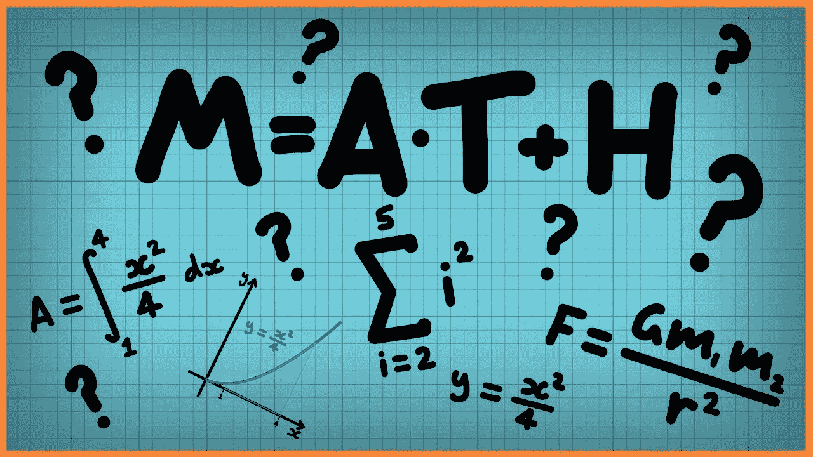

# 内置的 Javascript 数学对象

> 原文：<https://levelup.gitconnected.com/the-javascript-math-object-33293684952b>

## 数学对象的有用方法



Javascript 提供了一个方便的内置`Math`对象，该对象具有帮助执行数学计算的*属性*和*方法*。

正如 [w3schools](https://www.w3schools.com/js/js_math.asp) 所解释的:

> 与其他全局对象不同，Math 对象没有构造函数。方法和属性是静态的。
> 
> 所有方法和属性(常量)都可以使用，无需先创建 Math 对象。

# 性能

`Math`对象的属性包括各种常量。一个例子是π，它可以通过写`Math.PI`来访问。

```
const radius = 3;
const circumference = 2 * Math.PI * radius;
console.log(circumference)
// expected output: 18.8495....
```


# 方法

我使用`Math`对象的方法比使用它的属性更频繁。让我们在本文的剩余部分讨论一些我认为最有用的方法。

***注:*** *一般情况下，* `*Math*` *对象的方法期望接收一个数字作为自变量。如果传入的参数不是数字并且不能转换成数字，它将返回* `*NaN*` *。*

## Math.sqrt(x)

这个方法接受一个数字并返回它的(正)平方根。

`Math.sqrt()`期望参数是一个*正*数，所以如果传入的参数是*负*，则返回`NaN`。

```
console.log(Math.sqrt(4)) 
// expected output: 2console.log(Math.sqrt("16"))
// expected output: 4console.log(Math.sqrt("five")
// expected output: NaNconsole.log(Math.sqrt(-4))
// expected output: NaN
```

## Math.round(x)

它接受一个数字，并返回舍入到最接近的整数的参数值。

```
console.log(Math.round(4.5)) 
// expected output: 5console.log(Math.round(4.2)) 
// expected output: 4
```

## 数学.楼层(x)

它接受一个数字，并返回将参数值向下舍入到最接近的整数(即。返回小于或等于所提供数字的最大整数)。

```
console.log(Math.floor(6.001)) 
// expected output: 6console.log(Math.floor(6.999)) 
// expected output: 6
```

## Math.ceil(x)

这是`Math.floor`的反义词。它接受一个数字并返回将**向上**舍入到最接近的整数的参数值(即。返回大于或等于所提供数字的最小整数)。

```
console.log(Math.ceil(6.001)) 
// expected output: 7

console.log(Math.ceil(6.999)) 
// expected output: 7
```

## Math.min(a，b，c，…)

该方法接受任意数量的参数，并返回所提供的最小参数。

为了找到数组中的最小值，可以使用[扩展运算符](https://developer.mozilla.org/en-US/docs/Web/JavaScript/Reference/Operators/Spread_syntax)来提供数组值作为参数。

如果*作为参数提供的任何*值不是数字并且不能转换为数字，则返回`NaN`。

```
console.log(Math.min(1, 3, 2));
// expected output: 1console.log(Math.min(-1, -3, -2));
// expected output: -3const array1 = [1, 3, 2];console.log(Math.min(...array1));
// expected output: 1console.log(Math.min(3, "five", 1))
// expected output: NaN
```

## Math.max(a，b，c，…)

这是`Math.min()`的反义词。它返回作为输入给出的最大数字。

```
console.log(Math.max(1, 3, 2));
// expected output: 3console.log(Math.max(-1, -3, -2));
// expected output: -1const array1 = [1, 3, 2];console.log(Math.max(...array1));
// expected output: 3console.log(Math.max(3, "five", 1))
// expected output: NaN
```

不像`Math.round()`、`Math.floor()`、`Math.ceil()`不带任何参数调用就会返回`NaN`，有趣的是，`Math.max()`、`Math.min()`也可以不带参数调用。

如果不带参数调用，`Math.max()`将返回`-Infinity`，`Math.min()`将返回`Infinity`。

**不，那不是错别字。我不是不小心把顺序搞混了。**

我知道这似乎违反直觉，这就是为什么我提出来。

如 [MDN 文件](https://developer.mozilla.org/en-US/docs/Web/JavaScript/Reference/Global_Objects/Math/max)中所述，对于`Math.max()`:

> `[-Infinity](https://developer.mozilla.org/en-US/docs/Web/JavaScript/Reference/Global_Objects/Infinity)`是初始比较值，因为几乎所有其他值都更大，这就是为什么当没有给定参数时，- `[Infinity](https://developer.mozilla.org/en-US/docs/Web/JavaScript/Reference/Global_Objects/Infinity)`会返回。

对于`Math.min()`来说，情况正好相反，`Infinity`是初始比较值，因为传入的任何其他值都会更小。


## Math.random()

该方法不接受任何参数，它返回一个浮点数，该浮点数是左闭右开范围[0，1]内的一个[伪随机](https://hackernoon.com/how-does-javascripts-math-random-generate-random-numbers-ef0de6a20131)数。(对于我们这些永远记不住记数法是什么意思的人来说，它是大于或等于 0(包括 0)且不超过 1(不包括 1)的数。)

```
Math.random()
// expected output: 0.4594633007874416 (for example)
```

我们可以使用来自`Math`对象的额外方法来缩放和移动生成的数字到一个适合我们需要的范围。

例如，如果我想生成一个范围在[1，5](1 和 5 之间，含 1 和 5)内的随机整数:

```
Math.floor(Math.random() * 5) + 1
// expected output: well it's random.... but will be in the set
// {1,2,3,4,5}
```

要逐步解释:

1.  `Math.random() * 5`将生成一个介于 0(含)和 5(不含)之间的浮点数。

2.我们使用`Math.floor()`将其向下舍入到最接近的整数，所以现在它将是 0、1、2、3 或 4。

3.然后我们加上`1`，所以数字将是 1、2、3、4 或 5

更一般地，为了生成范围[a，b](在 a 和 b 之间，包括 a 和 b)中的随机整数，我们可以使用下面的公式:

```
Math.floor(Math.random() * (b - a + 1)) + a
```

`Math.random()`是我使用最多的方法，但是我们可以看到它与其他一些`Math`对象方法配合得很好。


***注:*** *你可以在这里* *找到所有数学属性和方法的文档(包括方法签名和如何处理不同的输入值)。*