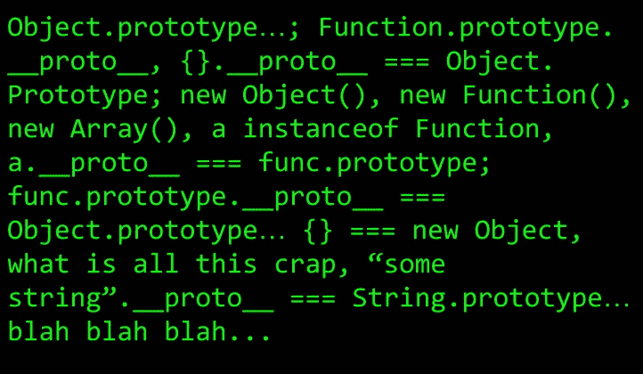
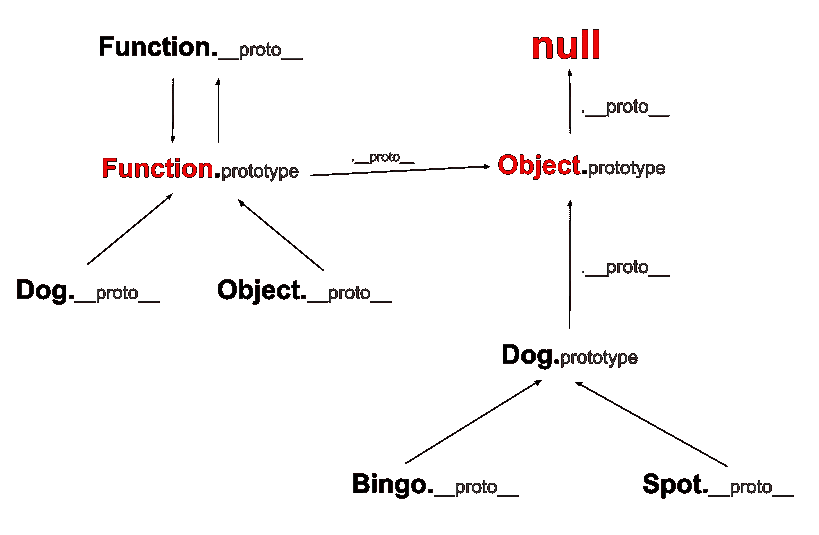

# 简单解释了 JavaScript 对象范例和原型

> 原文：<https://levelup.gitconnected.com/the-javascript-object-paradigm-and-prototypes-explained-simply-e9cb9eaa49aa>

## 关于 JavaScript 对象的所有令人困惑的地方都暴露出来了，所以你可以停止对它们的厌恶



Ughhh，为什么 JavaScript 一定要这样？

对于许多新开发人员来说，JavaScript 世界可能看起来相当令人厌烦，尤其是对于那些来自传统面向对象背景的人来说。仅仅在谷歌上搜索一些 JavaScript 代码和解释可能会发现相当混乱的代码和令人困惑的术语。为了使事情变得简单，本文将向您概述简单的、基于原型的继承，这样您就可以为使用 JavaScript 编程打下良好的基础。

> 只是指出一点，我知道试图解释 JavaScript 对象的文章已经做得够多了，但是我觉得我从来没有真正读过一篇彻底或清楚地解释它们的文章。他们经常只关注继承，而忽略了其他重要的点，或者没有给出足够的例子。这里的目的是以最简单的方式向您简要介绍 JavaScript 对象和原型继承。

## 什么是对象？

最基本的对象可以被认为是一个键/值对的列表，其中键总是一个字符串，值是……当然也可以是其他的。这类似于其他语言中你可能称之为*【地图】*。您在 JavaScript 中键入的所有非原语的内容(参见最后一节了解更多关于原语的信息)都是对象。对象使得打包和移动数据变得容易，创建新的对象比其他面向对象的语言(如 Java/C#)更简单。

在谈论物品时，你会经常听到使用术语*、*。这是指对象上特定的键/值对。为了让您了解对象的样子，我们将从一个简单的具有两个属性的对象示例开始:`age`和`weight`。

```
var Dog = {
    age: 8,
    weight: 65
}
```

> 注意:我们刚才的代码片段是一个使用对象文字的例子。object-literal 严格地指的是花括号内的代码。object-literal 不是变量或返回值。

## 函数是对象

如前所述，所有不是原语的东西都是对象，包括函数…我知道怪异，对吗？很难把函数想象成一组键/值对。由于函数是对象，它们通常被称为*函数对象*。函数对象是一组特殊的键/值对，具有执行代码和传递值的特定属性。我们将在下一节讨论这些属性是什么。首先让我们谈谈为什么函数很重要。

你可以说函数对象有两个主要目的。如果我们想创建一个执行的逻辑块，我们可以使用函数对象:就像任何其他编程语言中的*【方法】*。下一个目的是 JavaScript 变得有点时髦。如果我们想创建既有值又有方法的对象，也许还需要一些逻辑来设置这些值，我们也可以使用函数对象。在这里，您可以认为函数对象的行为类似于面向对象语言(如 Java/C#)中的*“类”*。

> **注意**:你会听到 JavaScript 中有时会用到的术语“*方法”*。在 JavaScript 中，方法是指作为包含对象的属性而存在的函数对象。

在标准情况下，JavaScript 中的函数看起来像任何其他语言中的函数；它们执行块逻辑来执行特定的任务。在下面的代码片段中，`bark`是函数对象执行代码。

```
function bark() {
    console.log('woof woof')
}bark() => 'woof woof'
```

如果我们想打包一小组数据，就像之前在`Dog`对象中的 2 个属性，那么一个简单的键/值对列表就可以了。如果我们想要创建多个狗对象呢？也许有些值需要是静态的，而有些值需要是动态的。这就是函数对象派上用场的地方。当我们用`new`调用一个函数时，一个对象(又名*实例-对象*)被返回，带有从函数内的`this`关键字设置的属性。

```
function Dog(age, weight) {
    this.species = 'Canis Familiaris'
    this.age = age
    this.weight = weight
    this.bark = bark <-- bark() from prev snippet
}// Spot and Bingo are **'instance-objects'** of Dog
var Spot = **new** Dog(8, 65)
var Bingo = **new** Dog(10, 70)Spot.species => 'Canis Familiaris'// bark is a **'method'** of Dog
Bingo.bark() => 'woof woof'
```

## 对象与原型

既然你对对象，更重要的是对功能对象有了一个很好的理解，让我们来谈谈原型。您经常听说 JavaScript 是一种基于原型的语言。那么这是否意味着对象和原型是同一件事呢？不完全是。*原型是一种特殊类型的对象，作为功能对象的属性而存在。当我们试图访问一个函数对象上的键时，JavaScript 会查看它的`prototype`属性，看看它是否在那里。如果没有，它将沿着**原型链**向上尝试找到它。为了理解原型链，我们需要了解函数和继承。*

## 函数和继承

每当使用`new`从函数调用中返回一个实例对象时，它就被赋予一个带有键`__proto__`的属性。这个属性的值是创建它的函数的`prototype`属性。

```
Bingo.__proto__ === Dog.prototype
Spot.__proto__ === Dog.prototype
```

如果我们试图访问实例对象上的一个属性，而它不在那里，JavaScript 将首先转到`__proto__`并查看它是否在父函数的原型上。为了看到这一点，让我们在狗对象的`prototype`键上设置一个属性，当我们调用`Spot['whatever the key name is']`或`Bingo['whatever the key name is']`时，我们将得到相同的值。这将工作，即使在两个狗实例对象已经创建。

```
Dog.prototype.bark = function() {
    console.log('woof woof')
}Spot.bark() // => 'woof woof'
Bingo.bark() // => 'woof woof'
```

以这种方式设置方法(与在函数内部使用`this`相比)特别有用，因为方法实现只会发生一次，而不是每次调用`new`时。这将节省内存并提高性能。

## 现在让我们更深入地研究一下继承吧！

所有 JavaScript 继承的核心是`Object`关键字，它是一个函数对象。所有实例对象都继承自它。当我们创建一个 object-literal 时，幕后的 JavaScript 实际上是在调用`new Object()`。新对象的`__proto__`将指向`Object`的原型。所以所有由 object-literal 构成的对象实际上都是`Object`的实例对象。这为我们提供了很多像`hasOwnProperty`这样有用的方法，可以告诉我们一个对象上是否存在一个属性。如果我们试图直接访问 function-object 上的属性，JavaScript 将首先查看`prototype`，然后使用原型上的`__proto__`沿着链向上移动。

让我们看几个 JavaScript 沿着原型链向上移动来访问一些对象上的`hasOwnProperty`的例子。

对象文字:

```
var insect = {legs: 6}// insect.__proto__ === Object.prototype
// insect.hasOwnProperty === Object.prototype.hasOwnPropertyinsect.hasOwnProperty('legs') // => true
```

实例对象:

```
var Bingo = new Dog()// Bingo.__proto__ === Dog.prototype
// Dog.prototype.__proto__ === Object.prototypeBingo.hasOwnProperty('weight') // => true
```

直接在功能对象上:

```
function Foo() {
    this.something = 'blah'
}// Foo.prototype.__proto__ === Object.prototypeFoo.hasOwnProperty('name') // => true
Foo.hasOwnProperty('something') // => false, set on instance-object not on the function
```

## 那么函数对象的 __proto__ 呢？

如前所述，`__proto__`有助于将对象链接到它们所继承的原型。但是直接在函数对象上调用`__proto__`呢？JavaScript 实际上有一个内置的函数对象，叫做`Function`。每个函数的`__proto__`属性都指向`Function.prototype`，它是一个函数，但没有`prototype`属性，返回`undefined`。`Function.prototype`定义所有函数继承的默认行为。像函数对象的所有`prototype`属性一样，它仍然有指向`Object.prototype`的`__proto__`。

```
Dog.__proto__ === Function.prototype       
Object.__proto__ === Function.prototype    
Function.__proto__ === Function.prototype Function.prototype.__proto__ === Object.prototype
```

## 咻，太多了…

所有这些都有点令人困惑，对吗？也许这张照片可以让事情变得简单一点。注意`Object.prototype`是一切的起源。



原型链

## 多层次继承

当我们说到继承时，我们通常会想到从函数返回的实例对象。使用`prototype`你也可以做多层次的继承，让函数对象从其他函数对象继承。您所要做的就是将子功能对象的原型设置为父功能对象原型的另一个实例。然后将复制父对象的所有属性。如果父函数在`Dog`中接收参数，如年龄和体重，使用`.call`设置子对象的`this`属性。

`Labrador`继承自`Dog`:

```
function Labrador(furColor, age, weight) {
    this.furColor = furColor
    this.breed = 'labrador'
    Dog.call(this, age, weight)
}Labrador.prototype = Object.create(Dog.prototype)var Fido = new Labrador('white', 4, 41)
Fido.bark()
```

## 班级

JavaScript 中为 ES6 创建的类只是功能对象之上的语法糖。不用一遍又一遍地输入`prototype`来定义函数的方法，使用`class`关键字我们可以在一个类中定义一组方法。有了`extends`关键字，类可以从其他类继承，而不必做`Object.create`和`Object.call`。我更喜欢使用类，但是记住不是所有的浏览器都支持它们(ES6)。这就是巴别塔这样的工具被创造出来的原因。

使用功能对象:

```
function Dog(age, weight) {
    this.age = age
    this.weight = weight
}Dog.prototype.bark = function() {console.log('woof woof')} function Labrador(furColor, age, weight) {
    this.furColor = furColor
    this.breed = 'labrador'
    Dog.call(this, age, weight)
}Labrador.prototype = Object.create(Dog.prototype)
```

等效使用类:

```
class Dog {
    constructor(age, weight) {
        this.age = age
        this.weight = weight
    } bark() {
        console.log('woof woof')
    }
}class Labrador extends Dog {
    constructor(furColor, age, weight) {
        super(age, weight)
        this.furColor = furColor
        this.breed = 'labrador'
    }
}
```

## 对象与原语

JavaScript 代码本质上可以归结为两种基本类型:原语和对象。JavaScript 中有 5 种原语:`boolean`、`number`、`string`、`null`和`undefined`。原语只是没有属性的简单值。其中 3 个原语:`boolean`、`number`和`string`都有 JavaScript 在某些操作中强制使用的对象对应。例如，`"some string".length`将调用`new String()`并将返回的实例对象包装在 string 原语周围，这样就可以访问`length`属性。如上所述，所有实例对象都继承自`Object`。所以对于一个字符串，你仍然可以使用像`hasOwnProperty`这样的方法。

```
// String.prototype.__proto__ === Object.prototypeString.hasOwnProperty('length')  // => true
```

# 结论

是啊是啊，我知道这很让人头疼；这看起来像是没完没了的接二连三。就个人而言，我认为 JavaScript 中的继承比它需要的要复杂得多，这就是我使用 TypeScript 的原因。如果您正在努力成为一名优秀的前端开发人员，了解并理解 JavaScript 超级集合的存在是有帮助的。

如果你觉得这篇文章有帮助，请点击拍手按钮。祝网络设计愉快！

[](https://levelup.gitconnected.com/)[](https://gitconnected.com/learn/javascript) [## 学习 JavaScript -最佳 JavaScript 教程(2019) | gitconnected

### 排名前 64 的 JavaScript 教程。课程由开发者提交并投票，使您能够找到最好的…

gitconnected.com](https://gitconnected.com/learn/javascript)