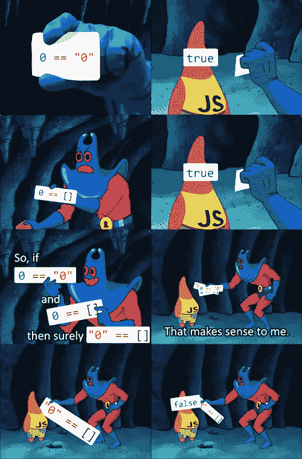
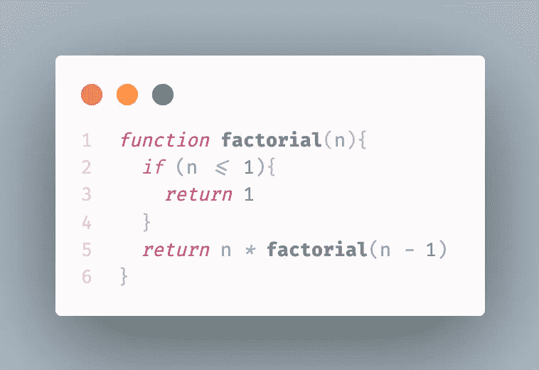
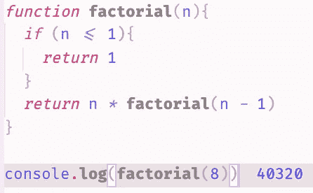
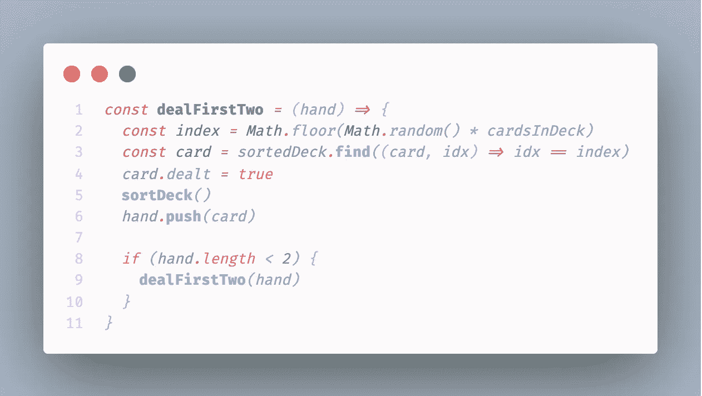
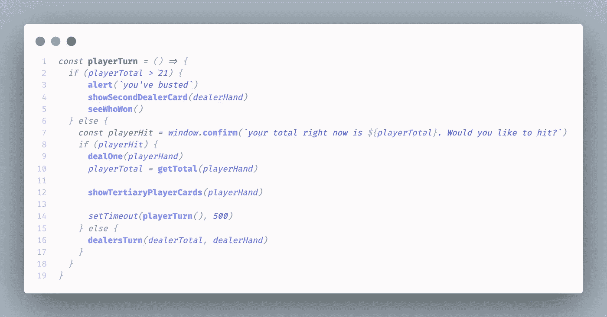

# Javascript 直到循环。

> 原文：<https://levelup.gitconnected.com/the-javascript-until-loop-68c350d7f5b0>

## 如何有效地使用递归？

我们都知道。Javascript 很棒。
直到不是。
超级好用。
直到不是。在 JS 中，你可以做任何你想做的事情。从 DOM 操作到客户机服务器架构。从机器学习到物联网。javascript 真的能解决所有问题，对吗？

虽然这是一个居高临下的介绍，但我真的觉得 Javascript(或 Typescript)是未来。也就是说，这种语言及其框架并不是没有问题。我想向你提交一个我最喜欢的编程迷因，以帕特里克·斯达和蝠鲼为特色。

帕特里克星和蝠鲼，争论 0 整数，0 字符串和空数组的区别。

将它插入控制台，我们发现显示的内容是正确的。但我不是来说 JS 坏话的。我写这篇文章的目的是提出，我们面对的编程语言的(一些)问题实际上不是语言本身的问题，而是我们作为程序员如何处理手头的任务。

## 回车:递归。

作为一个 Rubyist 爱好者，学习 Javascript 有它的曲线。有些东西我更喜欢 Ruby，有些东西在 Javascript 中更有意义。其中一个例子是 JS `for`循环，更具体地说是`for…of`循环。

当我发现`for…of`环时，就好像世界对我隐藏了起来。“这无疑是人类创新的顶峰”我想。能够用这么少的语法迭代一个数组是一个奇迹。

当然，JS，像几乎所有其他通用语言一样，有一个`while`循环，只要给定的表达式为真，它就会做一些事情(或者如果你不小心，就会使你的计算机崩溃)。

因此，如果一个普通的`for`循环在一个数据集合上迭代`x`次(或者等于集合长度的次数),并且`while`循环一直继续下去，只要还有剩余的东西`true` …我能告诉 Javascript 做一些事情`UNTIL`某事为真吗？

随着我继续学习 JS，这个问题越来越困扰我。理论上，我可以操纵上述迭代器中的一个以这种方式运行，但是这个函数最终几乎总是比我认为必要的更复杂。后来有一天，在一次代码会议上，我在谷歌上搜索一些与问题陈述无关的内容，我看到了递归的使用，一切都很顺利。

我相信很多读到这里的人都熟悉递归的概念，但是为了我自己的内心平静，我还是要给它下一个定义。

> 递归被定义为递归过程的重复应用。(“某事正在被重复”的长形式。)

*“好吧，这太棒了，但这对我有什么帮助？”*

让我们看一个沙盒例子。

返回阶乘的函数。

这区区六行代码将返回给函数的任意数字的阶乘。这个函数是一个常见的沙盒问题，有许多不同的方法来解决它，但是通过实现递归，这个函数可以尽可能的短。我们来分解一下。

举个例子，假设我们将`8`插入到函数中。在第一行，该函数检查`n` ( `8`)是否小于或等于`1`。既然不是，我们继续，`return`就是`n`乘以`n-1`的乘积的值。因为递归，我们可以用期望的数字`n`调用这个函数一次，它会循环通过，递减`1` `UNTIL` `n`等于或小于`1`。这需要理解很多东西，尤其是如果你不熟悉递归的话。下面是这个函数的运行情况:

阶乘函数在起作用。

(作为参考，阶乘是一个数乘以每一个小于它的数的乘积，大于 0。)

该函数获取数字`8`，将其乘以`7`，乘以`6`，然后乘以`5` …等等。一直到`1`，全部 6 行代码。如果没有递归，这将是不负责任的复杂。

递归和一个`if`语句解决了我对 Javascript 拥有一个 until 循环的渴望，尽管这是不必要的。

但是说实话，这个例子太深奥了，很难理解递归到底有多棒。来看一个实际使用。

## [反应杰克](https://github.com/jackismoe/blackjack)

最近，我建立了一个黑杰克模拟器。在二十一点的游戏中，每个玩家包括发牌者最初会得到两张扑克牌。

二十一点中发两张牌的功能

在`dealFirstTwo()`函数中，变量`index`将在`1`和(初始)`52`之间创建一个随机数。它将在我创建的名为`wholeDeck`的对象数组中找到一个`card`，该数组包含所有 52 张扑克牌，它们在数组中的索引对应于`index`变量。然后，它会将找到的`card`对象的属性`dealt`设置为`true`。`sortDeck()`函数将变量`sortedDeck`设置为等于`wholeDeck`数组中的所有对象，这些对象的`dealt`属性等于`false`，这在第一遍中是除了第一张`card`之外的所有牌。然后，该函数将把找到的`card`推入作为参数传递给该函数的`hand`(或者是`playerHand`或者是`dealerHand`，两者最初都是空数组)。最后，该函数检查作为参数传入的`hand`的长度，如果长度不等于或大于`2`，它将重复该函数。

*TL；给我一个随机数，根据这个数在一副牌中找到一张牌，告诉这张牌已经发了，告诉这副牌已经发了，告诉玩家这张牌属于它，如果玩家手里没有两张牌，给它另一张牌。*

调用这个函数两次，分别将`playerHand`和`dealerHand`作为参数传递给函数，我们可以有效地给一个玩家和一个庄家发两张牌(理论上，可以根据需要发给很多玩家)。

最后一个例子，我的 21 点模拟器中的另一个处理玩家初始回合的函数也使用了递归。

处理 21 点中的玩家回合

这个函数有点长，但是实现了相同的想法。一个玩家要么破产，要么选择留下，继续给这个玩家一张牌。
这里我们有一个`if…else`语句，另一个 `if…else`语句嵌套在初始的`else`分支内。

我们一行一行地看到:

如果`playerTotal`(一个设置为给定`hand`中所有牌值总和的变量)大于`21`，告诉玩家‘你已经被抓了’，展示隐藏的庄家牌，然后`seeWhoWon()`。如果`playerTotal`不大于`21`，发送一个确认窗口告诉玩家他们的`total`，并询问玩家是否想要另一个`card`(这将返回一个布尔值)。如果玩家要`hit`，`dealOne()`函数发一张牌(这个函数和上面的函数`dealFirstTwo()`一样，没有递归`if`语句)。`playerTotal`将被更新，`showTertiaryPlayerCards()`将在屏幕上显示已发牌的`card`，500 毫秒后，该功能将重复。如果玩家不想玩`hit`，我们就把这个回合交给庄家，这是一个类似的功能，但对我非常简单的“人工智能”来说，有一些更多的规范。

*TL；检查一下玩家是否被终结了。如果没有，问他们是否想要一张卡。如果他们这样做，给他们一个，并重复。如果他们不这样做，就轮到经销商了。如果他们失败了，庄家就没有机会了，因为庄家自动赢了。*

希望这已经为一些人澄清了递归的概念，如果没有，也许它能够向你展示这个概念背后的效用。
干杯！