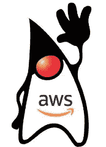
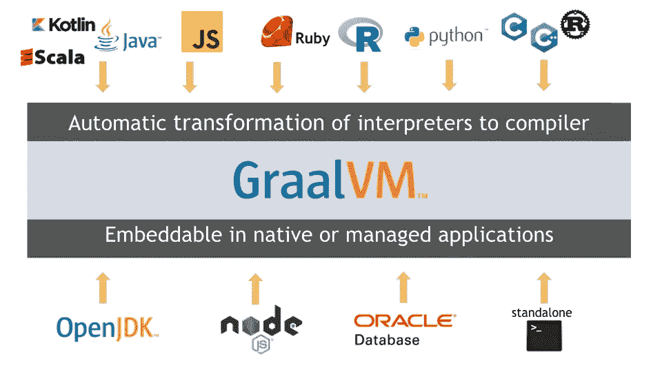
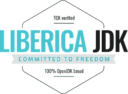
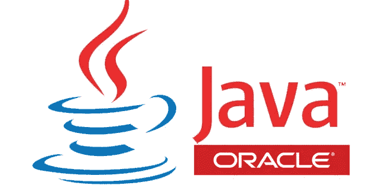

# JDK 生态系统

> 原文：<https://levelup.gitconnected.com/the-jdk-ecosystem-adeaec20b3a9>

## 哪些 JDK 可用，它们有何不同？


内森·杜姆劳在 [Unsplash](https://unsplash.com/images/food/coffee?utm_source=unsplash&utm_medium=referral&utm_content=creditCopyText) 上的照片

大约在 Java 于 1996 年问世 10 年后，Sun Microsystems 于 2007 年发布了 OpenJDK，这是一个 Java SE 的免费开源实现。许多公司开始作为贡献者加入。第一个是[红帽](https://www.redhat.com/en/blog/history-and-future-openjdk)，现在还在[前三](https://blogs.oracle.com/java-platform-group/building-jdk-11-together)贡献者中。即使在甲骨文 2009 年收购 Sun 之后，这种合作关系仍在继续。

即使其他 JDK 版本可用，我们大多数人甚至不知道他们。但随着甲骨文针对 Java 的新许可模式于 2019 年 1 月生效，情况发生了变化。

Oracle Java SE 现在仅限于个人或非商业开发、测试、原型制作、演示等。
任何其他场景都需要[包月](http://www.oracle.com/us/corporate/pricing/price-lists/java-se-subscription-pricelist-5028356.pdf)。

但是不要担心，Java 仍然是，并且将永远是免费的，我们只需要选择一个不同的 JDK 版本。

# 参考实施(RI)

使用 OpenJDK 而不是 Oracle Java SE 并不意味着我们必须放弃任何特性。

从 OpenJDK 7 开始，它就是 Java SE 的官方参考实现。从 Java 10 开始，OpenJDK 甚至负责 [JDK 项目](https://openjdk.java.net/projects/jdk/)，每六个月发布一个新版本。

从表面上看，不同的 JDK 选项是相同的，因为它们必须遵循 Java 规范。Java 兼容性工具包[(JCK)确保了这一点，否则你不能称你的构建为 *JavaSE 兼容*。](https://openjdk.java.net/groups/conformance/JckAccess/)

最显著的差异来自支持工具、默认设置、提供的支持和安全补丁。

# 免费和开源 JDK

## OpenJDK


Java SE 的免费开源实现，由 Sun 发起。所有其他 JDK 都基于这个代码库。构建由 Oracle 维护和提供。

从 Java 11 开始，OpenJDK 还包括许多以前的商业功能，如 [Java 飞行记录器](http://openjdk.java.net/jeps/328)和 [Java 任务控制](http://openjdk.java.net/projects/jmc/)，使这个版本实际上与[甲骨文 JDK 版本](https://blogs.oracle.com/java-platform-group/oracle-jdk-releases-for-java-11-and-later)相同。

发布周期是 6 个月，以提供更小的、更易管理的、更容易采用的改进。但这也意味着支持生命周期的缩短，并且只有最新的版本才能在他们的主页上看到。但是许多包管理器有多个可用的版本。

[项目主页](https://openjdk.java.net/)
[下载](https://openjdk.java.net/install/index.html)

## AdoptOpenJDK


尽管 OpenJDK 源代码是可用的，但缺乏跨多个平台的现成可用且可重复的构建。为了解决这个麻烦，[AdoptOpenJDK.net](https://adoptopenjdk.net/)于 2017 年由 Java 用户组成员、开发者和供应商组成的社区发起。

它将提供来自 OpenJDK 上游源代码的“原样”构建。AdoptOpenJDK 不是一个提供和维护自己的分支或版本的实体。

OpenJDK 和 OracleJDK 的一个很大的区别是不同捆绑 JVM 的可用性: [OpenJDK HotSpot](https://openjdk.java.net/groups/hotspot/) 和 [Eclipse OpenJ9](https://www.eclipse.org/openj9/) 可用。

[项目主页](https://adoptopenjdk.net/)

## 亚马逊 Coretto



Java 之父*、[詹姆斯·高斯林](https://en.wikipedia.org/wiki/James_Gosling)在 Devoxx Belgium 2018 的[主题演讲中宣布了亚马逊 Coretto。亚马逊在此基础上运行其服务，并决定开源其成果，使其在 AWS 之外可用。](https://youtu.be/2-qzwOhLQEE?t=3355)*

这是一个免费的、多平台的、生产就绪的 OpenJDK 发行版。发布周期至少是每季度一次，包括免费的长期支持。所有补丁都会上游到 OpenJDK，所以整个生态系统都会从中获利。

Java 版本 8 和 11 已经上市，LTS 将于 2023 年和 2024 年上市。

[项目主页](https://aws.amazon.com/corretto/)
[介绍亚马逊 Coretto](https://aws.amazon.com/blogs/opensource/amazon-corretto-no-cost-distribution-openjdk-long-term-support/) (AWS 博客)

## GraalVM



GraalVM 是一个通用虚拟机，能够在一个共享运行时中运行多种编程语言，如 JavaScript、Python、Ruby、R、C、C++，当然还有基于 JVM 的语言。它可以作为一个 JDK，或在另一个 JDK 的背景下使用。

Java LTS 版本 8 和 11 可用。

[项目主页](https://www.graalvm.org/)
[GraalVM 十大必做之事](https://medium.com/graalvm/graalvm-ten-things-12d9111f307d)(中)

## Liberica



另一个重要的 Java 贡献者是 Bellsoft，坦白地说，我以前从未听说过它。他们的 JDK 可用于多种平台，包括嵌入式架构，如基于 ARM 的系统。额外的所有构建包含 LibericaFX，一个 [OpenFX/JavaFX](https://openjfx.io/) 变体。

Java LTS 版本 8 和 11 可用，当前版本 13 也可用。对于嵌入式平台，LTS 版本 8 和 11 也是可用的。

[项目主页](https://bell-sw.com/)

# 专有/商业实施

## SapMachine


由德国跨国企业软件公司 SAP SE 维护。旨在为他们的客户和合作伙伴提供一个“友好的分支”，一个 SAP 支持的版本。

[新功能](https://github.com/SAP/SapMachine/wiki/Differences-between-SapMachine-and-OpenJDK)将向上游贡献给 JDK。如果不被接受，它仍然可能被包含在 SapMachine 中，甚至被移植到早期版本。

Java LTS 第 11 版现已推出，支持到 2022/09 年。只有最新的非 LTS 版本可用(目前是 Java 14)，支持到 2020/09 年。旧版本可以在档案馆找到。

[项目首页](https://sap.github.io/SapMachine/)
[sap machine 与 OpenJDK](https://github.com/SAP/SapMachine/wiki/Differences-between-SapMachine-and-OpenJDK) (Github)的区别

## 祖鲁语


Zulu 是 OpenJDK 的品牌版本，但是可以免费使用，没有任何限制。可选的付费支持由维护者 Azul Systems 提供。

Java LTS 版本 7、8 和 11 是可用的，还有两个最新的非 LTS 版本 13 和 14。

[项目主页/下载](https://www.azul.com/downloads/zulu/)
[路线图](https://www.azul.com/products/azul_support_roadmap/)

## 甲骨文 JDK 公司



最初的商业 Java 版本，不能免费用于生产。为了证明成本的合理性，我们提供了额外的工具和付费支持。

Java LTS 版本 8 和 11 可用。只有最新的非 LTS 版本。

[项目主页](https://www.oracle.com/java/)
[下载](https://www.oracle.com/java/technologies/javase-downloads.html)

# 选择哪一个

有选择很好。但是从高层次的角度来看，我们选择哪一个 JDK 并没有太大的关系。它们都基于原始的上游 OpenJDK 源代码，并通过了 JCK 以兼容 JavaSE 规范。

我们必须问的真正问题是基于我们的项目需求:

*   是免费的，还是需要购买许可证？
*   这些构建有多长时间可用？
*   安全补丁是反向移植的，还是我们必须转换到下一个版本？
*   支持生命周期有多长？有 LTS 版本吗？
*   我们的应用程序需要特殊的优化吗？
*   我想要或需要哪个 JVM？
*   如果需要，我们可以获得付费支持吗？

对于大多数用例，使用 OpenJDK 构建不会出错，无论是来自 Oracle 还是 AdoptOpenJDK。我们已经用了一段时间，没有任何问题。

其他选项是特殊情况下的好选择，如供应商优化或嵌入式系统支持。

# 使用多个 JDK

如此多样的选项引出了另一个问题:如何同时使用多个版本？

幸运的是，有多种工具可以简化不同 JDK 之间的切换。

## jEnv

一个命令行工具，可用于 Linux 和 macOS，帮助在全球和本地级别管理`JAVA_HOME`。

```
# ADD JDK
$ jenv add <path to JDK># LIST VERSIONS
$ jenv versions# SET DEFAULT
$ jenv global <version># SET LOCAL
$ jenv local <version># SET CURRENT SHELL
$ jenv shell <version>
```

[项目主页](https://www.jenv.be/)

## SDKMAN

*软件开发工具包管理器*是一个在大多数基于 Unix 的系统上管理多个 SDK 的工具，并不仅限于 JDK。

```
# ADD JDK
$ sdk install java <version># LIST VERSIONS
$ sdk list java# SET DEFAULT
$ sdk default java <version># SET LOCAL
# There doesn't seem to be a way to set locally# SET CURRENT SHELL
$ sdk use <version>
```

[项目主页](https://sdkman.io/jdks)

## 贾巴

受[节点版本管理器](https://github.com/nvm-sh/nvm)启发的版本管理器。

```
*# LIST INSTALLABLE VERSIONS*
$ jabba ls-remote*# ADD JDK*
$ jabba install <version>*# LIST VERSIONS*
$ jabba ls*# SET DEFAULT*
$ jabba alias default <version>*# SET LOCAL*
$echo <version> .jabbarc*# ACTIVATE LOCAL VERSION*
$ jabba use
```

[项目主页](https://github.com/shyiko/jabba)

## 更新 Java 替代方案

命令`update-java-alternatives`有助于在已安装的 JDK 之间切换。

```
*# LIST VERSIONS*
update-java-alternatives --list*# SET VERSION*
update-java-alternatives --set <path to JDK>
```

[Ubuntu 手册页](http://manpages.ubuntu.com/manpages/trusty/man8/update-java-alternatives.8.html)

# 资源

## 免费和开源 JDK

*   [OpenJDK](https://openjdk.java.net/)
*   [AdoptOpenJDK](https://adoptopenjdk.net/)
*   [亚马逊 Coretto](https://aws.amazon.com/corretto/)
*   [GraalVM](https://www.graalvm.org/)
*   [Liberica](https://bell-sw.com/)

## 专有和商业 JDK

*   [SapMachine](https://sap.github.io/SapMachine/)
*   [阿苏尔祖鲁](https://www.azul.com/downloads/zulu/)
*   [OracleJDK](https://www.oracle.com/java/) ( [价目表](http://www.oracle.com/us/corporate/pricing/price-lists/java-se-subscription-pricelist-5028356.pdf))

## JDK 管理工具

*   珍妮芙
*   SDKMAN
*   贾巴
*   [更新-Java-替代方案](http://manpages.ubuntu.com/manpages/trusty/man8/update-java-alternatives.8.html)