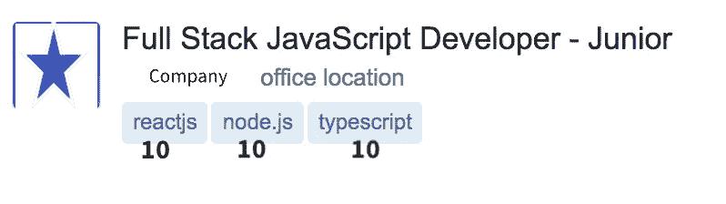
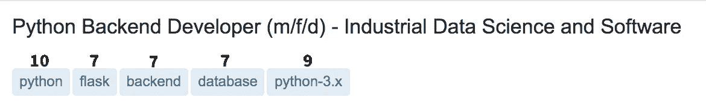
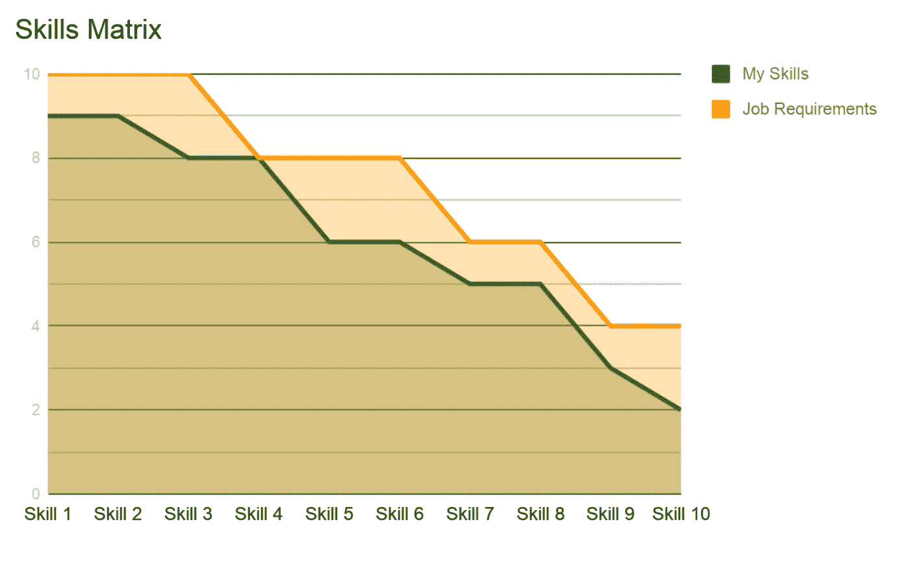
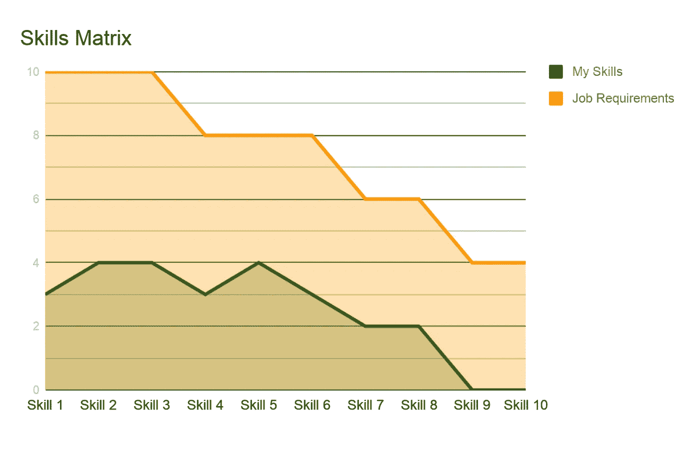

# 绝地矩阵获得开发人员工作面试

> 原文：<https://levelup.gitconnected.com/the-jedi-matrix-to-get-developer-job-interviews-3d2b6547b914>

## 让我获得数百次采访的黑客帝国

## 一个让你的技能与你想要的软件工程工作相匹配的系统

照片由[马太·亨利](https://burst.shopify.com/@matthew_henry?utm_campaign=photo_credit&utm_content=Free+Stock+Photo+of+Cross+Table+Hand+Shake+%E2%80%94+HD+Images&utm_medium=referral&utm_source=credit)发自[突发](https://burst.shopify.com/business?utm_campaign=photo_credit&utm_content=Free+Stock+Photo+of+Cross+Table+Hand+Shake+%E2%80%94+HD+Images&utm_medium=referral&utm_source=credit)

当我和我的同事讨论我们面试过的地方时，当我提到我接受过面试、接受过技术任务、甚至与招聘经理进行过最后面试的大公司时，他们会感到惊讶。

起初，我不明白他们为什么感到震惊或惊讶。我认为这是每个人为了找工作而做的正常的努力。

你需要一份工作来生存(在这个世界上)——你调查市场，你发现一些与你的技能相匹配的东西，你申请，然后你得到或不得到这份工作……如果匹配，你会得到它，但如果不匹配，那么你知道你需要为未来的面试学习什么。你越来越意识到你可以适应的其他工作，等等。

**对我来说，获得面试机会是学习过程中的一步。**

我学到了什么？当然是关于领域和市场！

我开始和几个朋友分享我获得工作面试的方法，我真的很惊讶，当他们在找工作时，并不是所有人都这样做。然后我与一些几个月后来的应届毕业生分享，强调这些提示和技巧对他们有帮助。

在这篇文章中，我将总结一些获得面试的方法和步骤。这些策略帮助我获得了世界上许多大公司的面试机会。

# 黑客帝国

我遵循一个简单的矩阵，这个矩阵经常帮助我接到面试电话，在我寻找新工作的过程中，我总是执行这个策略。

2009 年开始职业生涯。在过去的十年里，我在五家不同的公司工作过，平均每家工作两年。我从一家公司跳槽到另一家公司，根据我的热情和工作需要，我用不同的技术参与了多个项目。

利用这个矩阵，我一直在做采访。有些面试是为了搬到一个新的地方，有些是为了获得更多的知识。

有些面试是我当时梦寐以求的工作，它给了我很多关于市场的知识。其中一些是非常糟糕和尴尬的经历，因为我不能回答足够多的问题来满足面试官或我自己。

所有这些实验都需要我多次改变和更新我的矩阵，直到它变成我现在使用的样子。

矩阵有两个维度:**你**和**市场**。

# 先了解自己

在你开始找工作之前，要清楚自己知道什么，不知道什么。列出你的技能并衡量你对每项技能的了解是很重要的。

当你准备你的简历时，你列出所有你知道的技能。同时，**为你个人使用，给他们每个人打分**——这是你矩阵的第一个维度。

我们都知道许多工具和技术，但它们的能力和知识深度却不尽相同。你有自己喜欢的工具，也有自己更熟练使用的工具。意识到这一点，并给每一项打分。

请记住这是你如何看待自己的**，所以请放心地给出你认为自己应得的分数。这个分数在你做了一些采访后会有所变化。你回答的问题和你错过的问题将帮助你了解你的实际水平。**

**你给的分从 0 到 10 不等。6 分以上的分数就是你掌握的工具。4 到 6 级工具是帮助您满足市场需求的支持性工具。任何低于 4 的都不应该是你找工作的重点。**

**例如，下面的列表向您展示了一个传统老式前端 web 开发人员如何评价自己的示例:**

*   **HTML: 9**
*   **CSS: 9**
*   **jQuery: 7**
*   **JavaScript: 6**
*   **休息:5**
*   **JSON: 5**
*   **XML: 3**
*   **PHP: 2**
*   **SQL: 1**

**而现代前端 web 开发人员将具备如下技能:**

*   **节点:9**
*   **角度:8°**
*   **离子 2: 7**
*   **萨斯:6**
*   **咕哝:6**
*   **国家预防机制:4**
*   **反应:3**
*   **MongoDB: 2**

**对于工作本身，你也要设定所需技能的尺度。这需要你了解这项工作及其工具。如果你能做到这一点，那么你可以考虑申请这份工作，进行下一步。但是如果你不能说这些技能对这个职位有多重要，那么你应该看看:**

****

**根据工作要求的技能给分**

****

**当你试图衡量时，有些工作令人困惑，只要考虑所有 10 个**

****

**如果你不知道 python，不要申请**

**把你的“大不”考虑进去。如果你不懂 Java，也没有兴趣学习它，那么就不要花时间去找 Java 开发人员的工作。你是一个喜欢前端工作的 web 开发人员，那就不要浪费时间去查数据科学家的职位了。专注！**

**但是如果您的搜索标准是面向对象语言，并且您准备从 Ruby 迁移到 Java，那么为什么不呢！试试看。**

## **比较**

**每个开发人员都知道他们的技能，他/她可以直接将其与工作描述对应起来。只要你对照工作要求列出你的技能，你就可以很容易地将你的技能和工作要求进行比较。**

****

**申请这份工作**

**在前面的图表中，技能接近工作要求，很明显你的技能涵盖了大部分工作职责，你知道这份工作是关于什么的。你应该申请这份工作。**

**但是在接下来的图表中，你所知道的和填补这个职位所需要的有很大的差距。你在申请这个职位之前应该三思，因为他们可能不会认真对待你的简历。**

****

**不要申请这份工作**

# **了解就业市场**

**矩阵的第二个维度是市场本身。为什么我开始深入了解市场变化？那是在史蒂夫·乔布斯反对闪存的战争之后。**

**2010 年 4 月，史蒂夫·乔布斯发表了他的公开信[对 Flash 的看法](https://www.apple.com/hotnews/thoughts-on-flash/)，开始了一场后来他赢得了对 Flash 的战争。在这些日子里，我是一名 Flash 开发人员…**

**这个时候的生活对我来说很好。我正在为 Flash 应用程序和游戏编写 ActionScript3.0，并且正在创建完全交互式的网站。工资很高，到处都是工作！我上午和下午为一家大公司工作，晚上忙于自由职业。所以我并不担心苹果公司的首席执行官会说什么，我相信 Adobe 可以很容易地增强和改进 Flash 技术。Adobe 做了很多改进，我最喜欢的网站是 labs.adobe.com 的，它在 Flash 最流行的时候火了。**

**然而，市场并不关心你的想法，你的技术在论坛上表现如何，或者它在你和同事的谈话中有多受欢迎。有一些市场领导者，你需要仔细听他们说话，因为他们可以随时随地改变市场方向。**

**因此，当 Flash jobs 从市场上消失时，我学习了 HTML5、JS，当然还有 NodeJS……我让 jobs 开发和构建我使用 Flash 开发的相同的东西，但这次使用 HTML5。**

**那么，你如何解读市场呢——哪种技术能让你找到工作，哪种技术在现在的搜索过程中没有帮助？**

**技术有三种主要状态:**

*   **稳定的技术**
*   **新兴技术**
*   **染色技术**

## **稳定的技术**

**很少有稳定的技术不会很快消失。这些技术是由大组织和公司创造的，他们将继续支持和增强它。市场上总有你可以瞄准的空仓。**

**只要微软存在，一些微软的技术就会存在，当微软宣布它的时候(或者当微软的生命周期结束的时候)就会消亡。).这当然不是一个角色，但市场对这些技术失去信任的可能性非常低。因此，企业始终有机会满怀信心地使用这些技术。如果你喜欢舒适的安乐窝，你可以利用这些技术学习和寻找工作。**

**一些编程语言是世界上大多数 IT 行业的支柱。C、C++、Java、Python、Javascript、Web 技术和数据库一直都在，而且还会持续几十年。拥有这些工具中的一个会给你很大的帮助。**

## **新兴技术**

**在 **Web 开发**中，一开始有 JavaScript，然后 jQuery 似乎提供了一些魔力。几年前，流行的前端 web 开发人员的主要工具是 jQuery 和 Bootstrap(现在仍然是不同的方式)。**

**然后随着 HTML5 和新一代 web 浏览器的兴起，大量框架开始出现:backbone.js、knockout.js 和其他一些库在 2010 年左右出现，让开发人员的生活变得更容易。在 AngularJS 之前不久，ember.js 在第二年年底改变了市场…随后是 React.js 2013，Vue。JS 2014…而故事永远不会结束…在这里阅读更多[。](https://stackoverflow.blog/2018/01/11/brutal-lifecycle-javascript-frameworks/)**

**几年前，要成为一名 **Android** 开发者，你需要带有 Android 开发工具(ADT)插件的 Eclipse。然后在 2014 年，谷歌发布了基于 [IntelliJ IDEA](https://en.wikipedia.org/wiki/IntelliJ_IDEA) 的 [Android Studio](https://en.wikipedia.org/wiki/Android_Studio) ，作为其 Android 应用开发的主要 IDE。代码是用 Java 写的，直到 2017 年谷歌宣布支持 Kotlin。**

**如你所见，该领域的发展和变化非常快。你可以跟着后起之秀，学其中一个框架，就有工作了。然后下一个框架出现的时候，你又会在同一个圈子里。这很痛苦，但是如果你有主要的技能，你可以从一个框架跳到另一个框架。**

**如果你懂 Javascript，那么过去的十年就是你编写 Javascript 代码的方式的改进。如果你懂 Java，那么过去的十年也是你为市场开发 Android 应用的一个进步。**

## **染色技术**

**这项技术需要几年时间才会消亡，它不是突然消亡。了解市场及其变化对了解你的技术地位和未来很重要。我之前提到过，Macromedia\Adobe Flash 还是巨星的时候我就和它合作过。但是市场已经说得够多了，Adobe 并没有控制市场。**

**很明显，Flash 开发人员的工作机会正在快速减少，现在是改变的时候了。你可能会说当时的 Flash 属于第一类(稳定技术)，因为 Adobe 在支持它。但事实是，Adobe 并不拥有一个操作系统来引导市场…苹果和微软拥有市场并引导它。**

> **如果你现在的技术处于同样的情况…那么，运行…**

# **TODO(给你的)**

**现在你有足够的时间去评估你的技能，确切地知道你的强项是什么。开始寻找一份与你的技能相匹配的工作。将你的技能与工作要求进行比较，如果你对所见满意，就申请这份工作。即使你犹豫不决，也要申请这份工作。如果你确定你不能适应，快速向前移动，在每个可能的开放位置重复相同的步骤。**