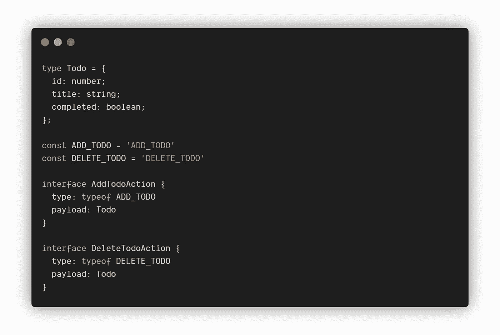
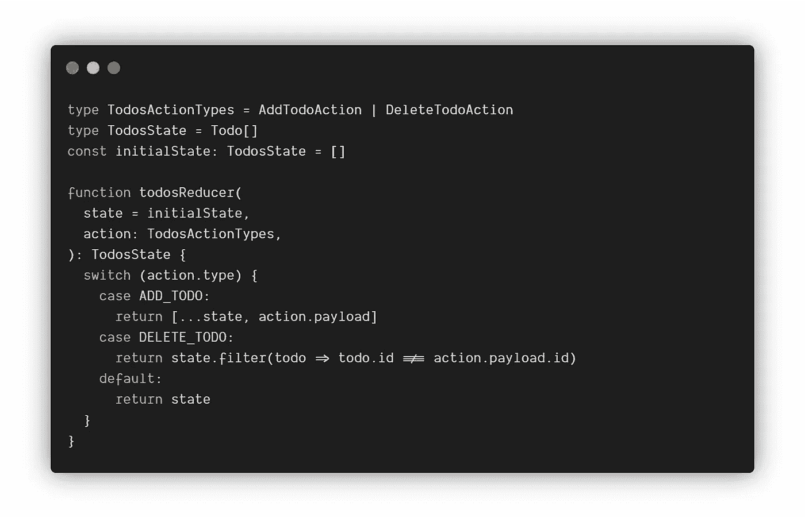
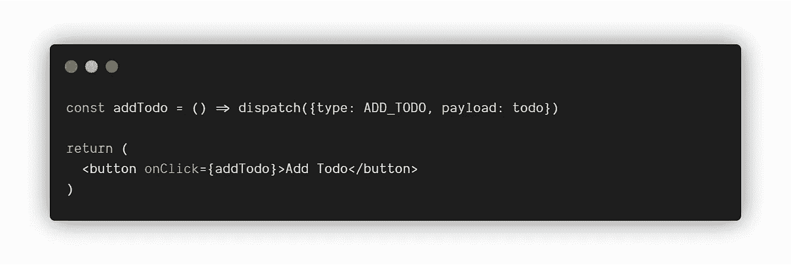
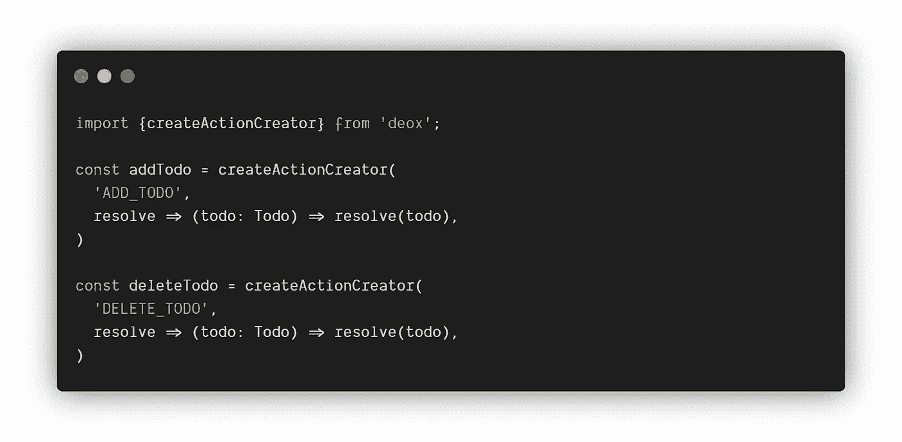
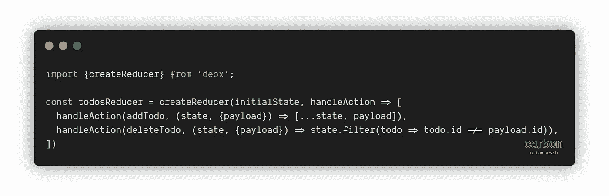
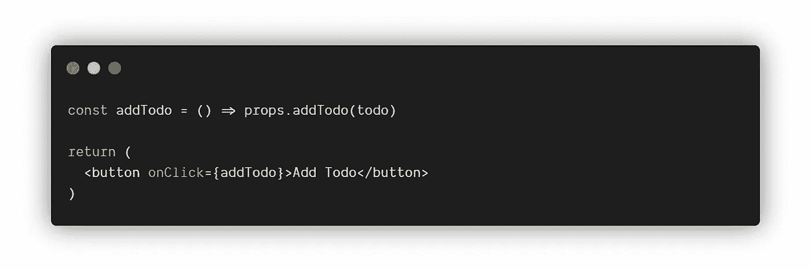
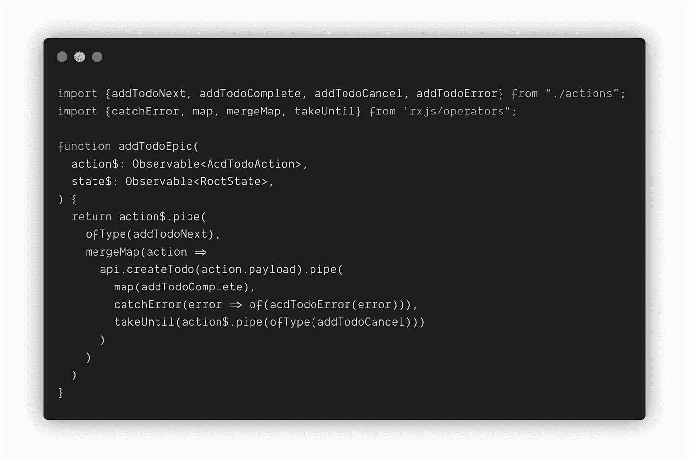

# 类型安全流状态的乐趣

> 原文：<https://levelup.gitconnected.com/the-joys-of-type-safe-flux-state-8335ed2f01c3>

## 使用 Redux、TypeScript、Deox 和 RxJS (redux-observable)

用纯现代的[React](https://reactjs.org/)at[Move Digital AG](https://www.movedigital.ch/)构建我们的一个网络应用已经让我们走得很远了。代码库很容易理解，任何逻辑都很简单易懂。我们总是在短时间内取得巨大的进步。

直到我们遇到某个点，我们当前的项目增长如此之快，以至于对完整的状态管理解决方案的需求变得越来越明显。因此，受我们当前需求和技术的启发，我决定调查和评估可能的解决方案，我喜欢在以前的项目中工作。

在这篇文章中，我假设你已经熟悉了通量模式。对于我们的例子，我将使用 [**Redux**](https://redux.js.org/) 实现。因此，首先，我将提供一些关于[**TypeScript**](https://www.typescriptlang.org/)**如何让您的 Redux 设置受益的见解，然后继续讨论如何在神奇的库 [**Deox**](https://deox.js.org/) 的帮助下克服一些典型问题。在本文的最后，我还会向你展示这是如何与[**redux-observable**](https://redux-observable.js.org/)完美融合的。**

## **键入 Redux(本机)**

**将 TypeScript 添加到您的代码库中有很多好处，也有一些缺点，但是我不想深入研究我们为什么首先要使用 TypeScript，因为有许多关于这个主题的现有文章。相反，我想告诉你，如何使它与 Redux 很好地配合工作。从这两种技术本身开始，您可能会编写如下代码:**

****

**为实体和操作定义类型**

**创建操作类型常量并定义类型后，可以实现 reducer 函数:**

****

**创建一个 reducer 来处理您的待办事项**

**通常，您可以使用`action.type`上的开关盒来实现这一点。请注意包括`payload`在内的`action`这样做会丢失其输入信息。**

****

**在组件中调度操作**

**正如你所看到的，在一些情况下，我们不会得到任何类型安全。当然，我们可以在这里或那里进行类型转换，但我认为这多少会违背所有的目的。**

**使用设置通量模式的默认方式(如上所述)，例如，TypeScript 不能自动计算出 reducer 函数中要返回什么`state`。或者说`ADD_TODO` 的那个`payload`会是什么样子。**

**因为这极大地损害了开发人员的体验和 TypeScript 的好处，所以一些开发人员想出了一种简洁的方法来耦合那些应该在一起的东西。使我们能够轻松构建类型安全的 Redux 架构。**

## **带 Deox 的类型安全 Redux**

**Deox 的主要目标是支持类型安全的 flux 架构和最小化样板代码。它简单易用，易于阅读。但最重要的是，您将最终获得使用 TypeScript 的全部好处。**

****

**创建具有耦合类型和有效负载的类型化操作**

**使用`createActionCreator`你可以定义你的行动。动作现在包含了类型和解析器函数，可以用来在将数据提供给 reducer 之前做一些小的数据预处理。不再需要类型的字符串常量(如`ADD_TODO`)，因为您将使用创建的动作对象本身。**

****

**创建具有耦合状态和处理程序的类型化缩减器**

**为了定义我们的减速器，我们使用 Deox 的`createReducer`功能。它推断出我们的第一个参数的类型,`initialState`,然后用于输入我们的处理程序的返回值以及进入我们的处理程序的状态参数。`handleAction`函数再次使用了我们的类型化动作对象，由此它可以推断出有效载荷应该是什么样子。**

**和 hazaaa🎉你不会再写一个 reducer，却在运行时发现一个错误的负载已经破坏了你的状态！**

****

**分派类型化的操作**

**接下来，您将希望在组件内分派您的操作。在使用 React 的情况下，这应该使用`connect`的助手参数来完成，以将状态/分派映射到 props。现在想象用一个`string`作为参数，而不是一个`Todo`对象来调用`addTodo`。多亏了我们的类型化操作，TypeScript 编译器将会给我们关于你传递的字符串参数的错误类型的即时反馈。**

**不用说，您将消费的任何状态也将被正确地键入。**

## **添加可观察的中间件**

**最酷的是，所有这些都可以很好地转化为异步中间件处理。在这个例子中，我们使用了 [**redux-observable**](https://redux-observable.js.org/) ，基于 [**RxJS**](https://rxjs-dev.firebaseapp.com/) 的替代方案 [*redux-saga*](https://redux-saga.js.org/) 和 [*redux-thunk*](https://github.com/reduxjs/redux-thunk) 。**

**设置一个简单的 Epic 来异步获取我们的 todos，如下所示:**

****

**通过我们的 API 异步创建一个新的 todo**

**如您所见，我们可以再次从我们的类型化动作和有效负载中获益良多。想象一下，用所有这些类型重构一些主要的州是多么简单。以及所有 RxJS 操作符中的自动完成和返回类型检查。此外，由于 RxJS 强大的集成操作符，您可以声明性地实现请求取消、错误处理和重试策略、延迟、缓冲等等。**

**我希望我能给你一个宝贵的第一印象，让你了解这些技术是如何协同工作的。**

**如果您有任何问题或意见，请不要犹豫发表评论或通过任何其他沟通渠道联系我，如 [LinkedIn](https://www.linkedin.com/in/matthias-meier-74120286/) 。**

**本文最初发布于
[https://www . Matthias Meier . io/blog/the-joys-of-type-safe-flux % C2 % A0 state/](https://www.matthiasmeier.io/blog/the-joys-of-type-safe-flux%C2%A0state/)**