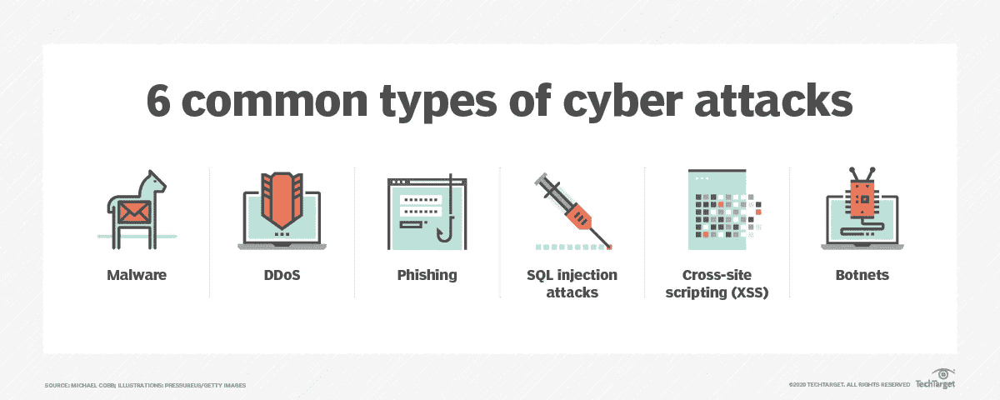
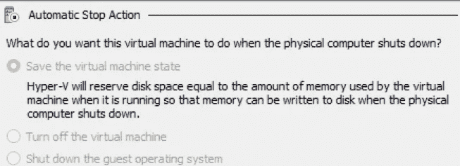
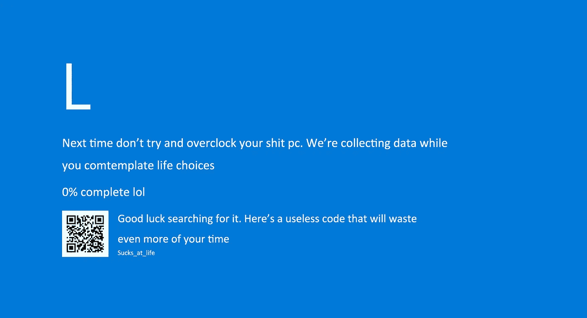
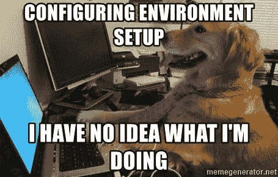
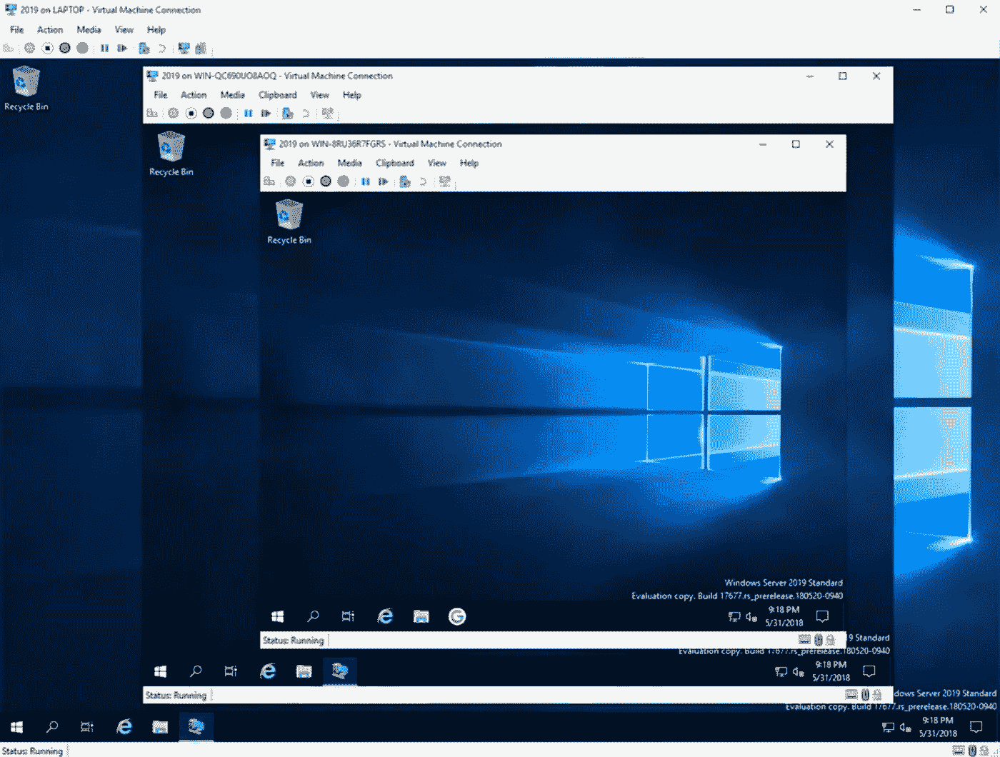

# 您需要的最后一个开发环境(Hyper-V、Docker、流浪者)

> 原文：<https://levelup.gitconnected.com/the-last-dev-environment-you-will-ever-need-hyper-v-docker-vagrant-c82688ab9a9d>

我记得在过去(大约 10 年前)，虚拟机对人们来说还是一个非常新的事物。计算机很慢，所以在虚拟机中开发代码不成问题。

快进 5 年后，技术发生了变化。PCIe 4 定义了速度的一切。**支持虚拟化的操作系统**软件已经发展到主机和虚拟机之间不再有区别的地步。

随着**无头**虚拟机 **Docker** 和**流浪汉**的兴起，在虚拟机中编码已经不是什么新鲜事了。相反，它应该成为每个开发人员的标准。

由于我在 Windows 上使用 **Hyper-V** 作为我的虚拟机管理器，我的观点将通过 Hyper-V 特性来说明。

# 它非常安全

说到**安全性**，没有什么比在虚拟机中编写和发布代码更安全的了。将开发环境与个人空间隔离的能力降低了网络攻击的风险。

6 种常见类型的网络攻击

# 这是超级快的

Hyper-V 中的保存状态功能确实很好，但被许多人低估了。它允许我立即启动我的开发环境，并在我想的任何时候恢复工作。此外，它甚至带有自动停止功能。基本上，虚拟机将在没有用户干预的情况下随着主机自动打开和关闭。

最重要的是，这一点我怎么强调都不为过，即时启动的开发环境是全栈开发人员的必备条件。以前，我必须手动执行脚本来打开**前端**、**后端**和**数据库**。现在，只要我的电脑一开机，一切都准备好了。

这是你吗？:)

你有没有不小心编写了一个**无限循环**然后它立刻冻结并关闭你的系统？虚拟机没有机会。由于能够限制资源，如 **CPU** 和 **RAM** ，只有虚拟机会死亡，而主机不会。此外，如果你使用像 Chrome 这样的内存密集型浏览器，它会自动调节 Chrome 可以使用多少内存。这样，主机系统就不会受到资源不足的困扰。

如果 PC 是诚实的

# 这是最终的未来

根据我的经验，初级开发人员需要 3 天时间来建立他们的工作环境。如果我们能把它缩小到 **3 分钟**呢？这可能吗？介绍**流浪汉**。它是一个脚本工具，用于构建虚拟化环境，以提高开发效率。只需几行简单的代码，您就可以拥有一个随时可用的环境:

流浪档案

我曾经花了 3 周的时间来配置我的环境。我是哑巴。

如今，你甚至可以用**Docker**&**vs code**在一个无头 VM 中编码。当然，最大的缺点是很难使用需要 **UI** 的应用程序。此外，它使用共享卷来保持主机和容器之间的文件一致。为此，它可能会降低热重装功能或自动构建功能的速度。然而，它在用**Anaconda**/**Python**构建 **AI** 东西方面做得非常出色。只用一行代码，您就可以在几秒钟内拥有一个完整的 Anaconda 环境:

如果出于某种原因，你厌倦了你的生活，想尝试一些疯狂的事情，为什么不尝试虚拟机中的虚拟机。听起来像《盗梦空间》,对吗？也许，在深入**之后，你会明白我试图通过这篇文章灌输给你的**想法**。毕竟，**

> “一个想法就像一个病毒。”:)

"梦中的梦太不稳定了."

嘿，今天到此为止。我希望你喜欢我的写作。请不要忘记订阅我的博客。这对我的编码之旅意义重大。此外，请考虑通过以下方式支持我:

*   [我的全新 Patreon(简历/自由职业服务)](https://www.patreon.com/leonto101)
*   [中等会员](https://leon101.medium.com/membership)