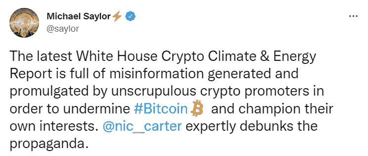

# 白宫的最新报告对比特币不利。

> 原文：<https://levelup.gitconnected.com/the-latest-white-house-report-isnt-good-for-bitcoin-5208b646cffc>

在 [Unsplash](https://unsplash.com/s/photos/white-house?utm_source=unsplash&utm_medium=referral&utm_content=creditCopyText) 上由 [Tabrez Syed](https://unsplash.com/@tabrez_syed?utm_source=unsplash&utm_medium=referral&utm_content=creditCopyText) 拍摄的照片

美国[联邦储备局](https://www.federalreserve.gov/paymentsystems/coin_data.htm)印了这么多钱，简直让你热泪盈眶。

随着新冠肺炎刺激计划支票在 2020 年 4 月[左右进入人们的信箱](https://www.cnbc.com/2020/04/13/first-coronavirus-stimulus-checks-deposited.html)，许多偶像手和“傻钱”进入了这个系统。

人们被迫违背自己的意愿呆在家里，导致自我主权的广泛兴起和加密货币的日益普及。

数字资产价格飞涨。

到 2021 年 11 月，全球数字资产的市值达到了 3 万亿美元。具有讽刺意味的是，美联储在 2020 年左右多印了 3 万亿美元。

16%的成年美国人已经购买了数字资产。

当前的美国政府正在应对不断上升的通货膨胀、不断上涨的能源价格、欧洲的战争，以及最近大量人口购买正在崩溃为零的新台币。

美国总统乔·拜登(Joe Biden)签署了一项“行政命令”，呼吁政府审查数字资产的好处和风险。

我不打算打破行政命令，而是强调与比特币相关的重要部分。

在过去的六个月里，政府机构共同努力，为数字资产制定政策建议。

确定的六个关键优先事项是

*   **消费者和投资者保护**
*   **金融稳定**
*   **非法活动**
*   **美国在全球舞台上的竞争力**
*   **金融普惠**
*   **负责任的创新**

看起来都很普通。

对于我的非美国读者来说，行政命令是美国政府中最常见的总统文件之一。

它经常引起争议。

大多数美国总统至少发布过一个，很少事先解释这个文件是什么。

该行政命令与比特币相关的地方是这一部分。

> “能源部、环境保护局和其他机构将考虑进一步跟踪数字资产的环境影响；酌情制定绩效标准；并为地方当局提供减轻环境危害的工具、资源和专业知识。
> 
> 为加密资产供电可能需要大量的电力，这会排放温室气体，使电网紧张，并通过噪音和水污染损害一些当地社区。
> 
> 将数字资产的发展与过渡到净零排放经济和改善环境正义相结合的机会是存在的。"

这是一个微妙的观点，但显然是指比特币的工作证明模型。

拜登后来提到了比特币等数字货币的能源成本。

白宫甚至表示，如果让采矿变得更加绿色的措施不起作用，能源密集型加密采矿，即比特币采矿，可能会被完全禁止。

他们是这样说的。

> “如果这些措施证明在减少影响方面无效，政府应探索行政措施，国会可能会考虑立法，以限制或消除使用高能耗共识机制进行秘密资产开采，”

著名的比特币最大化主义者迈克尔·塞勒(Michael Saylor)很快在他的 Twitter 页面和博客上发表了行政命令。

来源——[迈克尔·塞勒推特](https://twitter.com/saylor/status/1570795816935378946?s=20&t=cNB1A7FSsULqIhzYsn5T_w)

在塞勒的博客页面【michael.com 上，他从七个方面对气候争论进行了彻底的剖析。

以下是塞勒提到的一些关键点。

> “比特币挖矿是最高效、最清洁的工业用电方式，其能源效率的提高速度是所有主要行业中最快的。”
> 
> “我们的指标显示，约 59.5%的比特币开采能源来自可持续来源，能源效率同比提高 46%。没有其他行业能与之媲美。”
> 
> “比特币网络的能效越来越高，这是因为驱动比特币采矿中心的半导体不断改进，加上协议中规定的比特币采矿奖励每四年减半。”
> 
> “这导致能源效率年复一年持续提高 18–36%。有关这方面的更多详细信息，请参见 [BMC 演示文稿](https://bitcoinminingcouncil.com/wp-content/uploads/2022/07/2022.07.19-BMC-Presentation-Q2-22-Presentation.pdf)。

当你更深入地挖掘数据时，你会发现加密货币行业正在尽一切努力应对气候对话，而不是停留在头条读者的位置。

塞勒是正确的。

根据比特币矿业委员会(BMC)2021 年 1 月的一份报告，到 2021 年第四季度，全球采矿业估计有 58.5%的可再生能源。

他们发现，清洁能源的大量使用是因为需要赶走政治压力和更加环保。

最终，使用可再生能源对矿工来说更有利可图。

在[媒体](https://t.co/0WsCUfngD2)、 [LinkedIn](https://www.linkedin.com/in/jayden-levitt-aa93511b9/) 或 [Twitter](https://twitter.com/JaydenLevitt) 上关注我。

*本文仅供参考；不应将其视为财务、税务或法律建议。在做出任何重大财务决定之前，请咨询财务专家。*