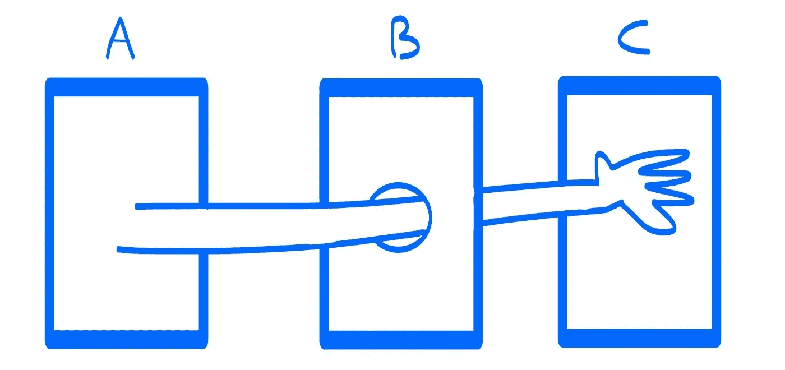

# 德米特里定律

> 原文：<https://levelup.gitconnected.com/the-law-of-demeter-4bd40aa21cbe>

## 它经常被遗忘或忽视😔



德米特里定律

德米特法则，被称为 LoD 或最少知识原则。这个所谓的法律有如下三个核心思想。

*   每个单元应该只对其他单元有有限的了解:只有与当前单元“密切”相关的单元。
*   每个单位应该只和自己的朋友说话；不要和陌生人说话。
*   只和你最亲近的朋友说话。

请记住，这个上下文中的单元是一个特别编码的抽象，比如可能是一个函数、一个模块或者一个类。而这里说的是接口，比如调用另一个模块的代码或者让那个模块调用你的代码。

这是非常有用的学习和应用到您的程序，但它是可悲的😔它经常被遗忘或忽视。这条法则更多的是一条指导方针，而不是帮助减少组件间耦合的原则。

我们都见过像这样的长长的函数链。

```
obj.getX()
      .getY()
        .getZ()
          .doSomething();
```

我们问了又问，然后才说。对 doSomething()的调用向外传播，直到到达 z。这些长长的查询链违反了所谓的 Demeter 法则。像下面这样不是更好看吗？

```
obj.doSomething();
```

换句话说，我们可以这样理解这个规律:一个对象应该只调用这几类对象的方法，如下:`itself, its parameters, any objects it creates, its direct component objects, objects of the same type`。

接下来，让我们举一些定义`Customer`和`CustomerWallet`类的简单例子。

```
public class Customer {

    ...

}public class CustomerWallet {

    private float amount = 0;

    ...

}
```

调用自身及其参数。

```
public class CustomerWallet {

    ...

    public void addMoney(float deposit) {
        this.amount += deposit;
    } public void takeMoney(float debit) {
       this.amount -= debit;
    }
}
```

在我们创建的任何对象或任何直接持有的组件对象上调用方法是没问题的。

```
public class Customer {

    private CustomerWallet wallet;
    public Customer() {
        this.wallet = new CustomerWallet();
    }

}
```

看得更远。我们以店主和顾客之间的互动的简化版本为例，可能会出现如下问题。

```
public class ShopKeeper {
    public void processPurchase(Product product, Customer customer){
        static price = product.price();
        customer.wallet.takeMoney(price);
        ...
      }

}
```

这违反了德米特里的法律。我们尝试考虑这种相互作用的一个真实案例。店主从顾客的口袋中取出钱包，然后打开钱包，取出所需的金额，而不以任何方式直接与顾客互动。

显而易见，在现实生活中，这永远不会是一种合适的社交互动。在这种情况下，店主做出的假设超出了他们的职权范围。顾客可能希望使用不同的机制支付，或者甚至可能没有钱包。

这里的店主不应该知道顾客的钱包，所以不应该和它说话。所以，我们应该重写我们的程序如下。

```
public class ShopKeeper {
    public void processPurchase(Product product, Customer customer){
        static float price = product.price();
        customer.requestPayment(price);
        ...
    }

}public class Customer {

    ...
    public requestPayment(float price) {
        ...
    }

}
```

`ShopKeeper`现在正直接与`Customer`对话。客户还将与他们的`CustomerWallet`实例对话，检索所需的金额，然后将其交给店主。

很简单，对吧？