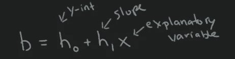
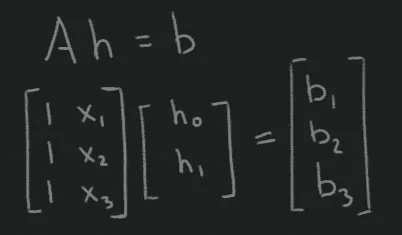
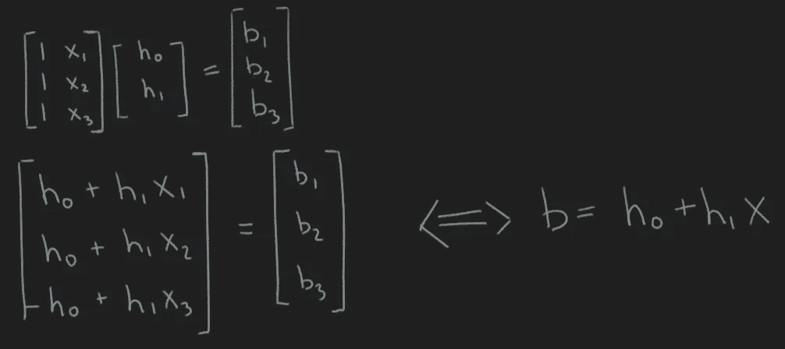
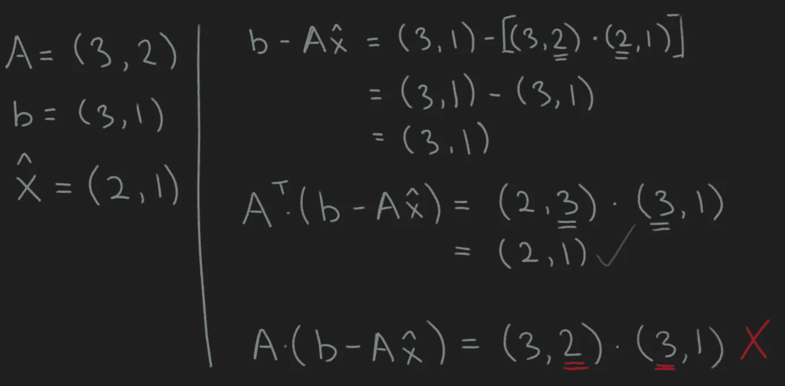
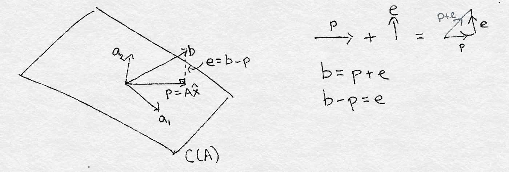
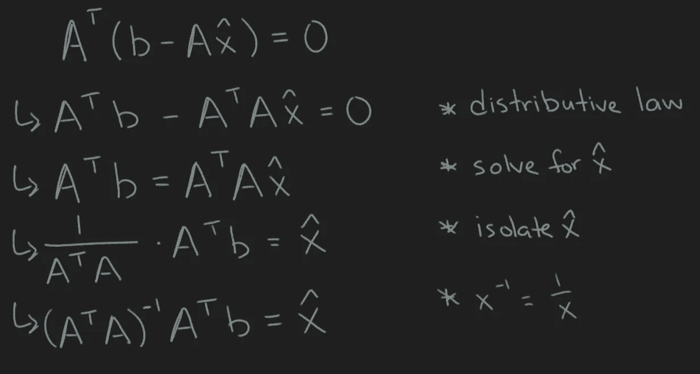

# 最小二乘回归的线性代数观点:对新手读者的补充

> 原文：<https://levelup.gitconnected.com/the-linear-algebra-view-of-least-squares-regression-supplements-for-the-novice-reader-94092b60bd25>

这篇文章基于 Andrew Chamberlain 在他的文章“最小二乘回归的线性代数观点”中提出的材料。他出色地完成了在线性代数模型中呈现线性回归的工作，在这里，我试图填补我第一次阅读他的帖子时遇到的一些缺失。单凭这篇文章决不会让你接触到张伯伦提出的核心观点，所以我鼓励你先阅读他的文章，并以此作为补充参考。我所涉及的概念是面向那些对线性代数经验相对较少，但仍有灵感并想学习更多的人的。

**用矩阵形式定义直线方程**

你可能记得高中时学过直线的[方程](https://www.mathsisfun.com/equation_of_line.html)。不管方程中的变量取了什么名字，方程总是三个东西的函数:
1)解释变量
2)直线的斜率
3)它是 y 轴截距

直线的方程式

给定一个解释变量 *x* ，让我们假设 *x* 只取三个值。即 *x₁、*x₂、和 *x₃* 。直线方程将预测每个 *x* ᵢ ∈ *x、*的 y 值，结果将存储在与 *x* 大小相同的向量 b 中。我们可以将直线方程改写为 Ah = b 形式的线性系统，其中 a 是设计矩阵，h 是分别代表截距和斜率的两个参数 h₀和 h₁的列向量。

改写为线性系统 Ah = b 的直线方程

为了证明将前面的方程改写为上面的线性系统是正确的，让我们评估点积 A ⋅ h。得到的方程系统是我们的初始直线方程，对于 *x.* 的每个不同值，该方程被分解为单独的方程

在 [Chamberlain 的帖子](https://medium.com/@andrew.chamberlain/the-linear-algebra-view-of-least-squares-regression-f67044b7f39b)中，我们已经开始定义矩阵形式 Ax = b 的线性系统。接着，Chamberlain 使用二维平面上的向量符号来表示我们的搜索空间，用一个错误的向量来表示实际观察到的数据，从而很好地可视化了最小二乘回归模型。再次，看帖子。

**我在‘求解回归系数’时问的问题**

> ‘A 的转置是从哪里来的？’

在第一个等式之后，当用 *b* - *p* 交换 *e* 时，引入了 *A* 的转置，其中 *p* 是 *A* * *x-hat* 。他为什么移调 A？如果你的直觉告诉你这和点积有关，那你就对了！我发现在处理需要许多矩阵运算的方程时，一个有用的技巧是只使用矩阵的形状而不是它们的内容来遍历方程。例如，由于我们的设计矩阵 A 有 3 行 2 列，我将用 A = (3，2)来解方程。

换位 A 的理由，以及为什么 A 本身在取点积时不起作用

我们看到，转置 a 对于计算点积 *A ⋅ e* 是必要的。

> 求解回归系数的中间步骤是什么？

首先让我们讨论来自向量加法的错误向量 *b* 、投影 *p* 和错误向量 *e.* 之间的关系，如果我们有一个向量 *A* 和另一个向量 *B* ，其来源是向量 *A* 的头， 然后向量和 *C* = *A+B* 由一个向量得到，该向量的源是 *A 的源，而*的头与 *B 的头相遇*因此给定两个向量 *A* 和 *C* ，我们可以推理出*B = C-A*我们可以将相同的逻辑应用于 *b* 和 *p*

最后，下面展示了我为解决 x-hat 所做的工作。

虽然这篇文章没有带来任何新的东西，但它揭示了最初文章中没有详细讨论的一些更基本的概念。