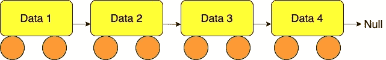
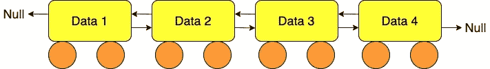

# 链表数据结构

> 原文：<https://levelup.gitconnected.com/the-linked-list-data-structure-6559a1e15f09>


我们可以把链表想象成一列数据火车

## 介绍数据结构

在我的上一篇文章中，我介绍了计算机科学中的数据结构，特别是堆栈数据结构。这一次，我将通过介绍另一种类型回到数据结构的主题:链表数据结构。

概括一下:数据结构只是一种存储信息和保留信息片段之间特定关系的方式。使用这些关系，我们可以定义一些方法来检索数据的特定部分。

## 链表数据结构

在链表数据结构中，每一段数据都与下一段数据相连，这样我们就可以访问该数据的值以及链中下一段数据的值。如果该值是链中的最后一个，那么它将链接到 null。为了形象化这种结构，我们可以想象一列火车，其中每节车厢都是一段数据，我们可以从火车的一端开始，行进到每节相邻的车厢，以到达下一段数据。我们不能跳过车厢，也不能从中间进入火车，但是，我们可以通过从一节车厢到下一节车厢来参观火车上的每一节车厢。当我们到达最后一节车厢时，我们无处可去，下一段数据什么也不是(或者用更计算机科学的定义来说是“null”)。我们称链表中的每一个回车为“节点”。每个节点有两个属性:一个值和指向下一个节点的指针。链表的大小是由节点的数量定义的。在下面的火车例子中，我们有一个大小为 4 的链表。



链表数据结构

在简单的链表数据结构中，我们也没有办法后退，但是，也有一种叫做双向链表的东西，我们可以双向移动，即每一段数据都包含对前一段数据以及下一段数据的引用。在我们的火车类比中，双向链表将允许我们从火车中的任何一点行进到下一节或上一节车厢。



双向链表数据结构

双向链表的一个可能的实际应用是使用前进和后退按钮在浏览器中浏览页面。就像我们的火车例子一样，我们只能线性地浏览页面，不允许跳跃，但是，如果你浏览整个列表，就有可能到达每一页。在本文中，我们将坚持使用单链表，但是我认为在现实世界中提到双向链表是很重要的。

现在我们已经定义了链表，让我们深入代码，看看如何用 JavaScript 创建一个链表数据结构。

## JavaScript 中的链表数据结构

在创建链表类之前，我们必须首先创建`Node`类。这是一个简单的类，其中每个实例都有一个数据值和一个指向另一个实例的指针。默认情况下，我们将这个指针设置为 null，除非我们向它传递另一个值。

```
class Node { constructor(data, next = null) { this.data = data; this.next = next; }}
```

现在创建了节点类，我们可以开始定义链表了。

```
class LinkedList { constructor() { this.head = null; this.size = 0; }}
```

这里我们将列表的头部定义为第一个节点。因此，当我们第一次构造链表时，我们没有数据，所以头被设置为空，大小被设置为 0。让我们添加一个函数来获取列表的大小，这样我们就可以跟踪添加了多少项。我们定义:

```
class LinkedList {
...
   getSize() {

   return this.size;}
```

现在，我们可以很容易地获得列表中的项目数量。然而，没有数据，我们就没有任何用处！因此，让我们从添加一个向列表中插入元素的方法开始:

```
class LinkedList {...
    insertFirst(data) { this.head = new Node(data, this.head); this.size++ }}
```

这里我们使用我们的`Node`类来创建一个新的`Node`实例，并将其设置为列表的头部。如果我们添加到一个空列表中，`this.head`将会是 null，所以实际上，我们创建了一个新的节点`new Node(data, null)`，并将列表的大小增加 1。让我们用 JavaScript 创建一个名为`Train`的列表:

```
const train = new LinkedList();train.insertFirst('first carriage');console.log(train)// output: LinkedList { head: Node { data: 'first carriage', next: null }, size: 1 }
```

让我们给火车增加一节车厢:

```
train.insertFirst('second carriage');LinkedList 
   { head: 
      Node { data: 'second carriage',next: 
      Node { data: 'first carriage', next: null } }, 

     size: 2 }
```

很好，现在我们有了一列火车和一些车厢，但是以这种方式查看数据会很难读取实际值。不如我们定义一个函数，让我们打印出我们的数据列表，并显示那些重要的链接关系。我们可以通过访问每个节点的数据值并使用带箭头的字符串插值来实现这一点:

```
class LinkedList {... printDataAsList() { let current = this.head; let str = ""; while (current) { str +=`${current.data}->` current = current.next; } str += 'null' console.log(str) }
}
```

所以看着`printDataAsList(train)`我们看到:

```
train.printDataAsList();\\ output: second carriage->first carriage->null
```

可读性强多了！

现在我们可以创建新的列表，我们可以看到列表中的所有数据，并向列表中添加数据，但是如何向列表的另一端添加数据呢？我们知道我们只能从开始访问我们的列表，所以解决方案在于从第一个节点开始遍历列表。

```
class LinkedList {...

    insertLast(data) { let node = new Node(data); let current; if (!this.head) { this.head = node } else { current = this.head; while (current.next) { current = current.next } current.next = node;

       } this.size++

      return;
    }}
```

首先，我们为我们的数据值创建一个新的节点，由于我们在构造函数中将默认值`next`设置为 null，我们只需要给这个节点传递一个参数，因为我们将把它添加到列表的末尾，所以它无论如何都会指向 null。现在我们检查列表，看它是否包含任何数据。如果列表是空的，我们只需要在列表的开头插入新的节点，然后就可以返回了。否则，我们将当前节点设置为列表的开头，然后使用 while 循环沿着列表移动，直到`current.next`为空，即我们已经到达了数据序列的末尾！然后，只需将`current.next`更改为我们的新节点，增加列表的大小，我们就可以返回了。让我们给火车增加一个引擎:

```
train.insertLast('Engine')train.printDataAsList();\\output: second carriage->first carriage->Engine->null
```

现在我们可以在两端相加并打印出数据值，在列表中的特定索引处插入数据怎么样。同样，我们需要从第一个节点开始遍历列表，让我们看看如何做到这一点:

```
class LinkedList {...

   insertAt(data, index) { if (index > 0 && index > this.size) { return;
   } if (index === 0) { this.insertFirst(data) return; } const node = new Node(data); let current, previous; current = this.head; let count = 0; while (count < index) { previous = current; count++; current = current.next;   } node.next = current; previous.next = node; this.size++;

   return; }}
```

比在列表末尾添加稍微复杂一点，但是使用类似的逻辑，我们首先必须检查索引是否在列表的大小之内，如果不是，我们简单地返回。您也可以决定通过将这个值添加到列表的末尾来定义它，但是我决定以这种方式实现它。接下来，我们必须检查索引是否确实为 0，在这种情况下，我们可以简单地使用前面定义的 `insertFirst`函数。否则，我们将 current 设置为第一个节点，并定义一个变量`count`来跟踪我们在列表中的位置。再次使用 while 循环，我们向下移动列表，存储当前节点和前一个节点，直到我们到达给定的索引。此时，我们退出循环，并将新节点的下一个指针设置为当前节点，将前一个节点的下一个指针设置为新节点，即我们在这两个节点之间插入新节点。最后，我们再一次将大小增加 1，我们可以从函数返回。让我们给火车增加一节车厢:

```
train.insertAt('1.5 carriage', 1)train.printDataAsList();\\ output: 
second carriage->1.5 carriage->first carriage->Engine->null
```

现在我们可以在列表中插入任何一个索引，如何访问这个值。让我们定义一个方法`getAt(index)`来访问列表中任意给定索引处的值。

```
class LinkedList {... getAt(index) { if (index > 0 && index >= this.size) { return "Index is greater than size of list"; } let current = this.head; let count = 0; while (count < index) { count++; current = current.next; } return current.data }}
```

这里我们首先检查索引是否在我们的列表中，事实上，这一次因为我们没有向列表中添加数据，所以我们需要检查索引是否是`>= this.size`。否则，我们将当前节点设置为第一个，然后在列表中向下移动，直到找到索引，此时我们只返回该节点的数据值。回到我们的火车例子:

```
train.printDataAsList();console.log(train.getAt(2))\\output:second carriage->1.5 carriage->first carriage->Engine->nullfirst carriage
```

现在，如何移除给定索引的节点呢？在添加数据的类似方法中，我们将方法`removeAt(index)`定义如下:

```
class LinkedList {... removeAt(index) { if (index > 0 && index >= this.size) { return; } let current, previous; if (index === 0) { current = this.head this.head = current.next } else { current = this.head; let count = 0; while (count < index) { previous = current; count++; current = current.next; } previous.next = current.next; } this.size--; return; }}
```

像以前一样，我们检查索引是否在当前列表中。然后我们检查索引是否是第一个节点，如果是，我们将头设置在第二个节点并返回。否则，我们将当前节点设置为第一个节点，将前一个节点设置为当前节点之前的节点，并在列表中向下移动，直到到达给定的索引。在那里，我们简单地将 previous 的指针设置为当前节点之后的节点，即我们跳过当前节点，有效地将它从列表中删除。最后，我们将大小减 1，并从方法返回。让我们通过移除索引 1 处奇怪的火车车厢来看看这一点:

```
train.removeAt(1)train.printDataAsList();\\output:second carriage->first carriage->Engine->null
```

让我们再定义一个函数来清空我们的列表。假设我们实际上想要清除整个列表，而不是只删除一个节点。这实际上很简单，我们需要做的就是将列表的头重置为空，并将列表的大小重置为 0，如下所示:

```
class LinkedList {... clearList() { this.head = null; this.size = 0; return; }}
```

最后，在所有这些车厢操作之后，我们的火车准备出发了，我们把它送上了它的路，并清除了我们的列表！

```
train.clearList();train.printDataAsList();\\output:null
```


再见火车！

# 我们如何使用链表数据结构？

现在我们已经看到了用 JavaScript 创建链表的方法，我们如何用它来解决问题呢？事实上，我们可以使用链表来创建一个简单的计算器，并通过将这些数字表示为链表并逐位相加来将非常大的数字相加。在本文中，我将只创建一个将两个大数相加的函数，但是以类似的方式，我们可以使用这个结构来做减法、乘法甚至除法。

从加法计算开始，我们首先需要一个函数来检查两个列表的大小是否相同，如果不相同，我们将在较短的列表中添加零作为占位符，以使加法更简单。所以首先我们定义一个函数`makeSameSize(l1, l2)`，其中`l1`和`l2`是两个链表，作为我们上面定义的类的实例创建。

```
function makeSameSize(l1, l2) { l1Size = l1.getSize(); l2Size = l2.getSize(); if (l1Size !== l2Size) { let [bigger, smaller, smallList] = l1Size > l2Size ? [l1Size, l2Size, l2] : [l2Size, l1Size, l1]; let n = bigger - smaller; for (let i = 0; i < n; i++) { smallList.insertAt(0, smaller + i); } } return [l1, l2]}
```

首先，我们检查两个列表的大小，如果其中一个更大，我们使用三元运算符设置数组`[bigger, smaller, smallList]`来包含适当的值。我们设置`n`为两个列表大小的差，然后使用我们的`insertAt(index)`方法添加占位符零，直到两个列表长度相等。

比如说我们要添加`1234 + 567`。我们在链表结构中表示这些数字如下:

```
let list1 = new LinkedList();list1.insertFirst(4);list1.insertFirst(3);list1.insertFirst(2);list1.insertFirst(1);let list2 = new LinkedList();list2.insertFirst(7);list2.insertFirst(6);list2.insertFirst(5);list1.printDataAsList();list2.printDataAsList();\\output:1->2->3->4->null5->6->7->null
```

然而，颠倒这些列表是有意义的，这样我们首先有最小的数字，因为这将使数字相加更容易(想想纸上的长加法:我们总是从单位开始！).我们可以使用我们的`getAt(index)`方法创建一个简单的函数来反转一个链表，如下所示:

```
function reverseList(ll) { let outPutList; if (ll.getSize() === 0 || ll.getSize() === 1) { return; } else { outPutList = new LinkedList(); for( let i = 0; i < ll.getSize(); i++) { let current = ll.getAt(i); outPutList.insertFirst(current) } } return outPutList;}
```

现在我们颠倒列表，使单位列在第一位。这使得以正确的顺序添加数字变得容易:

```
list1 = reverseList(list1);list2 = reverseList(list2);list1.printDataAsList();list2.printDataAsList();\\output:4->3->2->1->null7->6->5->null
```

如果我们将这些值添加到我们的函数中，使它们具有相同的大小，我们将得到预期的输出:

```
const [sslist1, sslist2] = makeSameSize(list1, list2)sslist1.printDataAsList();sslist2.printDataAsList();\\output:4->3->2->1->null7->6->5->0->null
```

正如所料，我们在数字 567 的千位列中添加了一个 0，所以现在我们的列表大小相同。

现在让我们实现其余的功能！我们需要创建几个变量来存储数字的总和，检查这个总和是否大于 10，如果恰好是这样，则存储进位数字，这里有一种在 JavaScript 中实现这个函数的可能方法:

```
function addTwoLists(l1, l2) { outPutList = new LinkedList(); [l1, l2] = makeSameSize(l1, l2) let currentL1 = l1.getAt(0); let currentL2 = l2.getAt(0); let carry = 0; let remainder, quotient; let sum = 0; let index = 0; while (index < l1Size) { index++; sum = currentL1 + currentL2 + carry; quotient = Math.floor(sum / 10); if (quotient !== 0) { remainder = sum % 10 carry = 1; outPutList.insertFirst(remainder) } else { carry = 0; outPutList.insertFirst(sum) } currentL1 = l1.getAt(index); currentL2 = l2.getAt(index); if (index === l1Size && carry !== 0) { outPutList.insertFirst(carry) } }

  return outPutList;
}
```

我们首先使用索引为零的`getAt(index)`得到每个列表的头，并将`carry`(结转数字)设置为 0。我们还为余数、常数、总和以及指数定义了一些变量。因为我们现在有两个相同大小的列表，我们只需要检查一个列表的大小，所以我们使用 while 循环直到索引到达列表的末尾。

在这个循环中，我们增加索引，并将总和定义为 2 个当前数据值的总和，并加上进位数字(在我们的第一次迭代中，这当然会是 0)。我们必须检查这个值是否大于 10(就像你在纸上做长加法时，必须检查你是否需要携带一个 10)。如果值大于 10，那么一定在 10 到 20 之间，所以我们设置`remainder`，设置`carry`为 1，否则`carry`不变为 0。我们将`remainder`或`sum`插入链表，这取决于我们是否有一个结转数字。最后，我们将`currentL1`和`currentL2`的当前值重置为列表中的下一个值，并继续下去，直到索引达到`l1`的大小。

最后，我们只需检查最后一对数字，也就是说，如果我们的最后 2 位数字有一个带有进位的和，那么我们必须将这个进位数字添加到我们的链表中(因此，与输入相比，我们将输出链表的大小增加了 1)。然后我们只需要返回输出链表，我们就成功了！让我们看看我们的例子的输出，并使用 JavaScript 的内置加法函数进行一些巧妙的添加:

```
(addTwoLists(list1, list2)).printDataAsList();console.log("Answer should be:", 1234 + 567)\\output:1->8->0->1->nullAnswer should be: 1801
```

万岁！让我们尝试一个更复杂的加法:`987654321 + 123456789`

我们像以前一样创建两个链表，并颠倒数字:

```
1->2->3->4->5->6->7->8->9->null9->8->7->6->5->4->3->2->1->null
```

用我们的函数添加这些

```
(addTwoLists(list1, list2)).printDataAsList();console.log("Answer should be:", 987654321 + 123456789)\\output:1->1->1->1->1->1->1->1->1->0->nullAnswer should be: 1111111110
```


万岁！

所以加法就这样了。我们当然可以用这个函数作为基础，创造出其他的算术运算来对大数进行乘、减甚至除。但那是以后的事了！

在本文中，我们介绍了链表数据结构，并了解了如何通过创建一个类在 JavaScript 中实现它，并使用该结构为由整数组成的长列表创建一个简单的加法函数。

参考资料:

[](https://www.tutorialspoint.com/data_structures_algorithms/linked_list_algorithms.htm) [## 数据结构和算法-链表

### 链表是通过链接连接在一起的一系列数据结构。链表是一系列…

www.tutorialspoint.com](https://www.tutorialspoint.com/data_structures_algorithms/linked_list_algorithms.htm)