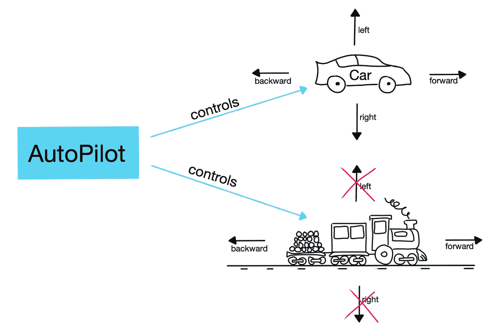

# 里斯科夫替代原理变得简单

> 原文：<https://levelup.gitconnected.com/the-liskov-substitution-principle-made-simple-5e69165e7ab5>

## 或者什么时候扩展基类，什么时候组成对象。

米海三都

最容易被忽视的固体原理的第一名是……利斯科夫替代。这里没有惊喜。

我不会用科学定义来烦你。简而言之，该原则声明所有对象类型都应该可以替换它们的子类型，而不会改变正确的行为。

理解原理的关键在于“正确的行为”。我们用一个例子来看看原理。

# 自动驾驶系统问题

作为 AutoPilotCars AI 初创公司软件工程团队的一部分，我们必须想出一个控制普通汽车(比如丰田凯美瑞)的解决方案。

经过深思熟虑，团队决定构建两个模块:

*   将汽车转换成“可驾驶”物体的模块。该模块支持四个简单的命令:前进或后退，左转或右转。
*   自动驾驶模块计算路线，并在可驾驶模块显示的四个命令的帮助下驾驶汽车。

这是一个图表:

我们必须建立两个模块:一个控制汽车，一个驾驶汽车。米海三都

和一些基本的 C#代码:

## 向卡车市场扩张

由于我们的两个模块非常成功，该公司决定扩展到一个新的市场，卡车。我们观察到卡车和汽车支持相同类型的命令，所以我们想要重用自动驾驶模块并重新实现可驾驶模块。

我们将把常见的抽象提取到一个单独的接口中，并让自动驾驶模块控制可驾驶的对象。以下是解决方案:

基于 Car 类，我们提取了“IDrivable”接口。现在，自动驾驶类依赖于 IDrivable 接口。到这里为止都很好。

事情进展得很顺利，所以我们公司想扩展到火车领域。

火车不能左转或右转。米海三都

这是我们第一次减速带。火车不能左转或右转，因为它们在轨道上。所以我们别无选择，只能忽略实现 TurnLeft()和 TurnRight()方法。这意味着抛出 NotImplementedException 或者什么都不做(因为在这种情况下，该方法返回 void)。

# **问题**

想象一下，自动驾驶模块背后有一个 AI 算法。经过无数个小时的训练，它终于掌握了四个方向。该模块不知道它是否控制一辆汽车、一辆卡车或一列火车，它只知道它将接收一个“可驱动的”对象。

对于汽车和卡车来说，它工作得完美无缺，但是对于火车呢？我们有两种可能的结果:

*   如果 TurnLeft()和 TurnRight()方法抛出异常，它将在运行时意外地停止程序。没有用
*   如果这些方法什么都不做，算法可以学习要么忽略它们(这不好，因为在汽车和卡车上，我们不希望它们被忽略)，要么继续陷入无限循环，试图转弯。又不行了

我们通过继承 IDrivable 接口打破了 Liskov 替换原则。我们的自动驾驶课程只有在我们得到一辆汽车或一辆卡车，而不是一辆火车时才起作用。

## 解决办法

我们可以忽略继承 Train 类的 IDrivable 接口。这将使逻辑分离，因此所有代码看起来都没问题。但这样做也意味着我们必须为火车建造另一个自动驾驶模块。价格昂贵。

我们可以更新自动驾驶模块，并验证接收到的对象是否是火车。并相应地更新代码。但这是掉进兔子洞之前的第一步。如果导致另一个如果，等等，直到我们到达一个点，我们不知道 wtf 发生了。

也许有更好的方法。我们将在接口分离原则文章中讨论这一点。

## 中违反 LSP 的示例。NET 框架

有时候很难不违反原则。以微软为例。可以说，他们拥有一些世界上最好的开发人员在开发 C#语言。但即使是他们也无法预见。NET 框架将会发展。

今天，在。您可以调用 Add()方法数组。它不会工作，它将抛出一个 NotSupportException。但是为什么能做到呢？因为 Array 类实现了定义该方法的 IList 接口。

此问题出现在。NET 2.0(当泛型被引入时)，由于微软不想打破向后兼容性，他们做出了这个妥协

# 当心

避免基于类提取接口。在 90%的情况下，提取的接口导致违反原则。当您寻找通用抽象时，请执行以下操作:

*   应用 ROT 规则(三法则)。我们渴望在复制粘贴一次代码后，尽快提取代码。两个案例代表的信息太少，无法提取一个好的概括。至少等三次，甚至更多，如果你没有信心的话。
*   并不是每一个**都是一个**的关系就应该导致继承。例如，一个正方形是一个长方形，但是我们不想让一个继承另一个。矩形可以设置宽度和长度，但是这样的方法对于正方形来说是不好的。有时候最好把事情分开。
*   在编写接口或建立类层次结构之前，从客户的角度来看你的类 API。

但是，有时你别无选择，只能打破 LSP。它发生在我们最好的人身上。就像微软不想打破旧的合同，并保持或保持框架停止，你可能会面临唯一的出路是打破它的情况。尽你所能让你的客户知道并继续前进。

# 外卖食品

*   通常，当我们试图移除特征时，LSP 被违反。NotImplementedException(或类似的)是最大的违规标志。
*   避免从类中提取接口。寻找共同的抽象。应用 ROT *(三原则- >在提取抽象之前至少复制粘贴三次)*
*   面对较大的界面，支持多个较小的界面；它不太可能违反原则(将在接口隔离原则中详细讨论)
*   违反原则几乎总是会导致难以发现的错误。

**扎实的原理制作简单的系列:**

*   [单一责任原则](/the-single-responsibility-principle-made-simple-4e1597a44d7d) (SRP)
*   [开闭原理](/the-open-closed-principle-made-simple-cc3d0ed70553) (OCP)
*   利斯科夫替代原理(LSP)
*   [接口隔离原理](/interface-segregation-principle-made-simple-990da495441c) (ISP)
*   [依存倒置原则](/the-dependency-inversion-principle-made-simple-70108b88dc76) (DIP)

# 进一步阅读

 [## 固体设计:利斯科夫替代原理(LSP) - NDepend

### 利斯科夫替代原理是众所周知的固体首字母缩略词中的 L。最初的原则定义是…

blog.ndepend.com](https://blog.ndepend.com/solid-design-the-liskov-substitution-principle/)  [## 坚实的设计原则解释:利斯科夫替代原则与代码示例

### 所有 5 个坚实的设计原则被广泛使用，如果你不知道他们的名字，你会很快认识到他们…

stackify.com](https://stackify.com/solid-design-liskov-substitution-principle/)  [## Java 中的 Liskov 替换原则| Baeldung

### Robert C. Martin 在他 2000 年的论文《设计原则和设计…》中介绍了可靠的设计原则

www.baeldung.com](https://www.baeldung.com/java-liskov-substitution-principle)