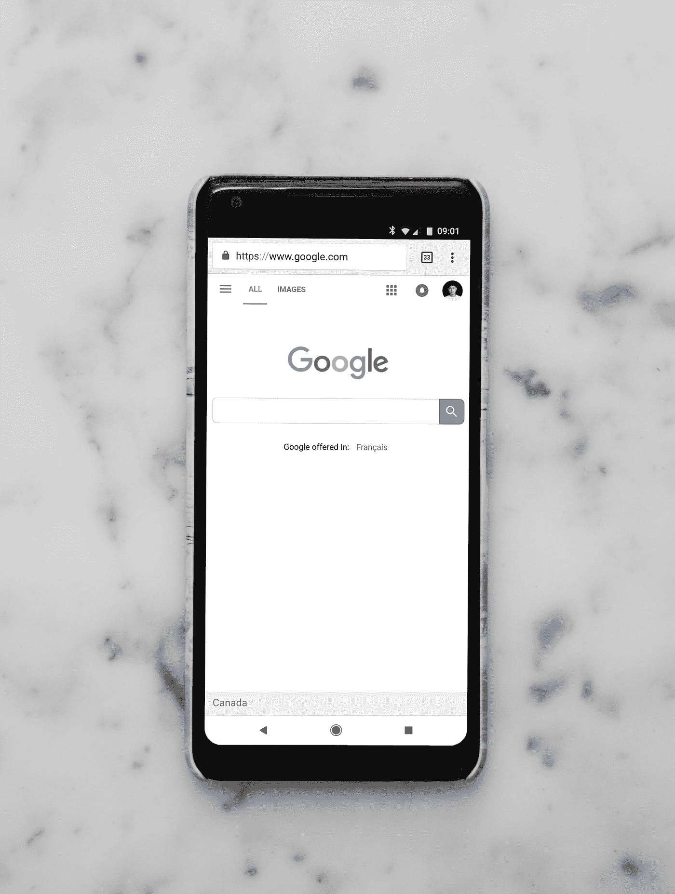

# 作为亚马逊、微软、谷歌的软件工程师，这些小事帮助了我

> 原文：<https://levelup.gitconnected.com/the-little-things-that-helped-me-as-a-software-engineer-at-amazon-microsoft-google-4f815630bba>

小变化产生大影响。

由 [Unsplash](https://unsplash.com?utm_source=medium&utm_medium=referral) 上 [charlesdeluvio](https://unsplash.com/@charlesdeluvio?utm_source=medium&utm_medium=referral) 拍摄的照片

虽然亚马逊、微软和谷歌都是非常独特的公司，但软件工程师在每家公司取得成功的做法实际上是一样的。

三者中的内部工具和专门知识是唯一的，不可转让的。但是无论你在哪里，这里有一些习惯可以帮助你成为一名成功的软件工程师。

# 打印文档

无论你在哪个公司，你都应该有打印机和荧光笔。如果您打印出 UX 设计或文档，您可以立即参考以快速查看您的项目工作。

你可以把打印稿发给任何需要看的人，而不是分享一个链接，直接指向你关心的地方。

这并不意味着从现在开始你只需要打印文件，而是增加了另一种方式，使审查复杂的项目更容易。

# 在您的工作基础上构建

无论你在哪里，总会有更多的工作。并非所有的工作都是平等的，所以你必须选择做什么和不做什么。

如果你必须在两个任务之间做出决定，你可能要考虑

*   这项工作能帮助我了解我们的领域和系统吗？
*   这项工作建立在我现有的工作之上吗？
*   这个作品是我独有的吗？

如果你发现自己对以上所有问题的答案都是否定的，你可能想把它委托给别人。

# 审查比你需要的更多的代码

照片由[阿诺·弗朗西斯卡](https://unsplash.com/@clark_fransa?utm_source=medium&utm_medium=referral)在 [Unsplash](https://unsplash.com?utm_source=medium&utm_medium=referral) 拍摄

对于任何代码评审来说，只评审变更是很诱人的。但是如果你只看代码的变化，那么你将会把你的学习局限在任务或者错误上。

*   如果一个函数中有一行发生了变化，就要检查整个函数。
*   如果实现了一个新的函数，检查正在被调用的其他函数
*   如果对模式进行了更改，请检查整个模式。

代码更改倾向于时间和空间局部性。一个领域的改变可能需要再次改变。那个地区的变化可能会导致周围地区的变化。

一开始这听起来很难，但是你的知识会不断积累，你会发现随着时间的推移，它会变得越来越容易。

# 和对工作充满热情的人在一起

有些工人试图勉强度日，有些工人试图超越自我。

超越你的水平而不是在你的位置上工作看起来很累人，但是和认真对待工作的人在一起，你会学到更多。

无论你需要审查你的代码，阅读设计文档，还是解释管道，问问真正关心它的人。因为真正关心自己工作的人真正关心他们能在多大程度上帮助你。

# 结束语

这绝不是作为一名工程师取得成功的全部方法。但这是一个小清单，我发现在我最初的几家公司工作时很有帮助。也许下次我会分享我希望在每家公司做得更好的具体问题。

你看到点击并按住拍手按钮会发生什么了吗？

帮我进入**亚马逊**和**谷歌**的 [$4 简历模板](https://alexcancode.gumroad.com/l/fullresumekit)

如果你喜欢这种体验，考虑成为[会员](https://medium.com/@alexcancode/membership)以获得更多类似的内容！

Twitter 上有 1000 人在关注！

关注我在 LinkedIn 上的 10 万名粉丝