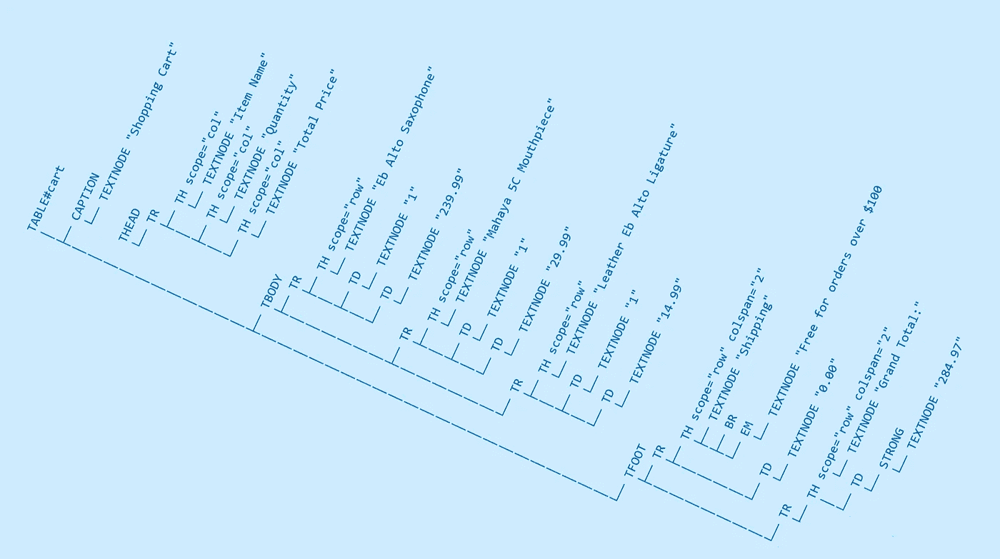

# “活的 DOM”不是“慢的”、“坏的”或“错误的”。Web 开发人员是。

> 原文：<https://levelup.gitconnected.com/the-live-dom-is-not-slow-bad-or-wrong-web-developers-are-2bf86c3b9e2e>



从各种来源——特别是前端框架的粉丝——你会听到很多关于修改动态 DOM 是“糟糕的”或神奇地“缓慢”的废话。哦，你需要批量修改，哦，你需要使用文档片段或影子 DOM，等等等等等等…

坦率地说，99%的人说这种话时都是在吹牛。

唯一可能有意义的时候——使用 innerHTML——甚至不正确。你知道吗？不要再用那种过时的、不安全的、火车失事般的清单，不要在页面上添加内容……或者至少，除了少数速度无关紧要且你知道内容是安全的情况下，不要这样做。

使用文档片段有很多合理的理由，但是如果你理解浏览器是如何工作的，并且知道一个简单的、微小的细节，像“影子 DOM”这样的东西似乎是浪费时间和代码。一个细节揭示了许多主张和想法完全是胡说八道。

浏览器**中的 DOM 改变直到脚本执行被释放后才会呈现！**

什么也没有，什么也没有，什么也没有，什么也没有！直到脚本执行停止，然后将控制权交还给浏览器，您的 DOM 更改在触发 CSS 的重新应用或呈现方面不会做任何事情。为什么这个细节如此重要？

你听过有人说你应该“批量修改你的 DOM”吗？或者“不要写 DOM，因为你还不想让渲染发生”？“最后做所有的改变会更快”怎么样？

牛肉饼！所有这些说法都是彻头彻尾的胡说八道。因为同样:

> 在脚本执行后的**释放控制权之前，浏览器不会呈现脚本化的 DOM 变化！**

# 来证明一下吧！

我能想到的最简单的方法是，在 DOM 编写完成之后，然后在渲染完成之后，简单地抛出一堆新的段落，用足够数量的 lorem-ipsum 文本填充 *(32，768 应该足够)*我们可以获得有意义的性能。小巧、简单、易于追踪。

要反复插入的数据将存储在一个数组中，因此:

```
var testData = [
 "Lorem ipsum dolor sit amet, consectetur adipiscing elit. Sed et mauris odio. Pellentesque habitant morbi tristique senectus et netus et malesuada fames ac turpis egestas. Aliquam tortor urna, dapibus sit amet dolor a, fringilla dapibus mi. Integer tempus rutrum risus vel hendrerit. Vestibulum ante ipsum primis in faucibus orci luctus et ultrices posuere cubilia curae; Nunc sit amet convallis nulla, sit amet fermentum leo. Nullam porta, magna nec vehicula efficitur, orci nibh dictum arcu, a bibendum massa leo vitae lacus. Curabitur et sem at enim dictum dictum sit amet ut ligula. Etiam eget suscipit tellus. Donec et ligula id justo tincidunt bibendum. Pellentesque vitae egestas tortor. Aliquam ut vulputate arcu, nec sollicitudin augue.",
 "Sed a vulputate tellus, id dapibus dui. Donec eget pretium orci. Etiam ullamcorper efficitur auctor. Praesent gravida mi id velit rutrum lobortis. Proin sit amet erat eu mi ultricies ornare. Vivamus malesuada volutpat fermentum. Suspendisse viverra mattis risus eget vehicula. Mauris faucibus ipsum eget dictum accumsan. Fusce dictum viverra diam a feugiat. In non fermentum sem. Curabitur at nulla non neque mollis aliquam. Aliquam libero orci, cursus sit amet aliquam ac, pharetra ut ligula. Vestibulum placerat leo vitae dui varius, ac malesuada tortor viverra. Aenean faucibus mi vitae nunc ornare, et consequat quam tempor. Vestibulum vitae scelerisque quam, vitae luctus neque.",
 "Duis felis augue, facilisis sed tempus et, consectetur in justo. Integer libero elit, interdum et pharetra et, finibus a ipsum. Nulla in ex ac lectus hendrerit finibus. Suspendisse condimentum tristique laoreet. Fusce urna neque, mattis et sollicitudin a, feugiat at sapien. Sed ultrices ex id mauris dignissim interdum. Nullam vel sem ac risus malesuada pharetra. Ut et malesuada turpis. Proin placerat at nisl in finibus. Proin tristique, nunc et facilisis varius, sapien ipsum scelerisque est, et molestie nisi massa eu risus. Nam id orci quis orci lobortis ornare. Etiam vitae consectetur nisl. Donec vehicula auctor turpis. Integer venenatis feugiat finibus."
];
```

## 但是等等！？！？你不能跟踪渲染完成的时间！

不…不思考的人会说更多的废话。这都是因为无论 JavaScript 如何欺骗您，让您认为它可以执行异步任务，浏览器仍然是——或者至少浏览器标签是——单线程的！浏览器引擎的各个子组件——解析器、脚本、呈现器——不能同时执行。*老实说，如果人们不再反对和/或认识到这一点，他们的代码会简单得多，也不会那么复杂。看到像 React 和 Vue 这样的愚蠢的垃圾火箍跳过去。*

因为事件不能在渲染阶段触发，并且渲染阶段直到脚本结束后才发生，所以当渲染在当前脚本范围后结束时，最简单的陷印方法是？

```
setTimeout(function() {
  console.log('ended: ', performance.now());
}, 1);
```

如果设置为零，它会“偶尔”在渲染之前运行。但是，如果我们将其设置为 1 毫秒，那么直到渲染将控制返回到管道之后，才会触发超时。

因此，一个使用直接 DOM 访问的简单测试是这样的:

```
(function(d) { function writeResult(txt) {
    results.appendChild(d.createTextNode(txt + "\r\n"));
  }

  var
    results = d.body.appendChild(d.createElement('pre')),
    start = performance.now();

  for (var i = 0; i < 0x8000; i++) {
    d.body.appendChild(d.createElement('p')).textContent = testData[i % 3];
  }

  var domWriteComplete = performance.now();

  setTimeout(function() {
    var renderComplete = performance.now();
    writeResult(navigator.userAgent);
    writeResult("   DOM Complete: " + (domWriteComplete - start));
    writeResult("Render Complete: " + (renderComplete - start));
   }, 1);

})(document);
```

为了测试文档片段，我们只需将 append 改为:

```
 var
    results = d.body.appendChild(d.createElement('pre')),
    start = performance.now(),
    fragment = d.createDocumentFragment();

  for (var i = 0; i < 0x8000; i++) {
    fragment.appendChild(d.createElement('p')).textContent = testData[i % 3];
  }

  d.body.appendChild(fragment);
```

影子 DOM(仅限 chrome)是一个类似的简单交换:

```
 var
    results = d.body.appendChild(d.createElement('pre')),
    testArea = d.body.appendChild(d.createElement('div')),
    start = performance.now(),
    shadow = testArea.createShadowRoot();

  for (var i = 0; i < 0x8000; i++) {
    shadow.appendChild(d.createElement('p')).textContent = testData[i % 3];
  }

  var domWriteComplete = performance.now();
```

请注意，开始是在他们之间有任何不同之前完成的。对于 shadow DOM，我创建了一个 DIV 来插入内容，因为第一次写入 shadowRoot 会删除父对象的所有内容，这是我们不希望出现的行为。

我在它们各自的选项卡中运行每一个，没有任何其他干扰，并将第三个 ctrl-F5 的结果作为有意义的值，以便消除奇怪的浏览器和内存行为。我没有在同一个选项卡中运行它们，因为脚本运行的最初几分钟通常比脚本的后面几分钟要快(某种内部缓存/优化？).基本上，我们希望排除所有可能干扰我们结果的因素。

为了确保万无一失，我会在 Firefox 和 Chrome 上测试它们，尽管 Firefox 没有真正的 shadow DOM，所以它不得不退出。

测试的完整档案可以在这里找到:
[https://cutcodedown . com/for _ others/medium _ articles/shadow DOM/shadow DOM . rar](https://cutcodedown.com/for_others/medium_articles/shadowDOM/shadowDOM.rar)

## 试验结果

经过 20 多次运行，剔除了由于浏览器之外的事件而突然出现的明显“异常值”,我在锐龙 5 3600 上得到了以下平均值。

```
 DOM Complete    Render Complete
FIREFOX
Direct DOM         43              1092
Doc Fragment       45              1107CHROME
Direct DOM         31              4876
Doc Fragment       38              5017
Shadow DOM         32              4885
```

抛开 FF 如何在脚本/对象上慢，在渲染上快，我们可以得出一个结论。特别是如果人们接受“渲染完成”少于 50 毫秒的任何内容都可能在我们的误差范围内的想法。

> **没什么区别！**

直接编写 DOM 没有关系，因为它们是对象。对象通常是由指针引用的底层对象，所以不管它们连接到什么，修改它们都是一样的。更重要的是，改变一个对象的值对它的兄弟、子或父对象没有任何影响。

甚至没有理由认为直接使用动态 DOM 会有所不同。然而人们仍然对此喋喋不休。

它还显示了在我们的“DOM 完成”时间和超时执行之间的时间间隔。这是渲染/样式应用时间。我们可以困住它！正如我们所看到的，你在加速用户使用你所做的东西的速度的想法只是另一个赤裸裸的谎言！因此“*你需要批量修改*”是一个**的谎言。**

# 这有什么关系呢？

这些主张和建议——即使完全是胡扯——也不会凭空出现。我怀疑，在大多数情况下，要么是不良做法的混合，要么是一些小的角落案例，并将其夸大。正如我的上一篇文章“不要把避免变成永远不要”所提到的，有时人们会听到一个很少发生的小细节，然后把它涂到所有事情上，不管它是否有意义。

## 第一种情况，InnerHTML —错误！

垃圾邋遢“眼罐 haz teh intarwebs”的精神侏儒是 innerHTML — *你能看出来我不是一个粉丝吗？—* 仍然是最常见的情况之一，在这种情况下确实会有所不同。Element.innerHTML 意味着解析器需要参与这个过程，所以我们再添加两个测试。

问题是 documentFragment 没有 innerHTML，所以我们只能比较直接的 innerHTML:

```
(function(d) { start = performance.now();

  for (var i = 0; i < 0x800; i++) {
    d.body.innerHTML += "<p>" + testData[i % 3] + "</p>";
  }

  var domWriteComplete = performance.now(); setTimeout(function() {
    var renderComplete = performance.now();
    console.log(navigator.userAgent);
    console.log("   DOM Complete: ", (domWriteComplete - start));
    console.log("Render Complete: ", (renderComplete - start));
  }, 1);

})(document);
```

对一个影子根:

```
(function(d) { var
    testArea = d.body.appendChild(d.createElement('div')),
    start = performance.now(),
    shadow = testArea.createShadowRoot();

  for (var i = 0; i < 0x800; i++) {
    shadow.innerHTML += '<p>' + testData[i % 3] + '</p>';
  }

  var domWriteComplete = performance.now();

  setTimeout(function() {
    var renderComplete = performance.now();
    console.log(navigator.userAgent);
    console.log("   DOM Complete: ", (domWriteComplete - start));
    console.log("Render Complete: ", (renderComplete - start));
  }, 1);

})(document);
```

注意我运行了 1/10 的循环次数。这是因为 innerHTML 太慢了，浏览器会开始抱怨脚本运行时间太长，扭曲了我们的结果。*我还切换到 console.log，因为写入 innerHTML 会搞乱对生成的“PRE”的引用。*

我们也可以在 HTML 中嵌入一个 DIV 而不是一个文档片段，但是结果几乎与直接在主体上工作一样。

```
 DOM Complete    Render Complete
CHROME
body.innerHTML    14729           15302
shadow.innerHTML  14771           15288
```

同样，20 次运行的平均值基本上在我们的误差范围内…

所以“innerHTML 在 live DOM 上很慢”也是虚构的，**原来不是这样！**。将其应用于阴影或非活动元素**并不能在渲染或脚本执行时间上提供任何真实世界的加速！**

> 是的，innerHTML 比直接在 DOM 上工作慢 30 倍左右，这是为什么你不应该在第一时间使用它的原因之一。

## 角落案例#2，“组件”——愚蠢！

这是 JavaScript 粉丝们津津乐道的众多热点和时尚垃圾中的一个，坦白地说，整个概念是又一个愚蠢的纪念碑。

在后端，他们使用像 JSX 这样的东西来吐出看起来像标记的东西，这些东西被编译成一个对象发送到客户端以添加到 DOM 中。它的这一方面似乎是那些愚蠢到无法使用对象(更不用说 JavaScript)的人的拐杖，这总是让我问“为什么不通过 JSON 之类的东西使用一个易读的对象呢？”

但是在客户端，这些“组件”是我能想到的最愚蠢的垃圾。我为什么这么说？因为如果你想更新结构中的任何值/文本，他们会重写 DOM 中的整个对象。

如何解释这一点…让我们假设您有一个购物车，它像普通的 HTML 一样会是这样的:

```
<table id="cart">
  <caption>Shopping Cart</caption>
  <thead>
    <tr>
      <th scope="col">Item Name</th>
      <th scope="col">Quantity</th>
      <th scope="col">Total</th>
    </tr>
  </thead><tbody>
    <tr>
      <th scope="row">Eb Alto Saxophone, Chinese</th>
      <td>1</td>
      <td>$239.99</td>
    </tr><tr>
      <th scope="row">Mahaya 5C Mouthpiece</th>
      <td>1</td>
      <td>29.99</td>
    </tr><tr>
      <th scope="row">Leather Eb Alto Ligature</th>
      <td>1</td>
      <td>14.99</td>
    </tr>
  </tbody><tfoot>
    <tr>
      <th scope="row" colspan="2">
        Shipping<br>
        <em>Free for orders over $100</em>
      </th>
      <td>0.00</td>
    </tr><tr>
      <th scope="row" colspan="2">
        Grand Total:
      </th>
      <td><strong>284.97</strong></th>
    </tr>
  </tfoot>
</table>
```

如果使用 react 之类的东西，你可以用它们自己的“组件”替换所有不同的 TR，这些组件包含基本相同的标记，但是用变量代替数据。然后，这些组件将被插入到表示该表及其四个子表(caption、thead、tbody、tfoot)的组件中。外部组件被转换成对象树，并被发送到客户端。

难就难在用户何时/是否想要改变客户端的值。假设用户能够将连字的数量从 1 更改为 3。您必须重新计算并更改该行的总计和总计，对吗？

他们做事的方式？重新计算变量，然后重新发布整个 DOM 树**替换整个表。**实际改变的只是数量、行成本和总计。

在片段或阴影中重建整个 DOM 结构并再次插入所有变量，或者简单地将 DOM 移动到适当的节点并插入值，哪个会更快？

仅仅为了改变两个字段中的值而浪费时间重新创建整个该死的东西并替换现有的东西是没有意义的，但这正是 React 和 Vue 这样的系统对其组件/视图 chazerei 所做的事情。

为什么呢？因为想出这种 bekaptah 精神错乱的人有某种错觉，认为直接在 DOM 上工作是“错误的”或“缓慢的”或“有问题的”或不知何故是“更难的”。

所有这些主张都站不住脚。我唯一能想到的是，这些小丑们根本没有学习足够的 HTML 或 JavaScript 来掌握如何利用 DOM 的任何线索，或者他们已经吞下了一大堆谎言。

可悲的是，这种方法中唯一站得住脚的部分是，您可以使用底层变量来执行计算，而不必手动更新页面上的元素……但这可以复制，而不会影响 DOM 或效率低下，只需创建带有 getter/setter 的函数/对象结构，当您更改某些值时，这些结构会自动为您更新 DOM！

这就是我十五年来一直使用 Object.defineProperty 解决此类问题的方法。我知道，我知道，这很恐怖……我已经可以听到“类”粉丝们排队叫嚷动态扩展对象是多么“邪恶”。让那噪音见鬼去吧。

*这可能是另一篇文章的好主题。*

## 案例 3“无序执行/异步操作”——为什么？

这个想法来自于函数式程序员和对象框架的粉丝们，一分钟前他们会说“不要直接在 DOM 上存储信息”，一分钟后他们会说“我们想将对 DOM 的更改排队，这样我们仍然可以在新的 DOM 上并行引用实时副本”……**是哪个？这就是这些迂腐的傻瓜完全让我迷惑的地方，因为他们经常在同一段话里，有时甚至是同一个句子里自相矛盾。**


也许这只是我的想法…但是如果我现在写代码来修改 DOM，那是因为我想现在就做。如果我现在不想做，为什么我现在要做？我仍然不明白为什么他们现在谈论要说的事情，但以后会发生。你想现在就做，现在就声明。你想那么做，那就宣布吧。现在宣布去做是没有意义的…很快。

这基本上是一种令人困惑的循环逻辑，导致使用 vue、react、angular 等垃圾的人在编写自己的代码之前，依赖于三倍于完成工作所需的代码，因此他们可以编写两到十倍于他们从一开始就应该编写的代码！更不用说由他们的“构建过程”引入的所有额外的无意义的复杂层和浪费时间的步骤。

# 他们也不能保护自己

从上到下，这些主张都是愚蠢的胡言乱语，然而不知何故，那些提出这些主张的人对此视而不见。像大多数邪教徒一样，当面对与他们的言论相矛盾的事实时，他们实际上无法为其辩护，所以他们用这样令人震惊的宝石来回答:

1.  你只是一个还没学会的初学者
2.  你只是一个不愿改变的老前辈
3.  行业内某某这样说
4.  每个人都这样做
5.  确实如此。
6.  不是你说了什么，而是你怎么说

请特别注意所有这些都是偏差，完全缺乏任何合理的事实。然而，他们总是那些为这些谎言辩护的人口中说出的第一句话。“框架很好”，“你应该使用这种需要两倍代码的技术”，“这更容易”，或者“更适合协作”。**谎言！！！**

前两者都是为了避开信息而解雇信使。这是那些自以为是专家，但实际上只不过是邪教徒的人的最爱。他们抓住任何借口，提出疯狂的指控——通常是相互矛盾的——只是因为“哇哇，看邓茨·温纳·赫尔的脚！”

第三个是毫无意义的轶事，第四个是纯粹的跟风谬论，最后一个是爱哭的“哇哇，iz nots！”。

第五点和第六点是故意否认，除了逻辑上的反驳之外，不去尝试任何事情。这就是当他们跑到论坛的版主那里，或者试图组织一群暴徒，大声喊出他们不想听到的，无法抵御的真相，通常他们不能忍受的事情发生了… **暴露他们真正的欺诈！**

我们一次又一次地从职业教育工作者、粉丝、框架创建者和其他人那里看到所有这些，他们会相信第一个好的胡说八道的故事，甚至没有咨询过事实。**乔禁止你建议人们学习更多关于底层语言和过程的知识**。不，这都是同样的“现在，现在，现在”和“我，我，我，他妈的事实，他妈的其他人”的态度，这是现代社会的一部分。

在过去的十五年里，我不得不面对我咨询过的几乎每一个客户的态度。即使公司/组织/机构深陷困境，总有*至少*一个人抛出这些态度。这些人如此确信“框架不会出错”，并且他们已经得到了“经过良好测试的组件”，以及所有其他他们被灌输和教导要无意识重复的废话。


你呢，莱什·拉鲁？你能让你的马刺不叮当作响吗？

即使他们收到大量用户报告问题的电子邮件。即使他们的流量是它应该是一个零头。即使当人们抱怨他们甚至不能使用联系表单，因为他们也过度依赖于没有优雅的降级计划的脚本。即使他们的网站只不过是熊熊燃烧的钱坑。甚至当他们因为易访问性失败而打官司的时候… *也就是所有像我这样的顾问被雇佣来帮助解决的事情！*

总有一些开发人员或高层管理人员会说“不不不不不”，就像拒绝布偶的“叶童”，因为他们被告知他们被告知的和他们选择的是他们陷入困境的原因。完全是因为他们被卖给了这种五岁和十岁的巫毒。

[简单地说就是认知失调。](https://en.wikipedia.org/wiki/Cognitive_dissonance)

# 结论

直接在 DOM 上工作并不“邪恶”，也不“错误”，而且肯定不会慢。事实上，如果你们愿意花时间去理解 DOM，并实际尝试使用它，你们可能会意识到所谓的“专家”用他们愚蠢无知的“框架”和与之相关的 dimestore 巫术给你们带来了多大的麻烦。

相反的说法似乎是存在的，并且是由那些使用我一直反对的垃圾框架的人所提出的，他们不得不从客户的网站上大规模删除。事实上，实践和思维定势根本不存在，除了让一切变得更难处理，需要更长的时间去发展，以及维持一个皇家的痛苦；尽管疯狂毫无根据地宣称“协作更容易”或“更好”,无知无知的粉丝们还是唱着圣歌，鹦鹉学舌，赞美上天。

"但是数百万的网站使用这种东西！"你哭了…数百万人认为地球是平的，橙色的奇多是一个真正稳定的天才，把玉蛋塞进 yazoo 对女性健康有好处，有机食品使用更少的杀虫剂，神奇地“更安全”或“更健康”，天空中有一个神奇的种族灭绝疯子用永恒的折磨威胁我们…因为他“爱我们”。

并不意味着他们中的任何一个是对的。这是跟风谬论，也是诱使乡巴佬相信谎言的众多方法之一。

> 谎言不会带来任何好处。

总而言之，DOM 比 innerHTML 更快，再多的 DOM 诡计也不能让 innerHTML 更快，而且总的来说，所有这些不同的 DOM 技术的速度和代码难度都差不多。因此，编造关于“影子 DOM”或编写片段如何“优越”的童话，只是为了支持破碎、臃肿、无意义的处理实时文档的方法而编造的更多谎言。