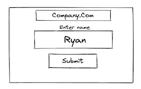

# 为开发人员解释的 Log4J 漏洞

> 原文：<https://levelup.gitconnected.com/the-log4j-vulnerability-explained-for-developers-3456bc1d62a7>


弗洛里安·奥利佛在 [Unsplash](https://unsplash.com?utm_source=medium&utm_medium=referral) 上拍摄的照片

Log4J 漏洞最近成为世界各地的头条新闻，各公司都在竞相修补这一漏洞。实际上，任何使用 Java 的规模相当大的公司都容易受到这种攻击。CVE-2021–44228 或通常称为 Log4Shell(或 Log4J)，是一个远程代码执行漏洞，它利用了 Log4J 中一个称为 JNDI 的功能。Log4J 是 Java 中用于记录信息、帮助处理用户错误的一个非常常见的框架。

JNDI 是一个 API，本质上允许 Log4J 从第三方应用程序中检索数据。这是一项老技术，可能早就应该“退休”了，但是 Java 倾向于不“退休”包/库，因为他们希望他们的代码跨版本工作，这在我看来是 Log4J 变得如此糟糕的原因。

但是为什么这是一个问题呢？恶意黑客可以使用恶意日志输入轻松访问您的服务器。他们就是这样做的，恶意黑客通过用户输入或 URL 使用 JNDI 传递命令，Log4J 会对其进行插值和反序列化，然后尝试通过 LDAP 协议连接到机器并远程执行代码。现在你的服务器被入侵了，他们得到了一个外壳。
用更多开发商的话来说:

```
print(“Hello, World! This is bad”)
```

以下是 Log4J 漏洞的高级工作方式:

当我们在用户输入字段中输入一些东西时(比如我们的名字)，它会被记录下来，这段代码看起来像这样。



```
my_log.info("His name is {}", info.GetName())
```

它会返回:

```
[date][INFO] default - His name is Ryan
```

这是因为字符串插值。但是，如果我们传递一个使用 API 从 3d party source (JNDI) LDAP 服务器检索对象的命令会怎么样呢？我们自己做了第三方。这本质上就是 Log4J 漏洞。

```
my_log.info("His name is {}", "${jndi:ldap://....}",info.GetName())
```

然后我们必须创建一个 LDAP 服务器，它将发送回一个远程代码执行负载。服务器运行有效负载，给我们一个反向外壳。

**我们如何解决这个问题:**

幸运的是，阿帕奇已经通过停用 JNDI 修补了这个漏洞。因此，将 Log4J 更新到任何版本 **2.16 或更高版本**都会使您的 Java 应用程序变得安全。这里可以下载[。但是这个问题还远远没有结束，在不久的将来，我们将在许多应用程序中看到这个漏洞，大多数人甚至不知道他们是易受攻击的，因为他们间接使用它。](https://logging.apache.org/log4j/2.x/)