# MongoDB 副本集的“多数”写问题

> 原文：<https://levelup.gitconnected.com/the-majority-writeconcern-of-mongodb-replica-sets-be426f388782>

在这节课中，我们将讨论 readConcern。目前，我们只处理副本集的非事务读取中使用的读取问题。我们不处理事务和共享集群。

首先，我们需要回顾两个老概念:多版本并发控制和“持久”数据。

WiredTiger 使用多版本并发控制来处理并发操作。

在读或写操作开始时，wiredTiger 向该操作提供数据的时间点快照。

时间点快照是给定时间点存储中数据的内存视图。这里，给定的时间点是读或写操作的开始。

例如，这是我们目前拥有的数据集。然后我们同时接收一个读和写操作。将数据集直接暴露给这两个操作是一个非常糟糕的想法，因为这两个操作会相互冲突。不能从变化的数据集中读取。

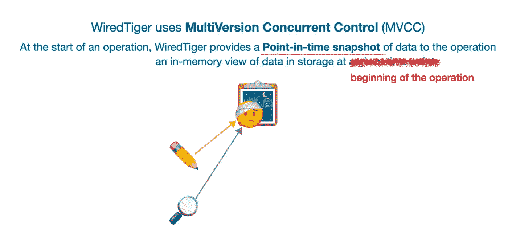

在 MVCC 下，当写入和读取操作开始时，它们都将收到数据集的快照。这两个快照是独立的，不会互相干扰。

写操作只对自己的快照进行更改。读取操作仅从其自己的快照中读取数据。这两个操作可以同时进行，不会互相影响。

在检查点，写操作的快照将被刷新到磁盘，并修改原始数据集。以下读操作将返回写操作的结果。

Durable 用于描述写操作的结果。如果写操作的结果可以在关机、崩溃和重新启动后保持不变，则认为写操作是持久的。

对于单个 mongod 进程，一旦写入到服务器的日志文件中，写操作就是持久的。

但是如果我们使用一个副本集，这是不够的。写操作只有在大多数投票节点上变得持久之后，才能被认为是持久的。这需要将写操作写入大多数投票节点的日志。

例如，我们这里有一个三节点副本集。每个节点都在投票并承载数据。

a 和 B 已被写入两个节点。因此它们不会回滚，这意味着它们是耐用的。

c 只在主节点上是持久的。这对副本集来说是不持久的。如果主节点在复制到其他节点之前出现故障，则 C 将回滚。

所以持久数据总是可以检索的，除非我们删除它。

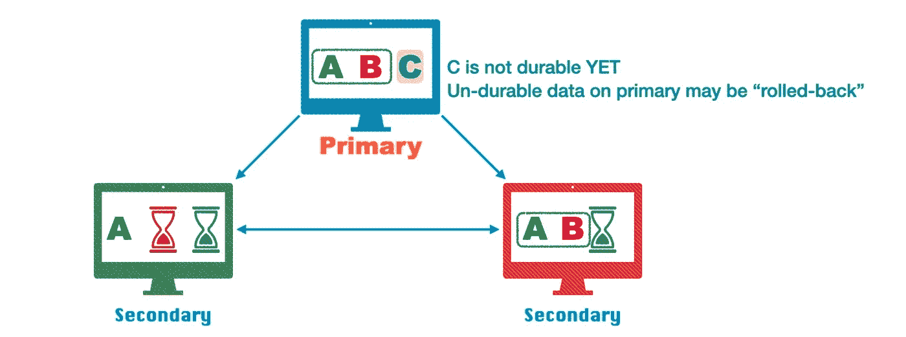

读取问题指定读取操作的隔离级别。简而言之，读关注将持久数据与非持久数据隔离开来。

每个非事务读取操作都可以有自己的 readConcern。我们用 readConcern 方法作为 read 方法的附录。然后，我们将级别名传递给 readConcern 方法。有五个级别名称:本地、可用、多数、可线性化和快照。

我们现在只处理非事务读取，所以我们将跳过快照，因为它只在事务中可用。我们将在下面的交易课程中学习。

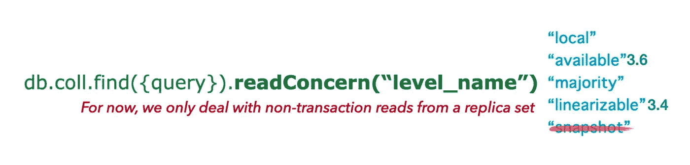

本地和可用是默认的读取问题。对于非共享集合，这两个是相同的。

它们都返回当前节点的所有内容。他们不关心返回的数据是否已经复制到其他节点。因此返回的数据可能会回滚。

Local 是对主节点进行读取的默认值。

对于与因果一致性会话无关的再次读取辅助节点，这也是默认设置。

Available 是对不与因果一致会话相关联的辅助节点进行读取的默认值。

Available 不支持因果一致的会话或事务。

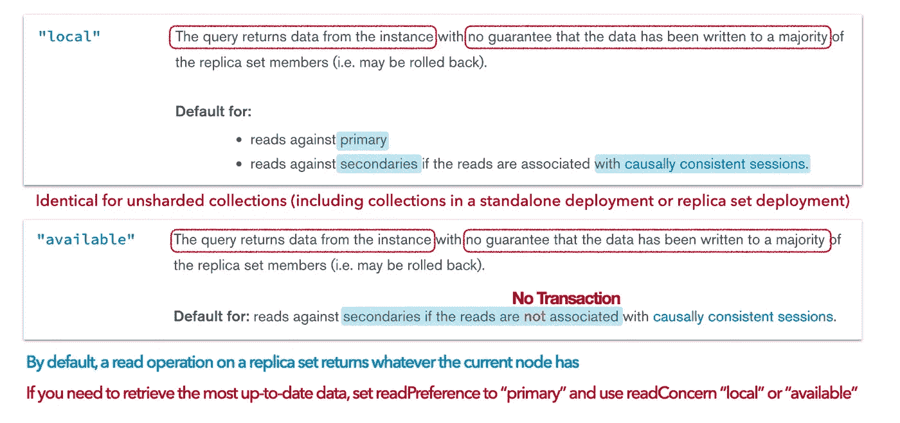

总之，在默认的读取关注下，对副本的读取操作检索当前节点拥有的任何内容。

如果需要检索最新数据，请将 readPreference 设置为 primary，并将 readConcern 设置为 local 或 available。主服务器将始终拥有最新的数据。使用本地或可用的 readConcern，我们可以获得主节点拥有的一切。

假设我们有一个三成员的副本集。每个节点都承载数据和投票。

客户端想要读取副本集。它没有指定任何读取问题，因此读取操作将使用本地可用的默认读取问题。

read 操作将它所读取的节点视为一个独立的 mongod 进程。它不关心其他集合成员。它检索节点中任何可用的内容。因此，检索到的数据可能不持久，以后可能会回滚。

如果从绿色节点读取，时间点快照只有一个。因此它将只获得一个。

如果它从也是主节点的蓝色节点读取，快照包含 A、B 和 C。因此它将获得 A、B 和 C。C 只存在于主节点上，因此它可能会在以后回滚。

如果客户端从 read 节点读取，它将获得 A 和 b。

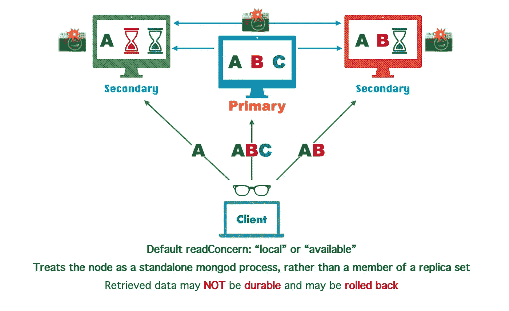

接下来，我们来谈谈多数阅读关注。这实际上比你想象的要复杂得多。

多数 readConcern 返回的文档即使在失败的情况下也是持久的。这意味着大多数 readConcern 需要 wiredTiger 存储引擎。

只有主节点可以确认具有多数写入问题的写入。记住这一点，我们以后会需要它。

假设所有这些点代表存储在当前节点中的文档。

它们可以分为两部分。第一部分仅包括持久数据，第二部分仅包括非持久数据。

持久数据是多数提交写操作的结果。

如果我们使用 majority readConcern 进行读取，我们将只能从 durable 部分获得数据。

那么，节点如何知道它执行的哪个写操作变得持久了呢？

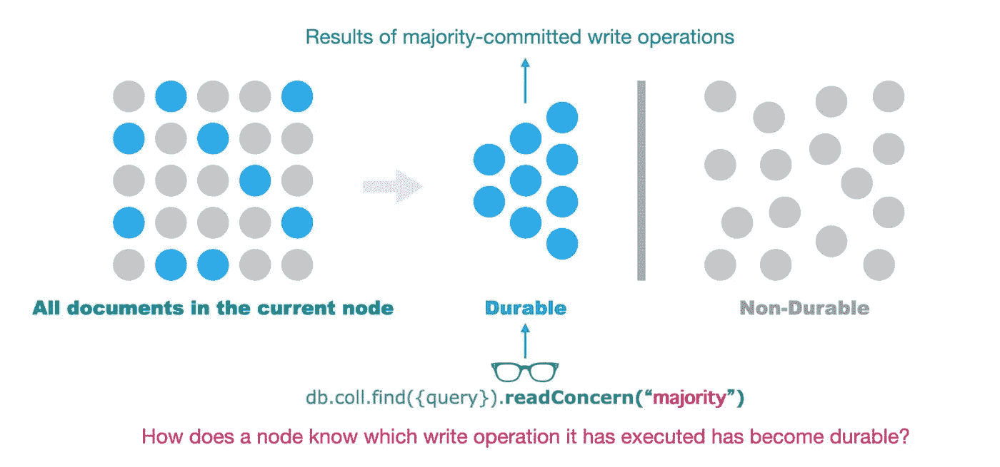

每个集合成员都有一个内存视图或快照，用于记录自己多数提交的写操作的结果。该视图由主节点更新。这就是集合成员如何知道它复制的哪个写操作已成为多数提交的。

在以下课程中，我们将此快照称为多数快照或持久快照，而不是本地和可用 readConcern 使用的时间点快照。

多数快照是在副本集开始时创建的，并一直保持至今。它不反映当前节点上的最新数据集。它只保留多数提交的写入结果。

当我们使用多数 readConcern 进行读取时，我们实际上是从多数快照中检索数据。

对于大多数快照，延迟是不可避免的。写操作成为多数提交需要时间，因此多数快照无法立即反映数据更改。因此，我们可能得不到最新的数据，但仍可能检索到最近删除的数据。保存和维护多数快照也会不断消耗内存空间。

但是大多数 readConcern 在性能成本上与其他 Concern 不相上下。这是因为多数 readConcern 只使用已经存在的多数快照，不需要任何新的时间点快照。总的来说，它的成本类似于其他需要时间点快照的读取问题。

可以手动禁用多数快照。但是强烈建议您保持启用状态。

当我们在 mongod 配置文件中设置复制部分时，该部分中的最后一个属性是 enableMajorityReadConcern。其默认值为 true。此属性启用多数快照。

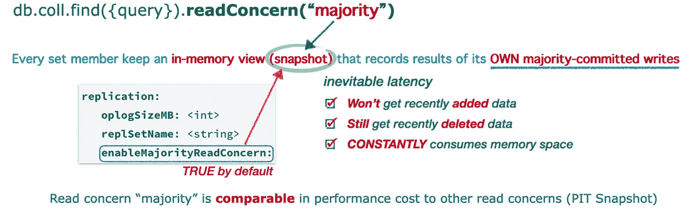

假设我们有一个三成员的副本集。所有成员都有数据和投票权。

主节点已完成三次写入:A、B 和 c。

此时，红色节点已经复制了 A 和 b。C 仍处于待定状态。

绿色节点较慢。它只复制了 a。B 和 C 正在等待。

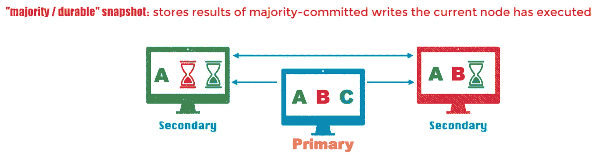

主节点已经声明 A 和 B 是多数提交的。c，此时只存在于主节点中。因此，如果主节点在将它复制到辅助节点之前出现故障，它可能会回滚。

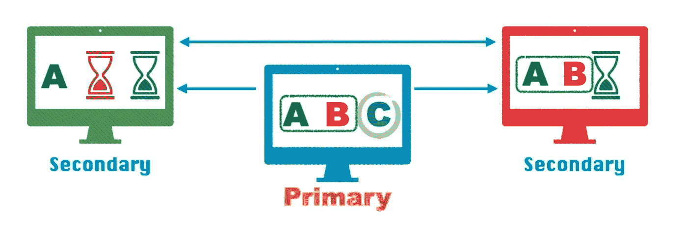

我们在多数读关注下开始读操作。如果我们从主节点读取，我们将得到 A 和 b，C 还没有包含在多数快照中。

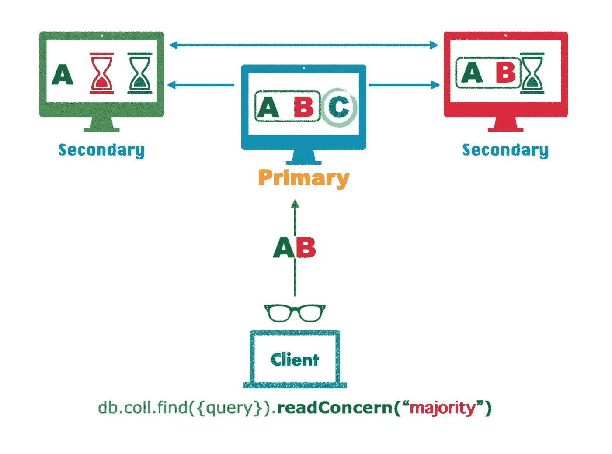

如果我们从读取节点读取，我们将得到 A 和 B，这是红色节点的所有内容。红色节点的所有东西都是耐用的。在这种情况下，无论我们使用哪个 readConcern，都会得到相同的结果。

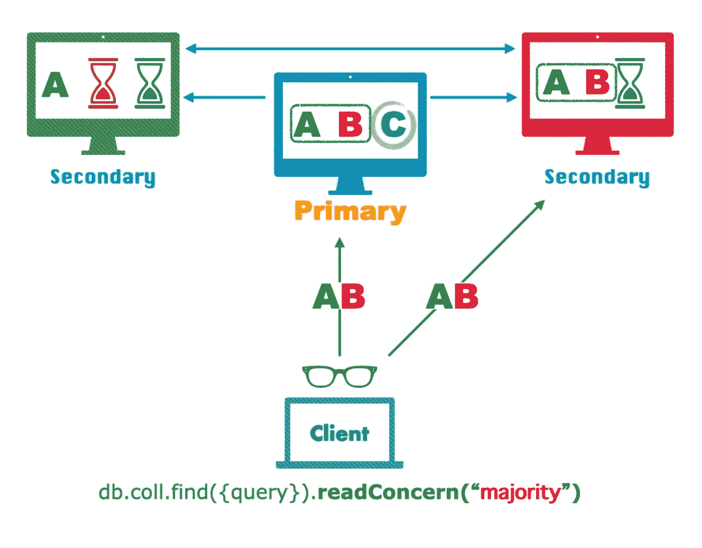

如果我们从绿色节点读取，我们将只获得 A。这是因为 A 是绿色节点已经完成的唯一写入操作，并且 A 是多数提交的。

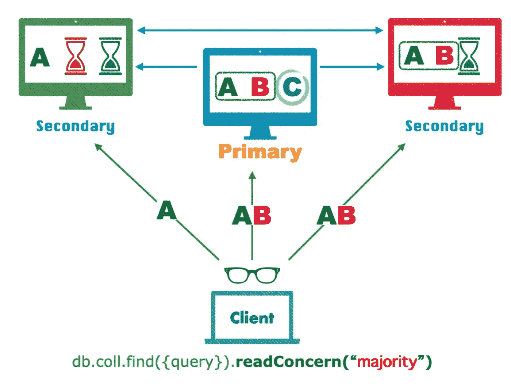

**你永远得不到当前节点没有得到的。但是您可以获得当前节点不再拥有的内容。**

例如，如果我们从主节点删除一个并立即从中读取，如果复制延迟足够长，我们仍然可以检索到一个。

已从主节点中移除，这意味着主节点已完成删除操作。但是删除操作还没有成为多数提交。因此 A 仍然记录在主节点的多数快照中。因此，它仍然是可检索的。

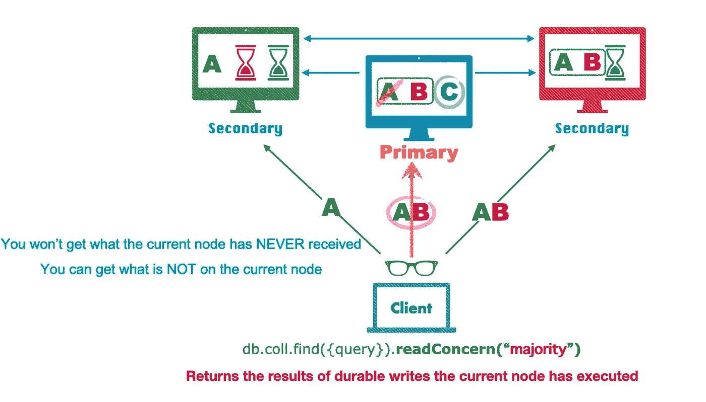

记住这个结论:**多数 readConcern 返回当前节点已经执行的持久写入的结果**。

现在，让我们看看多数快照是如何维护的。一旦你知道它是如何维护的，你就可以准确地预测多数读取的结果。

我们仍将使用三个成员的副本集作为示例。每个成员都有投票权和数据。

首先，我们为三个节点绘制三条时间线。

蓝色节点是主节点，绿色和红色节点是次节点。

对副本集的最后一次写操作是写零。它在所有三个节点中存储数据零。

写零已被所有集合成员复制，并已被主节点确认为多数提交。因此，所有集合成员都认为数据零是持久的。不管我们从哪个节点读取数据，也不管我们使用哪种 readConcern 级别，我们总是会得到零数据。

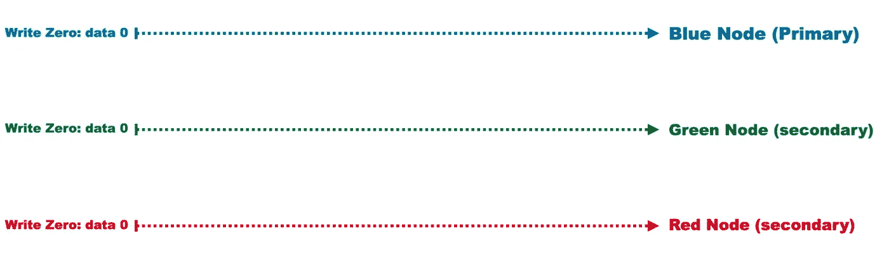

让我们开始一个新的 write: writeOne。它将数据 0 变为数据 1。

WriteOne 将首先应用于主节点。假设主节点在 T0 完成了 writeOne。

如果客户端使用 writeConcern W One 启动 writeOne，我们可以在 T0 时向客户端确认写入。

如果我们使用本地或可用的 readConcern 从主节点读取，我们将获得 dataOne。

但是如果我们使用多数 readConcern，我们仍然会得到 dataZero。DataOne 还不耐用。

在 T0 之后，writeOne 将被复制到绿色和红色节点。假设这两个节点分别在 T1 和 T2 完成 writeOne。红色节点稍微在绿色节点的后面。

在 T1，如果我们从绿色节点读取并使用本地或可用的 readConcern，我们将获得 dataOne。但是如果我们使用多数 readConcern，我们仍然会得到 dataZero。

出于同样的原因，在 T2，如果我们从红色节点读取，只有本地和可用的 readConcern 可以返回 dataOne。多数 readConcern 仍然返回数据零，即使此时 dataOne 已经保存到所有集合成员中

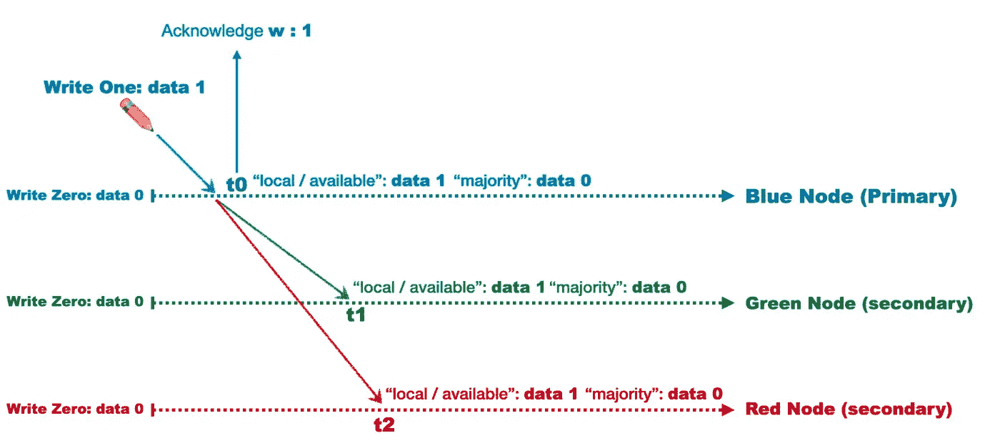

在 T1，writeOne 已经复制到三分之二的投票成员。这意味着对于当前的副本集，数据一已经是持久的。

但是主节点还不知道这一点，并且只有主节点确认具有多数写关注的写。所以在 T1 之后，writeOne 仍然不会被认为是多数提交的。

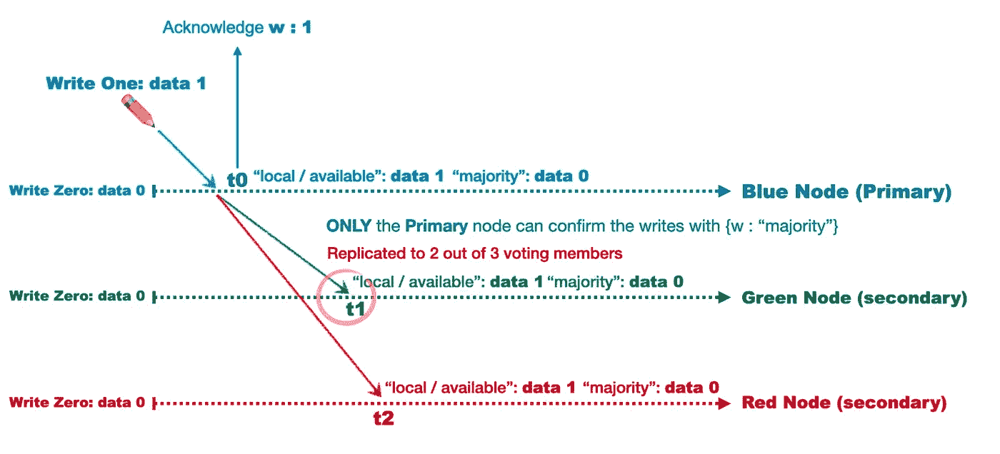

复制 writeOne 后，绿色节点将向主节点发送确认，告诉它已成功执行 writeOne。

假设主节点在 T3 接收到确认。

显然 T3 是 writeOne 最关键的时刻。

主节点现在知道两个投票成员已经完成了 writeOne。因此，它可以确认 writeOne 是多数提交的。这使得 T3 成为提交点。主节点将更新其多数快照以包括数据一。

因此，从 T3 开始，如果我们从主节点读取并使用多数 readConcern，我们将获得 dataOne。

WriteOne 在 T3 被正式声明为多数提交，但是如果我们使用多数 readConcern 从两个辅助节点读取，我们仍然会得到 dataZero。这是因为他们的快照还没有更新。

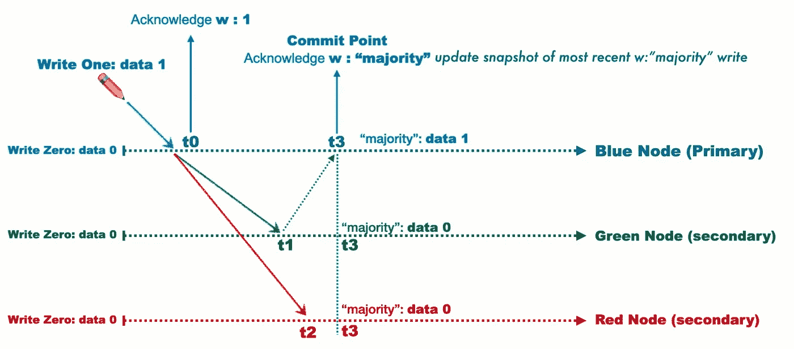

在收到来自绿色节点的确认后，主节点将发回通知，告知绿色节点 writeOne 已成为多数提交。

收到通知后，绿色节点将更新其多数快照以包括 dataOne。

因此，在 T5 之后，如果我们从多数读取关注下的绿色节点读取，我们将获得 dataOne。

WriteOne 在 T3 已经成为多数提交。但是红节点不会马上收到通知。这是因为主节点还没有收到来自红色节点的确认。因此它不知道红色节点是否已经完成 writeOne，因此不会发送通知。

这意味着即使在 T5 之后，如果我们在多数读取关注下从红色节点读取，我们仍然会得到数据零。

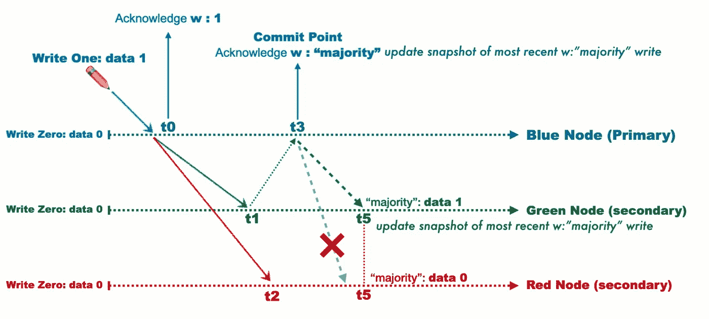

red 将在主节点完成 writeOne 后对其进行确认。

假设 T4 的主节点收到了这个确认。如果 writeOne 在其 writeConcern 中使用 W3，则 T4 是主节点确认客户端并声明 writeOne 成功的时刻。

此时，writeOne 已经被声明为多数提交。因此，在收到来自红色节点的确认后，主节点将向红色节点发回通知，要求它更新其多数快照。

假设红色节点在 T6 收到通知。从 T6 开始，如果我们在多数读取关注下从红色节点读取，我们将能够获得 dataOne。

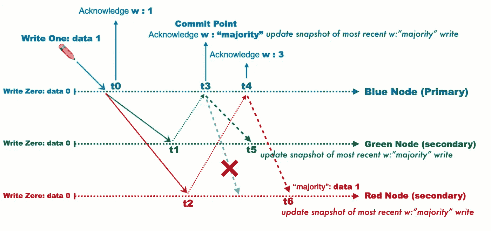

如果您需要检索最新的数据，请从主节点读取并使用本地或可用的 readConcern。

查看我们的完整视频课程:

[https://www.udemy.com/course/mongodb-4-complete-course/?referral code = a5c 4133 cc 04 b 751 BD 76 c](https://www.udemy.com/course/mongodb-4-complete-course/?referralCode=A5C4133CC04B751BD76C)