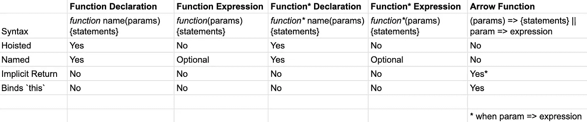

# 编写 JavaScript 函数的多种方法

> 原文：<https://levelup.gitconnected.com/the-many-ways-to-write-javascript-functions-f5e42be0a30c>

函数可能是编程中的主要对象，但是您可能会在 JavaScript 中看到它们以许多不同的方式编写，甚至是在同一个代码库中——这是因为函数根据其定义方式而具有不同的属性。

这是您在 JavaScript 编程之旅中可能遇到的不同类型函数的现场指南，来自 MDN Web Docs 的[文档。](https://developer.mozilla.org/en-US/docs/Web/JavaScript/Reference/Functions#Defining_functions)

# 概观

编写函数的语法决定了这些属性:函数是否被提升，是否被命名，是否有隐式返回，或者是否在词汇上绑定了关键字`this`的值。

我制作了这个图表来总结我们的工作:



注意:函数和生成器函数都可以使用各自的对象构造函数来创建，但不推荐这样做。

# 函数声明

我发现这是用普通 JavaScript 编写函数最常见的方式。这里有一个例子:

```
cow() //=> "moo"function cow() {return "moo"}
```

请注意，该函数可以在声明之前调用，因为它的定义是在编译期间、代码执行之前放入内存中的。

对于函数声明，以及除箭头函数之外的所有其他类型的函数，`this`关键字的值根据其执行上下文而变化。在 ES2015 中，`.bind(someObj)`方法允许你在对象传入. bind 时永久设置`this`的值。

```
function f() {
  return this.a;
}

var g = f.bind({a: 'azerty'});
console.log(g()) //=> azerty

var h = g.bind({a: 'yoo'}); // bind only works once!
console.log(h()) //=> azerty

var o = {a: 37};
console.log(o.a, o.f(), o.g(), o.h()) //=> 37,37, azerty, azerty
```

(修改自:[https://developer . Mozilla . org/en-US/docs/Web/JavaScript/Reference/Operators/this](https://developer.mozilla.org/en-US/docs/Web/JavaScript/Reference/Operators/this))

# 函数表达式

函数表达式与函数声明不同，不必命名，也不需要提升。

未命名的，或*匿名的*函数，通常被用作回调函数，因为它们会被立即调用。然而，MDN Web Docs 指出，命名函数仍然是有用的，这样可以更容易地在调用栈中跟踪它们。

```
const dog = function() { return "bark" }dog() //=> "bark"(function() {return "meow"})() //=> "meow"
```

即使已命名，也不能重用立即调用的函数。

```
(function sheep() { return "baa" })() //=> "baa"sheep() //=> ReferenceError: sheep is not defined
```

# 函数*声明

使用`function*`关键字定义了一种特殊类型的函数，称为生成函数。

与调用时一直执行的常规函数不同，生成器是可以退出的函数，以后可以在不同的点重新进入。这允许它们改变它们返回的值，即使是用相同的参数调用。

```
function* yieldAndReturn() {
  yield "Yield"
  return "Return"
  yield "unreachable"
}const gen = yieldAndReturn()console.log(gen.next()) //=> { value: "Yield", done: false }console.log(gen.next()) //=> { value: "Return", done: true }console.log(gen.next()) //=> { value: undefined, done: true }
```

(修改自[https://developer . Mozilla . org/en-US/docs/Web/JavaScript/Reference/Statements/function *](https://developer.mozilla.org/en-US/docs/Web/JavaScript/Reference/Statements/function*))

调用时，生成器函数返回一个带有三个实例方法的生成器对象:`.next`、`.return`和`.throw`。调用`.next()`会返回一个带有键`value`和`done`的对象，键【】指向 yield，键`done`指向一个布尔值，指示生成器函数是否已经到达其主体的末尾。

发电机功能和`[async functions](https://developer.mozilla.org/en-US/docs/Web/JavaScript/Reference/Statements/async_function)`一起用于异步编程。

# 函数*表达式

生成器函数也可以写成表达式。函数*定义被提升，而函数*表达式不被提升。

```
const foo = function* () {
  yield 10
  yield 20
}console.log(foo().next()) //=> { value: 10, done: false }
console.log(foo().next()) //=> { value: 10, done: false }
```

(修改自[https://developer . Mozilla . org/en-US/docs/Web/JavaScript/Reference/Statements/function *](https://developer.mozilla.org/en-US/docs/Web/JavaScript/Reference/Statements/function*))

注意(对于 function*声明和表达式)您必须将函数返回的生成器对象保存在一个变量中，以便使用`.next()`遍历函数。

```
const foo = function* () {
  yield 10
  yield 20
}const gen = foo()console.log(gen.next()) //=> { value: 10, done: false }console.log(gen.next()) //=> { value: 20, done: false }console.log(gen.next()) //=> { value: undefined, done: true }
```

每次调用该函数时，都会返回一个新的生成器对象。

```
const foo = function* () {
  yield 10
  yield 20}const gen = foo()
const bar = foo()
console.log(gen === bar) //=> false
```

# 箭头功能

最后，箭头函数是编写函数的一种独特的、非命名的方式。它们没有被升起。

```
const arrowFn = () => "hi"
arrowFn() // => "hi"(() => "hi")() //immediately invoked arrow function
```

当*定义*时，箭头函数隐式地将`this`的值绑定到其词法上下文。

从语法上来说，箭头函数有一些变化。如果有一个参数，则左括号是可选的，但是如果有零个、两个或更多参数，则左括号必须出现。如果只有一个表达式，函数体的括号也是可选的，但是如果返回一个对象，就需要用括号括起来。

```
param => expression 
(param) => { return expression }// these two are equivalent
```