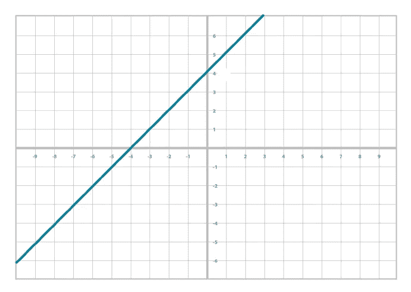
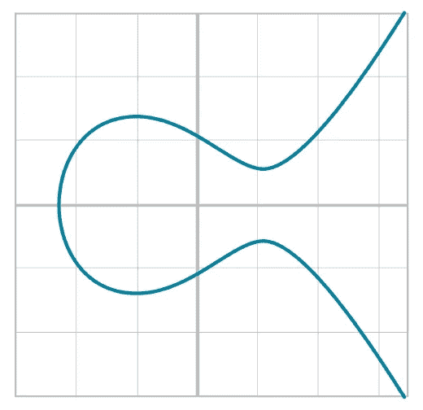
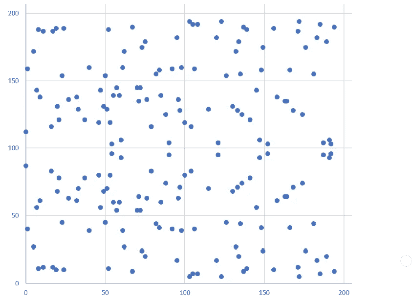
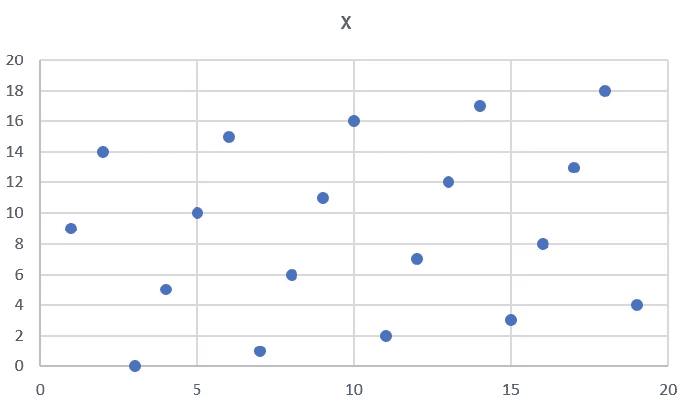
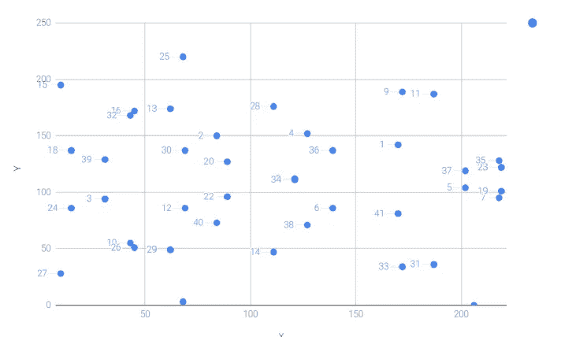

# 比特币背后的数学

> 原文：<https://levelup.gitconnected.com/the-mathematics-behind-bitcoin-522f72ed87b7>

我写这篇文章是为了分享比特币用于加密的重要数学概念。

先说第一个吧！

## 椭圆曲线

我们都熟悉线性方程:

> *y = mx + b*

线性方程

类似地，椭圆曲线被定义为:

> *y^2 = x^3 + ax + b*

连续椭圆曲线

比特币使用的椭圆曲线叫做 ***secp256k1。***

它的方程式是:

> *y^2 = x^3 + 7 (* 其中 a = 0，b = 7)

太好了！现在你知道椭圆曲线了。

请记住，这些椭圆曲线是在实数之上的，我们知道可能有无限个实数。

先说第二个数学概念。

## 有限域

有限域是数字的有限集合，其中可以执行两种运算，即加法(+)和乘法(⋅).

有限域也满足下列条件:

1.如果 a 和 b 在集合中，a + b 和 a ⋅ b 在集合中。我们把这个属性叫做*。*

*2.0 存在并具有属性 a + 0 = a .我们称此为 ***加性恒等式*** 。*

*3.1 存在并具有性质 a ⋅ 1 = a .我们称此为 ***乘法恒等式*** 。*

*4.如果 a 在集合中，–a 在集合中，定义为使 a+(–a)= 0 的值。这就是我们所说的 ***加逆*** 。*

*5.如果 a 在集合中且不为 0，则 a–1 在集合中，定义为使⋅a–1 = 1 的值。这就是我们所说的 ***乘逆*** 。*

**

*[Tamanna Rumee](https://unsplash.com/@tamanna_rumee?utm_source=medium&utm_medium=referral) 在 [Unsplash](https://unsplash.com?utm_source=medium&utm_medium=referral) 上拍摄的照片*

*在数学概念中，有限域可以表示为:*

> *Fp = {0，1，2，…p–1 }其中 p 称为有限域的阶。*

*例如，17 的有限域看起来像:*

> *F17= {0，1，2，3，4，5，6，7，8，9，10，11，12，13，14，15，16}*

*请记住，字段的顺序必须是质数的幂。*

## *回到椭圆曲线*

*回到椭圆曲线，当我们在有限域上画椭圆曲线时，得到的图形看起来有点奇怪。*

*让我们来看看这个等式:*

> *103 阶有限域上的 y^2= x^3+7(f103)*

*由此产生的情节看起来是这样的！*

**

*103 阶有限域上的椭圆曲线图*

*令人惊讶的是，在有限域上绘制的线(y = mx + c)看起来像这样。很奇怪，不是吗？*

**

*有限域上的直线*

*让我们去有点花哨！*

## *椭圆曲线的标量乘法*

*让我们在有限域的椭圆曲线上取一点。*

*我们可以把它乘以标量数，得到一个不同的图。*

**

*对于点(170，142)，y^2 = x^3 + 7 除以 F223 的标量乘法结果*

*为了简化，我们将点(170，142)乘以不同的标量数。*

*需要特别注意的是，当我们把标量乘到某个倍数时，乘法的结果是无穷远处的一个点。*

*如果我们想象一个点 G，并进行标量乘，直到我们得到无穷远处的点，我们最终得到一个集合:*

> *{ G，2G，3G，4G，… nG }其中 nG = 0*

*g 称为生成点。*

*这个集合叫做**有限循环群**。*

> *执行这种标量乘法在一个方向上很容易，但在相反的方向上很难。这是比特币背后的加密技术的基础。*

**

*照片由[思想目录](https://unsplash.com/es/@thoughtcatalog?utm_source=medium&utm_medium=referral)在 [Unsplash](https://unsplash.com?utm_source=medium&utm_medium=referral) 上拍摄*

## *比特币的椭圆曲线*

*重申一下，比特币使用的椭圆曲线叫做 ***secp256k1。****

*它的方程式是:*

> **y^2 = x^3 + 7 (* 其中 a = 0，b = 7)*

*使用的其他参数有:*

*   *有限域(p)的阶是 2^256–2^32–977*
*   *生成器点的 x 坐标(G)= 0x 79 be 667 ef 9 dcb BAC 55 a 06295 ce 870 b 07029 bfc db 2 DC e28 d 959 f 2815 b 16 f 81798*
*   *生成器点的 y 坐标(G)= 0x 483 ada 7726 a3 c 4655 da 4 fbfc 0 e 1108 A8 FD 17 b 448 a 68554199 c 47d 08 FFB 10 D4 b 8*
*   *n = 0x fffffffffffffffffffffffffffffffebaaedce 6 af 48 a 03 bbfd 25 e8cd 0364141*

*(注意，以 0x 开头的数字是十六进制格式)*

## *离散对数问题*

*当我们用一个随机选择的数字 **e** 乘以 **G** 时，我们到达曲线上的一个点 **P** 。*

> *P = eG*

*如前所述，这是一个 ***单向方程*** 。*

*当我们知道 **e** 和 **G** 时，很容易找到 **P** ，但当我们知道 **P** 和 **G** 时，就不容易计算出 **e** 。*

*这被称为**离散对数问题**。*

*有趣的是， **e 是私钥**而 **P 是公钥**，用户可以用它来进行比特币交易。*

*这构成了比特币中使用的椭圆曲线加密的基础。*

**

*Mauro Sbicego 在 [Unsplash](https://unsplash.com?utm_source=medium&utm_medium=referral) 上拍摄的照片*

# *进一步阅读*

* [## GitHub-Jimmy song/programming bit coin:图书仓库

### 编程比特币###作者 JIMMY SONG # # # # # O 'Reilly Media，Inc . 2019 年 3 月该书将由…

github.com](https://github.com/jimmysong/programmingbitcoin)* 

**感谢你阅读这篇文章！**

**如果你是 Python 或编程的新手，可以看看我的新书，书名是'* [**【没有公牛**t 学习 Python 指南**](https://bamaniaashish.gumroad.com/l/python-book)**'***:**

* [## 学习 Python 的无牛指南

### 你是一个正在考虑学习编程却不知道从哪里开始的人吗？我有适合你的解决方案…

bamaniaashish.gumroad.com](https://bamaniaashish.gumroad.com/l/python-book)  [## 通过我的推荐链接加入 Medium——Ashish Bama nia 博士

### 阅读 Ashish Bamania 博士(以及 Medium 上成千上万的其他作家)的每一个故事。您的会员费直接…

bamania-ashish.medium.com](https://bamania-ashish.medium.com/membership)*