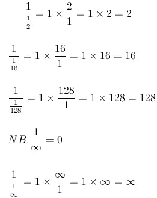

# DivideByZeroException 异常背后的数学

> 原文：<https://levelup.gitconnected.com/the-mathematics-behind-the-dividebyzeroexception-632820596b4d>

照片由[弗雷迪婚姻](https://unsplash.com/@fredmarriage)在 [Unsplash](https://unsplash.com/)

作为程序员，我们都听说过`DivideByZeroException`。抛出的是异常。当您试图将一个整数或小数除以 0 时。
但是不能被零除的数学推理到底是什么？
为了理解这一点，让我们先来看看当你除以“接近”零的数字时会发生什么:

可以看到，分母越接近 0，数字就变得越大。当分母为 0 时，答案理论上等于无穷大，这不是一个精确值。这就是抛出异常的原因。

# 浮点呢？

然而，有趣的是，这个异常只在整数和小数时抛出。将一个[浮点值](https://medium.com/@DavidKlempfner/single-precision-in-net-c3d7901f743e)除以零会得到正无穷大、负无穷大或非数字(NaN)。