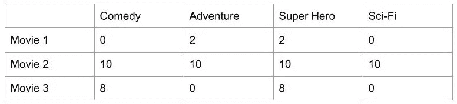

# 推荐系统的数学

> 原文：<https://levelup.gitconnected.com/the-mathematics-of-recommendation-systems-e8922a50bdea>

你有没有想过你的流媒体服务和购物网站，网飞和亚马逊 prime 以及其他电子商务网站是如何神奇地知道你想要什么的？他们怎么知道你对什么样的事情感兴趣呢？让我们找出答案。

照片由[晨酿](https://unsplash.com/@morningbrew?utm_source=medium&utm_medium=referral)在 [Unsplash](https://unsplash.com?utm_source=medium&utm_medium=referral) 拍摄

***你上一次网购是什么时候？***

你有没有注意到网站或应用程序向你显示“你可能感兴趣的项目”，或者类似“客户也带来了这个”之类的东西？你猜对了，推荐系统就是干这个的。这是一种算法，根据你的搜索和购买历史以及其他类似用户的历史，建议购买或观看的商品。你知道数据是新的石油。现在，一个明显的问题来了。

## 为什么这些电子商务网站都使用推荐系统？

以下是一些原因—

1.  以向用户提供更广泛的展示。
2.  持续使用或购买产品的可能性。
3.  以提供更好的用户体验。

*先简单了解一下推荐系统。*

## 推荐系统层次结构

推荐系统层次结构

## **现在让我们用一个电影推荐示例**来理解它背后的数学基础

1.  **基于内容的推荐系统**

他们试图找出用户的喜好，比如喜好、品味和偏好。

基于内容的推荐系统

考虑下面的例子，其中用户给 3 部电影电影 1、电影 2、电影 3 的评级分别是 2、10、8。让我们来看看电影 4，电影 5，电影 6 中的哪部电影会推荐给用户。

基于内容

第一步是根据电影中出现的类型制作一个独一无二的编码矩阵。矩阵中的所有类型都被指定为一列。如果电影中存在特定的类型，则将其指定为 **1** ，否则为 **0** 。

一个热编码

现在，将用户评分矩阵与独热编码矩阵相乘，形成**加权流派矩阵。**

加权体裁矩阵

这个加权的流派矩阵被聚集以形成用户简档，该用户简档随后被归一化以帮助形成推荐矩阵。

用户概要

用户简档的标准化是通过将一行中的每个元素除以该行中元素的总和来完成的。

> 在这里，18+12+20+10 = 60
> 
> 所以每个元素的归一化值将变成 x/60。

标准化用户配置文件

最后，归一化的用户简档乘以未被该用户评级的剩余可用电影的独热编码矩阵，然后被聚集以给出推荐矩阵。

标准化用户档案*电影矩阵

推荐矩阵

形成的建议矩阵将用于提出建议。**权重最高的电影会推荐给用户。**

我们已经了解了如何使用基于内容的系统进行推荐，但是它也有一个**缺点**。

> 用户从未看过的类型将不会出现在他们的个人资料中。

这个缺点可以通过使用基于协同过滤的推荐系统来克服。

## 2.协同过滤

就当用户在说告诉我我的邻居都喜欢什么吧。找到相似的用户组，并根据该组中相似的品味提供推荐。

有两种不同的协同过滤方法——
a)基于用户的协同过滤——基于用户的邻居
b)基于项目的协同过滤——基于项目的相似性

基于用户和基于项目的协同过滤

实线代表用户的偏好，而虚线代表推荐。

这两种方法基于相同的数学原理。在这里，我们将着眼于基于用户的方法。基于项目的方法能被它直观地表现出来。

## 基于用户的协同过滤

基于用户的协同过滤

第一步是发现活跃用户与其他用户有多相似。

我们如何做到这一点？

这可以通过几种不同的统计和矢量技术来完成，例如距离或相似性测量，包括欧几里德距离、皮尔逊相关、余弦相似性等。

为了计算两个用户之间的相似度，我们使用这两个用户在过去评价过的三部电影。不管我们使用什么来进行相似性度量，例如，活动用户和其他用户之间的相似性可以是 0.7、0.9 和 0.4。这些数字表示数据集中活动用户与其他用户的相似性权重或接近度。

用户评级矩阵

上表中的空白栏表示用户没有对电影进行评级。

这里，用户 4 是活跃用户，我们必须从电影 1 和电影 5 中为其推荐一部电影。

接下来，我们将使用用户评级矩阵和每个用户的相似性权重来形成加权评级矩阵。从用户评级矩阵中选择要推荐的电影列，并且每个电影列乘以各自的用户相似性指数。

加权评级矩阵

现在，加权评级矩阵被聚合以形成推荐矩阵。归一化推荐矩阵是通过将每个电影加权和除以相似性指数的和而得到的。

推荐矩阵

具有最高权重的电影(这里是电影 5)将被推荐给活动用户，即用户 4。

这就是协同推荐系统的工作原理。但是它也有一些缺点

> a) **数据稀疏**——用户一般只对有限的几个项目进行评分。
> b) **冷分类** —向新用户或新物品推荐的难度。
> c) **可扩展性** —由于相似性计算的增长，用户或项目数量的增加可能会导致性能问题。

这可以通过使用混合推荐系统来克服，混合推荐系统是基于内容和协作过滤方法的混合。

*我们来连线上*[*LinkedIn*](https://www.linkedin.com/in/ankita-prasad-5a0156137/)*。你也可以通过 ankita2108prasad@gmail.com 联系我。*