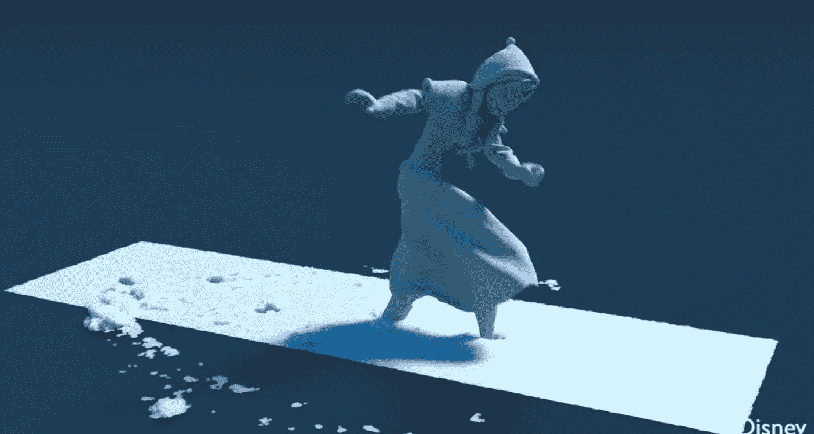
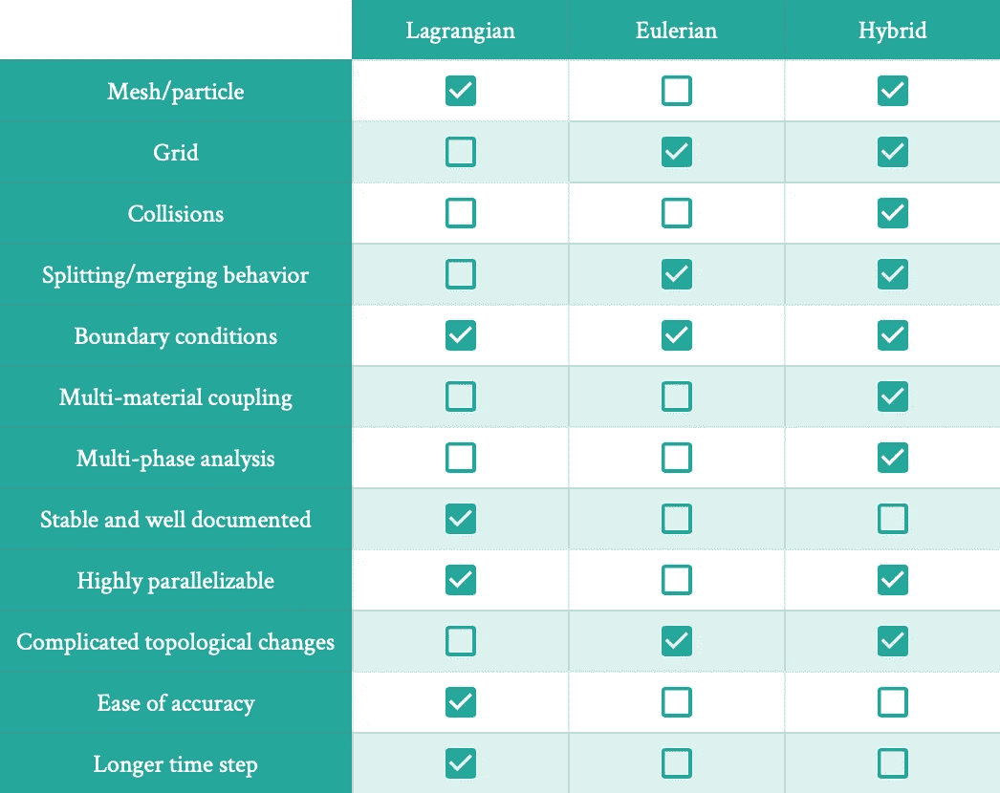
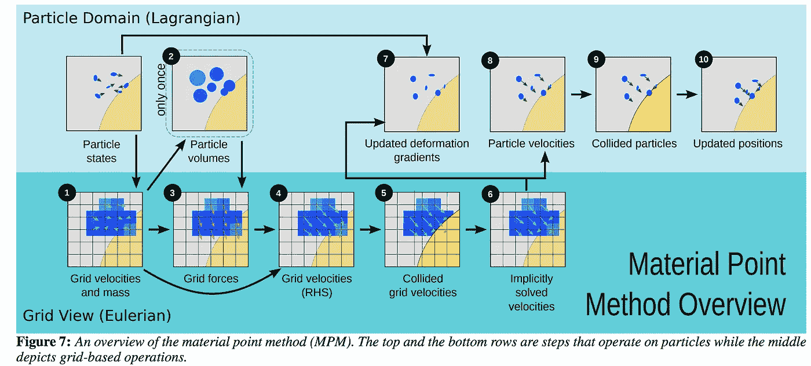

# 迪士尼雪地动画背后的机制

> 原文：<https://levelup.gitconnected.com/the-mechanics-behind-disneys-snow-animations-29ec8d117e35>

《冰雪奇缘》最令人印象深刻的部分之一是对雪的逼真刻画。

观看视频，了解不同的雪地模拟:)

如果你仔细想想，那实际上是很难精确生产的东西。我们都有过下雪的经历，所以当我们看到分辨率低或表现稍有偏差的图形时，它就会跳出来。虽然你知道如果你把一个雪球扔向墙壁或者捡起一堆雪球让它从你的手指间滑落会发生什么，但准确地描述它真的很难。

雪是一种介于固体和液体之间的物质。你可以把它打包成雪球，但它也可以分解成小块和雪花，它们可以像液体一样独立移动。

这就是为什么物质点法(MPM)如此有用。MPM 是一种数值算法，用于模拟材料如何移动和变形。

在我深入研究 MPM 是如何工作的之前，让我们看看其他的分析选项是什么。

# 不是粒子的粒子；不是网格的网格？

基本上有三类分析方法。

## 1.拉格朗日算符

这是基于网格的方法或基于粒子的方法。本质上，你在物体上放一个网格(像一个隐喻的网)，然后**跟踪网格中每个粒子的属性和运动**。所以你可以说在给定的时间 *t* ，你可以说对于给定的粒子 *j* ，它有一定的位置，质量，体积，速度等。

有限元法是最常用的算法之一，尤其是因为它已经存在了大约 75 年了(他们过去只是手工完成所有的计算！！).正如我之前提到的，你追踪单个粒子。

*这里需要注意的一点是，粒子实际上并不意味着原子/分子，它只是一点物质。所有这些方法都假设材料是连续的，即物质是连续的，并分布在整个体积中(连续介质力学)。

## 2.欧拉的

这是一种基于网格的方法。在这里，你在物体上叠加一个固定的网格，当物体移动时，**你跟踪特定单元格中发生的事情**。例如，你可以说在时间 *t* ，水以一定的速度流过这个细胞。这个真的很擅长追踪扩散。

## 3.混合物

顾名思义，这是两者的结合。它将对象在某些点视为粒子的集合，在其他点视为网格。 **MPM 是一种混合方法**。

有一些值得注意的混合方法。

*   **单元中的粒子(PIC)和流体隐式粒子(FLIP)** 是最古老的方法，包含混合网格和粒子的一般思想。FLIP 和 PIC 很像，只是稍微优化了一点的版本。
*   细胞中的仿射粒子(APIC)是对 PIC 的改进，PIC 将动量矩阵存储为材料的属性。
*   MPM 是本文的重点，所以我将在后面详细介绍。 **MLS-MPM(移动最小二乘物质点法)**是 MPM 的更好版本，利用了 APIC 的一些信息传递的思想来提高 MPM 效率。

为了帮助理解这三种方法的优缺点，请参见下表。

对比图表

# MPM 算法

所有涉及到这一点的数学看起来真的是一团糟(我喜欢数学)，所以我将在这里保留所有的理论。如果你好奇，我会在底部链接一个资源。

**总的来说:** 我们已经知道，MPM 把一个物质既是点的集合，又是一个固定的网格。事实上，**网格只是一个临时的“白板”**用于计算，并在每个时间步被清除。

粒子储存了它各自的位置、质量、体积、速度等。然后，当你计算它应该如何在下一个*∏t*上移动时，你把粒子的信息传送到网格。网格获取所有的粒子，并计算新的速度，然后将其传递回粒子。粒子移动到新的位置，重复这个过程。

## 循序渐进:

[https://www . seas . upenn . edu/~ CFF Jiang/research/MPM course/MPM course . pdf](https://www.seas.upenn.edu/~cffjiang/research/mpmcourse/mpmcourse.pdf)

1.  **粒子到网格转移(P2G)** —将粒子数量转移到网格。这是使用权重函数来完成的；每个粒子向网格中的特定体素贡献质量和动量，与它离细胞的距离成比例。
2.  **计算网格速度**——在网格中的每个节点上，*速度=动量/质量*。如果该点的为 0，则网格速度为 0。
3.  **确定自由度** —唯一可以自由移动的网格节点是那些有质量的节点。所有其他的都是已知的量。
4.  **计算网格力** —计算由于附近粒子的弹性应力而作用在每个网格节点上的力。
5.  **更新网格速度**——考虑边界条件和碰撞，确定每个网格节点的速度。
6.  **粒子变形梯度** —在这个过程的开始，网格总是被重置。在这一步中，我们决定了网格以及网格上的粒子应该如何变形。这种变形对于网格来说是虚构的，它只是用来计算新的粒子速度。
7.  **网格到粒子转移(G2P)** —计算新的粒子速度，并将它们从网格映射到适用的粒子。
8.  **粒子平流** —在下一个时间步根据新的速度移动粒子。
9.  **重置网格** —网格只是一个计算和存储计算的地方。每次求解都会重置。
10.  **重复**——这种情况一遍又一遍地发生，以计算长期运动。

## 关于 MPM 大联盟的一个简短说明

如果你还记得以前的话，MLS-MPM，或者移动最小二乘物质点法，是 MPM 的一个版本，可以加速计算。

在 MPM，每次我们将粒子速度转移到网格，网格必须执行网格插值(根据权函数将粒子映射到网格)和对这些函数的梯度计算，以确定粒子如何移动。有了 MLS-MPM，我们不需要做梯度计算。

MLS-MPM 使用了 APIC 的一些方法，它在每个粒子上存储了一个小的仿射矩阵，以及一些关于粒子如何移动的额外上下文。

# 摘要

*   拉格朗日=基于粒子；欧拉=基于网格
*   混合方法具有两者的优点。它们可以处理大的拓扑变化，并且可以处理多材料和多相模拟。
*   MPM 有储存在粒子中的信息。信息被传送到网格中，在网格中进行梯度计算以计算新的速度。新的速度被传输回来，粒子被平流。
*   这是计算机图形学和模拟中的一个强有力的工具。
*   虽然在这篇文章中，我只谈到了速度，材料也可以被赋予其他属性，如粘度，杨氏模量等。

感谢您的阅读，希望这对您有所帮助！MPM 是一个非常酷的工具，可以实现惊人的图形模拟。如果你有兴趣谈论更多关于计算材料科学或该领域的工作，并愿意提供建议，请随时联系我们:)

## 其他资源:

*   [https://www . seas . upenn . edu/~ CFF Jiang/research/MPM course/MPM course . pdf](https://www.seas.upenn.edu/~cffjiang/research/mpmcourse/mpmcourse.pdf)