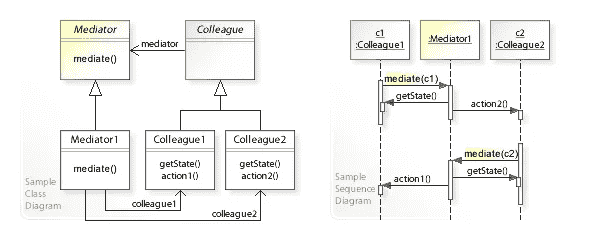

# 围棋中的中介模式

> 原文：<https://levelup.gitconnected.com/the-mediator-pattern-in-go-344ee5c8c2f4>

为繁忙的机场进行交通管制！


当您有一组不能或不应该直接相互通信的实体时，中介模式可以提供帮助。它允许您有一个信息流的中心点，以便您的其他对象或方法可以专注于它们自己的业务逻辑。当主动使用时，中介模式可以防止紧密耦合，分离职责，并为您的代码提供一个灵活的扩展基础。

本文将分为三个主要部分——我们将探索中介模式的真实用例，它的 UML 和序列图，并以它在 Go 中的实现结束。

我们开始吧！

# 真实世界的例子

仲裁者模式适用于无数不同的情况。随着程序的扩展，在许多不同的包和对象之间进行通信会变得很困难，尤其是直接进行通信时。为了鼓励松散耦合，中介充当中间人来处理信息流。

一些例子包括:

*   **聊天室** —聊天室的不同用户之间的交流通过聊天室对象本身来进行。这样可以确保信息不会发送给错误的人，避免使用不恰当的语言等等。
*   **交通控制** —无论是火车、汽车还是我们示例中的飞机，控制交通流动都是中介模式的一个重要应用。
*   **电信** —手机、无线电发射塔等现代通信的几乎所有形式。由另一种资源调节。不要再直接打电话给亚历山大·格雷厄姆·贝尔！

# UML 和序列图

中介模式有清晰直观的图表。UML 图将`Mediator`和`Colleague`作为其实现的基本接口。回想一下，Go 中没有类，所以我们没有从这两个接口继承特征，而是简单地实现它们的方法。

此外，`Mediator`接口要求方法`mediate()`在具体对象中实现。你猜对了，这个方法将在同事们执行一些由`action()`方法描述的动作时处理他们之间的某种形式的通信。注意`Colleague`是如何引用`Mediator`接口的，而具体的`Mediator1`引用了两个具体的同事。这代表了`Mediator`对象将如何作为同事交流的中间件。



来自[维基百科](https://en.wikipedia.org/wiki/Mediator_pattern)

对于序列图，第一步是一些`Colleague c1`尝试通信。这导致`Mediator1`通过`mediate(c1)`处理请求，其中它通过`getState()`获得必要的信息，并通过其`action()`方法将请求从`c1`传递到`c2`。

最后，一旦来自`c2`的`action()`被执行，我们`mediate()`返回信息，并通过链将信息发送回`c1`。在任一方向上，调解人确保沟通是标准化的，并保持同事之间相互独立。

# Go 中的实现

为了保持示例的直观性，我们将播放一个机场的交通控制。上面说的同事会是飞机，调解人会是空管塔台。

这是中介模式的一个很好的用例，因为飞机试图通过彼此直接对话来协调它们的着陆时间是疯狂的。这将需要每个飞行员与几十个其他人通话，这将成为一个非常危险的情况。

取而代之的是，飞行员会向控制塔发出着陆信号，控制塔会向飞行员发回何时何地着陆的信号。

有道理？让我们构建我们的项目结构:

```
$ mkdir mediator-pattern-go
$ cd mediator-pattern-go
$ touch airplane.go airbusA380.go boeing737.go mediator.go
$ touch airTower.go main.go
```

## 飞机，去吧

对于我们的第一个包，我们将定义一个具有三个方法`requestArrival()`、`departure()`和`permitArrival()`的`airplane`接口。这代表前面提到的`Colleague`接口。

## 空中巴士 380 .走

接下来，我们需要实现飞机接口。我们将通过下面的`airbusA380`和`boeing737`来实现。注意，Go 没有类，所以为了实现接口，我们必须创建一个结构来实现`airplane.go`中描述的每个方法。

这里，我们创建了扩展中介对象的 struct `airbusA380`(我们一会儿会讲到)。

我们还在`airplane`接口中实现了这三个方法。请注意，这个类中没有任何真正的逻辑，我们只是简单地询问`mediator`我们是否可以着陆(第 12 行)，或者通知`departure()`机场的跑道是空闲的(第 21 行)。除此之外，这架飞机不知道其他飞机在做什么，这是中介模式的主要目标。

## 波音 737 .走

这与之前的飞机几乎相同。你可以扩展这些平面的细节，但为了举例，我们将保持简单。

## 调解人，去吧

这个接口将作为中介的基本结构。飞机会询问他们是否`canLand()`，一旦一架飞机离开跑道，他们会呼叫`notifyFree()`，以便发出信号，告知下一架飞机可以降落了。

## airTower.go

这里我们将实现我们的`mediator`接口。`airTower`将有一个布尔值`isRunwayFree`以及一个请求到达的飞机队列。

我们还有 Go 形式的构造函数，其中我们简单地用一个函数返回一个新的`airTower`实例，默认值`isRunwayFree`设置为`true`。

我们还实现了`canLand`方法，方法是传递`airTower`结构，然后将`airplane`作为函数参数。该方法将根据跑道是否空闲返回 true 或 false。如果跑道不空闲，我们将追加到机场塔台的飞机队列中，并返回 false。

在飞机起飞后会直接调用`notifyFree()`方法，从而产生一条空闲的跑道。所以如果跑道不空闲，我们就把它设为空闲。然后，我们在第 27 行检查我们的队列中是否还有飞机。如果有，那么我们得到队列中的第一架飞机，然后缩短等待队列。队列中的第一架飞机最终被允许到达 30 号线的跑道上。

## main.go

我们的客户端代码将简单地初始化我们的`airTower`和两个平面。然后，我们从每架飞机上调用`requestArrival()`，导致第一架`boeing737`立即开始着陆，而`airbus380`则存储在航空塔台的飞机队列中。

用`go run *.go`运行这个程序，我们将得到以下输出:

```
Boeing737: Landing
AirbusA380: Waiting
Boeing737: Leaving
AirbusA380: Arrival Permitted. Landing
AirbusA380: Leaving
```

这篇文章是基于 [Golang by Example](https://golangbyexample.com/mediator-design-pattern-golang/) 的，其中他们还通过在试图访问受保护的资源时使用互斥锁来实现线程安全。本文的主要目的是给出中介模式及其最佳实践的完整总结。

如果你喜欢这篇文章或者想看更多的例子，我鼓励你在下面留下评论。感谢阅读！