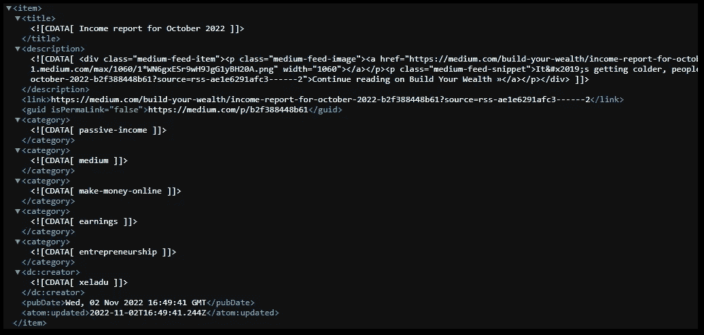

# 详细介绍了中型 RSS 提要以及您可以用它做什么

> 原文：<https://levelup.gitconnected.com/the-medium-rss-feed-in-detail-and-what-you-can-do-with-it-9759f7a23cd2>

## 里面有好东西！

## Medium 自动为每个编写器创建一个 RSS 提要。我将解释内容，并向您展示一些您可以用它做什么的想法。


照片由[沙哈达特·拉赫曼](https://unsplash.com/@hishahadat?utm_source=medium&utm_medium=referral)在 [Unsplash](https://unsplash.com?utm_source=medium&utm_medium=referral) 上拍摄

你有没有想过，虽然没有官方的 Medium API，但是有多少工具是从 Medium 获取信息的？他们中的一些人使用每个作家都有的老式 RSS 源。它们是自动创建和更新的，包含许多有用的信息。在这篇文章中，我将谈论细节。

# 什么是 RSS？

RSS 代表 [RDF](https://en.wikipedia.org/wiki/Resource_Description_Framework) Site Summary 或**Really Simple Syndication**，是网站的一种数据格式。它通常包含分层 XML 结构的文本，非常容易解析。标准是 1999 年出台的，所以有 20 多年的历史了。查看下面的维基百科文章了解更多细节。

[](https://en.wikipedia.org/wiki/RSS) [## RSS -维基百科

### RSS (RDF Site Summary 或 Really Simple Syndication)是一个 web 提要，允许用户和应用程序访问更新…

en.wikipedia.org](https://en.wikipedia.org/wiki/RSS) 

## 访问 RSS 源

在以下 URL 之一中插入您要查看其 RSS 源的作者的用户名:

```
https://{{username}}.medium.com/feed
<https://medium.com/@{{username}>}/feed
```

大多数现代网络浏览器，如 Chrome、Edge 和 Firefox，至少可以将 RSS 提要显示为一个文档树。当使用我的用户名时，您可以看到这样的内容，例如:


作者的 RSS 提要摘录

## 识别信息

现在，让我们来看看 Medium 免费提供的信息。

每个 feed 都包含一个作者最近的 10 篇文章。如果新的出版了，旧的就消失了。但是首先，让我们把重点放在标题部分的重要部分。


作者的中等 RSS 源的标题部分

到作者个人资料页面的链接
`<image>`包含作者的个人资料图片
`<lastBuildDate>`上次更新提要的时间戳

比标题部分更重要的是条目，因为它们包含了作者发表的文章的信息。



作者的中等 RSS 源的项目部分

我们可以看到一篇文章的所有相关信息，包括`<title>`、`<description>`、a `<link>`、使用的标签(最多 5 个`<category>`部分)、以及`<pubDate>`。

🔔**如果你的文章在 Medium 的付费墙**后面，描述只包含一个摘要。这与非会员用户会看到他们当月的免费文章是否用完是一样的。

如果商品未被计量，其内容在`<content:encoded>`部分完全可见。


作者的媒体 RSS 提要中的免费媒体文章的内容

你也可以通过在`<description>`中寻找``标签来获得文章的预览图片。这是 Medium 在其主页上向您展示的内容。

Medium 提供了许多信息，您可以使用它们来构建其他应用程序。

## 利用这些信息

这里有三个关于如何使用这些信息的想法。

👉**创建定制的媒体简讯**

收集信息，放入电子邮件中，发送给你的订户。例如，它可以是你的最佳文章选集或上周的回顾。

[我已经有一份简讯](https://xeladu.medium.com/you-can-subscribe-to-my-monthly-medium-newsletter-now-2fe671c11b02)，向我的订户提供每月摘要，它使用中型 RSS 提要来收集信息。有兴趣的话，在这里订阅[。](http://medium-newsletter.quickcoder.org)

[](http://medium-newsletter.quickcoder.org/) [## 每月媒体简讯- QuickCoder

### 赞助商链接是附属链接。我收到佣金，如果你注册或订购，没有任何额外费用给你！

medium-newsletter.quickcoder.org](http://medium-newsletter.quickcoder.org/) 

👉**建立个人媒体档案页面**

如果你不喜欢你的中型个人资料页面，你可以建立自己的！使用提要中的信息生成一个个人资料页面，其中包含您喜欢的文章预览。因为提要只包含最近的 10 篇文章，所以您需要定期解析数据并将新条目存储在数据库中。这将需要一段时间，你可能需要手动添加旧文章，但之后你可以用它们做一些很棒的东西。

👉**在 GitHub 上展示你的博客文章**

有一个[非常受欢迎的 GitHub 动作](https://github.com/gautamkrishnar/blog-post-workflow)使用中型 RSS 提要在 GitHub 个人资料页面上展示最新的博客文章。看看[我的 GitHub 简介](https://github.com/xeladu)看看它能长什么样。


作者 GitHub 页面截图

## 结论

在本文中，我向您解释了 Medium RSS 提要的细节，并就它的用途给出了一些想法。

[***通过我的推荐链接加入成千上万的媒体会员，每月只需 5 美元就能阅读你想阅读的文章！***](https://medium.com/@xeladu/membership)

[](https://medium.com/@xeladu/membership) [## 通过我的推荐链接加入 Medium-xela du

### 只需点击一下，就可以通过会员资格访问数千篇文章！您的会员资格只需 5 美元一张…

medium.com](https://medium.com/@xeladu/membership) 

点击 [**此处**](https://xeladu.medium.com/subscribe) 获取我发布时的邮件(或 [**此处**](http://bit.ly/xeladu-medium) 获取每月一次的总结)🔔浏览[我的 Gumroad 商店](https://xeladu.gumroad.com/)寻找有趣的编程素材🏬


xeladu

## 软件工具和技术指南

[View list](https://xeladu.medium.com/list/software-tools-and-tech-guides-1ab2ca04969b?source=post_page-----9759f7a23cd2--------------------------------)9 stories

[赛拉杜](https://xeladu.medium.com/?source=post_page-----9759f7a23cd2--------------------------------)

## 充分利用媒体及其特性！

[View list](https://xeladu.medium.com/list/make-the-most-of-medium-and-its-features-3241911f67ae?source=post_page-----9759f7a23cd2--------------------------------)4 stories