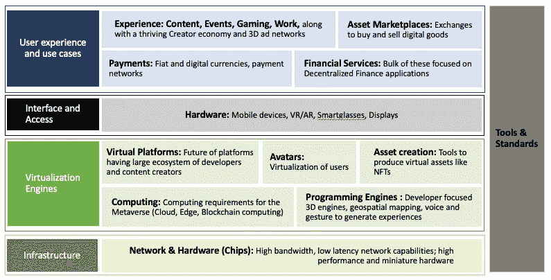
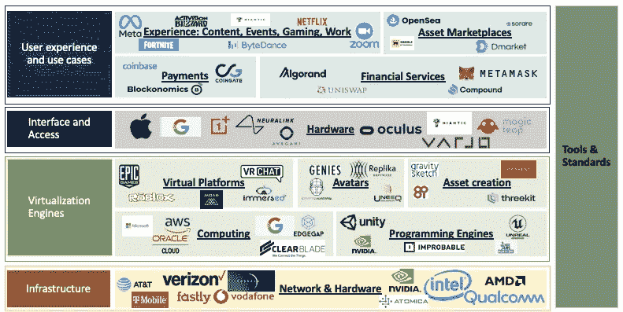

# 元宇宙:框架、构件和市场地图

> 原文：<https://levelup.gitconnected.com/the-metaverse-framework-building-blocks-and-market-map-3bb2ccf0241c>

这是科技世界最近痴迷的元宇宙系列的第二部分。

*第一部分介绍了元宇宙的真实含义和未来可能的样子。*

 [## 元宇宙:这是什么，会是什么

### 科技领域的伟大想法总是以看似行话的形式开始。理解行话以揭示想法首先需要…

medium.com](https://medium.com/@swatib16/metaverse-what-is-it-and-what-can-it-be-1173a0e65d73) 

元宇宙堆栈将大致围绕 5 个大型存储桶排列，每个存储桶及其子类别都是关键的构建模块。从用户和开发人员的角度来看，元宇宙的这种分解可以帮助我们更好地理解堆栈中的各个部分是如何组合在一起的，以及元宇宙的“流程”可能是什么样子。

大量的私人投资已经流入这些街区。有些目前完全由大型科技和游戏公司主导。然而，鉴于元宇宙才刚刚开始形成，存在巨大的创新空间。元宇宙的核心原则——普遍性和去中心化的原则，以及包含我们所有身份、历史、通信和支付等的无所不包的愿景，自然而然地成为创业公司的巨大机会空间。

未来几年的投资、协议和决策将决定元宇宙采取什么样的形式——是实现每个人都做出贡献并分得一杯羹的民主化梦想，还是采取另一波大规模看门人和寻租者的过渡形式。我们已经处于一个品牌试图在元宇宙培养新形式的客户参与以销售更多产品的时代，金融科技公司正在抓住机会利用新的金融需求，而一系列初创公司正在创造全新的虚拟产品，从头像到加密收藏品。

# 元宇宙价值链和组成部分

元宇宙可以被最好地理解为下一代互联网:它将建立在互联网之上，并不断地对其进行改造。它需要非凡的技术进步(产生数百万用户实时同步的共享、持久的模拟)，并将涉及强大的监管框架、商业政策和消费者行为的变化。

在这里，我创建了一个框架来理解需要聚集和组织起来以建立流动和启用元宇宙的堆栈。关于每一个构件的信息都是分散的，很难完全想象。我希望在跟踪新技术的出现、大型科技和游戏公司的活动以及跟踪初创公司时，将这个框架作为一个参考点。

鉴于元宇宙本身并不是一个整体，而是由几个移动的部分组成的，因此一直在发展和变化，这个框架也将继续发展。

元宇宙积木:一个框架

对于用户来说，所有潜在的用例都在用户体验桶中，这是一个包含创建和消费内容、游戏、参加现场活动、工作、协作和其他企业应用的层。这也是市场将大规模形成的地方——用户将在这里交易资产。所有这些体验都将得到数字支付和金融服务的支持，并为今天正在出现的区块链、加密货币和去中心化金融应用带来巨大潜力。

用户的元宇宙界面将通过硬件构建模块提供——从不断发展的智能手机、VR/AR、haptik 到显示技术。

中心坐落着庞大的“虚拟化引擎”——简单来说，就是元宇宙的处理器。结合了云计算、边缘计算、本地计算和区块链计算的极高程度的计算能力将必须结合在一起以提供计算能力。编程引擎将允许开发者为元宇宙创建应用程序。这一层还拥有虚拟平台——提供开发者和内容创作者的生态系统。化身和资产创造者将使人类身份虚拟化，并产生虚拟资产。

所有这一切都将建立在基础上，即从 5G 到 6G 的网络和硬件发展，以及芯片、微型传感器和光技术的发展。

所有这些构件都将受到工具、协议、格式、服务和引擎的指导，这些工具、协议、格式、服务和引擎作为互操作性的标准，并支持元宇宙的创建、运行和持续改进。

# 深入了解构建模块和主要参与者的市场地图

## 第 1 层:基础设施|网络和芯片

元宇宙将建立在由主干网提供商、网络、交换中心和在它们之间路由的服务以及那些管理消费者“最后一英里”数据的提供商提供的持久、实时连接、高带宽和分散数据传输的基础上。5G 网络将大幅提高带宽，同时减少网络争用和延迟。6G 将把速度再提高一个数量级。

***网络* :** 全新的技术、业务线和服务正在开发，以满足实时带宽应用不断增长的需求。

*玩家:* AT & T，威瑞森，T-Mobile，沃达丰，Jio，[子空间](https://subspace.com/)(低延迟网络寻路)， [Fastly](https://explore.fastly.com/cdn-new?utm_source=google&utm_medium=cpc&utm_campaign=NAMER_-_ENG_-_Search_-_Branded-Short&utm_adgroupid=116758579605&utm_term=fastly&utm_content=&utm_channel=&gclid=CjwKCAiAp8iMBhAqEiwAJb94z0FQvn95c5XeymDkChzb6Z2Qi44RbVpvMlbW4IdYhD-W9zLzyWJ27hoCScUQAvD_BwE) (基于“基础设施即代码”的 CDN，针对低延迟应用进行优化，而不仅仅是交付可靠性和带宽)

***硬件*** *:* 要实现下一代移动设备、智能眼镜和可穿戴设备所需的高性能和小型化，将需要功能越来越强大、体积越来越小的硬件:  半导体转向纳米工艺、微型传感器和长效电池

*玩家*:英伟达、高通、AMD、英特尔、 [Atomica](https://atomica.com/?creative=538640730371&keyword=atomica&matchtype=p&network=g&device=c&gclid=CjwKCAiAp8iMBhAqEiwAJb94z69-2dwAgkAFkHtvH3QQ8OmEE_Q9GayHyYx6xAoCpyniE908gzOHNxoCBtgQAvD_BwE) (云计算、自动驾驶汽车、细胞治疗、分子诊断、基因组学、5G 领域基于 MEMS 的解决方案)

元宇宙:市场地图

## 第 2 层:虚拟化引擎

这个构建模块是元宇宙的计算、编程和平台引擎，包括计算、编程引擎、虚拟平台和资产创建。

**虚拟化|计算:**元宇宙将拥有人类历史上最大的持续计算需求，计算能力的可用性和发展将限制和定义其各个发展阶段。对计算能力不断增长的需求及其稀缺性需要通过以下所有因素的组合来解决:

*   云计算:模拟——在云中处理，而不是在本地计算设备上。比如谷歌 Stadia 和亚马逊 Luna
*   本地计算:改善低延迟数据传输
*   边缘计算
*   区块链计算

*玩家:*谷歌，AWS，微软 Azure，甲骨文 Cloud， [Clearblade](https://www.clearblade.com/) ， [Edgegap](https://edgegap.com/)

虚拟化|编程引擎:以开发者为中心的引擎，允许用户创建游戏或 3D 世界，以及其他虚拟产品。人工智能驱动的 3D 引擎使得实时生成游戏内容(与游戏中的角色、对象或环境等的交互)成为可能，从而允许无限数量的场景，并使游戏更具互动性。

*   显示几何图形和动画的 3D 引擎
*   测绘和解释内部和外部世界—地理空间测绘
*   语音和手势识别
*   来自设备和生物识别的数据集成
*   支持并发信息流和分析的下一代用户界面

*玩家* : [Unity](https://unity.com/) ，[虚幻](https://www.unrealengine.com/en-US/)，[小概率](https://www.improbable.io/)，蝎狮，英伟达 Omniverse，沙盒 VR

**虚拟化|虚拟平台**:身临其境的数字和 3D 模拟、环境和世界，用户和企业可以在其中探索、创造、社交和参与各种体验，并参与经济活动。虚拟平台的特点是存在一个由开发者和内容创作者组成的大型生态系统，这些开发者和内容创作者在底层平台上生成大部分内容和/或获得大部分收入。

*玩家:* Epic Games，Roblox(游戏平台) [VRChat](https://hello.vrchat.com/) (社交世界)[沉浸式](https://immersed.com/)(工作区) [Wave](https://wavexr.com/) (在线演唱会平台)

**虚拟化|资产创建:**生产虚拟内容和资产的工具，范围从合成媒体到全息图到 AR 内容再到 NFT。

*玩家:* [重力素描](https://www.gravitysketch.com/)(提供使用 AR 进行 3D 绘制的工具) [Marxent](https://www.marxentlabs.com/?utm_term=marxent&utm_source=google&utm_campaign=Search_-_Branded_-_NA%7CMarxent&utm_medium=cpc&utm_content=RSA-Brand-01&gclid=CjwKCAiAp8iMBhAqEiwAJb94z37VM10LpUSVzGlFmgD1hJPNid3dV73tBiwllop862JhIfnRwBzdEBoC1ZAQAvD_BwE) (帮助品牌和零售商在 3D 中可视化产品目录) [Threekit](https://www.threekit.com/lp/3d-product-configurator-c?utm_source=adwords&utm_medium=ppc&utm_campaign=202109_UnitedStates_Competitors&utm_term=marxent&hsa_tgt=kwd-527257705651&hsa_grp=127968013658&hsa_mt=p&hsa_cam=14488818908&hsa_ver=3&hsa_src=g&hsa_net=adwords&hsa_kw=marxent&hsa_acc=5152556160&hsa_ad=553242562313&gclid=CjwKCAiAp8iMBhAqEiwAJb94zw6R5bw7TkT4VVnDq30TbKyF9MIJQH4mAtf5Ikq9Y706EeloPnlGKhoCGboQAvD_BwE) ，Cappasity， [8i](https://8i.com/) (立体全息图)

**虚拟化|虚拟化身:**虚拟化身技术，用户可以用它来表现自己

*玩家:*[genes](https://genies.com/)，CryptoAvatars，Replika，Uneeq， [Crucible](https://crucible.network/)

## 第 3 层:接口和访问|硬件

简而言之，这是帮助我们访问元宇宙的一层——从移动设备到 VR 头戴设备，再到高级触觉和智能眼镜等未来技术。

***智能手机的演变*** *:* 智能手机只会越来越强大。随着进一步的小型化，传感器，嵌入式人工智能，以及对强大的边缘计算系统的低延迟访问，他们将从元宇宙吸收越来越多的应用和经验。智能手机的发展经历了不同的阶段——从黑莓的无处不在，到 iPhone 的新时代，以及 Android 与 iOS 操作系统的统治地位。我毫不怀疑，我们正在接近另一个拐点，这使得该行业迎来新一波颠覆和“类别创造”的时机已经成熟

*玩家:*苹果、一加、谷歌、三星

***VR/AR 和触觉技术* :** 专注于消费者和企业的硬件，使虚拟世界更加身临其境和逼真，如 VR/AR 耳机和触觉传感器或设备

*玩家* : Oculus VR (VR 头戴设备、游戏和设备) [Magic Leap](https://www.magicleap.com/en-us) (专注于混合现实的企业应用)[Niantic](https://nianticlabs.com/en/)(pokémon Go 的开发者) [Varjo](https://varjo.com/talk-to-sales/?utm_source=google&utm_medium=cpc&utm_campaign=12306810451&utm_content=120567387547&utm_term=varjo&campaign_id=12306810451&gclid=CjwKCAiAp8iMBhAqEiwAJb94zwaUUZXFWzy9TP7Zci-Odt8eJba3AT7cW00S1XJriws6yZP5IO54VRoCqfkQAvD_BwE) (面向专业人士的增强、虚拟和混合现实头戴设备)、微软 Hololens、 [Neuralink](https://neuralink.com/)

***显示器* :** 允许用户使用 3D 内容的界面，例如下一代电视、手机和全息显示器

*玩家* : [Avegant](https://www.avegant.com/) (开发使虚拟物体看起来更真实的光场显示器) [3D Live](https://3dlive.tech/) (设计 LED 显示系统，用于现场活动、音乐会、游乐园等更真实的全息图)

## 第 4 层:用户体验和用例

数字资产的创建、销售、交易、存储、支付和财务管理。这包含“建立在元宇宙之上”和/或“服务于”该平台的所有业务和服务，并且不垂直集成到虚拟平台中，包括独立于虚拟平台专门为元宇宙构建的内容。

它将伴随着一个强大的创作者经济，即帮助创作者为元宇宙制作和货币化的一切:设计工具，动画系统，货币化技术，以及 3D 广告网络的同时发展。

***内容、游戏、购物、电影、工作***

*玩家:* Meta，堡垒之夜，Niantic，动视暴雪，任天堂，Zoom，网飞，字节跳动

***资产市场* :** 资产市场为用户提供买卖数字商品的交易平台，其中一些专注于不可替代代币(NFT)

*玩家:* [OpenSea](https://opensea.io/) (NFT 市场，用户可以跨类别交易虚拟商品，如交易卡、密码猫和艺术品)、Sorare、 [Rarible](https://rarible.com/?source[]=google&source[]=google&medium[]=cpc&medium[]=cpc&campaignid=14850214750&adgroupid=127960235517&keyword=rarible&device=c&gclid=CjwKCAiAp8iMBhAqEiwAJb94z51_4zmRoFLGzs0zTYfcyJ6w37uuUQkFBmGcXvUO9nv4CmYvjwZRxBoCQ_UQAvD_BwE) 、DMarket

***支付:*** 支持数字支付流程、平台和运营，包括纯数字货币和金融服务，包括加密货币，如比特币和以太网，以及其他区块链技术。

***金融服务* :** 为虚拟货币量身定制的金融服务。这些公司大多专注于分散金融(DeFi)应用，并利用区块链技术。这是一个巨大的空间，需要深入挖掘 DeFi 应用的潜力。

*部分玩家:* [Algoran](https://www.algorand.com/technology) d(智能合约平台)[unis WAP](https://unlswap.store/exchange/)(DeFi 应用的市场) [Metamask](https://metamask.io/) (零售和机构加密钱包) [Compound](https://compound.finance/)

## 第 5 层:交换工具和标准

作为实际或事实上的互操作性标准的工具、协议、格式、服务和引擎，支持元宇宙的创建、运行和持续改进。这些标准支持物理、人工智能、资产格式、兼容性管理、工具和信息管理等活动。

这些建筑材料中的每一个都是价值数万亿美元的产业。跨这些组件的互操作性和垂直化将是一个大主题，尤其是在这个创新阶段出现的较大的参与者中。目前，Unity Games、Roblox 等大玩家在内容(游戏)、平台和编程引擎环境领域都有产品。此外，Unity 还为开发者提供 3D 开发平台、完全集成的 3D 引擎和设计工作室，支持插件和资产的大型生态系统。Meta(脸书)和微软希望转化为虚拟平台，推动跨社交、企业和其他用例的各种内容体验。

> 这整个飞轮当然会考虑到用户自己的关键组件。开发周期、垂直化和用例本身将由消费者和商业行为(采用、参与、花费、能力和保留)驱动。正是这些行为决定了元宇宙的社会意义。

*感谢阅读！我错过了什么？我很想收到你的来信——我可以通过*[*【LinkedIn】*](https://www.linkedin.com/in/swatibhatia/)*和*[*Twitter*](https://twitter.com/swati1606)*联系到你。*

我写科技、投资和行为方面的文章，在科技、投资和咨询领域拥有非常丰富的全球经验。(莫斐斯风险投资公司，优步，波士顿咨询集团)。