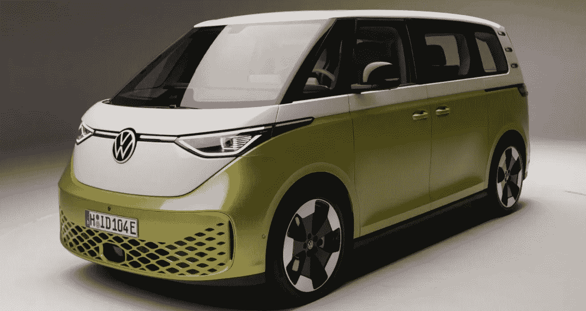
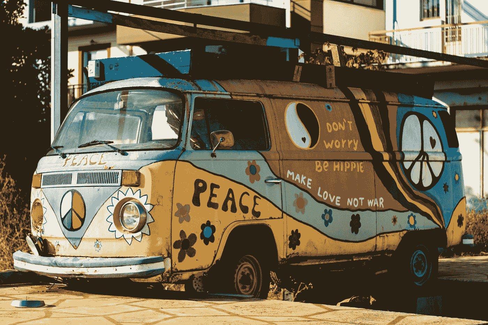

# 未来的微型巴士即将到来

> 原文：<https://levelup.gitconnected.com/the-microbus-of-the-future-is-coming-soon-eff2d5ac22c8>

## 大众将重振标志性的面包车，但这一次是电动的！

经过多年的戏弄和等待，大众汽车公司终于宣布了其标志性的未来微型巴士。这款车型将于 2024 年上市，届时将会是全电动的。

我们都记得那辆到处贴着和平标志、鲜花和抽象画的嬉皮士货车。想象同样的，但现代化的，为未来制造的。

# 怀旧

他们利用了许多人对这款标志性汽车的怀旧情绪。尽管它的主要形状是一样的，但新款车型有一些轻微的变化和现代化，这是完全可以理解的。

从上图可以看出，外形比较一致，可以和老款联系起来。引入了一些很酷的线条，给人一种未来感。

Vasilios Muselimis 在 [Unsplash](https://unsplash.com?utm_source=medium&utm_medium=referral) 上拍摄的照片

还有一些新功能，如车辆两侧的 LED 灯。这让它看起来更加独特。

它的内部和以前的版本完全不同。干净简约很多。你仍然可以在仪表盘和座椅上找到最初的大众标志。

它配有两排座位，非常适合家庭或夫妇使用。

一个很酷的事实是，他们保留了柠檬黄双色漆的原始配色方案，这将使全世界的粉丝都感到高兴。

# 特征

即使这个模型的全部细节还没有出来，我们仍然对其中的一些有了更多的了解。最重要的部分是，电池组有 81 千瓦时的容量，而只有 77 的是可用的。

该动力系统将提供一个能够产生 201 马力和 229 英尺-磅扭矩的电动机。出于安全原因，大众汽车将货车的最高时速限制在 145 公里/小时(90 英里/小时)。

大众汽车公司没有共享驾驶范围，但看起来它一次充电可以行驶近 300 英里。ID Buzz 应该可以从大众的子公司 Electrify America 获得足够的电池支持，该公司的网络包括美国各地近 2900 个独立的快速充电点，其中包括 2400 个 1 级点——这意味着它们能够以 150 千瓦及以上的功率充电。

# 结束语

这款车将会受到全世界车迷的高度赞赏，因为它具有如此重要的文化意义。你认为这真的是未来的小型货车吗？

如果你对这篇文章有任何问题或建议，请不要犹豫，在评论区回复。喜欢你读的东西吗？为什么不关注我的媒体简讯，这样你就不会错过我未来的任何文章了？很简单，点击[这里](https://kgabeci.medium.com/subscribe)输入你的邮箱地址，然后按订阅。

你喜欢阅读媒体上的文章吗？考虑成为会员，有很多功能，你将获得所有创作者的内容，每月只需 5 美元。使用[这个链接](https://kgabeci.medium.com/membership)，你也帮我赚一小笔佣金，点击成为会员，输入你的信息。