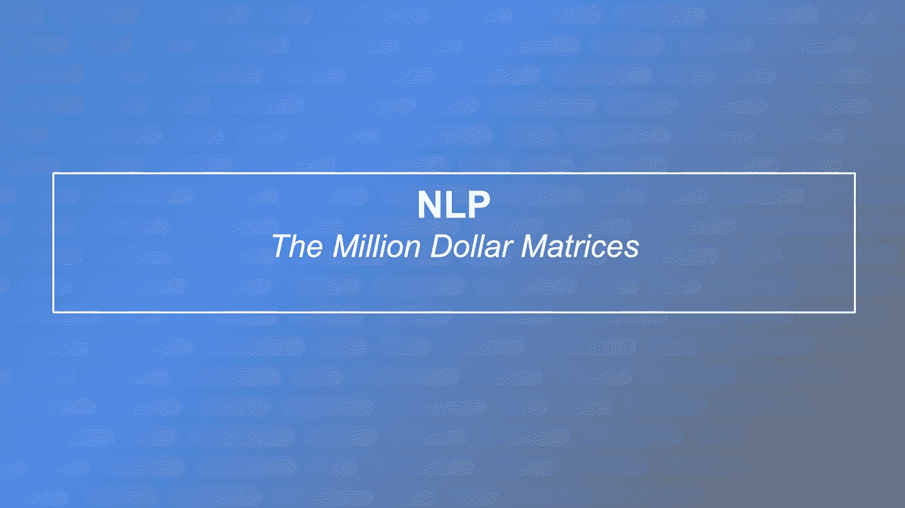

# 百万美元矩阵

> 原文：<https://levelup.gitconnected.com/the-million-dollar-matrices-1e9536656806>

训练机器学习模型通常是一个耗时的过程。自然语言处理模型也不例外。新的模型架构需要在专业硬件集群上进行多天甚至数周的训练，才能达到相当的效果，或者在特殊情况下达到新的最先进的效果，这种情况并不少见。这些陈述中经常忽略的是这些实验的货币成本。男孩可以变得昂贵！💸

NLP 领域的成功秘诀似乎已经变成创建比以往任何时候都更大的模型，在数百千兆字节的原始文本数据的合并上训练它们更长时间。即使这种方法达不到令人垂涎的[胶水排行榜](https://gluebenchmark.com/leaderboard)上的最先进位置，也有可能投入更多的计算来解决这个问题。训练来自不同初始化的多个模型来创建一个集合通常会达到目的。

> *“我们利用互联网上找到的每一个单词，在 1024 个你甚至买不起的 TPU 豆荚上训练了 8 个 100 亿参数模型的集合”*

通常都是这样。

但是有很好的理由来解释为什么这个故事会变成这样。*因为管用！*

这些训练运行——创建用于提交的模型——只是计算的冰山一角。下面是大量的超参数评估试验、消融研究和用于比较的基准模型。其中的每一个都需要一次以上的运行，以解决由于初始化和其他随机因素造成的统计差异。

所有这些都是说，每一个新的最先进的结果都包含了大量的计算。对于从 AWS 或 GCP know 购买计算资源人来说，这可能很贵。真的很贵。

那么最顶尖模特的培训价格是多少呢？

为了训练 submission worth 模型，而不是一个整体，BERT large 的大小估计为 200.000 美元！当查看排行榜的顶部时，伯特出生仅两年，认为 3.4 亿参数很小是不是很奇怪。训练 GPT-2 或 T5，分别有 15 亿和 110 亿个参数，估计花费大约 100 万美元！考虑到所有的辅助训练和实验，相信这些论文中的一篇的最终价格标签是数百万美元是合理的。

所有这些都是为了科学，当然，还有一组精心调整的矩阵。

*百万美元矩阵。*

蛮力有其优点，这一点应该已经很明显了。但是从新的角度来看这个问题，用大脑代替动物肯定会变得更加主流。这是 NLP 内部的一个研究领域，我发现越来越有兴趣跟踪——弄清楚我们如何使用更小的模型、更少的数据和/或更有效的训练程序。为此，最近发表了一些论文，讨论如何创建更有效的模型。无论是在训练中还是在现实世界中。下面，你会发现我认为值得强调的三个例子。

**伊莱克特拉**

ELECTRA 提出了一种新的变压器架构预训练程序，它比以前使用的屏蔽语言建模(MLM)更具参数效率。虽然能够在相同的计算上达到与 MLM 训练的模型相当的性能，但它也能够实现更高的性能。

[伊莱克特拉——解决伯特培训前流程的缺陷](https://medium.com/dair-ai/bert-is-extremely-inefficient-this-is-how-to-solve-it-688b09350f10)

**龙前**

变压器的注意头需要计算序列长度的二次复杂度。这使得处理更长的文档非常昂贵，这就是为什么 BERT 和它的许多亲戚被限制为 512 个令牌的原因。Longformer 引入了一种显示线性复杂性的窗口注意力机制，允许我们在相同的计算中处理更长的序列。

**TinyBERT**

尽管上述论文带来了训练方面的改进，但最终仍然有可能得到一个庞大的模型。因为我们可能不仅仅想用我们的模型来争夺排行榜的位置，它的大小很重要吗？这将直接影响推理时间和成本。

这就是*知识提炼*可以证明超级有用的地方。它可以将较大的模型简化成较小的模型，而不会损失太多的性能。TinyBERT 就是一个例子，它比 BERT base 小 7 倍，快 9 倍，而性能却是它的 96%!

tiny Bert——体型的确很重要，但你如何训练它可能更重要。🐣

# 参考

[训练 NLP 模型的成本:简明概述](https://arxiv.org/abs/2004.08900)

如果你觉得这个总结有帮助，请考虑阅读我的其他文章！我已经写了一堆，肯定还会有更多的。👋🏼🤖