# 带有 Python 和 Google Sheets 的 Mint API

> 原文：<https://levelup.gitconnected.com/the-mint-api-with-python-and-google-sheets-311b61379d4c>

## **通过 Mint API 访问所有类型账户的个人交易历史，包括支票、储蓄、信用卡等。微软 365“Excel 中的钱”的一个很好的替代品。**


由[stellweb](https://unsplash.com/@stellrweb?utm_source=medium&utm_medium=referral)在 [Unsplash](https://unsplash.com?utm_source=medium&utm_medium=referral) 上拍摄的照片

在一个地方查看您的所有个人账户——支票账户、储蓄账户、信用卡账户和借记卡账户，这不是很好吗？Intuit 的 Mint 提供了一个不错的解决方案，允许个人通过他们的平台连接到他们的银行/账户。该平台允许用户设置预算，跟踪账单到期时间，以及查看交易历史。它会自动与您的帐户同步，并提供良好的个人财务快照。

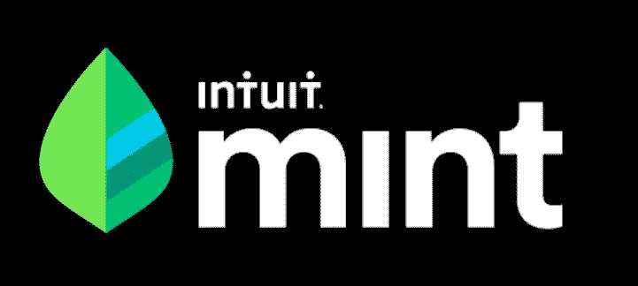

直觉造币厂

我感兴趣的是，Mint 是否有一个 API 来访问我在 python 笔记本或 excel 电子表格/google sheet 中的个人数据，以便进一步分析。我妻子和我在一个电子表格中做预算，所以当我们检查预算时，在同一个电子表格中保存交易数据可以节省时间和精力。所以，我做了一些研究，在 GitHub 上发现了一个有趣的解决方案，一个网页抓取 API。

[](https://github.com/mrooney/mintapi) [## 姆鲁尼/明塔皮

### 一个用于 Mint.com 的屏幕抓取 API。确保你有 Python 2 或 3 和 pip ( easy_install pip ),然后:mintapi scrapes…

github.com](https://github.com/mrooney/mintapi) 

这个 API 需要使用 [selenium](https://www.selenium.dev/selenium/docs/api/py/index.html) ，这是一个 chrome 驱动软件，允许 Mint API 在 chrome 浏览器中自动打开 mint.com 并登录。当您 pip 安装 Mint API 时，selenium 被下载。一旦登录到基于 web 的平台，Mint API 就会抓取所有数据，并将其存储在可以使用 python 调用的函数中。有了对 API 工作原理的基本理解，您就可以提取事务数据了。我将把它分成几个简单的步骤。

* *注意:微软 365 在订阅中提供了一个昂贵的 Mint API 替代方案，名为“Excel 中的 [Money](https://templates.office.com/en-us/money-in-excel-tm77948210) ”。对于那些不能接受挑战的人，请离开。对于那些准备好接受挑战的人，Mint API 提供了一个解决方案，另外你还可以获得亲自动手的奖励！

# **第一步:创建 mint 账户并连接所有账户(15 分钟)**

如果您已经有一个 mint 帐户，您可以跳过这一步。如果没有，设置好一切并不需要太长时间。这里是[注册的链接。](https://accounts.intuit.com/signup.html?offering_id=Intuit.ifs.mint&namespace_id=50000026&redirect_url=https%3A%2F%2Fmint.intuit.com%2Foverview.event%3Futm_medium%3Ddirect%26cta%3Dhero_sign_up_free_ProspectWeb%26ivid%3D1beafd17-5ee9-4c9d-8c07-0fbbf2342db4%26adobe_mc%3DMCMID%253D80715993186046308172412896613498320837%257CMCORGID%253D969430F0543F253D0A4C98C6%252540AdobeOrg%257CTS%253D1593140294%26ivid%3D1beafd17-5ee9-4c9d-8c07-0fbbf2342db4)

# **第二步:用 python 创建一个配置文件(2 分钟)**

如果你在 Jupyter 实验室工作，确保你有办法写 python 文件。如果您在 Jupyter 实验室中看不到这个，您可以通过从 github 添加这个扩展来添加它。

【https://github.com/jtpio/jupyterlab-python-file 

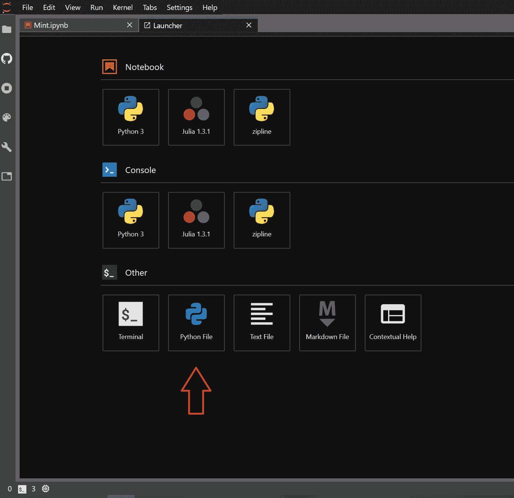

python 文件只需要两个变量—用户名和密码。

# **第三步:** **从您的 Google 帐户启用 Google Sheets API(15 分钟)**

如果您不想在 google sheets 中访问您的交易数据，您可以跳过这一步。

首先，你需要创建一个[谷歌云账户](https://cloud.google.com/)。在这里，您将能够管理您的 API 并创建服务。下一步是创建一个新项目。创建新帐户时，它可能会提示您这样做。(记不清了)。

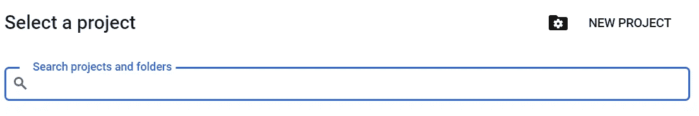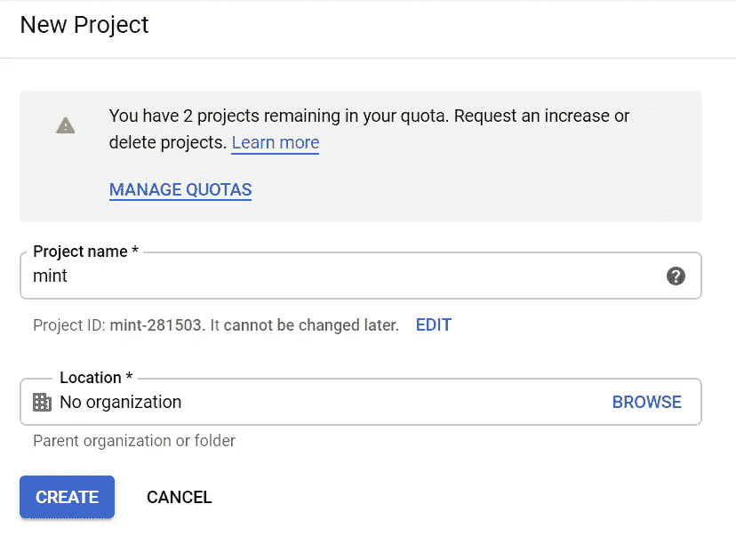

你可以给它贴上任何你喜欢的标签。出于这个例子的目的，我将我的项目命名为 Mint。

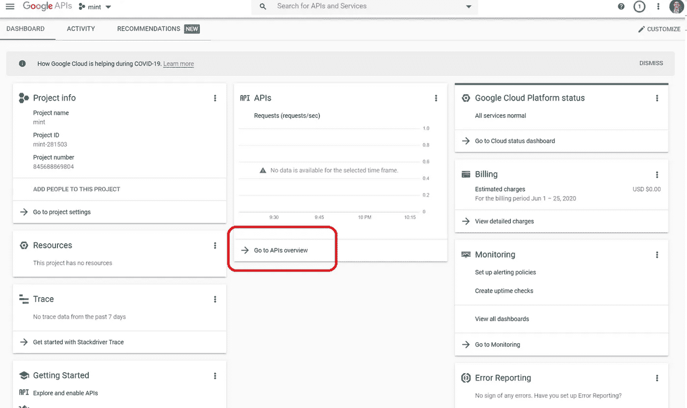

然后，您将选择“转到 API 概述”→ API 库→工作表 API →启用。

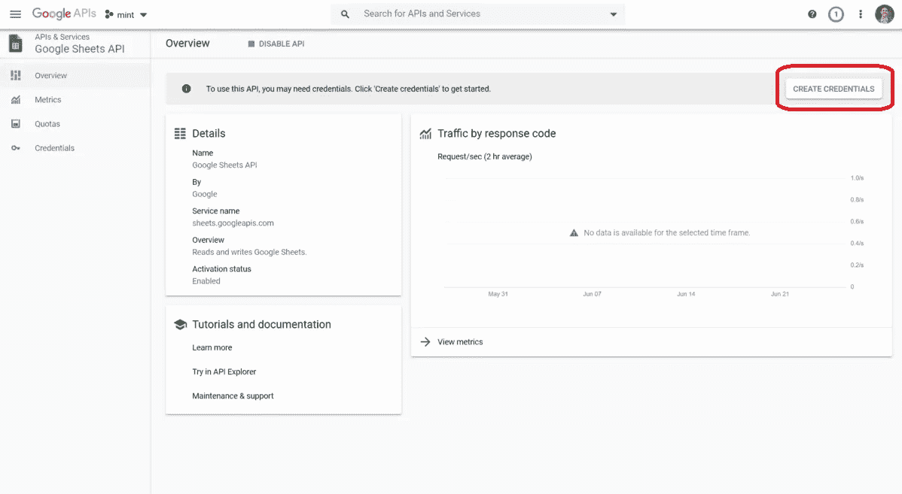

如果您做的一切都正确，您应该会看到这样的屏幕。

选择“创建凭据”。接下来的这一部分很重要，但也有点令人困惑。所以，要注意。

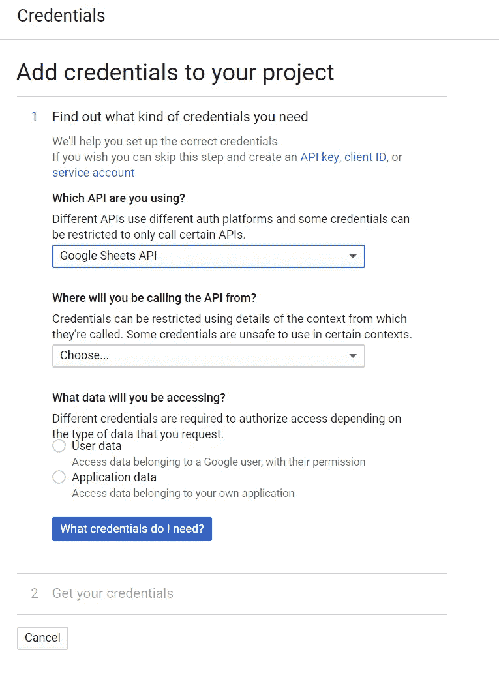

*   您将从哪里调用 API？=其他非 UI _ UI
*   您将访问哪些数据？=应用数据
*   您计划将此 API 与应用引擎或计算引擎一起使用吗？=不，我没有使用它们。

您应该会看到以下提示。

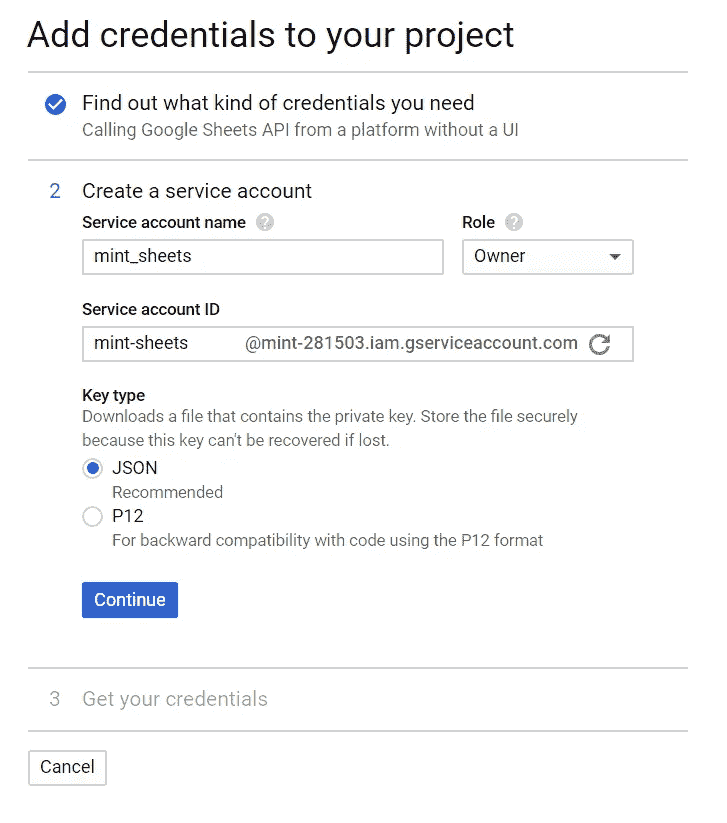

当您点按“继续”时，一个 json 文件会下载到您的电脑上。把这个文件放在你的 python/notebook 文件所在的地方。

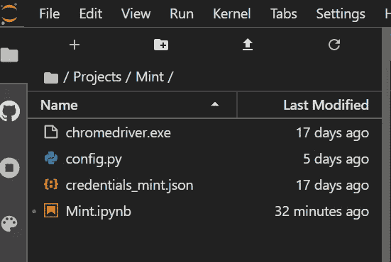

*   注意:复制已创建的服务帐户电子邮件。你马上就会需要它。[mint-sheets@mint-281503.iam.gserviceaccount.com]

# **第四步:写点代码！(你希望它有多长)**

确保 pip 安装了以下库。

```
pip install mintapi
pip install gspread
pip install df2gspread
pip install oauth2client
```

导入下列库。

```
import mintapi
import pandas as pd
import gspread
import df2gspread as d2g
from oauth2client.service_account import ServiceAccountCredentials
from config import username, password
```

我只是从 mintapi 文档中复制了代码。一旦运行了这个模块，就可以看到 selenium 是如何打开 Mint 并为您输入用户名和密码的。这很酷。

```
mint = mintapi.Mint(
    username,  # Email used to log in to Mint
    password,  # Your password used to log in to mint

    # Optional parameters
    mfa_method='sms',  # Can be 'sms' (default), 'email', or 'soft-token'.
                       # if mintapi detects an MFA request, it will trigger the requested method
                       # and prompt on the command line.
    headless=False,  # Whether the chromedriver should work without opening a
                     # visible window (useful for server-side deployments)
    mfa_input_callback=None,  # A callback accepting a single argument (the prompt)
                              # which returns the user-inputted 2FA code. By default
                              # the default Python `input` function is used.
    session_path=None, # Directory that the Chrome persistent session will be written/read from.
                       # To avoid the 2FA code being asked for multiple times, you can either set
                       # this parameter or log in by hand in Chrome under the same user this runs
                       # as.
    imap_account=None, # account name used to log in to your IMAP server
    imap_password=None, # account password used to log in to your IMAP server
    imap_server=None,  # IMAP server host name
    imap_folder='INBOX',  # IMAP folder that receives MFA email
    wait_for_sync=False,  # do not wait for accounts to sync
    wait_for_sync_timeout=300,  # number of seconds to wait for sync
)
```

下一段代码调用事务函数。它会自动将你的数据放入一个漂亮的熊猫数据框中。我打扫卫生。我放弃了信用卡支付，因为费用已经包含了这个月的费用。报酬会让事情变得混乱。交易都设置为发送到谷歌表。

```
transactions = mint.get_transactions()
transactions = transactions.drop(["labels", 'notes', 'original_description'], axis=1)
transactions.loc[(transactions.transaction_type == 'debit'), 'transaction_type'] = 'Expense'
transactions.loc[(transactions.transaction_type == 'credit'), 'transaction_type'] = 'Income'
transactions = transactions[transactions.category != 'credit card payment']
```

# **第五步:为原始交易数据创建一个谷歌表单(2 分钟)**

我设置了一个 google sheet 来发送所有的原始数据，然后通过一个 importrange 函数将这些数据放入我的预算表中，稍后我会对此进行解释。

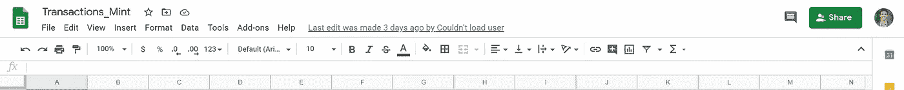

在数据流向工作表之前，您需要做两件事。

1.  首先，获取电子表格键。这在电子表格的 URL 中。

*https://docs . Google . com/spreadsheets/d/{ spread sheet _ Key }/edit # GID = 0*

2.与您的服务帐户电子邮件地址共享我在步骤 3 中让您复制的表格。

# **第六步:完成代码(2 分钟)**

交易数据都是干净的，随时可以使用。按照下面的代码片段将其发送到您的 google sheet。

```
# use creds to create a client to interact with the Google Drive API
scope = ['[https://spreadsheets.google.com/feeds'](https://spreadsheets.google.com/feeds')]
creds = ServiceAccountCredentials.from_json_keyfile_name('credentials_mint.json', scope)
client = gspread.authorize(creds)
# Send the data to google sheets
spreadsheet_key = "{spreadsheet_key}"
d2g.upload(transactions,spreadsheet_key,"RAW_DATA",credentials=creds,row_names=True)
```

运行完这个 chunck 之后，去检查一下你的 google 表单。如果你对你所看到的感到满意，那就继续，到此为止。我将继续探讨如何使数据更易于阅读和理解，以用于预算目的。

# **第七步:将数据导入预算表，按日期过滤(10 分钟)**

这最后一步只是为了好玩，我对如何让它加速我们的预算感到非常自豪。

打开你预算的谷歌表单，创建一个新标签。在该选项卡中，您可以使用以下函数导入原始数据。

```
=FILTER(IMPORTRANGE("https://docs.google.com/spreadsheets/d/{spreadsheet_key}/edit#gid=0","RAW_DATA!B2:H"), INDEX(IMPORTRANGE("https://docs.google.com/spreadsheets/d/{spreadsheet_key}/edit#gid=0","RAW_DATA!B2:H"),0,1)>=text(I1,"yyyy-mm-dd"),INDEX(IMPORTRANGE("https://docs.google.com/spreadsheets/d/{spreadsheet_key}/edit#gid=0","RAW_DATA!B2:H"),0,1)<=text(J1,"yyyy-mm-dd"))
```

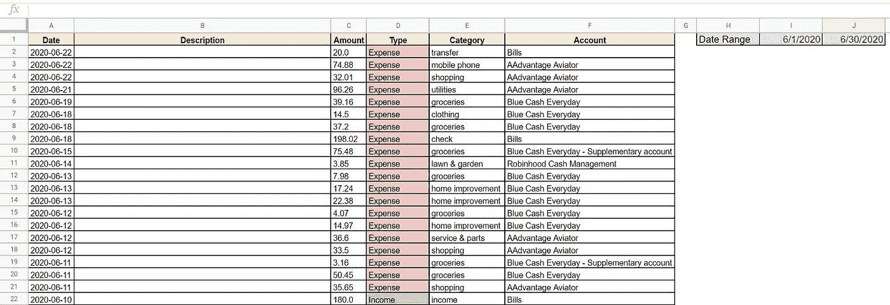

我将该函数放在单元格 A2 中。该函数将导入您的交易数据，然后根据您在单元格 I 和 j 中输入的数据范围对其进行筛选。我还添加了条件格式，将费用显示为红色，将收入显示为绿色。

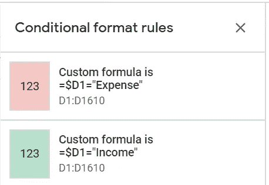

一旦你掌握了所有这些交易数据，你还可以分析趋势，计算出你每月哪一天花费最多，计算出你使用最多的信用卡，等等..这样的例子不胜枚举。

# **结论**

Mint API 提供了一个非常简洁的方法来分析和预算你想要的任何方式。python 和 google sheets 的结合提供了一种快速简单的方法来查看你在某段时间内赚了多少钱。

我希望听到您的评论和反馈。快乐预算！