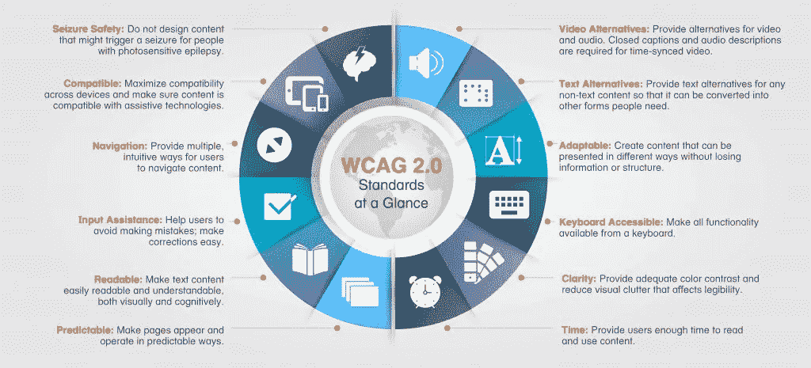
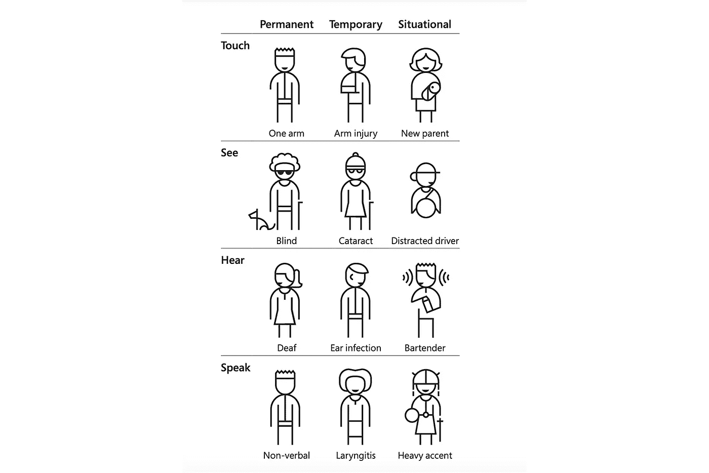
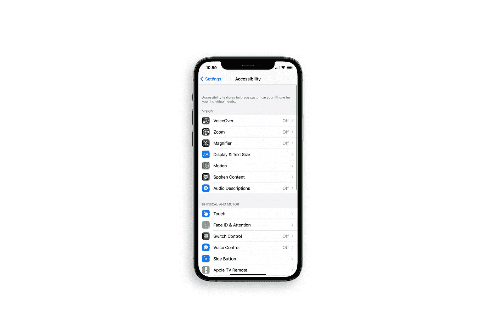
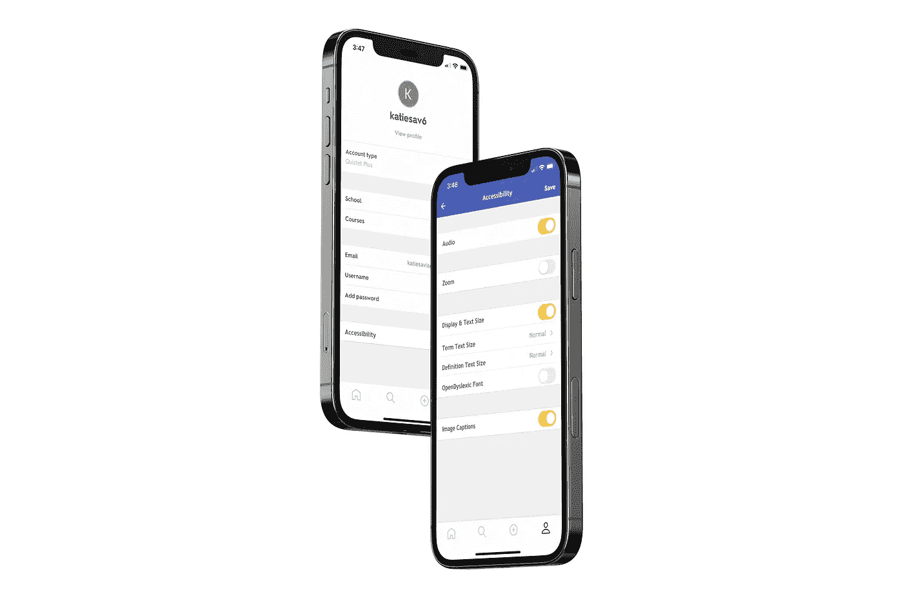

# 无障碍设计的误区

> 原文：<https://levelup.gitconnected.com/the-misconception-of-accessible-design-630ea44350a5>

为什么人们需要重新思考无障碍设计。

# 什么是无障碍设计？

无障碍设计是指确保产品或服务可以被每个人使用的实践。大约 13 年前，网页无障碍倡议(WAI)发布了第一份[网页内容无障碍指南](https://www.w3.org/WAI/standards-guidelines/wcag/) (WCAG)。这 14 条指导方针主要是为残疾人设计的，旨在使网络内容更易访问。

这些[残疾](https://usability.yale.edu/web-accessibility/articles/types-disabilities)包括:

**视觉**(色盲、低视力、失明)

**认知/学习/神经**(学习障碍、自闭症、精神健康障碍、癫痫症)

**听觉**(重听、耳聋)

**身体**(截肢、关节炎、瘫痪)

**言语**(沉默、构音障碍、口吃)

从那以后，无障碍设计有了很大的发展。

第一个 WCAG 概述，来自 [W3C 围](https://www.w3.org/WAI/standards-guidelines/wcag/)

WCAG 是推动无障碍设计的关键一步。这组建议鼓励设计者考虑在设计思维过程中通常没有考虑到的用户。该指南训练设计师善于运用色彩、使用通用语言、保持文字和图像的平衡等。虽然这份清单已经深深印在设计师的脑海中，开启了他们对真正的通用设计的思维，但我相信，随着时间的推移，有一种误解发展成了旋转无障碍设计。

# 无障碍设计的误区

无障碍设计的误解是，无障碍只关注有某种形式残疾的用户。然而，无障碍设计是包容所有人的，包括有障碍的人和没有障碍的人。这些障碍可能是偶然的，也可能是环境造成的。它们可以是永久的、暂时的或视情况而定的。

这些[障碍](https://www.interaction-design.org/literature/topics/accessibility)包括:

**偶发**(睡眠剥夺)

环境(地下牢房服务差)

要考虑的障碍示例，来自[微软的包容性设计套件](https://www.microsoft.com/design/inclusive/)

无论有无障碍，用户在使用产品或服务时都会面临挑战。也就是说，辅助功能对所有用户都有用。为了让所有用户都可以使用可访问性特性，我认为需要转变思维，以确保产品或服务是可访问的。

# 我们如何改变这种情况？

设计师需要在整个产品或服务中实现可定制的可访问性特征，而不是检查主要集中在产品或服务设计上的指南列表。这可以通过在设置中添加一个辅助功能文件夹来实现，甚至可以通过在屏幕上放置一个按钮来引导用户使用产品或服务的辅助功能。

我发现实现这些可定制的功能经常被忽视，我可以假设这是因为设计师非常依赖[苹果的 iOS 辅助功能](https://www.apple.com/accessibility/)。Apple 的辅助功能包括语音、缩放、放大镜、显示和文本、语音内容和音频描述等。

苹果新改进的 iOS 14 辅助功能文件夹，来自[苹果](https://www.apple.com/accessibility/)

虽然这些辅助功能是可定制的，并且可以用于大多数移动应用程序，但在许多情况下，用户只需要某些应用程序的辅助功能。用户可能需要在 Quizlet 应用程序中使用画外音和更改文本大小，但他们不想在整个手机上打开这些功能。在辅导有学习障碍和患有多动症的学生后，我可以自信地说，不同的辅助功能在不同的应用程序中对不同的人起作用，当人们无法定制他们想要在某些应用程序中打开和关闭的功能时，往往会造成更多的压力和干扰，而不是帮助。

# 这有什么用？

在所有产品和服务中实现可定制的可访问性功能将会拓宽用户体验，使所有用户都能从中受益。它将会给每一种类型的用户以他们喜欢的方式使用辅助功能的机会。

通过这样做，我相信无障碍设计只关注残疾人的误解将会消失。设计师可以更全面地进行无障碍设计，而不是通过遵循一套设计指南来假设产品或服务是无障碍的。这不仅可以帮助那些有残疾的人，还可以为有其他永久、临时或情境障碍的用户创造定制体验的空间。

产品如何实现可定制的可访问性特性的例子，来自 [Quizlet:可访问性案例研究](https://www.katiesaviage.com/work/quizlet-accessibility)

反过来，我相信改变这种误解可以通过正常化理论对残疾人产生积极影响。

> 正常化理论"意味着向所有残疾人提供尽可能接近正常生活环境和方式或社会的生活模式和日常生活条件"(Nirje，1985 年)。

很多人不熟悉残疾人的经历。这可能导致人们把他们当成下属——而不是同事。虽然遵循指南来实现无障碍设计是朝着正确方向迈出的一步，但我担心，在设计过程中抽出一些时间来检查被认为只对特定人群有帮助的设计建议，可能会导致人们认为残疾人不应被视为同龄人。通过改变对无障碍设计的误解，并鼓励设计师为所有人实现可定制的无障碍功能，人们将能够正常化残疾，为那些患有某种形式残疾的人提供更顺畅的社区融合。

# 摘要

无障碍设计不仅在道德上是正确的，而且对所有用户都有好处。由于无障碍法律和实践，有一种误解，即无障碍设计只适用于残疾人。然而，无障碍设计是包容所有人的。我们可以通过在设置文件夹中实现可定制的辅助功能来改变这一点，或者简单地添加一个按钮，将用户引导到他们可以定制的辅助功能。实现这些辅助功能将为所有用户提供同样的机会来定制他们的体验。通过使用这些功能并更好地了解残疾人所经历的事情，人们将能够将残疾正常化，并将遭受痛苦的人视为同伴而不是下属。

## 想看看例子吗？

如果你想看看如何做到这一点的例子，请查看我对 [Quizlet 的可访问性](https://www.katiesaviage.com/work/quizlet-accessibility)的案例研究。

对于这个案例研究，我提供了许多关于 Quizlet 如何提高可访问性的建议。其中一个建议是在 Quizlet 应用程序中实现可定制的辅助功能，方法是在 Quizlet 的设置中添加一个辅助文件夹。

## 参考

苹果。可达性。从 https://www.apple.com/accessibility/[取回](https://www.apple.com/accessibility/)

Fitzgerald，a .*UX 设计师需要知道什么关于无障碍*。用户缩放。检索自[https://www . user zoom . com/UX-library/what-do-UX-designers-need-to-know-about-accessibility/](https://www.userzoom.com/ux-library/what-do-ux-designers-need-to-know-about-accessibility/)

交互设计基础。*什么是无障碍？*检索自[https://www . interaction-design . org/literature/topics/accessibility](https://www.interaction-design.org/literature/topics/accessibility)

克里斯汉·k(2020 年 4 月 30 日)。*UX 的可及性:激进同理心案例*。UX 杂志。检索自[https://uxmag . com/articles/accessibility-in-UX-the-case-for-radical-同理心](https://uxmag.com/articles/accessibility-in-ux-the-case-for-radical-empathy)

尼耶，B. (1985 年)。*规范化原则的基础和逻辑*。澳大利亚&新西兰发育障碍杂志。

微软。*包容性设计的案例*。微软包容性设计。

围。*网页内容无障碍指南(WCAG)概述*。网络无障碍倡议。从 https://www.w3.org/WAI/standards-guidelines/wcag/[取回](https://www.w3.org/WAI/standards-guidelines/wcag/)

耶鲁大学。*可用性和网络无障碍*。检索自[https://可用性. Yale . edu/web-accessibility/articles/types-disabilities](https://usability.yale.edu/web-accessibility/articles/types-disabilities)