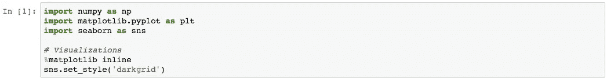
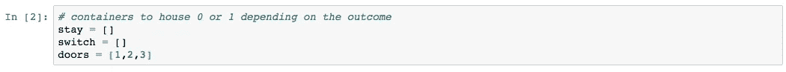
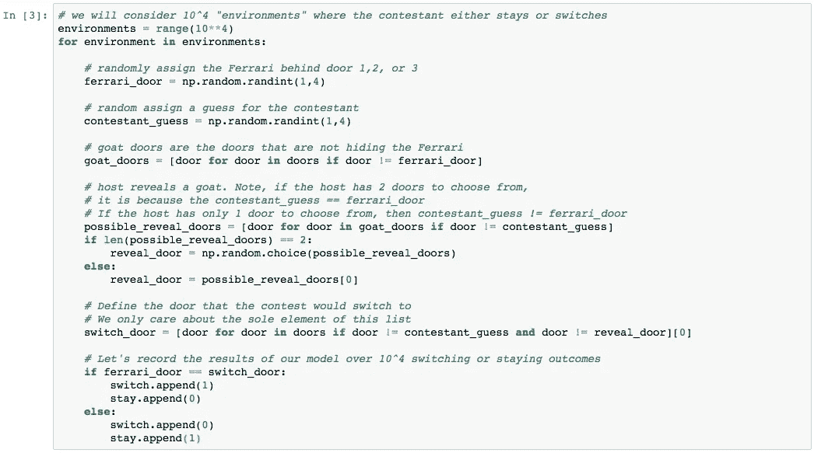
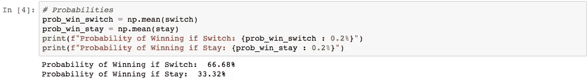
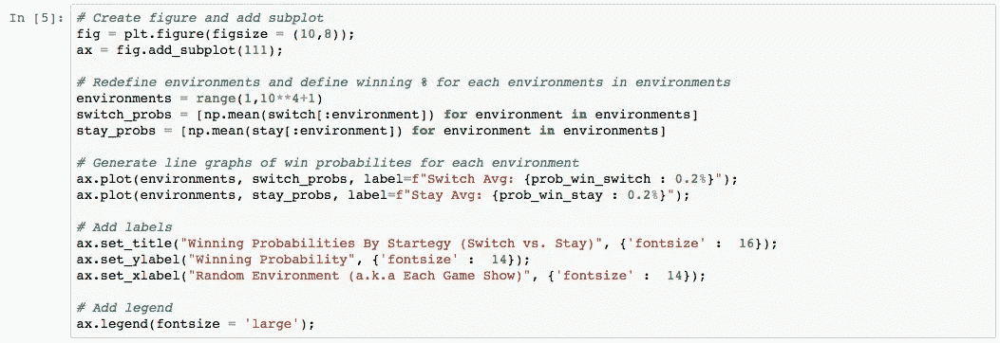
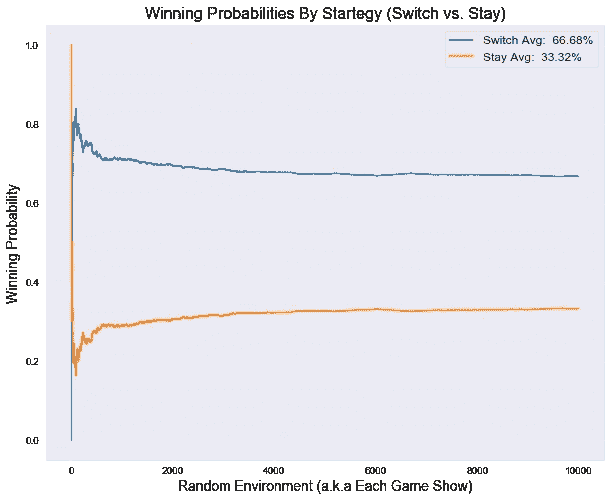

# 蒙蒂霍尔问题解决了

> 原文：<https://levelup.gitconnected.com/the-monty-hall-problem-solved-ec4f3753a682>

使用 Python 生成一万个经典游戏节目的随机模拟。

[Mitchell Ro](https://unsplash.com/@mitchel3uo?utm_source=medium&utm_medium=referral)在[Unplash](https://unsplash.com?utm_source=medium&utm_medium=referral)上拍摄的照片

我最近在看电影《T4》21《T5》时，偶然发现了一个著名的场景，由吉姆·斯特吉斯扮演的主角本向他的麻省理工学院教授解释了经典的蒙蒂霍尔问题，不久后他将成为算牌沙发米奇·罗莎。场景可在[这里](https://www.youtube.com/watch?v=cXqDIFUB7YU)找到。

# 问题

你是游戏节目的选手。在你面前的舞台上有三扇门。两扇门后是山羊，剩下的一扇门后是法拉利。

在节目开始时，非常英俊的主持人让你选一扇门(假设你选了第二扇门)。然后，主人打开另一扇门(1 或 3)，不出所料，露出一只山羊。因为主人知道法拉利的位置，所以每一轮都会有一只山羊出现。然后，主人会问你是想保持原来的选择(第二扇门)还是换到另一扇门。

保持原来的猜测还是改变主意对您最有利？主持人是否用逆反心理来影响你的猜测(因为他知道地点)。你在乎吗？

# 解决方案

像所有好的概率问题一样，我们应该首先从逻辑上考虑它。很多人(错误地)认为你有 50/50 的机会获胜，因为从技术上讲，你在第二轮从剩下的两扇门中随机选择了一扇门(你选择的那扇门和主人没有打开的那扇门)。然而，我更喜欢更有纪律的方法；让我们检查每种方法的获胜概率(转换与停留),看看我们是否能得到大于 50%的概率，使 50/50 的论点一劳永逸地变得无用。

如果你保持最初选择的第二扇门，在游戏开始时获胜的几率是多少？好吧，因为有两只山羊和一辆法拉利(我假设带着一辆法拉利超过一只山羊是在考虑赢——当然，除非为一辆全新的法拉利纳税不会让你兴奋)，赢的概率是 1/3，输的概率是 2/3。

如果每次你有机会的时候我们都交换一下会怎么样？为了赢得比赛，你首先必须选择一只山羊，然后将你的选择切换到法拉利(如果你不选择法拉利，你显然会输)。换句话说，如果你一开始就选择一只羊，你会选择法拉利并获胜(记住，主人总是会淘汰另一只羊，所以你永远无法从一只羊切换到另一只羊！).那么按照这个逻辑，原本选山羊的概率是多少呢？没错，2/3。

好的，很好，我们从逻辑上推断出，如果你改变，赢的概率是 2/3，这比你每次坚持原来猜测的概率(1/3)要大。

如果我们要模拟多个随机环境，在这些环境中，我们要么换，要么留，这种逻辑成立吗？让我们写一些代码来找出答案。

# 代码

首先，我们将使用 Numpy 来生成随机环境(或试验)和猜测，并使用 Matplotlib 和 Seaborn 来可视化结果。

接下来，我们将创建 stay 和 switch 容器。这些列表将根据输赢分别保存 1 和 0。此外，让我们创建我们的门，而我们在它。

现在是有趣的部分。

对于每个“环境”，我们将考虑其中的一万个，我们需要随机放置法拉利(“ferrari_door”)并随机为参赛者(“参赛者 _door”)分配一个原始猜测。请注意，我们不需要随机分配山羊，因为山羊会自动出现在法拉利没有的两扇门后(“山羊门”)。

接下来，我们需要一个门的列表，主持人可以从中选择他的大揭示(“可能 _ 揭示 _ 门”)。我们还知道，法拉利车门并不是 possible_reveal_door 的元素之一(因为主持人永远不会透露法拉利的位置)。Possible_reveal_doors 可以是长度为 2 的选项 A，或长度为 1 的选项 b。要实现选项 A，参赛者 _door 必须等于法拉利 _door。既然主持人揭示的是哪扇门(“reveal_door”)最终并不重要，只要是山羊，我们就随机选取其中一扇门让主持人揭示。要实现选项 B，参赛者门必须是原始山羊门之一(因为你不能切换到一只山羊，因为主持人会显示剩余的山羊)。因为这个列表中只有一个元素，所以我们抓取它。

最后，让我们定义一个“switch_door”，它代表剩下的门(不是最初的 competitor _ door，也不是 reveal_door)。这个 switch_door 是为每个环境定义的，不管我们的策略是转换还是保持。

所以现在让我们专注于赢得游戏节目的策略。如果我们盲目切换每一个环境，switch_door 等于法拉利 _door，那么我们就赢了。每次发生这种情况时，我们将在切换容器中添加 1，在停留容器中添加 0。如果我们盲目地停留在每一个环境，开关门不等于法拉利门，那么我们就输了。每次发生这种情况时，我们将在切换容器中添加 0，在停留容器中添加 1。一旦我们在每个环境中循环，我们将有一个包含一万个元素的开关容器和一个包含一万个元素的停留容器。

让我们检查一下代码:

现在我们必须计算每个策略的获胜概率。这就是(获胜次数)/(总环境数)。因为每次每个策略赢了，我们就在各自的容器上附加一个 1(每次输了，我们就附加一个 0)，所以上面的分子等于每个列表的总和。所以中奖概率等于 sum(container)/len(container)或者干脆就是每个列表的平均值。该代码如下:

如你所见，转换获胜的概率等于 66.68%(大约 2/3)，而保持获胜的概率等于 33.32%(大约 1/3)

# 可视化

下面的代码块试图在每个连续的环境中绘制获胜的概率。这个概率很快接近我们理论上的转换概率的 2/3 和停留概率的 1/3(少于 500 次试验)。

# 摘要

正如你所看到的，我们模拟了一个环境，在这个环境中，我们将法拉利随机分配到三扇门后，让我们的参赛者随机选择三扇门中的一扇门，让主持人展示一扇藏着山羊的门(但绝不是法拉利)，然后根据是转换策略会赢还是停留策略会赢，将 0 或 1 分配给适当的容器。然后我们这样做了一万次，然后计算如果我们坚持留下或改变的话获胜的概率。

所以你有它。如果你训练你的方法，并且每次都改变你的猜测，你赢的概率很快接近 2/3。

请访问我的 GitHub 获取完整的 jupyter 笔记本。一如既往，我欢迎您的评论或问题。